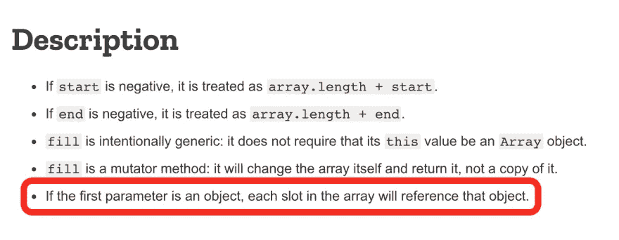

# 使用 JavaScript 的 fill()方法的警示

> 原文：<https://javascript.plainenglish.io/a-cautionary-tale-on-using-javascripts-fill-method-e0939e2e16f4?source=collection_archive---------12----------------------->

作为 ES6 特性的一部分， [Array.prototype.fill()](https://developer.mozilla.org/en-US/docs/Web/JavaScript/Reference/Global_Objects/Array/fill) 方法允许我们在数组中添加、替换或生成新元素。

对我来说，在数组中填充相同的元素时，这是普通 for 循环的一个聪明的替代方法。

例如，如果您想要创建一个包含三个相同元素的数组，而不是创建一个空数组并通过 For 循环将每个新元素推入数组，那么这个一行程序就可以完成这个任务:

```
const threeFives = Array(3).fill(5)
threeFives
// [5, 5, 5]
```

现在，让我们尝试在这个经典的螺旋矩阵算法挑战中实现`fill()`方法。

```
/* Direction:
Write a function that accepts an integer N, and returns a NxN spiral matrix. */// Examples: matrix(2)
// [[1, 2]
// [4, 3]]matrix(3)
// [[1, 2, 3],
//  [8, 9, 4],
//  [7, 6, 5]]matrix(4)
// [[1,   2,  3, 4],
//  [12, 13, 14, 5],
//  [11, 16, 15, 6],
//  [10,  9,  8, 7]]
```

如果你还没有尝试过这个挑战，我鼓励你在进一步阅读之前先尝试一下。

我发现的大多数解决方案都是从填充一个由空子数组组成的空数组开始的，就像这样:

```
function matrix(n) {
    const results = []
    for (let i = 0; i < n; i++) {
        results.push([])
    } let counter = 1
    let startColumn = 0
    let endColumn = n - 1
    let startRow = 0
    let endRow = n - 1
    while (startColumn <= endColumn && startRow <= endRow){
        // top row
        for (let i = startColumn; i <= endColumn; i++) {
            results[startRow][i] = counter
            counter++
        }
        startRow++
        // right column
        for (let i = startRow; i <= endRow; i++) {
            results[i][endColumn] = counter
            counter++
        }
        endColumn--
        // bottom row
        for (let i = endColumn; i >= startColumn; i--) {
            results[endRow][i] = counter
            counter++
        }
        endRow--
        // start column
        for (let i = endRow; i >= startRow; i--) {
            results[i][startColumn] = counter
            counter++
        }
        startColumn++
    }
    return results
}
```

如前所述，我们可以使用`fill()`来代替前三行中的 for 循环。因此，与其说:

```
const results = []
    for (let i = 0; i < n; i++) {
        results.push([])
    }
```

我们可以这样使用`fill()`:

```
const results = Array(n).fill([])
```

此时，当您在控制台中记录`results`时，您可以看到它们产生了相同的输出。

酷，所以如果我们在解决方案的其余部分保持相同的逻辑，我们会看到相同的结果，对不对？

不对。

根据 [MDN 文档](https://developer.mozilla.org/en-US/docs/Web/JavaScript/Reference/Global_Objects/Array/fill)，如果`fill()`方法的第一个参数是一个对象，“数组中的每个槽都将引用那个对象。”



这就是使用`fill()`可能会弄乱你制作精美的矩阵函数的地方。

如相同的 MDN 文档所示，如果您传入一个对象并改变一个对象中的项目，数组中的所有后续对象都将填充相同的项目。

```
let arr = Array(3).fill({}) // [{}, {}, {}]
arr[0].hi = "hi"            // [{ hi: "hi" }, { hi: "hi" }, { hi: "hi" }]
```

同样，在矩阵函数中，我们通过`fill()`创建的所有子数组都将改变，即使我们只想改变一个子数组。

在这里，我控制台记录了主矩阵产品中每个迭代的结果。正如你在下面看到的，所有用`fill([])`创建的子数组保持镜像第一个子数组:

```
using for loop:  [ [ 1 ], [] ]
using fill([]):  [ [ 1 ], [ 1 ] ]
=====
using for loop:  [ [ 1, 2 ], [] ]
using fill([]):  [ [ 1, 2 ], [ 1, 2 ] ]
=====
using for loop:  [ [ 1, 2 ], [ <1 empty item>, 3 ] ]
using fill([]):  [ [ 1, 3 ], [ 1, 3 ] ]
=====
using for loop:  [ [ 1, 2 ], [ 4, 3 ] ]
using fill([]):  [ [ 4, 3 ], [ 4, 3 ] ]
=====
```

这是否意味着我们不应该使用`fill()`来创建一个空的子数组？

下面是我发现的一个解决方案，它似乎可以成功地生成数组占位符，而且没有副作用:

```
const results = Array(n).fill().map(()=>Array(n).fill());
```

我们不是用数组填充数组，数组是对象类型，而是简单地用空值填充。在 JavaScript 中，空值是`undefined`，它不是一个对象，因此允许我们在每次迭代中重新分配新项，而不会影响其他子数组。

通过比较生成数组和子数组的所有三种用法，可以看出它们之间的区别:

```
using for loop:  [ [ 1 ], [] ]
using fill([]):  [ [ 1 ], [ 1 ] ]
using fill().map():  [ [ 1, undefined ], [ undefined, undefined ] ]
=====
using for loop:  [ [ 1, 2 ], [] ]
using fill([]):  [ [ 1, 2 ], [ 1, 2 ] ]
using fill().map():  [ [ 1, 2 ], [ undefined, undefined ] ]
=====
using for loop:  [ [ 1, 2 ], [ <1 empty item>, 3 ] ]
using fill([]):  [ [ 1, 3 ], [ 1, 3 ] ]
using fill().map():  [ [ 1, 2 ], [ undefined, 3 ] ]
=====
using for loop:  [ [ 1, 2 ], [ 4, 3 ] ]
using fill([]):  [ [ 4, 3 ], [ 4, 3 ] ]
using fill().map():  [ [ 1, 2 ], [ 4, 3 ] ]
=====
```

下一次，当您尝试使用`fill()`方法时，一定要检查您正在传递的值的类型。这是我从*第二次尝试几乎*破解螺旋矩阵代码挑战中学到的惨痛教训。

