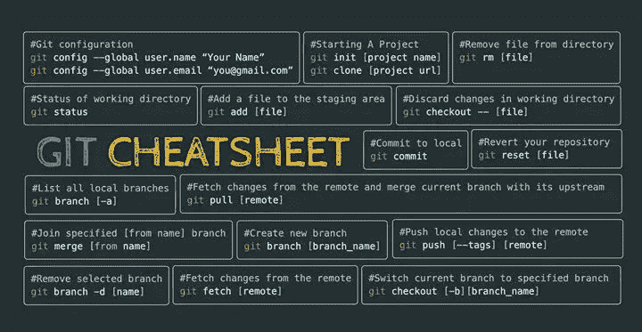
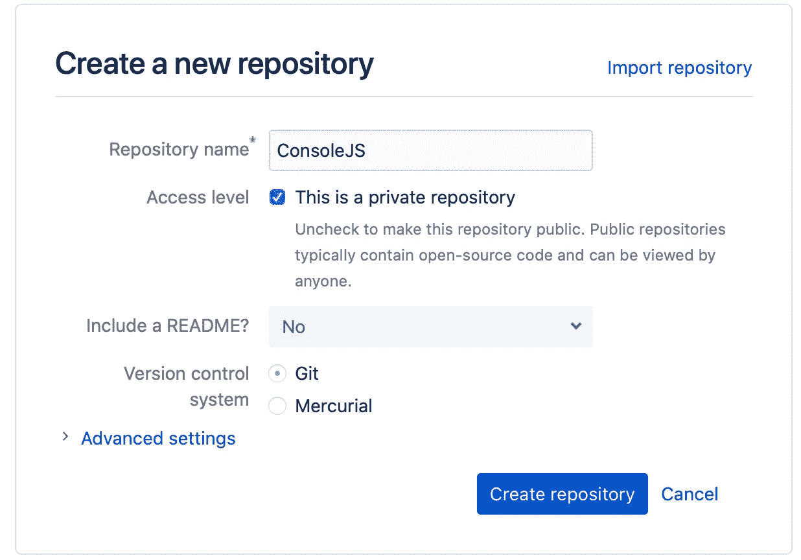
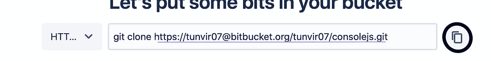
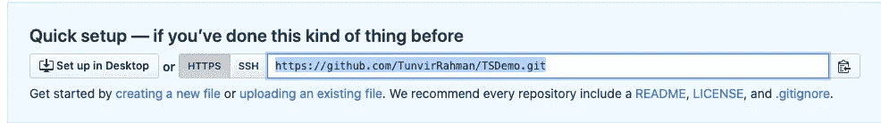

# 一份高频 Git 命令的目录

> 原文：<https://javascript.plainenglish.io/a-cheatsheet-of-high-frequency-git-commands-edd7e156f0b5?source=collection_archive---------2----------------------->

## 从我的机器上删除 SourceTree 后，我的日常 git 命令



Photo Credit [Marcel Halanocca](https://www.facebook.com/marcelhalanocca/?__cft__[0]=AZXkieMhbnOSOqjHz2kYuNi4dkkq7J4RdtAFiIilCTEW4tp9OIq3gaSvz5UPgvF09cvdLN9lGu8i_FVdkLFG7j_gik5EntIv8xA6iXwRhAoe0BEEClHKfsC00Y27i4TIaE2tbWmZX7cfroIH2B4Dt8G6m9Q1SPBCsi2OBCv3_5NGrQ&__tn__=-UC%2CP-R)

## 初始化存储库并连接到`Remote`(如位桶):

```
git init
```

## 在远程创建示例 repo(在本例中为位桶)



## 复制带下划线的文本:



Taken from Bitbucket



Taken from Github

## 远程连接:

```
**git remote add origin <YourRemoteURL>** 
# Now your repo is connected to a remote repository 
```

## 显示遥控器并删除遥控器

```
**git remote -v** 
# will list remote link**git remote rm <YourDestination/YourOrigin>** 
# Remove remote
```

## 显示更改

```
**git diff
#** Unstaged changes since last commit
```

## 设置提交用户名和电子邮件

```
**git config --local user.name** 
# Will show username in gitcongif**git config --local user.email** 
# Will show userEmail in gitcongif**git config --local user.name "YourName"** 
# Will set username in gitcongif**git config --local user.email "YourEmail"** 
# Will set email in gitcongif 
```

> 注意:如果需要设置**全局**用户名/电子邮件，请将- **本地**更改为-全局

## **用于跟踪变更、暂存/取消暂存文件**

```
**git status** 
# Show you your current branch and Changed files**git diff <ChangedFileName>**
#Show the changes in the file**git add <YourchangedFile>**
# Stage a particular file **git reset HEAD <YourchangedFile>**
# Unstage a particular file**git reset --hard**
# reset all to head**git reset --hard <Commit_ID>**
# reset to before that commit**git add .**
# Stage all changed files
```

## **对于提交、记录和推送更改**

```
**git commit -m "Message"****git commit --amend -o -m "New commit message"** # Replace the last commit message with new msg**git push origin <YourBranchName>** 
# if remote not exist otherwise simply git push**git push -u origin** **<YourBranchName>** # set upstream branch using the “git push” command**git log** # list all logs step by step**git log --oneline**
# Plain list of commits
```

## **用于与分支相关的物质**

```
**git branch <BranchName>**
# create sample branch**git push origin <BranchName>**
# push the branch to remote**git push origin --delete <BranchName>**
# Delete branch from remote**git branch -r**
# show all Remote branch**git branch**
# show all Local branch**git branch -a**
# All local and remote branch**git checkout -b <BranchName>**
# checkout to local branch**git fetch && git checkout <RemotebranchName>**
# remote branch #Checkout**git branch -d <BranchName>**
# remove branch**git branch -d <BranchName1> <BranchName2> <BranchName3> ..** # remove multiple branch**git merge <YourLocalBranch>****git merge origin <YourRemoteBranch>****git fetch --prune**
# align git remote branch with local
```

## **用于分期**

```
**git stash save <myStashName>** # Stash all staged changes**git stash list**
# List all stashed**git stash drop stash@{ID}**
# id from listed stash**git stash clear** #remove all saved stash ** **Careful before doing it** ****git stash apply stash@{ID}**
# Merge stashed changes to branch - Recommended

**git merge stash@{ID}**
# Immediately merge changes to branch - Not Recommended
```

## 恢复上次提交

```
**git reset HEAD~** # revert last commit and edit files as necessary and Commit again.
```

## 恢复提交

```
**git log --onetime** 
# list of your commits. copy <commit hash> from list**git revert <commit hash>** # will revert that commit
```

## 更新上次提交

```
# Say you have committed some code with something wrong# You can update your last faulty commit# Update Changes and then **git add ./** and then simply  **git commit --amend --no-edit**
#will update the current change in previous commit
```

# **普通英语注释**

您知道我们已经推出了一个 YouTube 频道吗？我们制作的每段视频都旨在教会您一些新东西。通过 [**点击这里**](https://www.youtube.com/channel/UCtipWUghju290NWcn8jhyAw) 查看我们，一定要订阅该频道😎

需要一些放松的东西吗？阅读此 [32+人们实际写的有趣的代码注释](https://medium.com/javascript-in-plain-english/30-funny-code-comments-that-will-make-you-laugh-1c1b54d4ab00)。

# 谢谢你的阅读。🍻