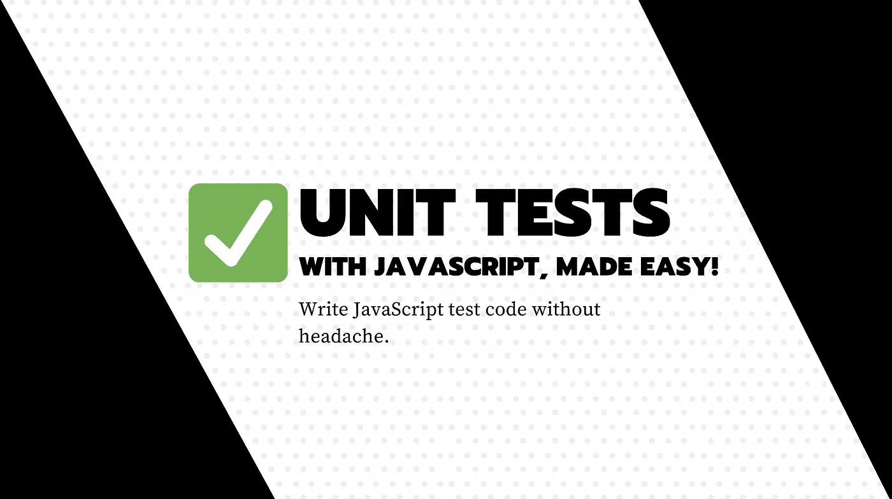

# 在 TypeScript 或 JavaScript 中进行单元测试的简洁方法

> 原文：<https://javascript.plainenglish.io/a-clean-and-simple-approach-for-unit-testing-in-typescript-or-javascript-b757e30c7b8?source=collection_archive---------5----------------------->

## 软件体系结构

## 不管你的项目规模有多大，或者你使用的框架是什么:只要写出重要的、有效的测试代码就行了。



我见过很多库和项目在处理单元测试代码时遇到困难。

说实话，我也是那种看到单元测试需求就逃跑的人。事情是这样的:我只是在精神上不擅长编写可测试的代码。

我有一个三角形的模具(我的测试要求),我正试着在里面放一个正方形。祝你好运！

我想这是人们害怕测试的主要原因。

他们走了一条简单的道路，用大量的耦合来实现三角形，然后他们试图用正方形来测试电池，这几乎是不可能的。结果就是他们反感，就是不做测试。

也许你正在用 TypeScript 编写测试，你没有为测试而编译代码，或者你得到一些奇怪的红色消息，与你的代码无关。

也许你有一个依赖有线网络的问题，它很慢，随机故障。

看起来你在多次测试同样的东西，没有任何附加价值。

你测试失败了，虽然我们可能认为这是因为测试很复杂，但事实要简单得多:**这经常是软件架构的问题。**

# 为什么测试一些代码如此困难？

这很难，因为在实现细节代码上有紧密的耦合。这种代码的一个例子可以是负责从远程服务获取价格映射配置的代码。该价格图可以位于 CMS 上，或者只是系统上的一个简单文件中。

如果你这样写你的代码，有很多问题可能会发生

```
import configService from "../services/config-service";export async function getFinalPrice(quantity: number) {
  const pricingMap = await configService.getPricingMap(); return pricingMap.get(quantity);
}
```

1.  代码是异步的，因为你每次都需要获取配置，我不是在这里谈论你可以使用的缓存，最初的概念对于正确的测试是错误的。
2.  您正在将您的模块文件耦合到一个外部依赖项，这将很难测试。
3.  您将您的模块耦合到其他模块，这不利于可重用性。

如果您开始不得不模拟模块导入来测试您的代码，那是因为您违反了依赖注入的核心规则之一，并且拥有紧密耦合的代码。

**有时候还好，**在应用程序的某个文件上，但不是每个部分。

由于代码是紧密耦合的，您需要制造一些魔术来模仿所使用的代码，这导致了一些高度黑客化的技术，例如模仿导入。

你最终安装了大量的库，只是为了绕过你为了快速开发而做的一个误解，也很难只是即插即用。

你真的认为这是有效的吗？我不知道。

测试规则非常简单，但是不仅仅是测试它，您需要编写大量的代码，只是为了让您的概念与某种测试工具相匹配。随着时间的推移，这变得越来越荒谬，你在添加逻辑代码来测试一些简单的东西。

**有时这样做就像经典药物一样(大部分？):它治疗症状，而不是原因。**

> 哦！你经常头痛吗？只需服用一些扑热息痛！如果它继续，多吃点！

我今天想谈的是如何组织你的软件代码，这是一件容易和简单的测试事情。

# 测试代码和业务规则:正确的方法

正如我在最近一篇关于领域驱动编程的文章中已经开始谈到的，一切都是有边界的。

[](https://medium.com/javascript-in-plain-english/a-first-step-to-improve-your-code-before-diving-into-domain-driven-design-or-the-clean-architecture-90da4a80d863) [## 在进入领域驱动设计或干净架构之前，改进代码的第一步

### 您可能听说过这两个概念:它们很聪明，但需要一些时间来实验和掌握…

medium.com](https://medium.com/javascript-in-plain-english/a-first-step-to-improve-your-code-before-diving-into-domain-driven-design-or-the-clean-architecture-90da4a80d863) 

**代码的所有部分都需要对它们的目的和依赖关系**有清晰的界限，这样你就可以在运行时注入依赖关系，这使得测试和热替换变得容易。

这很酷，因为它不会强迫你使用特定的测试框架或者根据你的最终框架修改你的代码。您只需为由您的函数填充的特定用例编写测试代码。

## 正确的测试是关于测试行为，这对我们的业务至关重要。

我们不想制造额外的代码来测试我们的业务规则，或者修改它来匹配我们的框架。我们想要的只是确保一个商业规则。

**所有的业务规则都可以被分解成简单的代码，这些代码只把基本类型作为输入和输出(I/O)。**

它是关于函数参数和返回数据的。

如果你不能做到这一点，那是因为你试图测试的东西太多了，你违反了单一责任原则。**记住这一点，因为这里有一大块秘密。**

*   单用途功能
*   首选依赖注入的纯函数。副作用只需要在胶水功能，把所有的小块在一起。

想象一下，我们有一个反应组件代码，它必须向我们的最终用户显示一些定价。用户给出一个数量，这个数量有分级定价，但是如果用户是特级会员，他会得到一些额外的折扣。

为了实现这个测试，我们将采用一种测试驱动的方法，但是当你有了逻辑，你就不会被迫这样做了。记住只测试真正重要的东西，这是我们的业务规则。

在测试驱动中首先要做的是**编写测试**(业务规则表示)。我自愿简化逻辑，不谈论绿色-红色-重构循环，因为它不是这里的主题。

**然后第二件事是分析满足需求的功能的输入输出。**

*   **在输入:**我们有一个量
*   我们有一张根据数量列出价格范围的地图
*   我们有会员资格
*   **在**的输出中，我们得到了最终价格。

好的，这个规则不需要绑定到我们的 React 上下文。我甚至可以最终在另一个上下文中使用它，比如在我的 NodeJS 应用程序中。React 应用会消耗它，我的 NodeJS 应用也是。

目前，没有代码，只有业务规则和功能之间的接口契约。

我们在这里所做的是隔离领域规则，这确实给我们的软件带来了价值。我们如何使用它只是一个细节，将来可能会改变。

现在的目标是编写更少的代码来满足规则并尊重接口契约。

下面是编写简单测试的一个关键秘密:

**通过用域(核心)和实现来分割代码，我们可以编写非常简单的函数，只使用原语类型。**

这里我们的领域是业务规则函数，以及它的接口契约。实现将是负责提供参数和处理返回数据的代码。

# 用`ts-jest`测试 TypeScript/JavaScript 业务规则的非常简单的产品代码示例

这不是这篇文章的目的，所以简单点

`yarn add — dev jest typescript ts-jest`

`yarn ts-jest config:init`

结束了。没有更难的，没有嘲笑图书馆或这种神奇的东西。*(如果你正在使用* `*npm*` *或者只是想了解更多，* [*点击这里*](https://kulshekhar.github.io/ts-jest/docs/installation) *)*

现在让我们创建两个文件`example.ts`和`example.spec.ts`

这是我们的规则接口契约，在代码中描述了我们上面在 I/O 方面指定的内容。我们正在传递`tieredPriceMap`，但是如果它不是经常在多个位置发生变化的东西，您最终可以在函数内部确定范围。

```
getFinalPrice(quantity: number, tieredPriceMap: Map<number, number>, hasUserMembership: boolean): number
```

我们有以下参数作为输入

*   一个数字
*   一个 JavaScript 映射
*   和一个布尔值

这里很酷的一点是，我们不依赖外部服务，也没有副作用。算法是可预测的，所以他更安全。

负责恢复价格映射的代码位于另一个函数中，该函数可能在其他地方甚至在远程 API 上进行测试。

我们还可以轻松地交换参数来测试各种场景。

我们在`example.spec.ts`中的测试代码非常简单:

```
describe("Price calculator rule", () => {
  it("ensure for a given quantity, we get proper pricing", () => {
    expect(getFinalPrice(1, new Map([[0,3],[5,2]]), false)).toBe(3)
  }
}
```

我们在`example.ts`中的实现代码可能是这样的:

```
export function getFinalPrice(quantity: number, tieredPriceMap: Map<number, number>, hasUserMembership: boolean): number {
  let total = 0;
  let currentPricingTier = 1; if (quantity <= 0 || !tieredPriceMap.has(currentPricingTier)){
    throw new Error("You must provide quantity > 0 and at least one pricing for 1 unit");
  } for (let i = 0; i < quantity; i++) {
    if (tieredPriceMap.has(i)) {
      currentPricingTier = i;
    } // We are sure this is valid
    total += tieredPriceMap.get(currentPricingTier)!
  } // Discount for membership
  return hasUserMembership ? total * 0.8 : total
}
```

再次注意，这段代码不依赖于任何外部库、导入或副作用。

有时您可以在文件的顶部使用一些导入，但是请确保只使用实用程序代码，比如类似 Lodash 或 TypeScript 接口的代码。在算法循环中被认为是“安全”和“稳定”的东西。

我知道这非常简单，但在这里我们只想确保这条规则。我们不想确保服务或 redux 行为之类的东西。我们只是想确保价格计算正确。因为这是我们应用业务的一个临界点。

**最后一句话是:当单元测试依赖于原始类型时，它是容易的。原始类型是全局兼容的数据类型，很容易模仿。**

[**🇫🇷为法国人🥖我提议用⚡️编码火花和一份简讯来收取技术费用**！](https://codingspark.io/?referral=medium)