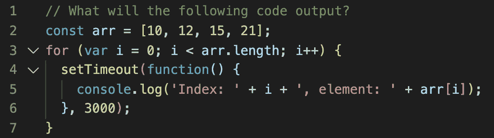
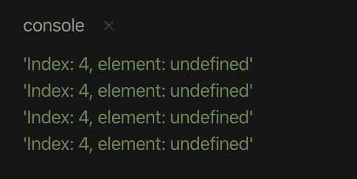
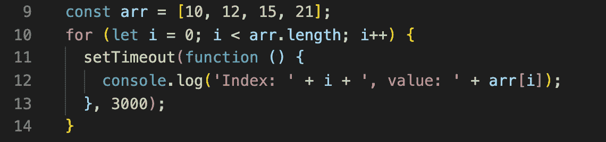
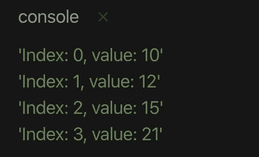
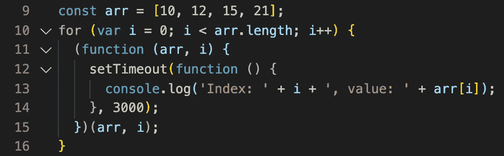

# 谷歌和亚马逊问的一个常见的 JavaScript 面试问题

> 原文：<https://javascript.plainenglish.io/a-common-javascript-interview-question-asked-by-google-amazon-f18a260dabde?source=collection_archive---------0----------------------->

## 我见过谷歌、亚马逊甚至更小的科技公司提出这个问题，以淘汰 JS 开发者。

# 这是一个普遍而典型的终结问题:

This code deals with closure, setTimeout and scoping

面试官问这种问题是为了测试你对重要 JavaScript 概念的了解。通过正确回答这个问题，可以展示你对块作用域、闭包、anon 函数、立即调用函数表达式(IIFE)的理解。

那么，3 秒钟过后，上面的代码会输出什么呢？

Confused? Keep reading below

我们看到这个输出的原因是因为 setTimeout 函数创建了一个函数()(它是闭包)。记住:JavaScript 闭包是指内部函数可以访问其外部封闭函数的变量和属性。它创建的函数可以访问包含索引为 *i* 的 for 循环的外部作用域。现在，在 3 秒钟过去(3000)后，可以执行该功能，并开始控制台记录 *i* 的值。这里的 *i* 值是多少？循环结束时， *i* 为 4，因为它经过 0，1，2，3，4。所以，当它到达 4 时，循环停止。你也可以看到这一点，因为 arr[4]不存在(未定义)。

由于原始代码有 const，我们来看一个简单的 ES6 解决方案/修复:

Replace var with let

使用 ES6，您可以快速创建代码的解决方案。通过将 *var* 改为 *let，*it*允许 *i* 至*的值被“保持”直到 setTimeout 结束。**

然后我们得到了我们想要的:

The correct output for each index in the array

对于那些不熟悉 ES6 的人，这里有一个更老的 JS 方法来解决它:

Produces the same output as the ES6 code above

如果这个例子令人困惑，我建议阅读 JS 闭包和作用域。一个好的起点是我在 [Javascript 范围](https://medium.com/javascript-in-plain-english/lets-talk-about-scope-baby-3241c6dff1e4)上的最后一篇中型文章😉！