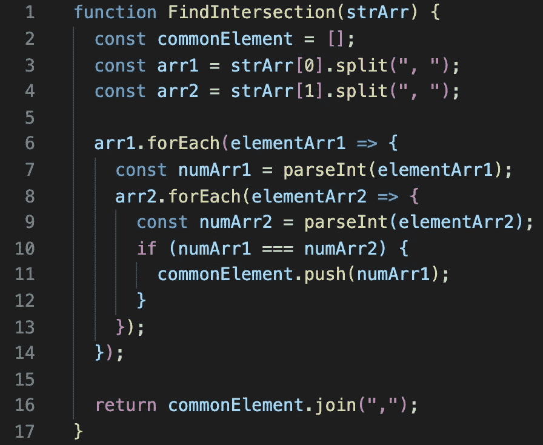
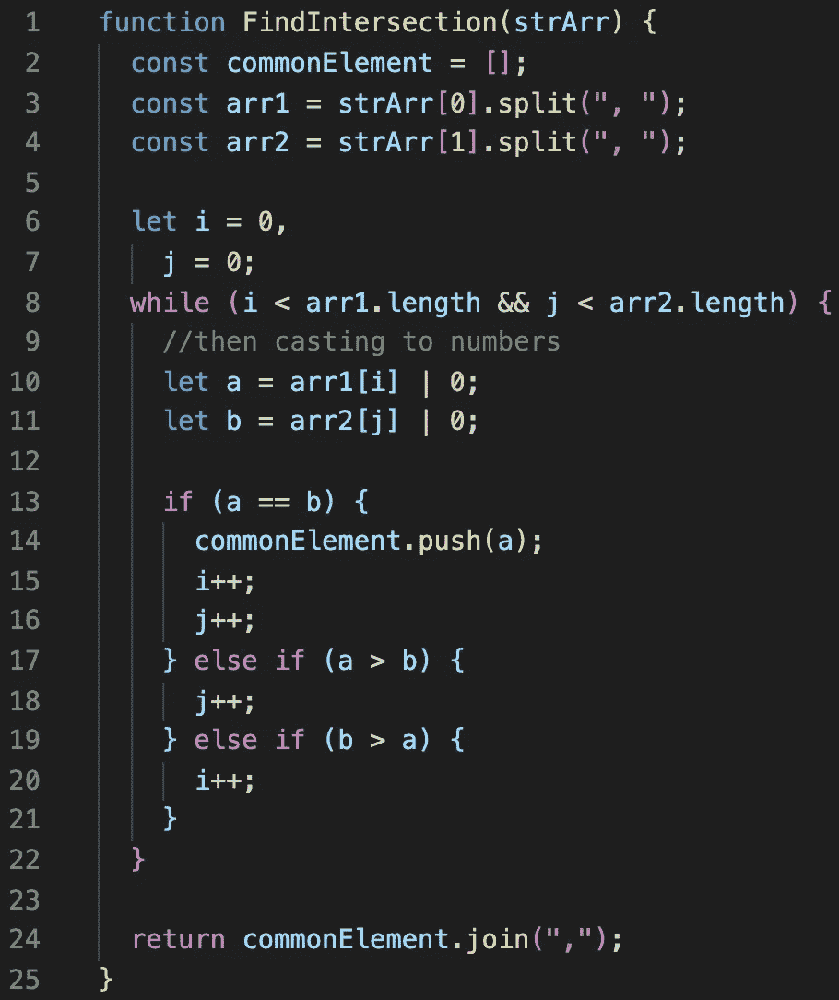
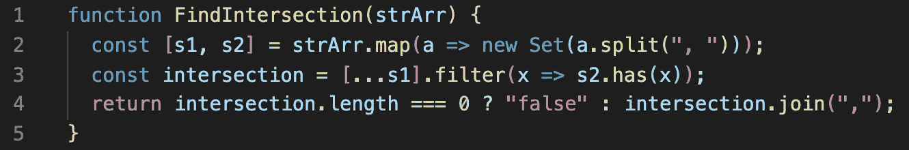

# 脸书问的一个常见的 JavaScript 电话屏幕问题

> 原文：<https://javascript.plainenglish.io/a-common-javascript-phone-screen-question-asked-by-facebook-357a0139c458?source=collection_archive---------0----------------------->

## 我在手机屏幕上看到过这个问题，并且知道脸书也问这个问题！

*自从我在* [*上的上一篇帖子谷歌&亚马逊*](https://medium.com/javascript-in-plain-english/a-common-javascript-interview-question-asked-by-google-amazon-f18a260dabde?) *问的一个常见的 JavaScript 面试问题变得流行并帮助了其他开发者，我认为继续这一趋势是有意义的。*

以下问题的目标是找出两个不同数组中的公共元素。

## 问题:

编写一个函数 **FindIntersection** ，该函数读取一个包含两个元素的字符串数组:第一个元素将表示一个以升序排序的逗号分隔的数字列表，第二个元素将表示第二个逗号分隔的数字列表(也已排序)。你的目标是返回一串数字，这些数字按排序顺序出现在输入数组的两个元素中。如果没有交集，则返回字符串“false”。

**例如**:如果输入数组是["1，3，4，7，15 "，" 1，2，4，15，21"]，输出字符串应该是" 1，4，15 "，因为这些数字出现在两个字符串中(它们是公共元素)。给定的数组不会为空，数组中的每个字符串都是按升序排序的数字，并且可能包含负数。

**另一个例子:**如果输入数组是["1，3，9，10，17，18 "，" 1，4，9，10"]，输出字符串应该是" 1，9，10 "，因为这两个字符串中都出现了这些数字。

在与一些初级开发人员交谈后，有些人倾向于采用蛮力路线来解决这一挑战。虽然这没有错，但这不是最佳解决方案，你肯定会被要求重构这种类型的答案。

强力回答类似于创建一个循环来遍历第一个字符串中的所有数字，对于第一个字符串中的每个元素，遍历第二个字符串中的所有元素。一旦找到匹配，就将该值连接到一个“答案”字符串。

Brute force solution NOT optimal

现在，如果面试官问你:

## 问:如果没有匹配会发生什么？

a:然后这个解将遍历第一个字符串中的每个元素，我们将不得不遍历第二个字符串中的每个元素。

## 问:那是什么时间复杂度？

答:时间复杂度为 O(nm)。n 和 m 代表字符串的大小。如果你对时间复杂性感到困惑，这是你开始阅读大 O 符号的机会。时间复杂性/大 O 符号可能是技术面试的很大一部分。*

以下是我想到的两个解决方案:

在阅读了关于**器械包**的文档后，我尝试了这个解决方案，它也很有效:

然而，对于这种集合解决方案，可能必须按照插入的顺序进行迭代，这可能并不理想。

## 请在下面的评论中留下你的解决方案和时间复杂度！