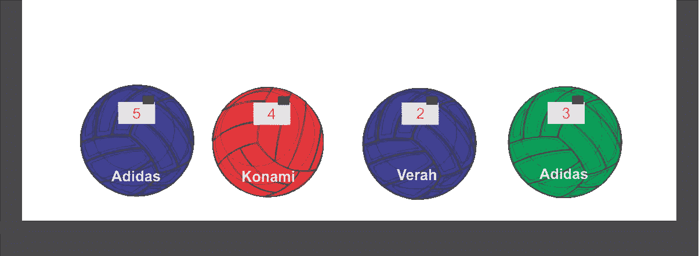
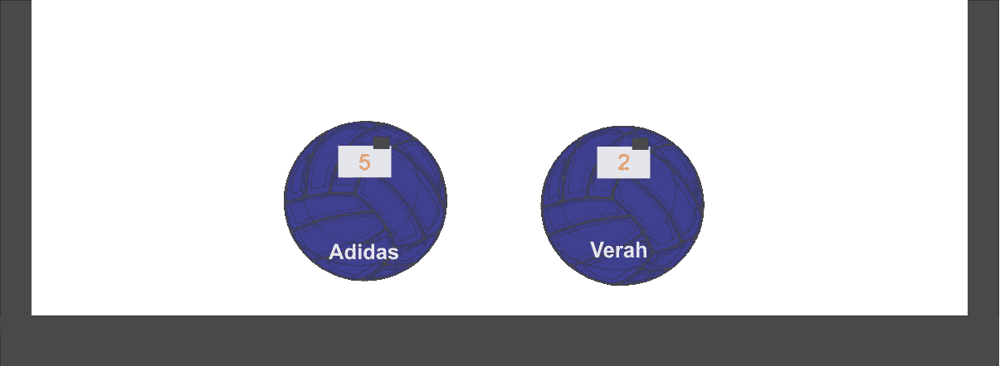
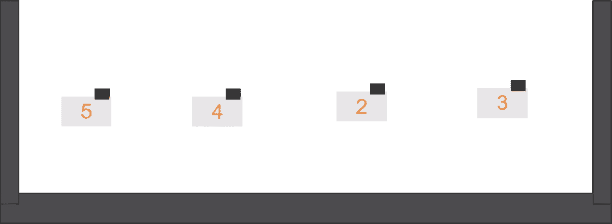

# JavaScript 数组方法的常识性解释

> 原文：<https://javascript.plainenglish.io/a-common-sense-explanation-of-javascript-array-methods-1205b2d2790e?source=collection_archive---------0----------------------->


数组方法`filter`、`map`、`reduce` 已经存在了一段时间，它们使数组的使用变得更加容易。但是有时候，新的 JavaScript 开发人员很难决定他们需要使用哪种数组方法。

一些开发人员仍然继续编写更长的代码，如果他们使用一个或多个数组方法，这些代码本来会更短，因为他们发现它们令人困惑。下面是我的一个 Javascript 领主的推文:

在这篇文章中，我将简单解释一下前面提到的数组方法。看完这篇文章后，选择使用哪一个将是小菜一碟。

# 数组里有什么？

考虑这个数组:

```
const balls = [
 {brand: 'Adidas', color: 'blue', rating: 5},
 {brand: 'Konami', color: 'red', rating: 4},
 {brand: 'Verah', color: 'blue', rating: 2},
 {brand: 'Adidas', color: 'green', rating: 3}
]
```

在上面的球数组中，长度是 4(我们可以通过`balls.length`得到这个)。每件商品都有一个形状:一个品牌、一种颜色和一个等级。

当我们使用任何提到的数组方法时，我们将处理数组的**长度** *和/或***形状**。

# 请记住…

当我们使用`filter`、`map` 和`reduce` 数组方法时，我们**循环**通过数组。在循环的每一次迭代中，我们'**挑选**数组中的每个成员，并对其进行**处理**。为了对数组的一个元素“做点什么”,我们向数组方法传递了一个`callback` 。回调只是一个指定我们想要对数组元素做什么的函数。例如，如果`arr` 是一个数组:

```
arr.map(callback)// callback is a function
arr.filter(callback) 
```

# 该过滤方法

当我们在一个数组上使用 filter 方法时，我们**改变了数组的大小**，但没有改变数组的形状。

想象一下，你有一个物理盒子，里面装着上面阵列描述的 4 个球，每个球都有一个标签，标明其等级。



Box containing 4 balls

现在，想象我给你另一个盒子，让你把蓝色的球放进这个新盒子里。如果你决定遵循我的指示，你会得到一个由两个球组成的盒子:



如果我们要用代码来表示这个新盒子，您需要:

```
[
 {brand: 'Adidas', color: 'blue', rating: 5},
 {brand: 'Verah', color: 'blue', rating: 2}
]
```

记住，在你过滤盒子之前，我必须给你一个*条件来检查* : **球必须是蓝色的**。同样，返回的数组是原始数组的子集。

现在让我们用 JavaScript 写一个`filter`方法:

```
let blueBalls = balls.filter(ball => ball.color === 'blue')
```

简单。

我们循环遍历“球”框，*挑选*每个“球”并检查它是否是蓝色的(`ball.color === blue`)，如果是，我们将它转储到新的框中(`blueballs`)！

更准确地说，在循环的每一次迭代中，任何为`ball.color === 'blue'`返回 true 的项都将在新数组中返回。

最好的部分是，我们原来的球阵列仍然完好无损。如果我们`console.log(balls)`我们仍然有原来的 4 个球。`filter`(像`map` 和`reduce` ) **不要改变**他们工作的数组！他们返回的结果没有对数组进行*变异*(也就是改变)。

# 映射方法

map 方法**改变数组的形状**，但**不改变其大小**。也就是说，当你需要*修改*一个数组的每个成员并返回修改后的数组时，你可以使用它。

例如，假设我再次将球“盒子”交给您，并要求您将我们每个球的评级放入另一个盒子中。即:你 ***挑选*** *每个*球，去掉评分标签，转储到 ***另一个*** *箱*。

你会得到这样的东西:



4 tags in a box

你的箱子里还有 4 件物品，但是现在它们已经被修改了。形状变了，但大小没变。

让我们用代码编写`map`函数。

```
let tags = balls.map(ball => ball.rating)console.log(tags)// returns [5, 4, 2, 3]
```

啊哈！

我们的`map`方法(就像`filter`一样)通过‘盒子’运行一个循环，‘*拾取’*一个球，然后移除评级标签！(`ball.rating`的意思是‘给我这个球的 rating 属性值’)。

如果我们运行`console.log(balls)`，我们的球数组仍然保持原样。同样，`map` 方法不会*改变*原始数组！厉害！。

# 该简化方法

`reduce`数组方法相当棘手却又强大，这是因为当我们使用它时，我们有双重能力:我们可以改变数组的**形状**和它的**长度**。就像`filter`和`map`一样，reduce 方法不会改变我们应用它的数组，它返回一个新的数组。

## **还记得复利吗？**

我从复利的角度考虑 reduce 函数。在复利中，每次计算利息时，投入的资金(也叫本金)都会增加。例如，如果你以 10%的复利投资 10，000 元(本金)5 年。在第一年末，你有一笔利息(10% * 10，000)，这是 N1 000。这个利息加到原来的本金上。

所以，第二年初，本金是 11000 奈拉。到第二年末，利息是 10% * 11，000 也就是 N1，100。这又加到本金上，变成(11，000 + 1，100) N12，100。这成为第三年的新校长！这样校长成长！这样一直持续到第五年年底！

**旁注**:爱因斯坦称复利为“自然界最强大的力量之一”🤓

## **回到 reduce 方法…**

让我们离开复利的数学世界，回到`reduce`方法。你应该从复利世界中得到的是，我们有一个本金，它在我们每次计算利息时都会增加，增加的值*成为新投资年度的本金*。

就像`filter`和`map`方法一样，我们也传递一个回调函数给`reduce`方法，这个回调函数叫做**缩减器**函数。reducer 函数有四个参数，但我们将讨论两个参数，即**累加器**和**当前值**。

```
the_array.reduce(callback)
```

请记住，在复利中，我们从一个初始本金开始，类似地，reduce 方法在回调函数后采用一个可选的第二个参数，这是累加器的**初始值。**

```
the_array.reduce(callback , initialValue)
```

初始值是可选的。如果我们不指定，reduce 方法会将数组的第一个元素作为累加器的初始值**。**

```
the_array.reduce(function(acc, cur){// do some stuff...}, initialValue)// **using arrow functions instead** the_array.reduce((acc, cur) => {// do some stuff...}, initialValue)
```

**累加器**类似于复利的**本金**，在这个意义上，在每次迭代之后，它都会改变。新值成为下一次迭代的累加器。**当前值**类似于复利中的利息，在这个意义上，每次迭代后，它都被“添加”到**累加器**中。(注意:我们可以执行除加法之外的其他操作)。

# 请给我一些代码！

如果你还在读这篇文章，那么我必须称赞你的耐心。那是一堆无代码的文本。现在让我们编写一些代码来实现 reduce 方法。

要使用`reduce`方法，让我们尝试获取`balls`数组中所有评级的总和。为了简化，让我们从上面 map 方法中的 tags 数组开始。

```
console.log(tags)
// returns [5, 4, 2, 3]
```

简化方法应用如下:

```
let sumOfRatings = tags.reduce((acc, cur) => acc + cur, 0)console.log(sumOfRatings)
// returns 14
```

累加器的初始值(`acc`)为 0，当我们遍历数组时，数组中的每个元素都是当前值(`cur`)，这个值被添加到累加器中。累加器的新值将用于循环的下一次迭代，到循环结束时，累加器的值将被返回。

**简单测验**:如果初始值设为 6 会返回什么？

# 请再举一个例子…

假设我们有一个更大的球阵列:

```
const balls = [
 {brand: 'Adidas', color: 'blue', rating: 5},
 {brand: 'Konami', color: 'red', rating: 4},
 {brand: 'Verah', color: 'blue', rating: 2},
 {brand: 'Adidas', color: 'green', rating: 3},
 {brand: 'Konami', color: 'white', rating: 1},
 {brand: 'Adidas', color: 'blue', rating: 2},
 {brand: 'Verah', color: 'yellow', rating: 1},
 {brand: 'Verah', color: 'green', rating: 2},
 {brand: 'Adidas', color: 'blue', rating: 5},
 {brand: 'Konami', color: 'red', rating: 4},
 {brand: 'Adidas', color: 'green', rating: 3},
 {brand: 'Konami', color: 'pink', rating: 1},
]
```

假设我们想要获得每个品牌出现的次数，我们可以使用 reduce 方法:

```
const brandFrequency = balls.reduce((acc, cur)=> {
let count = acc[cur.brand] || 0 
  return {
    ...acc,
    [cur.brand]: count + 1
  }
}, {})console.log(brandFrequency)
//returns *{Adidas: 5, Konami: 4, Verah: 3}*
```

请注意，初始值是一个空对象。这是`acc`论点的第一个价值。

我对下面的每一行都做了解释:

```
...
let count = acc[cur.brand] || 0
...
```

这一行意味着，每次我们都要检查一个品牌是否已经“累积”到`acc`中，并且有一个计数值，如果没有，我们将其计数设置为 0。

```
return {
    ...acc,
    [cur.brand]: count + 1
  }
```

上面的行意味着在每次迭代后，我们返回一个包含累加器当前值的对象**并且**我们包含一个品牌并增加它的计数 1。如果品牌已经存在于 acc 对象中，则不会重新包括它，它的计数只增加 1。

# 结论

`filter`、`map`和`reduce`数组方法使得编写简洁的代码成为可能。它们是为了使开发人员的工作更容易而不是让他沮丧而引入的工具。

我希望我能帮助澄清一些事情。

快乐编码。

**感谢您阅读至此。如果你喜欢这篇文章，请分享、评论并发表👏几次(最多 50 次)。。。也许会对某个人有帮助。**

**关注我的**[**Twitter**](https://twitter.com/solathecoder)**和 Medium，如果你将来对这些更深入、更翔实的报道感兴趣的话！**