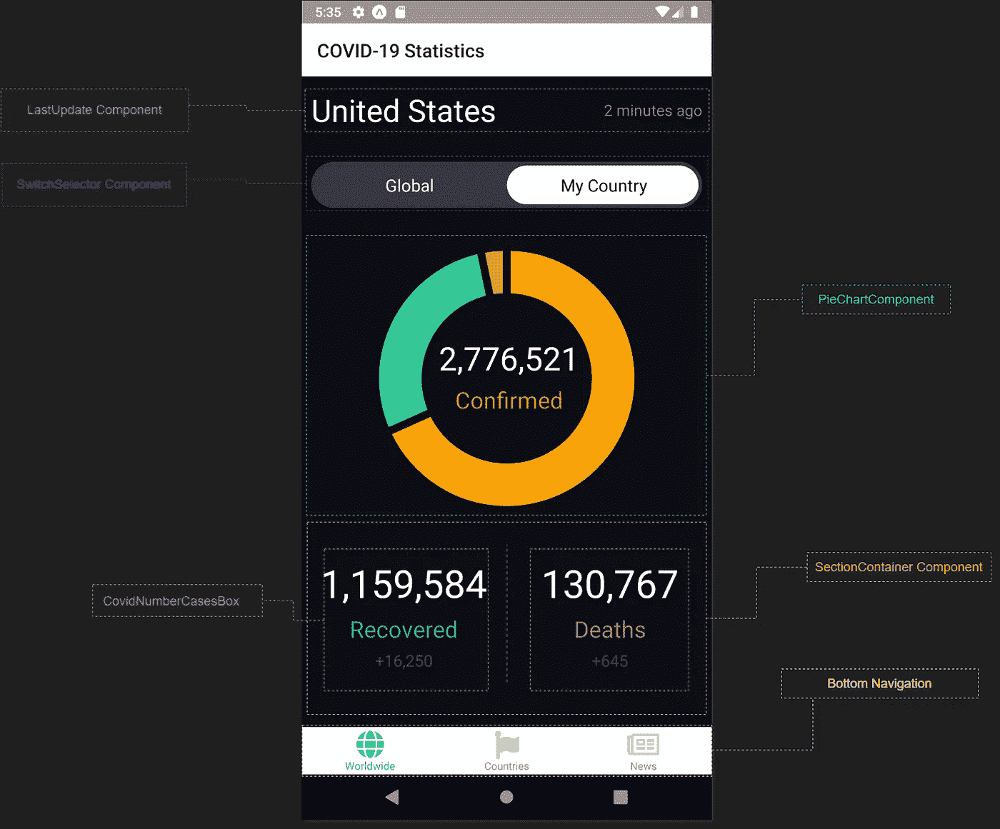

# React 本地应用程序合成过程的完整指南

> 原文：<https://javascript.plainenglish.io/a-complete-guide-of-the-composition-process-of-a-react-native-app-dd9f89542c46?source=collection_archive---------5----------------------->

## 在开始编写代码之前，让我们在这个过程上花更多时间


Photo by [Alvaro Reyes](https://unsplash.com/@alvarordesign?utm_source=unsplash&utm_medium=referral&utm_content=creditCopyText) on [Unsplash](https://unsplash.com/s/photos/programming?utm_source=unsplash&utm_medium=referral&utm_content=creditCopyText)

互联网上有大量的教程建议你在分析和设计阶段花足够的时间。React 开发过程也不例外。分析和设计周期的一部分包括通过组合过程构建应用程序的思考过程。

但是尽管如此，有时我们仍然继续在这个思考过程上花费较少的时间，并且匆忙地开始编码。我们可以做到这一点，但我敢打赌，后来你会意识到，你花的时间比你想象的要多，而且可能还会用糟糕的架构设计来构建应用程序，因此它们可能不够可伸缩。

我们认为这个过程是不必要的，或者因为我们的应用程序很简单。然而，我意识到的事实是，我在编码时浪费了大量的时间，因为我没有在上面花足够的时间。

事不宜迟，让我们跳到每次开始开发 React 应用程序时都应该遵循的思维过程。

***注*** *:为了学习过程，姑且只针对全局画面打破构图过程。React 应用程序的每个模块、屏幕或视图都应该执行相同的过程。*

# 1.模仿你的组件

无论项目是大是小，是简单还是复杂。在做任何事情之前，在开始编码之前，你要做的第一件事就是模拟你的注册护士应该是什么样子。然而，如果你和一个设计师合作，他会给你提供 Figma 网址，Adobe Photoshop 文件，图片，或者任何可以分享模型的方式。

我们将深入到合成过程中来构建类似这样的东西。



RN-Global Screen

# 2.使用单一责任原则将你的用户界面分成小块

坚持一个原则，即一个组件最好只做一件事。如果它最终增长，它应该被分解成更小的子组件。

放心吧！现在让我们分解成可重用和单一关注的组件，这就是 React 存在的原因。

## 共享组件

这是常见组件的列表。基本上，它们是不同模块和应用程序屏幕中可重复使用的组件。

*   这个组件的想法是在两个视图之间绘制一条垂直线。
*   **分隔器**:两个组件之间的分隔器
*   **PieChartComponent** :呈现全局或特定数据的饼图。
*   SectionContainer:它只是一个组织我们内容的盒子。它将在我们的应用程序中使用。
*   SwitchSelector:呈现全球或您所在国家数据的组件

## 全球屏幕

让我们列出全球(全球)屏幕上的组件。

*   **全局** (index.js):是我们的父母。它包含全局屏幕上的所有元素
*   这只是一个用来组织我们内容的盒子。它将在我们的应用中使用
*   **LastUpdate** :以以前的格式呈现标题和跨度的样式化组件
*   **PieChartComponent** :渲染全球数据或按国家的饼状图。
*   **垂直**:在两个视图/div 之间显示一条垂直线
*   **covidnumbercasebox**:显示已恢复、已确认或已死亡的病例数
*   **SwitchSelector** :一个切换选择器，一个呈现全球或国家数据的过滤器

## 将组件排列成层次结构

一旦我们将 UI 分解成组件，就该根据模型将它们排列成层次结构了。

*这个层次结构将帮助我们识别应该拥有状态的公共所有者组件或更高的组件。*

```
**-Global (parent)***---|LastUpdate*---|SwitchSelector*---|PieChartComponent***---|SectionContainer***-----|CovidNumberCasesBox*
```

# 3.使用 DRY 原则来定义你的 UI 状态

[干](https://en.wikipedia.org/wiki/Don%27t_repeat_yourself)原则代表*不要重复自己。*在 React 世界里，它的使命是不惜一切代价避免状态冗余。

让我们使用它，考虑我们在上面确定的组件列表中的每个组件上拥有的所有数据。

## 3.1 高效状态管理需要考虑的规则

*   *使用*[*【SRP】*](https://en.wikipedia.org/wiki/Single-responsibility_principle)*—使一个状态变量负责一个关注点。*
*   如果你知道一个状态变量违反了单一责任原则，那么你应该从某个地方提取复杂的状态逻辑。比如说一个定制的钩子。

*考虑到反应状态的规则，在全局屏幕上我们有了下一个数据:*

*   开关选择器(过滤器)的值
*   上次更新数据的日期时间
*   COVID 数情形的全局数据

好了，我们现在已经知道了要在全局屏幕上使用的所有数据，让我们逐一查看，看看哪些是状态数据，哪些不是。

根据 React 文档，一个好的做法是，我们对每条数据提出以下问题，以确定它是否是 State。

1.  是通过道具从父母那里传过来的吗？如果是这样的话，很可能没有说明。
2.  是否随时间保持不变？如果是这样，它可能不是 state。
3.  你能根据组件中的任何其他状态或属性来计算它吗？如果是这样，那就不是国家了。

## 3.2 弄清楚状态

是时候弄清楚我们的组件需要整个应用程序的可变状态的最小集合了。

*   切换选择器( **SwitchSelector** )的值会随时间变化，并且无法通过任何方式进行计算。当你点击同一个**开关选择器**项目时，该状态将有助于不产生新的请求网络。我们得到了州。
*   当用户点击刷新按钮时，数据最后更新的**日期时间**将会改变(这是将来的功能)。这就是状态。
*   **COVID** number cases 对象将作为一个 prop 在组件层次上传递，所以在这种情况下，它不是 State。然而，在全局屏幕(index.js)上，我们将数据设置为状态，它将根据状态而改变( **SwitchSelector** )。

如果您一直跟随我到这里，我们已经确定了应用程序状态的最小集合。下一步是识别哪个组件发生了变异或者应该拥有这个状态。

# 4.找出国家最适合居住的地方

这可能有点棘手。然而，为了更容易实现，让我们深入了解几个关键点，这将有助于我们进行这一斗争。

## 4.1 识别基于该状态呈现某些内容的每个组件

在全球屏幕上，我们有这些下一个组件。

*last update、PieChartComponent、CovidNumberCaseBox 需要根据状态渲染数据。例如，LastUpdate 将基于过滤器值呈现数据的最后更新和 PieChart 组件，以及 CovidNumberCasebox 组件。*

## 4.2 找到一个共同的所有者组件。

这旨在找出层次结构中需要状态的所有组件中的单个组件。

如果您向上滚动到我们创建组件层次结构的部分，您将意识到所有前面组件之上的单个组件是全局的(index.js ),因此状态应该位于其中。

# 最后的想法

构建 React 应用程序的思维过程应该与我们在本教程中所学的类似。

我的建议是，在开始编写代码之前，你应该花足够的时间来完成这个过程。这看起来很长，让人不知所措，然而，最后，当你有疑问时，这将帮助你澄清那些。

此外，这将允许您使用 React 的强大功能构建更具扩展性和效率的 web 应用程序以及跨平台应用程序。

*感谢阅读！我希望这篇文章是有帮助和有趣的。下次阅读时见。*