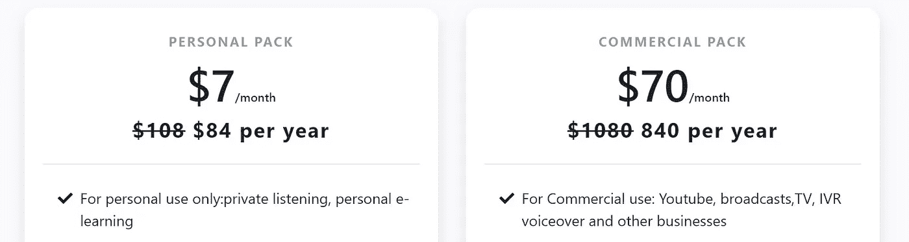
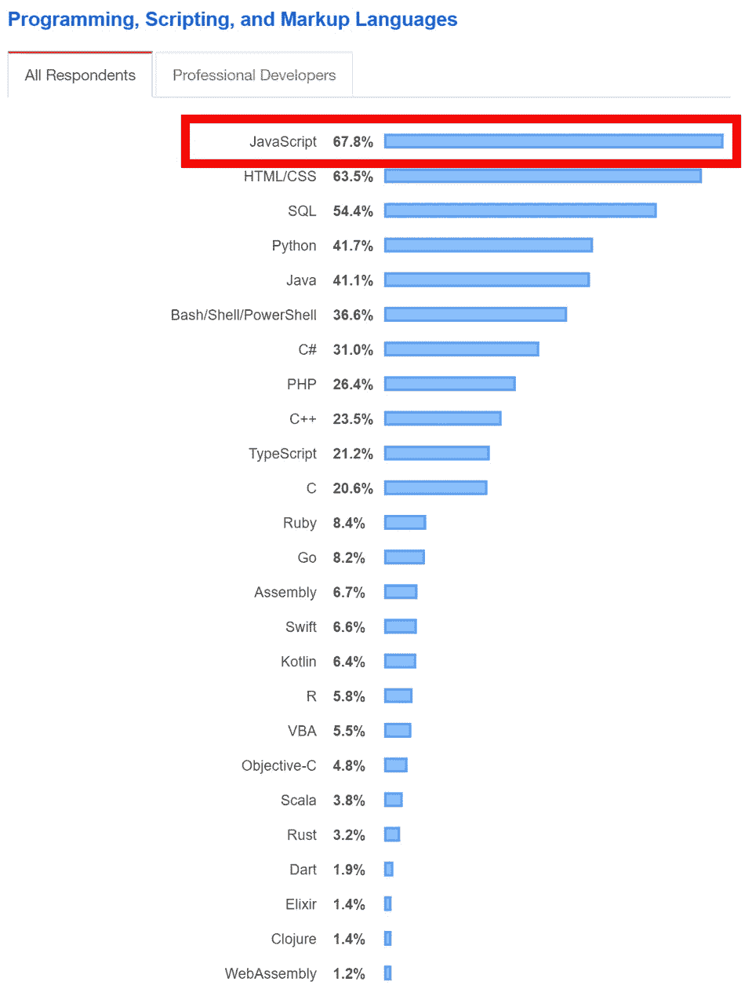
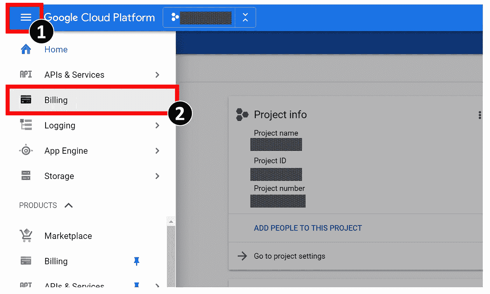
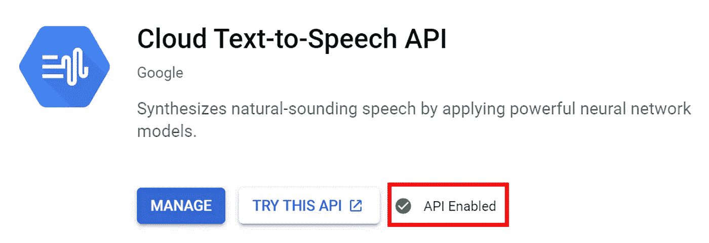
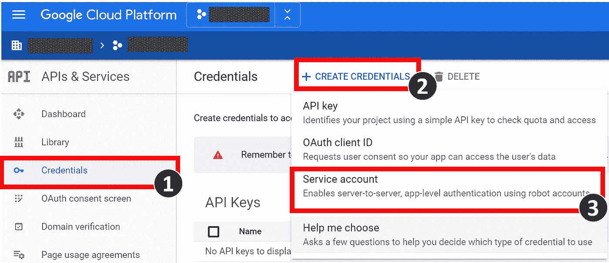
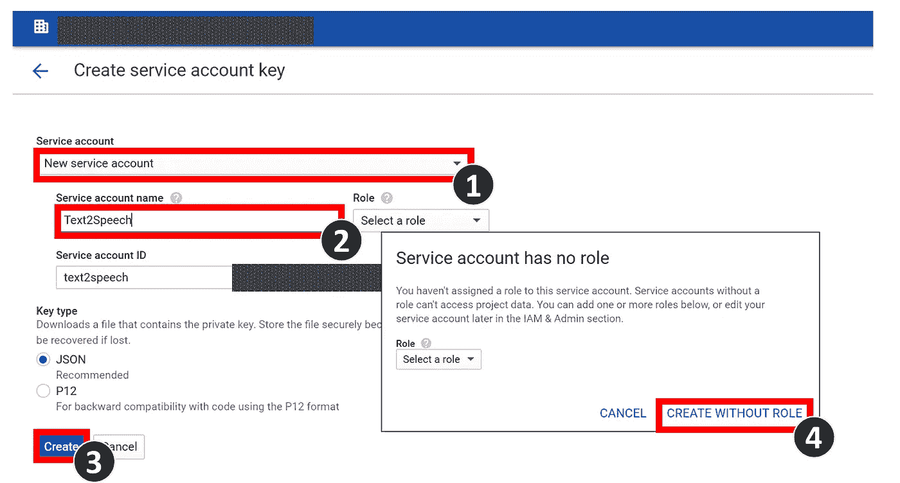
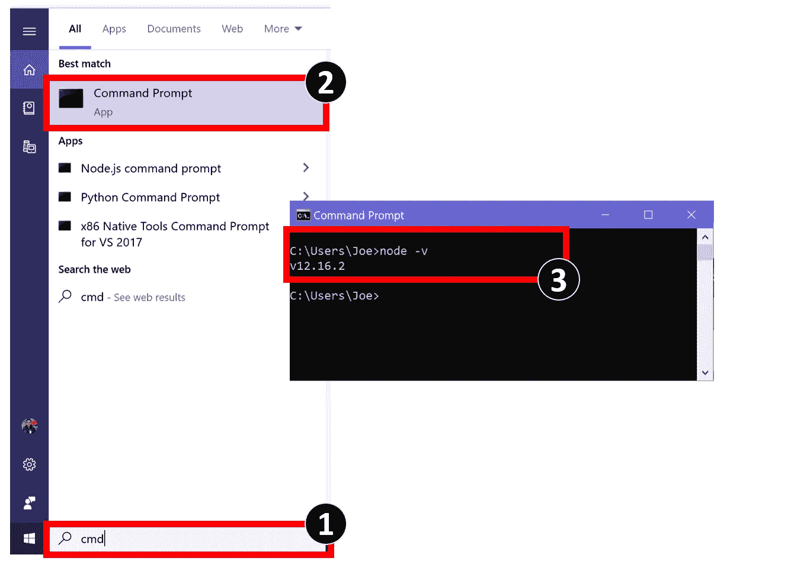

# 使用谷歌云和 Node.js 的文本到语音转换软件

> 原文：<https://javascript.plainenglish.io/a-complete-guide-to-build-text-to-speech-software-with-google-cloud-and-node-js-a28f6b81f8f5?source=collection_archive---------0----------------------->

## 一步一步的教程。不需要编程技能！


illustration by [Chaeyun Kim](https://www.linkedin.com/in/ChaeyunKim)

如果你以前从未编程，或者你是编程初学者，或者你只是厌倦了想在家里建立一些程序的隔离时间，让我们享受这篇文章，因为它涵盖了使用 Node.js 的 Google Cloud 文本到语音转换服务需要知道的所有基本步骤。

点击此处查看上述段落的语音输出演示:

## 首先，我可以用文本到语音转换做什么？

现代的文本到语音软件允许你创建一个声音转录你的阅读与自然/人类专业的声音一样，在电视上，你可以使用它

*   您的视频/演示产品
*   为你大声朗读书籍
*   你的家庭作业
*   还有更多…

## 为什么我不应该使用在线文本到语音转换服务？

网上有几个文本到语音转换服务，如 T2、NoteVibes、T4、T7、Naturalreaders、T8、T9 等。在他们的网站上宣称是免费的在线服务。**然而**，它们中的许多都带有广告或一些隐性成本。当您需要导出和下载 mp3 格式的音频结果，以将其包含在您的个人项目视频中，从而进行公开制作或推广时。**但是**你不会被允许免费这么做，因为它是被许可的！例如，在 **NoteVibes** 中，从 2020 年起，你必须每月支付 70 美元才能使用 mp3 语音播放节目。是的，如果你只是想用它来做你的短视频 YouTube 项目或者记录你喜欢的书，它可能太贵了。



Notevibers Pricing as of Apr 2020

## 我为什么要使用谷歌云？

谷歌云免费层包括访问 [**谷歌云文本到语音**](https://cloud.google.com/text-to-speech) 服务，允许你通过 WaveNet 技术每月免费使用**100 万字符**的服务。WaveNet 技术是谷歌提出的一种机器学习模型，可以生成模仿人类声音的语音，听起来更自然，与人类表现的差距缩小了 70%。如果允许 100 万个字符，那么它将相当于使用 12 号字体的 Word 文档的大约 330 个单倍行距页面，或者大约 23 个小时。哇，太棒了！！

*   *如果你更喜欢亚马逊服务，与**谷歌云文本到语音**相当的产品是**亚马逊 Polly** ，它也包括每月 100 万个字符，用于在免费服务中用神经语音转录你的文本。我将很快在另一篇文章中写一篇关于*如何使用 Amazon Polly* 的教程。

## 为什么是 NodeJS？

嗯，根据 [StackOverflow 开发者调查 2019](https://insights.stackoverflow.com/survey/2019#technology) ，我们发现世界上最流行的编程语言中的 JavaScript！有了 JavaScript 知识，您可以在前端和后端使用多个框架。所以，使用 Node.js 对我们来说是一个完美的选择！



Source: [StackOverflow Developer Survey, 2019](https://insights.stackoverflow.com/survey/2019)

# 所以，让我们开始吧！

## **1。准备好您的 Google Cloud 帐户并启用文本到语音转换服务**

*   打开你的浏览器，在这里注册谷歌云平台[。](https://cloud.google.com/)
*   在此创建或选择您的项目[。](https://console.cloud.google.com/projectselector2/)
*   为您的项目启用计费，打开控制台**导航菜单**，然后选择**计费**即可。你可能会担心，你必须给谷歌你的信用信息，但是，我们不会被收费，直到我们使用产品超过免费层的限制。所以，不用担心！



*   启用云文本到语音转换 API，您可以在 APIs &服务菜单中找到该服务，或者您可以点击此[链接](https://console.cloud.google.com/apis/library/texttospeech.googleapis.com)。完成后，你可以看到带有 *API 启用*标志的绿色标记。



Enabling Google Cloud Text-to-Speech API

*   创建一个服务帐户密钥，您可以在*API&服务* > *凭证* > *创建凭证* > *服务帐户*下找到，如下图所示。或者可以用这个[链接](https://console.cloud.google.com/apis/credentials/serviceaccountkey)。



*   请按 1 继续。选择一个*新服务账号*、**、** 2。为您的服务帐户命名，请按 3。点击*创建*确认。(不需要选择*角色*，请将键类型保留为 *JSON)* ，4。确认*创建没有角色*，如下图所示。之后，*私钥*文件将被保存到您的计算机中。请确保它的安全，因为它将被用作与您的谷歌云项目关联的密钥。



## 2.在您的 PC 中准备 Node.js

这一步非常简单。从[这里](https://nodejs.org/en/)下载安装 Node.js 即可。完成后，请确认 Node.js 安装成功。在 Window 系统中，只有 1。在搜索面板中键入“cmd ”, 2。打开命令提示符，请按 3。键入“node -v ”,然后您会得到一个作为“v.xx.xx.xx”的回答。就是这样。



## 3.编写 Node.js 程序

一切准备就绪后，让我们编写软件来消费 Google Cloud 文本到语音转换 API。首先，让我们准备代码编辑器，你可以使用任何你喜欢的文本编辑器，比如 [Atom](https://atom.io/) ， [VSCode](https://code.visualstudio.com/) ，或者， [Notepad++](https://notepad-plus-plus.org/) 。我最喜欢的是 VSCode。准备好之后，创建一个项目文件夹，并将步骤 1 中的*私钥*文件放在该文件夹中。然后，在项目目录下打开命令提示符/控制台/终端。您可以使用`ls`命令确保您在正确的目录中，并且使用`cd`命令更改目录。如果您使用 VSCode 软件，您可以使用`Ctrl + ‘`热键在程序内激活它。然后，使用以下命令启动 Node.js 程序，然后从 Google Cloud 安装必要的依赖包。

```
$npm init $npm install @google-cloud/text-to-speech
```

然后，在这个文件中创建一个名为`text2speech.js`的新文件，请复制以下代码并粘贴到您的文件中。请注意，您应该用您在 Google Cloud 上的项目 ID 和您的私钥名称分别为您的`projectID`和`keyFilename`变量赋值。

接下来，创建一个名为`setting.json`的设置文件。在第`8`行，您可以将您的文本输入更改为您想要转录的任何文本。在`11–12`行，你可以设置你喜欢的输入语言和输入声音！好玩的时候，可以随意选择 [*这里*](https://cloud.google.com/text-to-speech/docs/voices) 。您也可以在该设置文件的第`14`行更改输出文件名。

就是这样！现在一切都准备好了。您可以在终端/命令提示符下使用以下命令来测试运行该程序:

```
$ node text2speech.js
>> Audio content written to file: output.mp3
```

您的输出将以您在设置文件中指定的名称保存在项目文件夹中。

恭喜你！现在你的程序完成了！您可以在设置文件中更改输入文本、声音类型、语言和输出文件名，然后运行`$ node text2speech.js`命令生成新的语音。你可以随时在谷歌云[控制台](https://console.cloud.google.com/apis/api/texttospeech.googleapis.com)中查看你已经使用了多少。

# 结论

本文向您展示了如何使用 Node.js 和 Google Cloud Service 构建文本到语音转换程序的第一步。对于非程序员来说，设置起来可能有点复杂，但从长远来看，你会受益于一个最好的文本到语音转换工具，它有非常高的免费配额，而且完全没有隐藏成本。

## 感谢您的阅读📚！

[](https://medium.com/@JoeTS)

[https://medium.com/@JoeTS](https://medium.com/@JoeTS)

## 保重，保持健康。✌

## **用简单的英语写的 JavaScript 的注释:**

我们总是有兴趣帮助推广高质量的内容。如果你有一篇文章想用简单的英语提交给 JavaScript，请用你的 Medium 用户名在[submissions@javascriptinplainenglish.com](mailto:submissions@javascriptinplainenglish.com)给我们发电子邮件，我们会将你添加为作者。