# 使用 AWS Lambda 在亚马逊 S3 上传 JSON 文件的完整指南

> 原文：<https://javascript.plainenglish.io/a-complete-guide-to-upload-json-file-in-s3-using-aws-lambda-bb14112ee2b6?source=collection_archive---------2----------------------->

## 在 S3 上传文件，我们必须遵循一些步骤。让我们开始做这些步骤。


Photo by [Clément Hélardot](https://unsplash.com/@clemhlrdt?utm_source=medium&utm_medium=referral) on [Unsplash](https://unsplash.com?utm_source=medium&utm_medium=referral)

## **打造 S3 斗**

第一步是在[亚马逊 S3 控制台](https://console.aws.amazon.com/s3)中创建一个 S3 桶，点击**创建桶**按钮。您将重定向到此页面。

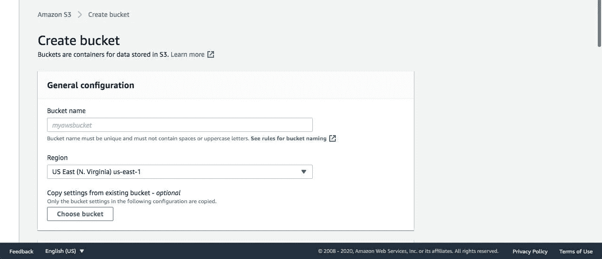

creating an s3 bucket

现在在**桶名**字段输入一个名称。然后向下滚动，您将看到黄色的**创建存储桶**按钮，单击该按钮。它将为您创建一个存储桶，您将在列表中看到它。

## 创建 Lambda 函数

在 [AWS Lambda 控制台](https://console.aws.amazon.com/lambda)中创建 Lambda 函数，点击**创建函数**按钮。您将重定向到此页面。

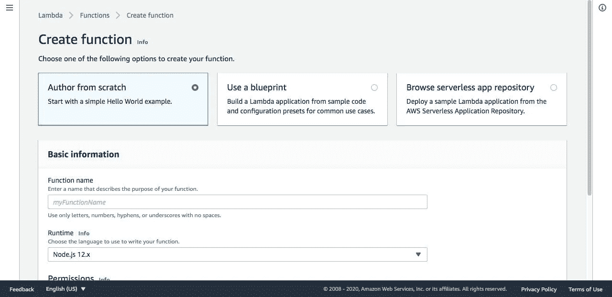

Creating a lambda function

在**功能名称**字段中输入功能名称。如果您已经创建了 lambda 函数，那么您可以选择**使用蓝图。**如果没有，你必须从头选择**作者**并向下滚动点击**创建功能**按钮。您将看到如下所示的内容。

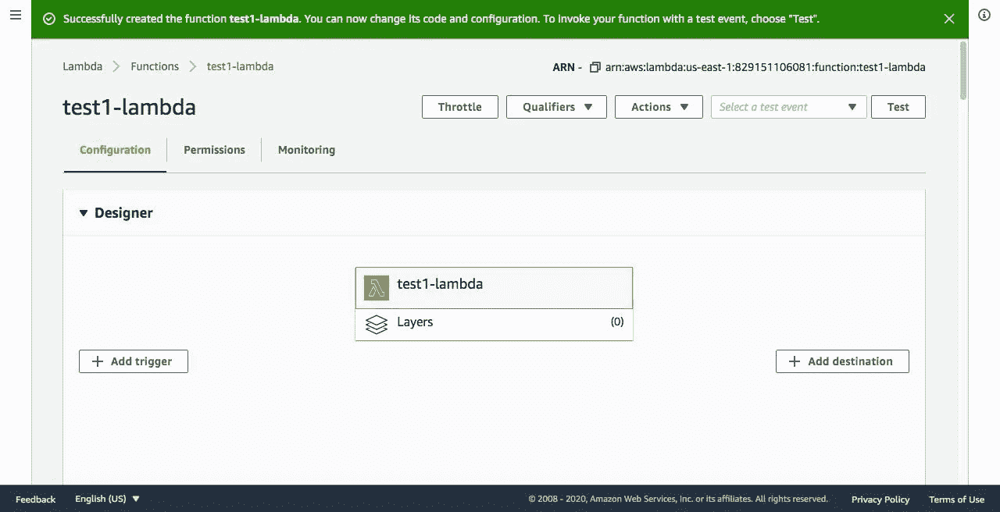

## **创建一个项目**

打开您的终端并输入以下命令。

```
$ mkdir lambda-tutorial && cd lambda-tutorial$ npm init -y$ npm i aws-sdk$ touch index.js
```

通过输入这些命令，它将创建一个项目并安装`aws-sdk` 包和`index.js`文件。这将需要在代码上创建逻辑。现在在你喜欢的代码编辑器上打开`index.js`。例如，您想用 VS 代码打开。输入以下命令。你可以用 Atom，Sublime text 来做这个。

```
$ code ./index.js
```

现在在这个文件中输入下面的代码。

```
const AWS *=* require('aws-sdk');const s3 *=* *new* AWS*.S3*({
 *accessKeyId*: 'YOUR_ACCESS_KEY', *// replace with your access key
  secretAccessKey*: 'YOUR_SECRET_KEY', *// replace with your secret   key* });*exports.*handler *=* async (event, context, callback) => {
/*
 HANDLE DATA WHICH ARE SENT FROM CLINT APP.
 HERE I JUST ADD STATIC DATA 
*/
   const s3Bucket *=* 'YOUR_BUCKET_NAME'; *// replace with your bucket name* const objectName *=* 'helloworld.json'; *// File name which you want to put in s3 bucket* const objectData *=* '{ "message" : "Hello World!" }'; *// file data you want to put* const objectType *=* 'application/json'; *// type of file* *try* { *// setup params for putObject* const params *=* {
       *Bucket*: s3Bucket,
       *Key*: objectName,
       *Body*: objectData,
       *ContentType*: objectType,
    }; const result *=* *await* s3*.*putObject(params)*.*promise(); console*.*log(`File uploaded successfully at https:/` *+* s3Bucket *+* `.s3.amazonaws.com/` *+* objectName);
  } *catch* (error) {
    console*.*log('error');
  }
};
```

## **在 Lambda 上部署代码**

现在我们将把代码部署到 lambda 函数中。我们需要将我们的项目转换成 zip 格式。压缩后，进入 [AWS Lambda 控制台](https://console.aws.amazon.com/lambda)并选择我们在步骤 2 中创建的函数。您将重定向到此页面。


向下滚动到**功能代码**部分。点击**动作**按钮，选择**上传. zip 文件**并上传您之前创建的 zip 文件。

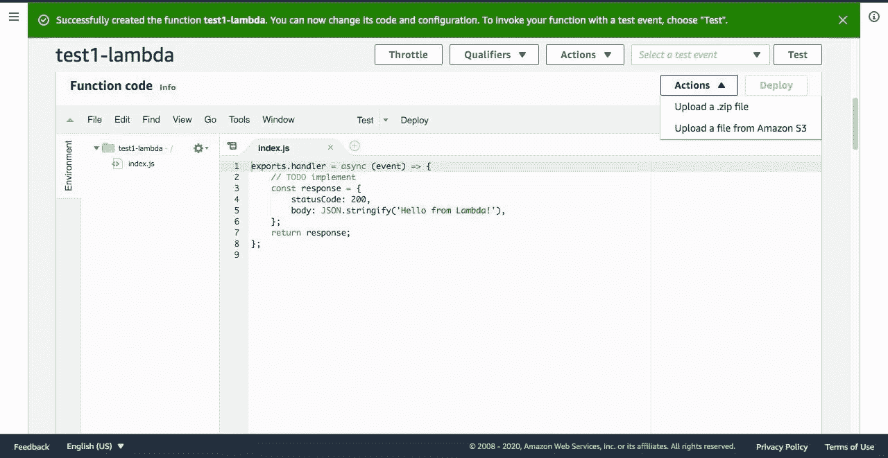

更新成功后，您将在编辑器中看到代码。现在你会看到**动作**按钮旁边的**展开**按钮。点击**测试**按钮并创建测试。创建后，再次测试点击**测试**按钮。然后你会看到这样一个日志。

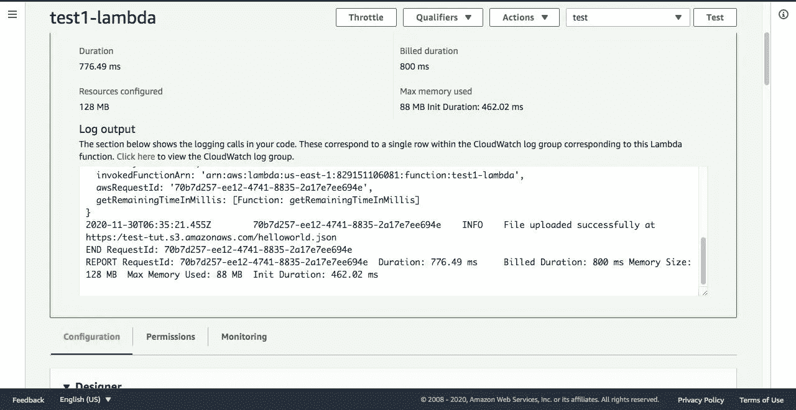

此外，您可以确认它是否已成功添加。进入[亚马逊 S3 控制台](https://console.aws.amazon.com/s3)选择你创建的桶。在**物体**部分，你会看到如下图。

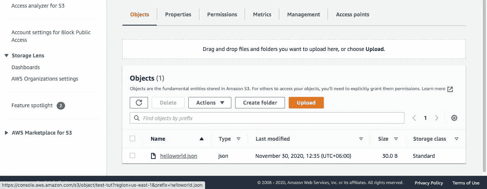

现在我们想从客户端应用程序调用我们的 lambda 函数。为此，我们必须执行以下步骤。

## 使用 AWS API 网关创建 API

转到[亚马逊 API 网关控制台](https://console.aws.amazon.com/apigateway)，点击**创建 API** ，然后选择 HTTP API，在那里你会找到**构建**按钮。现在，您必须遵循 4 个步骤来创建一个 API。

**第一步。**输入 API 名称。另外，选择 integrations 作为 lambda，并添加我们已经创建的 lambda 函数。

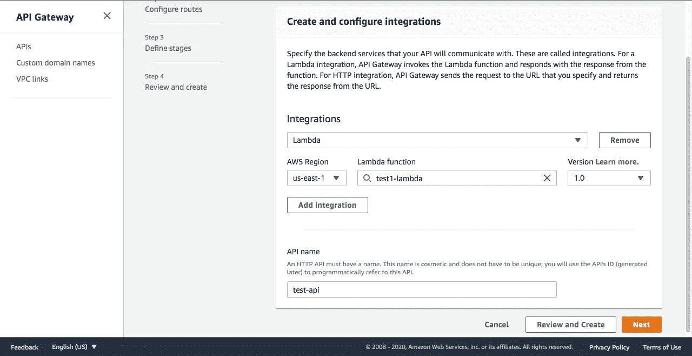

**第二步。**选择一个方法并为 API 添加一个路径。

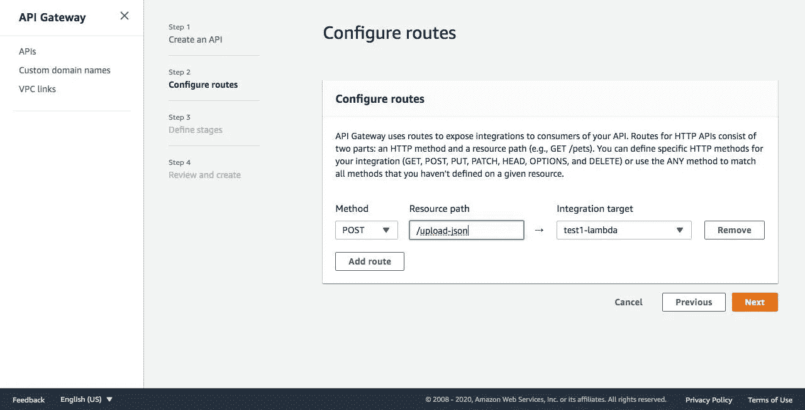

**步骤三。**为 API 定义一个阶段。对于这个教程，我不需要任何舞台。因此，我将它作为默认设置。如果你需要你可以添加。

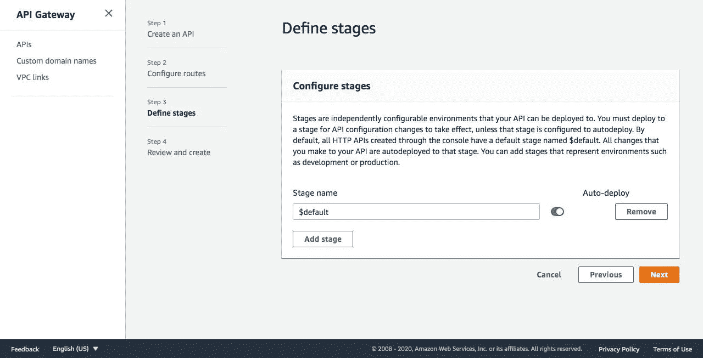

**第四步。**回顾一切正确与否。如果没有，可以点击**编辑**按钮进行编辑。

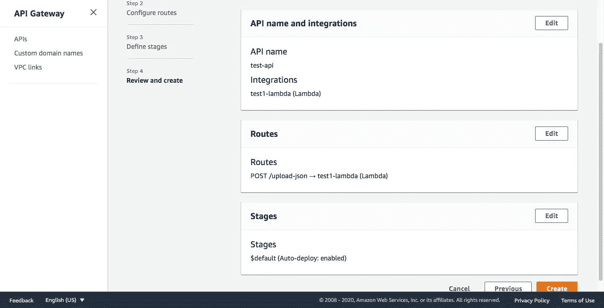

正确完成这些步骤后，现在点击**创建**按钮。它将为您创建一个 API，该 API 使用后端作为我们指定的 lambda 函数。现在，您将看到如下所示的内容。

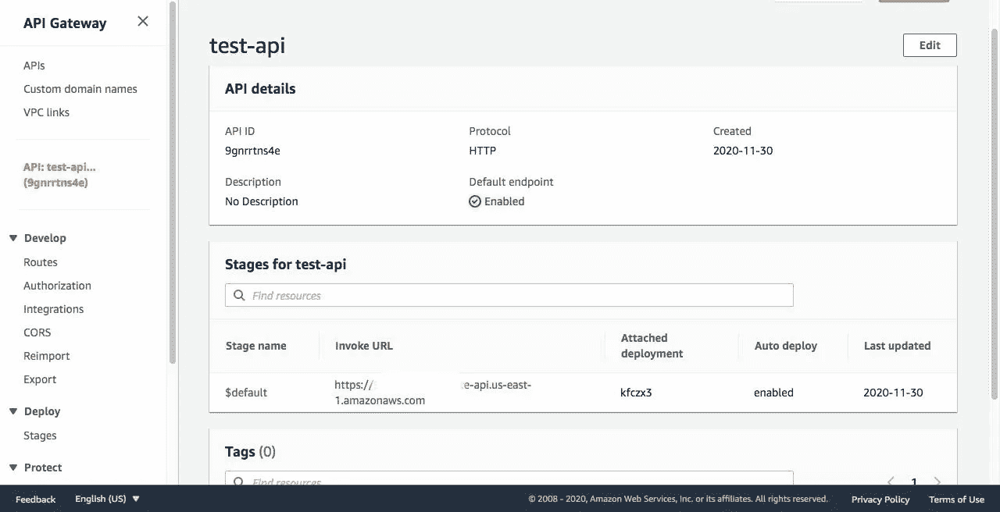

现在复制**调用 URL。这是我们下一步需要的。我们还必须做另一件事，那就是我们的客户将来自不同的域，为此我们必须启用 **CORS** 。要启用 CORS，请转到[亚马逊 API 网关控制台](https://console.aws.amazon.com/apigateway/)选择您已经创建的 API。从左侧导航，在**开发**部分点击 **CORS** 选项卡。你看下面这样。**

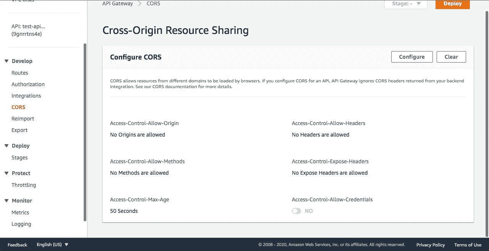

现在点击**配置**按钮，添加你希望被允许的源代码、头文件和方法。为了这个教程的目的，我在下面添加一些东西。您可以根据需要进行定制。

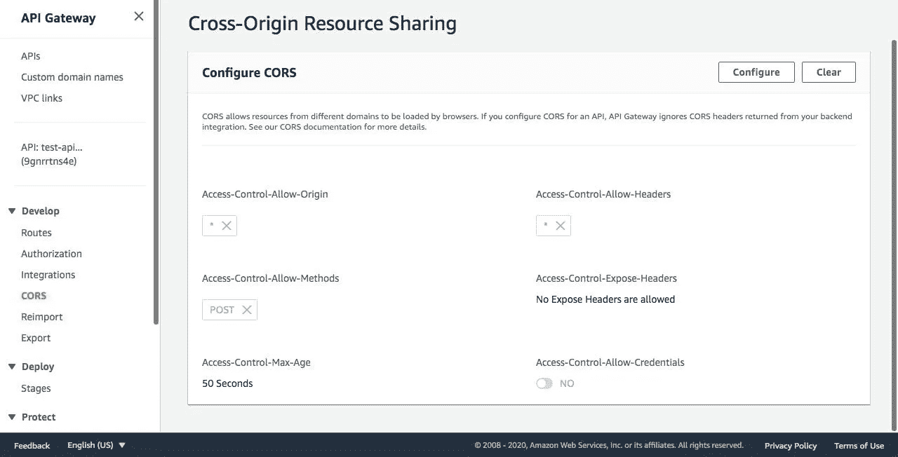

## 构建客户端应用程序

现在我们将使用 ReactJs 构建一个客户端应用程序。我们开始吧。

```
$ npx create-react-app call-lambda && cd call-lambda
```

你想请求我们的 API 调用 lambda 函数。对于请求，我们将使用`axios`包。要安装它，请输入以下命令。

```
$ yarn add axiosor,$ npm i axios
```

现在打开 App.js 文件，并在文件中添加以下代码。

```
import React from 'react';
import axios from 'axios';function App() {
  const api = 'YOUR_URL'; // enter the URL copied from prev. step
  const data = { name: 'Jhon Doe', age: 40 }
  const handleClick = () => {
    axios.post(api, data)
      .then(res => console.log(res))
      .catch(err => console.log(err))
  }return(
     <div>
        <button onClick={() => handleClick()}>Upload File</button>
     </div>
  )
}export default App;
```

现在运行客户端应用程序。

```
$ yarn start
```

现在点击**上传文件**按钮，这将调用我们的 lambda 函数并将文件放在我们的 S3 桶中。

恭喜你。您已经成功地使用 AWS Lambda 在 S3 完成了 JSON 文件的上传过程。这是一次非常漫长的旅程。我希望你的时间没有浪费。你学到了新的东西。我感谢你的努力。