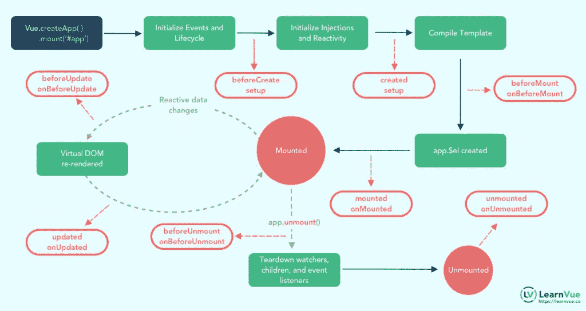

# Vue3 中 Vue 生命周期挂钩的完整指南

> 原文：<https://javascript.plainenglish.io/a-complete-guide-to-vue-lifecycle-hooks-in-vue3-3861d78033ba?source=collection_archive---------9----------------------->


Photo by [Sonja Langford](https://unsplash.com/@sonjalangford?utm_source=medium&utm_medium=referral) on [Unsplash](https://unsplash.com?utm_source=medium&utm_medium=referral)

在[的生命周期挂钩 Vue2 和 Vue3](https://learnvue.co/2020/02/building-the-same-component-in-vue2-vs-vue3) 工作非常**相似**——我们仍然可以访问相同的挂钩，我们仍然希望将它们用于相同的用例。

如果我们的项目使用 Options API，我们不需要为我们的 Vue 生命周期钩子修改任何代码。这是因为 Vue3 被设计成**兼容**先前版本的 Vue。

然而，当我们决定使用组合 API 时，我们访问这些钩子的方式有一点不同——这在**更大的 Vue 项目中特别有用。**

到本文结束时，您将知道如何在 Options API 和 Composition API 中使用生命周期挂钩，并开始编写更好的代码。

我们走吧！

**目录**

1.  什么是 Vue 生命周期挂钩
2.  在选项 API 中使用 Vue 生命周期挂钩
3.  在组合 API 中使用 Vue3 生命周期挂钩
4.  将 Vue2 代码更新到 Vue3 生命周期挂钩
5.  看看 Vue2 和 Vue3 中的每个生命周期挂钩
6.  创作挂钩
7.  安装挂钩
8.  更新挂钩
9.  破坏钩
10.  激活挂钩
11.  Vue3 中的新调试挂钩
12.  结论

## 什么是 Vue 生命周期挂钩

首先，让我们看一下 Vue3 生命周期挂钩图，包括选项 API 和组合 API。在我们深入细节之前，这应该给出了正在发生的事情的高层次概述。



Source: LearnVue

本质上，每个主要的 Vue 生命周期事件被分成两个钩子，分别在事件之前和之后调用。您可以在 Vue 应用中利用四个主要事件(8 个主要挂钩)。

*   创建-在组件的创建上运行
*   挂载—在 DOM 挂载时运行
*   更新—在修改反应数据时运行
*   销毁—在元素被销毁之前运行。

## 在选项 API 中使用我们的 Vue 生命周期挂钩

有了 Options API，我们的生命周期挂钩在我们的 Vue 实例上作为 options 公开。我们不需要导入任何东西，我们只需要调用方法并为生命周期钩子编写代码。

例如，假设我们想要访问我们的`mounted()`和`updated()`生命周期挂钩。它可能看起来像这样。

```
<script>     
   export default {         
      mounted() {             
         console.log('mounted!')         
      },         
      updated() {             
         console.log('updated!')         
      }     
   }
</script>
```

很简单，对吧？

好吧。让我们继续在组合 API 中使用 Vue 3 生命周期挂钩。

## 在 Vue3 组合 API 中使用我们的 Vue 生命周期挂钩

在组合 API 中，我们必须在使用生命周期挂钩之前将其导入到我们的项目中。这有助于保持项目尽可能的轻量级。

```
import { onMounted } from 'vue'
```

除了`beforeCreate`和`created`(由`setup`方法本身代替)之外，我们可以在我们的设置方法中访问 9 个选项 API 生命周期钩子

*   `onBeforeMount` -安装开始前调用
*   `onMounted` -安装部件时调用
*   `onBeforeUpdate` -当反应数据改变时和重新渲染前调用
*   `onUpdated` -重新渲染后调用
*   `onBeforeUnmount` -在 Vue 实例被销毁之前调用
*   `onUnmounted` -在实例被销毁后调用
*   `onActivated` -激活保活组件时调用
*   `onDeactivated` -当保持激活的组件被停用时调用
*   `onErrorCaptured` -当从子组件捕获到错误时调用

当我们导入它们并在代码中访问它们时，应该是这样的。

```
<script>
import { onMounted } from 'vue'

export default {
   setup () {
     onMounted(() => {
       console.log('mounted in the composition api!')
     })
   }
}
</script>
```

## 将 Vue2 代码更新为 Vue3 生命周期挂钩

这种方便的 Vue2 到 Vue3 生命周期映射直接来自 [Vue3 Composition API 文档](https://vue-composition-api-rfc.netlify.com/api.html#watcheffect)，我认为这是了解事物将如何变化以及我们如何使用它们的最有用的方法之一。

*   `beforeCreate` - >使用`setup()`
*   `created` - >使用`setup()`
*   `beforeMount` - > `onBeforeMount`
*   `mounted` - > `onMounted`
*   `beforeUpdate`->T21
*   `updated` - > `onUpdated`
*   `beforeDestroy` - > `onBeforeUnmount`
*   `destroyed` - > `onUnmounted`
*   `errorCaptured` - > `onErrorCaptured`

## 深入了解每个生命周期挂钩

我们现在明白了两件重要的事情:

1.  我们可以使用的不同生命周期挂钩
2.  如何在选项 API 和合成 API 中使用它们

让我们更深入地了解每个生命周期钩子，看看它们是如何使用的，我们可以在每个钩子中编写什么样的代码，以及它们在选项 API 和组合 API 中的区别。

## 创建钩子——虚拟企业生命周期的开始

创建钩子是程序中第一个运行的东西。

## *beforeCreate() —选项 API*

因为创建的钩子是初始化所有反应数据和事件的东西，`beforeCreate`不能访问任何组件的反应数据和事件。

以下面的代码块为例:

```
export default {
   data() { 
     return { 
       val: 'hello'    
     }
   },
   beforeCreate() {     
     console.log('Value of val is: ' + this.val)   
   }
}
```

因为数据还没有初始化，`val`的输出值是`undefined`。您也不能在这个方法中调用组件方法。

如果您想查看可用内容的完整列表，我建议您只需运行`console.log(this)` 来查看已经初始化的内容。当使用 Options API 时，这在其他钩子中也很有用。

当您需要某种不需要分配给数据的逻辑/API 调用时，使用`beforeCreate`钩子非常有用。因为如果我们现在给数据赋值，一旦状态被初始化，数据就会丢失。

## *created() —选项 API*

我们现在可以访问组件的数据和事件。因此，修改上面的示例，使用`created`而不是`beforeCreate`，我们可以看到输出是如何变化的。

```
export default {
   data() { 
     return { 
       val: 'hello'    
     }
   },
   created() {     
     console.log('Value of val is: ' + this.val)   
   }
}
```

这样的输出将会是`Value of val is: hello`，因为我们已经初始化了我们的数据。

当处理读/写反应数据时，使用创建的方法是有用的。例如，如果您想进行一个 API 调用，然后存储该值，那么这里就是这样做的地方。

在这里做比在 mounted 中做更好，因为它在 Vue 的同步初始化过程中发生得更早，您可以执行所有您想要的数据读/写。

## 复合 API 创建挂钩呢？

对于使用组合 API 的 Vue3 生命周期挂钩，`beforeCreate`和`created`都被`setup()`方法替换。这意味着您将放在这些方法中的任何代码现在都在您的 setup 方法中。

我们刚刚在创建的生命周期挂钩中编写的代码将被重写为这样。

```
import { ref } from 'vue'

export default {
   setup() {    
     const val = ref('hello') 
     console.log('Value of val is: ' + val.value)       
     return {         
       val
     }
   }
}
```

## 挂载钩子—访问 DOM

这些安装钩处理**组件的安装和渲染**。这些是项目和应用程序中最常用的挂钩。

## *beforeMount()和 onBeforeMount()*

在组件 DOM 实际呈现和挂载之前调用。在这一步中，根元素尚不存在。在选项 API 中，这可以使用`this.$el`来访问。在组合 API 中，为了做到这一点，您必须在根元素上使用一个`ref`。

```
export default {
   beforeMount() {
     console.log(this.$el)
   }
 }
```

使用 refs 的合成模板如下所示。

```
<template>
   <div ref='root'>
     Hello World
   </div>
</template>
```

然后，相应的脚本尝试访问 ref。

```
import { ref, onBeforeMount } from 'vue'

export default {
   setup() {
      const root = ref(null) 
      onBeforeMount(() => {   
         console.log(root.value) 
      }) 
      return { 
         root
      }
    },
    beforeMount() {
      console.log(this.$el)
    }
 }
```

由于`app.$el`尚未创建，输出将是未定义的。

虽然最好使用`created()` / `setup()`来执行 API 调用，但这确实是最后一步，因为这是在创建之后，所以在过程的后期不必要调用它们之前，它们可以访问相同的组件变量。

## *已安装()和未安装()*

在组件第一次呈现后立即调用。该元素现在是可用的，允许直接 DOM 访问。

同样，在 Options API 中，我们可以使用`this.$el`来访问我们的 DOM，而在 Composition API 中，我们需要使用 refs 来访问 Vue 生命周期钩子中的 DOM。

```
import { ref, onMounted } from 'vue'

 export default {
   setup() {    /* Composition API */

     const root = ref(null)

     onMounted(() => {
       console.log(root.value)
     })

     return {
       root
     }
   },
   mounted() { /* Options API */
     console.log(this.$el)
   }
 }
```

## 更新挂钩 VueJS 生命周期中的反应

每当修改反应数据时，都会触发更新的生命周期事件，从而触发渲染更新。

## *beforeUpdate()和 onBeforeUpdate()*

在数据更改和组件重新呈现之前运行。这是在发生任何变化之前手动更新 DOM 的好地方。例如，您可以删除事件侦听器。

`beforeUpdate`可用于跟踪对组件的编辑次数，甚至跟踪创建“撤销”功能的动作。

## *已更新()和未更新()*

一旦 DOM 被更新，updated 方法就会调用。下面是一些同时使用 beforeUpdate 和 updated 的起始代码。

```
<template>
    <div>
      <p>| edited {{ count }} times</p>
      <button @click='val = Math.random(0, 100)'>Click to Change</button>
    </div>
 </template>
```

使用相应的脚本。

```
export default {
   data() {
      return {
        val: 0
      }
   },
   beforeUpdate() {
      console.log("beforeUpdate() val: " + this.val)
   },
   updated() {
      console.log("updated() val: " + this.val
   }
 }
```

运筹学

```
import { ref, onBeforeUpdate, onUpdated } from 'vue'

 export default {
   setup () {
     const count = ref(0)
     const val = ref(0)

     onBeforeUpdate(() => {
       count.value++;
       console.log("beforeUpdate");
     })

     onUpdated(() => {
       console.log("updated() val: " + val.value)
     })

     return {
       count, val
     }
   }
 }
```

这些方法很有用，但是对于很多用例，我们可能要考虑使用观察器来检测这些数据变化。观察器很好，因为它们给出了更改数据的旧值和新值。

另一种选择是使用计算值来改变基于元素的状态。

## 破坏挂钩——清理东西

组件的销毁钩用于移除组件和清理所有松散末端的过程中。现在是[删除事件监听器](https://learnvue.co/2020/01/a-vue-event-handling-cheatsheet-the-essentials/)和如果处理不当可能导致内存泄漏的东西的时候了。

## *beforeUnmount()和 onBeforeUnmounted()*

因为这是在组件开始拆卸之前，所以这是进行大部分(如果不是全部)清理工作的时候。在这个阶段，您的组件仍然是完全可用的，没有任何东西被破坏。

在选项 API 中，删除事件侦听器的示例如下所示。

```
export default {
   mounted() {
     console.log('mount')
     window.addEventListener('resize', this.someMethod);
   },
   beforeUnmount() {
     console.log('unmount')
     window.removeEventListener('resize', this.someMethod);
   },
   methods: {
      someMethod() {
         // do smth
      }
   }
}
```

这在组合 API 中

```
import { onMounted, onBeforeUnmount } from 'vue' 

 export default {
   setup () {

     const someMethod = () => {
       // do smth
     }

     onMounted(() => {
       console.log('mount')
       window.addEventListener('resize', someMethod);
     })

     onBeforeUnmount(() => {
       console.log('unmount')
       window.removeEventListener('resize', someMethod);
     })

   }
 }
```

一种方法是在 Vite、vue-cli 或任何支持热重载的开发环境中工作。当您的代码更新时，您的一些组件将卸载和安装它们自己..

## *未安装的()和未安装的()*

在这一点上，你的大部分组件和它的属性都消失了，所以你能做的不多。再一次，我会使用打印出一些数据来看看到底还有什么，以及它是否对你的项目有用。

```
import { onUnmounted } from 'vue'

export default {
  setup () { /* Composition API */

    onUnmounted(() => {
      console.log('unmounted')
    })

  },
  unmounted() { /* Options API */
    console.log('unmounted')
  }
}
```

## 激活挂钩—管理保持活动状态的组件

一个[保活标签是动态组件](https://learnvue.co/2019/12/an-overview-of-vue-keep-alive/ https://learnvue.co/2020/04/a-beautiful-parallax-scrolling-effect-in-vuejs-daily-vue-tips-2/ https://learnvue.co/2020/01/getting-smart-with-vue-form-validation-vuelidate-tutorial/ https://learnvue.co/2020/01/build-a-custom-vuejs-tag-input-in-under-10-minutes/ https://learnvue.co/ https://learnvue.co/2020/02/building-the-same-component-in-vue2-vs-vue3/ https://learnvue.co/2020/01/4-vue3-composition-api-tips-you-should-know/ https://learnvue.co/2019/12/8-free-vue-icon-libraries-to-pretty-up-your-web-app/ https://learnvue.co/2020/02/how-and-why-to-use-wrapper-components-in-vue3/ https://learnvue.co/2020/04/animated-active-menu-highlights-in-vuejs-daily-vue-tips-1/ https://learnvue.co/2020/03/extract-and-reuse-logic-in-the-vue-composition-api/ https://learnvue.co/2020/01/7-simple-vuejs-tips-you-can-use-to-become-a-better-developer/ https://learnvue.co/2019/12/what-you-need-to-know-about-vue3-in-2020/ https://learnvue.co/2020/01/an-introduction-to-vuejs-suspense-components/ https://learnvue.co/2020/01/creating-your-first-vuejs-custom-directive/ https://learnvue.co/2020/09/a-quick-vue3-infinite-scrolling-component-daily-vue-tips-4/ https://learnvue.co/2020/09/an-introduction-to-vue-teleport-a-new-feature-in-vue3/ https://learnvue.co/2020/03/7-great-vue3-tutorials-and-resources-to-start-learning-today/ https://learnvue.co/2020/01/how-to-use-vuejs-filters-to-write-better-code/ https://learnvue.co/2020/03/using-vue-watcheffect-to-track-reactive-dependencies/ https://learnvue.co/2020/09/how-to-deploy-your-vue-app-to-github-pages/)的包装元素。它存储了对非活动组件的缓存引用，这样 Vue 就不必在每次动态组件改变时创建一个全新的实例。

对于这个特定的用例，Vue 给了我们两个生命周期挂钩

## *激活()和未激活()*

每当保持活动状态的动态组件被“重新激活”时，就会调用该方法，这意味着它现在是动态组件的活动视图。

例如，如果我们使用 keep-alive 组件来管理不同的选项卡视图，那么每次我们在选项卡之间切换时，当前选项卡都会运行这个激活的钩子。

假设我们有以下使用保活包装器的[动态组件设置](https://learnvue.co/2020/01/an-overview-of-vuejs-dynamic-components/)。

```
<template>
   <div>
     <span @click='tabName = "Tab1"'>Tab 1 </span>
     <span @click='tabName = "Tab2"'>Tab 2</span>
     <keep-alive>
       <component :is='tabName' class='tab-area'/>
     </keep-alive>
   </div>
</template>

<script>
import Tab1 from './Tab1.vue'
import Tab2 from './Tab2.vue'

import { ref } from 'vue'

export default {
  components: {
    Tab1,
    Tab2
  },
  setup () { /* Composition API */
    const tabName = ref('Tab1')

    return {
      tabName
    }
  }
}
</script>
```

在我们的`Tab1.vue`组件中，我们可以像这样访问我们的激活钩子。

```
<template>
 <div>
 <h2>Tab 1</h2>
 <input type='text' placeholder='this content will persist!'/>
 </div>
</template>

<script>
import { onActivated } from 'vue'

export default {
 setup() {
    onActivated(() => {
       console.log('Tab 1 Activated')
    })
 }
} 
</script>
```

## *停用()和未停用()*

正如您所猜测的，当一个保持活动状态的组件不再是动态组件的活动视图时，就会调用这个函数。

这个钩子对于一些用例很有用，比如当一个特定的视图失去焦点时保存用户数据和触发动画。

我们可以像这样抓住钩子。

```
import { onActivated, onDeactivated } from 'vue'

export default {
  setup() {
    onActivated(() => {
       console.log('Tab 1 Activated')
    })

    onDeactivated(() => {
       console.log('Tab 1 Deactivated')
    })
  }
}
```

现在，当我们在选项卡之间切换时，每个动态组件的状态都将被缓存和保存。


太好了！

## Vue3 调试挂钩

Vue3 给了我们两个钩子，我们可以用它们来进行调试。它们是:

1.  `onRenderTracked`
2.  `onRenderTriggered`

这两个事件都有一个 DebuggerEvent，它允许我们判断是什么导致了 Vue 实例中的重新呈现。

```
export default {
    onRenderTriggered(e) {
       debugger
       // inspect which dependency is causing the component to re-render
    }
}
```

## 结论

无论您决定使用 Options API 还是 Composition API，重要的是不仅要知道使用什么生命周期挂钩，还要知道为什么使用它。

对于许多问题，多个生命周期挂钩是可行的。但是知道哪一个**对你的用例来说是最好的**还是很好的。无论如何，你应该考虑一下，并且有一个好的理由来选择一个特定的生命周期挂钩。

我希望这能帮助你理解更多关于生命周期挂钩的知识，以及如何在你的项目中实现它们。

编码快乐！

[如果你有兴趣了解更多关于 Vue 3 的知识，下载我的免费的 Vue 3 备忘单，里面有基本的知识，比如组合 API、Vue 3 模板语法和事件处理。](https://learnvue.co/vue-3-essentials-cheatsheet/)