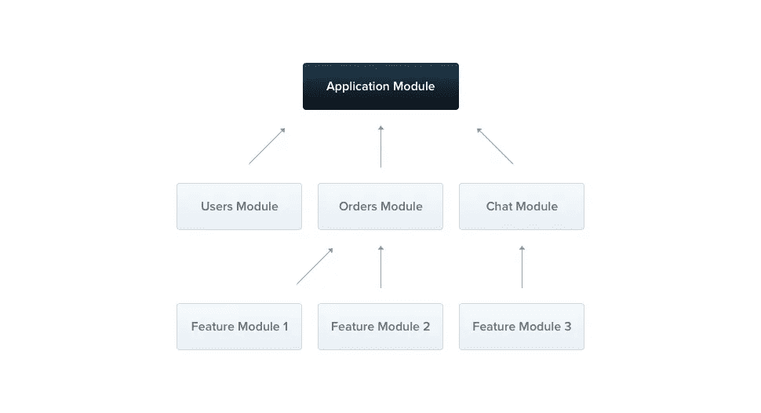
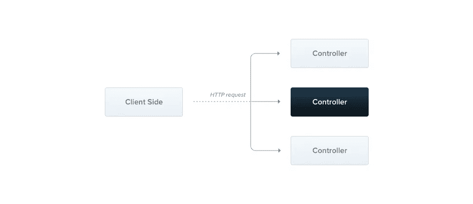
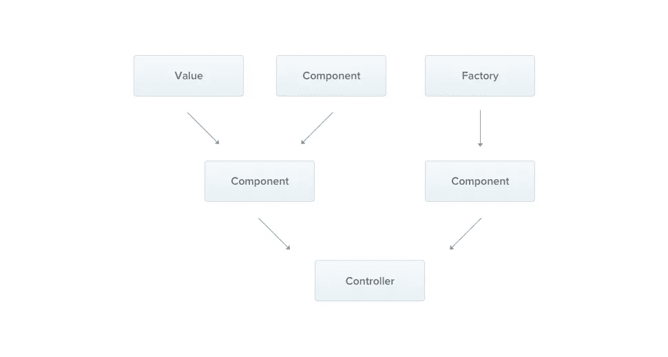
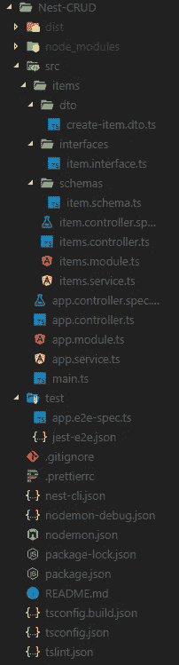

# NestJS 速成班

> 原文：<https://javascript.plainenglish.io/a-crash-course-in-nestjs-cccfc0090a16?source=collection_archive---------0----------------------->


Photo by [Dlanor S](https://unsplash.com/@dlanor_s?utm_source=medium&utm_medium=referral) on [Unsplash](https://unsplash.com?utm_source=medium&utm_medium=referral)

# 如果您曾经使用过 Node JS 或 Express，那么您会正确地意识到维护和扩展您的应用程序是多么乏味和令人困扰。

这就是 NestJS 的用武之地。它使用 Typescript 等现代开发工具，并提供开箱即用的应用程序架构，允许开发人员和团队创建高度可测试、可伸缩、松散耦合且易于维护的应用程序。

在幕后，Nest 利用了 Express 和 Fastify 等强大而健壮的 HTTP 框架。它在这些 API 上提供了一个抽象层，但也可以直接向我们开发人员公开它们的 API。

在本文中，我们将看看 NestJS 最重要的概念，甚至在最后构建一个小的 CRUD 应用程序。

所以，不要再浪费时间了，让我们开始吧。

# 为什么要关心 NestJS

现在的问题仍然是为什么首先应该使用 NestJS。以下是 NodeJS 开发者应该考虑转用 NestJS 的一些原因。

## 类型检查:

NestJS 基于 Typescript，它使我们开发人员能够向变量添加类型，并基于它们提供编译错误和警告。Typescript 还为我们 javascript 开发人员提供了许多其他的好处，你可以在这个[速成班](https://medium.com/free-code-camp/a-crash-course-in-typescript-e6bf9c10946)中找到更多。

## 依赖注入:

依赖注入是一种设计模式，用于提高应用程序的效率和模块化。它通常用于保持代码整洁，易于阅读和使用。NestJS 提供了开箱即用的功能，甚至可以轻松地使用它来创建耦合组件。

## 应用架构:

NestJS 项目有一个预定义的结构，提供了可测试性、可伸缩性和可维护性的最佳实践。尽管如此，它仍然非常灵活，可以根据需要进行更改。

## 可测试:

NestJS 提供了一个完整的 Jest 测试配置，但仍然允许我们开发人员使用我们认为合适的其他测试工具。

既然我们已经了解了 NestJS 为什么有用以及它可以在哪些方面改进我们的开发体验，那么让我们来看看这个框架最重要的概念和构建块。

# 模块

模块是每个 NestJS 应用程序的基本构建块，用于将控制器和服务等相关功能组合在一起。它们是用@Module()修饰器修饰的类型脚本文件。



Src: [https://docs.nestjs.com/modules](https://docs.nestjs.com/modules)

每个应用程序至少需要一个模块，即所谓的根模块。根模块是应用程序的起点，在启动项目时自动生成。理论上，我们可以在这个模块中编写整个应用程序，但是建议将一个大的应用程序分成多个模块，以帮助维护和可读性。

建议和常规做法是将每个特性分组到它们自己的模块中，例如 UserModule 和 ItemModule。

一个简单的模块示例:

```
@Module({
  controllers: [ItemController],
  providers: [ItemService],
})
export class ItemModule {}
```

# 控制器

在 Nestjs 中，控制器负责处理传入的请求并将响应返回给客户端。它们是使用@Controller()声明符定义的，该声明符将主路由的路径作为其参数。



[https://docs.nestjs.com/controllers](https://docs.nestjs.com/controllers)

控制器内部的每个函数都可以用以下声明符进行注释:

*   @Get() —定义一个 Get 请求
*   @Post() —定义发布请求
*   @Delete() —删除请求
*   @Put() — Put 请求

下面是一个具有一个 get 路径的简单控制器的示例:

```
@Controller('item')
export class ItemController {
  @Get()
  findAll(): string {
    return 'Returns all items';
  }
}
```

**注意:**在创建控制器之后，需要将它添加到一个模块中，以便 NestJS 能够识别它(当您使用 Nest CLI 生成它时，这将自动发生)。

# 提供者

NestJS 中的提供者也被称为服务，用于封装和抽象控制器等其他类的逻辑。可以使用依赖注入将它们注入到其他类中。



[https://docs.nestjs.com/providers](https://docs.nestjs.com/providers)

提供者是一个普通的 Typescript 类，顶部有一个@ Injectable()声明符。

例如，我们可以很容易地创建一个获取所有项目的服务，并在我们的 *ItemController* 中使用它。

```
@Injectable()
export class ItemService {
  private readonly items: Item[] = [{ title: 'Great item', price: 10 }];

  create(item: Item) {
    this.items.push(item);
  }

  findAll(): Item[] {
    return this.items;
  }
}
```

现在我们已经定义了我们的服务，让我们在控制器中使用它:

```
@Controller('item')
export class ItemController {
  constructor(private readonly itemService: ItemService) {}

  @Get()
  async findAll(): Promise<Item[]> {
    return this.itemService.findAll();
  }
}
```

# 生命周期

每个嵌套应用程序元素都有自己的生命周期，它由各种生命周期挂钩组成，这些生命周期挂钩可用于提供这些关键状态的可见性以及在它们发生时采取行动的能力。

## 生命周期事件:

以下是四个生命周期序列:

*   OnModuleInit —一旦初始化了主机模块就调用它
*   OnApplicationBootstrap —在应用程序完全启动并引导后调用
*   OnModuleDestroy —在 Nest 销毁主机模块之前进行清理
*   OnApplicationShutdown —当应用程序关闭时

## 用法:

这四个生命周期挂钩中的每一个都由一个接口表示。这意味着我们只需要在组件(类)中实现接口并覆盖函数。

下面是 OnModuleInit 接口的一个简单示例:

```
import { Injectable, OnModuleInit } from '@nestjs/common';

@Injectable()
export class ItemService implements OnModuleInit {
  onModuleInit() {
    console.log(`The module has been initialized.`);
  }
}
```

# 管道

NestJS 中的管道用于操作控制器路由处理程序的参数。这给了他们两个典型的用例:

*   转换-将输入数据转换为所需的输出
*   验证-评估输入数据是否有效

## 用法:

可以通过在我们的类上实现 PipeTransform 接口并覆盖 Transform 函数来创建管道。让我们看一个自定义验证管道的简单示例:

```
import { PipeTransform, Injectable, ArgumentMetadata } from '@nestjs/common';

@Injectable()
export class CustomValidationPipe implements PipeTransform {
  transform(value: any, metadata: ArgumentMetadata) {
   const { metatype } = metadata;
   if (!metatype) {
     return value;
   }
   const convertedValue = plainToClass(metatype, value);
   return convertedValue;
  }
}
```

在这个例子中，我们检查我们提供的元标记是否为空，如果是，我们将接收到的数据转换为我们定义的元类型。

# 测试

NestJS 为我们提供了 Jest 测试框架的完整设置，这使得开始单元、集成和端到端测试变得容易。

在您开始测试之前，我建议您熟悉测试金字塔和其他最佳实践，如 KISS(保持简单愚蠢)技术。

## 单元测试:

现在让我们来看看上面定义的*项目服务*的简单单元测试。

```
import { Test } from '@nestjs/testing';
import { ItemService } from './item.service';describe('ItemService', () => {
  let service: ItemService;

  beforeEach(async () => {
    const module: TestingModule = await Test.createTestingModule({
      providers: [ItemService],
    }).compile();

    service = module.get<ItemService>(ItemService);
  });

  it('should be defined', () => {
    expect(service).toBeDefined();
  });
});
```

在这个例子中，我们使用 NestJS 提供的测试类，通过 compile()和 get()函数创建并获取我们的服务。之后，我们只需编写一个简单的测试来检查服务是否被定义。

**注意:**为了模拟一个真实的实例，您需要用一个定制的提供者覆盖一个现有的提供者。

## 端到端测试:

端到端测试帮助我们测试 API 的整体功能，以及我们的小单元如何协同工作。端到端测试利用了我们用于单元测试的相同设置，但是额外利用了 [supertest](https://github.com/visionmedia/supertest) 库，它允许我们模拟 HTTP 请求。

```
describe('Item Controller (e2e)', () => {
  let app;

  beforeEach(async () => {
    const module: TestingModule = await Test.createTestingModule({
      imports: [ItemModule],
    }).compile();

    app = module.createNestApplication();
    await app.init();
  });

  it('/ (GET)', () => {
    return request(app.getHttpServer())
      .get('/item')
      .expect(200)
      .expect([{ title: 'Great item', price: 10 }]);
  });
});
```

这里，我们向前面创建的端点发送一个 HTTP 请求，并检查它是否返回正确的响应代码和数据。

# 入门指南

NestJS 提供了自己的 nice CLI(命令行界面),可以用来创建项目、模块、服务等等。我们可以使用节点包管理器(npm)和下面的命令来安装它。

```
npm i -g @nestjs/cli
```

之后，我们应该能够使用 new 命令创建一个新项目。

```
nest new project-name
```

现在我们已经安装了 CLI，让我们开始使用 NestJS 和 MongoDB 构建一个简单的 CRUD 应用程序。

# CRUD 示例

如本文前面所述，我们将使用 NestJS 和 MongoDB 作为数据库创建一个简单的 CRUD 应用程序。这将帮助您真正掌握 Nest 的核心概念。

## 创建项目:

首先，让我们使用上面讨论的命令创建项目。

```
nest new mongo-crud
```

之后，让我们进入生成的目录并启动我们的开发服务器。

```
// Move into the directory
cd mongo-crud// Start the development server
npm run start:dev
```

使用 Nodemon 运行应用程序，这意味着当您保存项目时，它会自动更新页面。

现在我们已经输入了这些命令，我们应该看到一个“Hello World！”我们 http://localhost:3000 上的消息。

## 生成文件:

接下来，我们需要创建这个项目所需的所有文件。让我们从使用 CLI 生成标准的 NestJS 文件开始。

```
nest generate module items
nest generate controller items
nest generate service items
```

之后，我们只需要为我们的数据库模式和访问对象添加一些文件。这是我的文件夹结构和文件的图片。



如您所见，您只需在我们的项目目录中创建三个丢失的文件夹及其文件。

## 设置 MongoDB:

接下来，我们将继续在我们的 Nest 项目中设置 MongoDB 数据库。为此，您首先需要在您的计算机上安装 MongoDB。如果您还没有下载，您可以使用[此链接](https://www.mongodb.com/download-center/community)下载。

完成本地安装后，我们只需要在项目中安装所需的依赖项，然后将它们导入到我们的模块中。

```
npm install --save @nestjs/mongoose mongoose
```

现在让我们在应用程序模块中导入 Mongo:

```
*import* { Module } *from* '@nestjs/common';
*import* { AppController } *from* './app.controller';
*import* { AppService } *from* './app.service';
*import* { MongooseModule } *from* '@nestjs/mongoose';
*import* { ItemsModule } *from* './items/items.module';@Module({
imports: [MongooseModule.forRoot('mongodb://localhost/nest'), ItemsModule],
controllers: [AppController],
providers: [AppService],
})
*export* class AppModule {}
```

如您所见，我们使用 forRoot()方法导入了 MongooseModule，该方法接受与 mongoose.connect()相同的参数。

我们还需要在 ItemsModule 中设置 Mongo，可以这样做:

```
*import* { Module } *from* '@nestjs/common';
*import* { MongooseModule } *from* '@nestjs/mongoose';
*import* { ItemsController } *from* './items.controller';
*import* { ItemsService } *from* './items.service';
*import* { ItemSchema } *from* './schemas/item.schema';@Module({
imports: [MongooseModule.forFeature([{ name: 'Item', schema: ItemSchema }])],
controllers: [ItemsController],
providers: [ItemsService],
})
*export* class ItemsModule {}
```

这里我们也导入了 MongooseModule，但是使用了 forFeature()方法，该方法定义了将在当前作用域中注册什么模型。得益于此，我们以后将能够使用依赖注入来访问服务文件中的模型。

## 构建模式:

接下来，我们将为数据库创建模式。模式定义了数据在数据库中的表示方式。让我们在我们的`item.schema.ts`文件中定义它。

```
*import* * *as* mongoose *from* 'mongoose';*export* const ItemSchema = new mongoose.Schema({
 name: String,
 qty: Number,
 description: String,
});
```

如你所见，我们首先需要导入*mongose*依赖项，然后使用*mongose 创建一个新的模式。Schema()* 。

## 接口:

接下来，我们将创建一个 Typescript 接口，用于我们的服务和控制器中的类型检查。要进行设置，只需将以下代码粘贴到您之前创建的`item.interface.ts`文件中。

```
*export* interface Item {
 id?: string;
 name: string;
 description?: string;
 qty: number;
}
```

## 创建 DTO:

DTO(数据传输对象)是定义数据如何通过网络发送的对象。它是一个基本类，变量与我们的模式相同(在我们的例子中)。

```
*export* class CreateItemDto {
 readonly name: string;
 readonly description: string;
 readonly qty: number;
}
```

我们现在已经完成了数据库的基本配置，可以继续编写实际的 CRUD 功能了。

## 设置服务:

服务文件将保存与我们的 CRUD(创建、读取、更新、删除)功能的数据库交互相关的所有逻辑。

```
*import* { Injectable } *from* '@nestjs/common';
*import* { Item } *from* './interfaces/item.interface';
*import* { Model } *from* 'mongoose';
*import* { InjectModel } *from* '@nestjs/mongoose';
*import* { CreateItemDto } *from* './dto/create-item.dto';@Injectable()
*export* class ItemsService {
 constructor(@InjectModel('Item') private readonly itemModel:  Model<Item>) {} async findAll(): Promise<Item[]> {
  *return* *await* *this*.itemModel.find();
 } async findOne(id: string): Promise<Item> {
  *return* *await* *this*.itemModel.findOne({ _id: id });
 }async create(item: CreateItemDto): Promise<Item> {
  const newItem = new this.itemModel(item);
  *return* *await* newItem.save();
 } async delete(id: string): Promise<Item> {
  *return* *await* *this*.itemModel.findByIdAndRemove(id);
 } async update(id: string, item: Item): Promise<Item> {
  *return* *await* *this*.itemModel.findByIdAndUpdate(id, item, { new: true });
 }
}
```

在这里，我们首先导入所有需要的依赖项，例如我们的 item.interface、dto 等等。

接下来，我们需要将我们的项目模型注入到我们的服务中，这样我们就可以执行与数据库相关的活动。为此，我们在构造函数中使用@InjectModel()声明符。

之后，我们最终创建处理 CRUD 功能的函数:

*   find all()-使用 *find()* 方法查找数据库中的所有项目
*   findOne() —查找与函数参数具有相同 id 的项目
*   create() —使用我们的 *itemModel* 和 MongoDB *save()* 函数创建一个新项目
*   delete()-删除与函数参数具有相同 id 的项目
*   update() —用 PUT 请求中提供的新数据更新具有相同 id 属性的客户

## 控制器:

控制器负责处理传入的请求，并向客户端提供正确的响应。

```
*import* {
Controller,
Get,
Post,
Put,
Delete,
Body,
Param,
} *from* '@nestjs/common';
*import* { CreateItemDto } *from* './dto/create-item.dto';
*import* { ItemsService } *from* './items.service';
*import* { Item } *from* './interfaces/item.interface';@Controller('items')
*export* class ItemsController {
 constructor(private readonly itemsService: ItemsService) {} @Get()
 findAll(): Promise<Item[]> {
  *return* *this*.itemsService.findAll();
 } @Get(':id')
 findOne(@Param('id') id): Promise<Item> {
  *return* *this*.itemsService.findOne(id);
 } @Post()
 create(@Body() createItemDto: CreateItemDto): Promise<Item> {
  *return* *this*.itemsService.create(createItemDto);
 } @Delete(':id')
 delete(@Param('id') id): Promise<Item> {
  *return* *this*.itemsService.delete(id);
 } @Put(':id')
 update(@Body() updateItemDto: CreateItemDto, @Param('id') id): Promise<Item> {
  *return* *this*.itemsService.update(id, updateItemDto);
 }
}
```

这里我们使用@Controller()声明符，它是定义任何基本控制器所必需的，并将路由路径前缀作为可选参数(在我们的示例中，我们使用/item)。

之后，我们使用依赖注入在构造函数中注入我们的 ItemService。

现在，我们只需使用 HTTP 请求方法声明符定义我们的 HTTP 端点，并调用我们在服务中定义的方法。

## 测试应用程序:

现在我们已经完成了应用程序，是时候测试功能了。为此，我们需要启动我们的服务器，然后通过向端点发送 HTTP 请求来测试它(我们可以使用像[邮差](https://www.getpostman.com/)或[失眠](https://insomnia.rest/)这样的程序来完成)

```
npm run start
```

启动服务器后，您只需通过向我们上面创建的端点发送 HTTP 请求来测试应用程序。

如果你有任何问题，请在下面的评论中留下。完整的代码也可以在我的 Github 上找到。

[](https://github.com/TannerGabriel/Blog/tree/master/Nest-CRUD) [## TannerGabriel/博客

### 我所有博客项目的存储库。在 GitHub 上创建一个帐户，为 TannerGabriel/博客的发展做出贡献。

github.com](https://github.com/TannerGabriel/Blog/tree/master/Nest-CRUD) 

## 推荐阅读:

[](https://medium.com/dailyjs/an-introduction-into-stencil-js-a08e41e2102) [## Stencil.js 简介

### Stencil 是一个编译器，可以生成 Ionic 团队开发的 Web 组件。模板结合了…的最佳概念

medium.com](https://medium.com/dailyjs/an-introduction-into-stencil-js-a08e41e2102) 

# 结论

你一直坚持到最后！希望这篇文章能帮助你理解 NestJS 的基础知识，以及为什么它对我们后端开发人员如此有用。

如果您发现这很有用，请考虑推荐并与其他开发人员分享。如果你有任何问题或反馈，请在下面的评论中告诉我。

如果你想获得我博客的持续更新，请确保在媒体上关注我，并且[加入我的时事通讯](https://gabrieltanner.us20.list-manage.com/subscribe/post?u=9d67fc028348a0eb71318768e&amp;id=6845ed3555)。

> 最初发表于[gabrieltanner.org](https://gabrieltanner.org/blog/nestjs-crashcourse)。