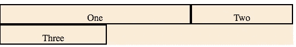
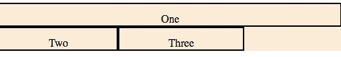
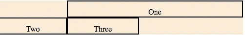
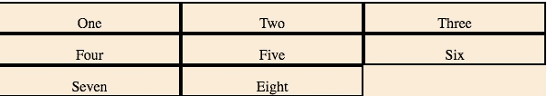
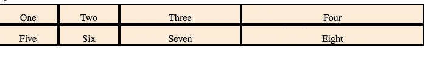
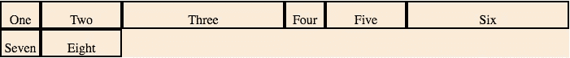
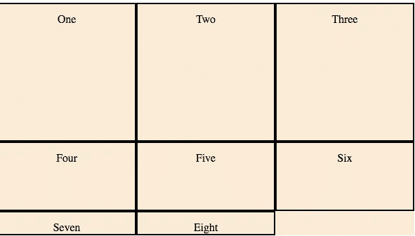
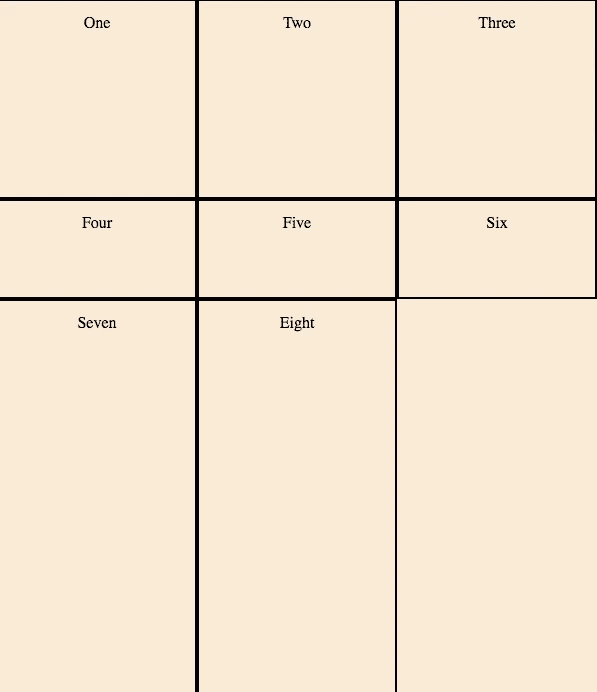

# 面向 Web 开发人员的 CSS 网格备忘单

> 原文：<https://javascript.plainenglish.io/a-css-grid-cheat-sheet-for-web-developers-b50412b13f69?source=collection_archive---------3----------------------->


# 内容

*   网格柱
*   网格柱(带跨度)
*   网格-模板-列
*   网格-模板-列(重复)
*   网格-模板-行
*   网格-模板-行(带网格-自动-行)

## 网格柱

**语法**

```
grid-column: grid-column-start / grid-column-end
```

**例子**



```
.one {
 grid-column: 1 / 3}
```

`Wrapper`(行)有 3 列，`.one`从第 1 列到第 3 列(不含)

```
.wrapper{ display: grid; grid-template-columns: auto auto auto;}
```

## 网格柱(带跨度)

**语法**

```
span <integer>
```

**示例**



```
.one {
 grid-column: 1 / span 3 
} /* OR */.one {
 grid-column: span 3 
}
```

类似地，`Wrapper`(行)有 3 列，`.one` div 占据(跨越)3 列，或者`1`指定起始列

举个例子，



```
.one {
 grid-column: 2 / span 3 
}
```

**代码片段**

## 网格-模板-列

**语法**

```
grid-template-columns: none|auto|max-content|min-content|*length*|initial|inherit;
```

**示例**



```
.wrapper {
 display: grid; grid-template-columns: 200px 200px 200px;
}
```

网格有 3 列，有 8 项；每行放置 3 件物品(3–3–2(剩余 2 件物品)

**网格-模板-列(带重复)**

**语法**

```
repeat(number, [col-start] *length* (px, %, fr ...) [col-end])
```

**示例**



```
.wrapper{ grid-template-columns: 100px repeat(1, 100px 200px 300px);}
```

第一列占用`100px`，第`100px 200px 300px` (3 列)重复一次`1`；`100px`为第二列`200px`为第三列`300px`为第四列



```
.wrapper{grid-template-columns: repeat(2, 50px 100px 200px);}
```

3 列`50px 100px 200px`重复两次(2 * 3) == >每行 6 个项目

## 网格-模板-行

**语法**

```
grid-template-rows: none|auto|max-content|min-content|*length*|initial|inherit;
```

**示例**



```
.wrapper { grid-template-rows: 200px 100px;}
```

类似于`grid-template-columns`，可以给 div 具体的`height`。例如，上面的代码片段将第一行的`200px`赋予第二行的& `100px`

## 网格-模板-行(带网格-自动-行)

**语法**

```
grid-template-rows: auto | *length* (px, %, fr ...) | minmax()
```

**示例**



```
.wrapper {grid-template-rows: 200px 100px;
grid-auto-rows: 400px;}
```

`grid-auto-rows`是每行的默认高度。在上面的片段中

```
grid-template-rows: 200px 100px;
```

其他行(即第三行)的高度未定义。因此`grid-auto-rows: 400px`被应用

谢谢你检查这个！