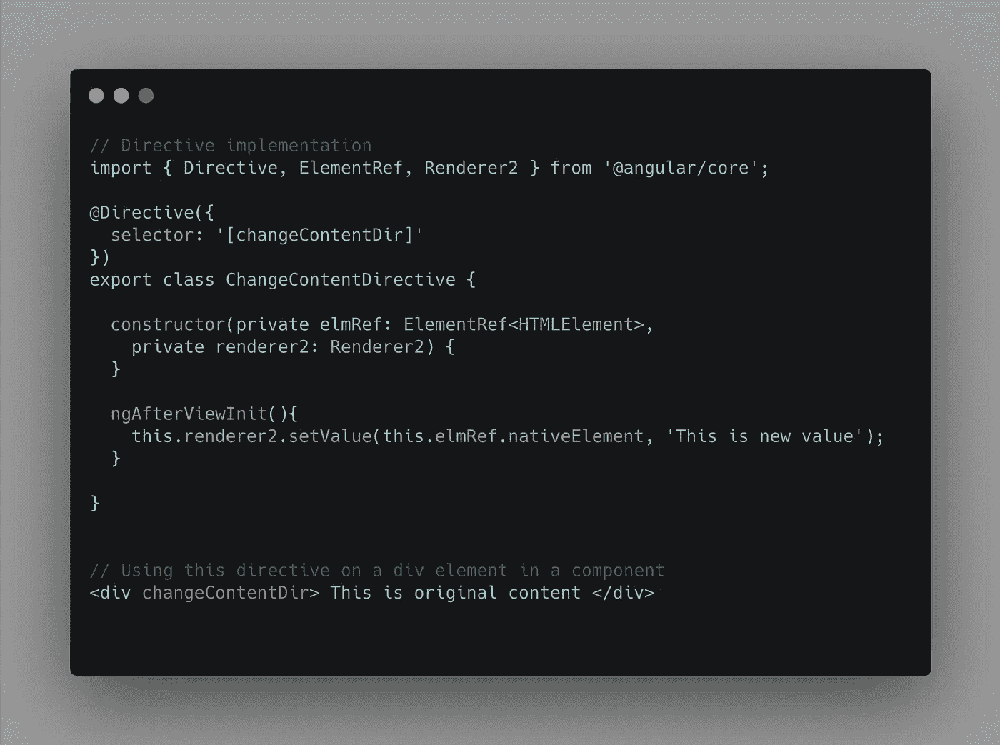
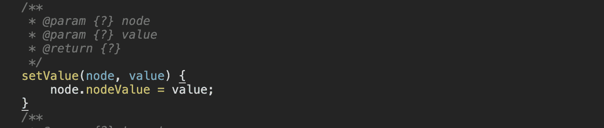
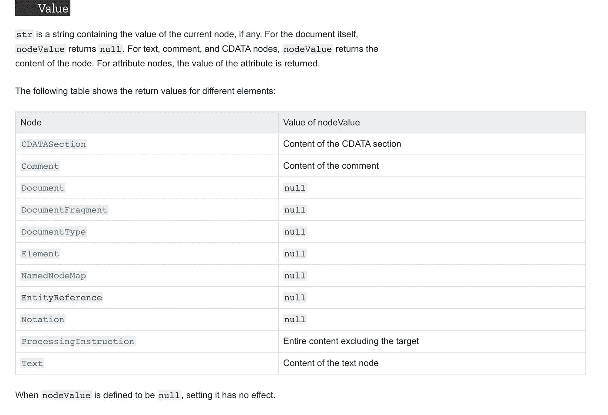
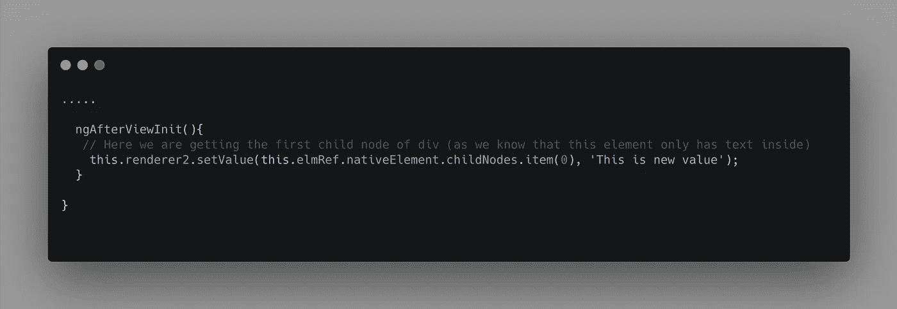
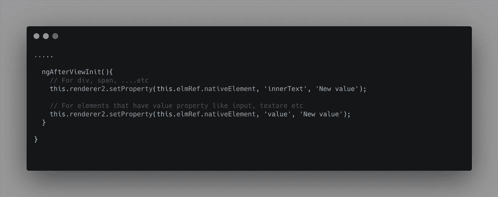

# 深入探讨 Angular 的渲染器 2.setValue 方法

> 原文：<https://javascript.plainenglish.io/a-deep-dive-into-angulars-renderer2-setvalue-method-229fa210e7d3?source=collection_archive---------1----------------------->

Photo by [Artem Verbo](https://unsplash.com/@artemverbo?utm_source=unsplash&utm_medium=referral&utm_content=creditCopyText) on [Unsplash](https://unsplash.com/s/photos/deep-dive?utm_source=unsplash&utm_medium=referral&utm_content=creditCopyText)

解释为什么 Renderer.setValue 方法不能按照您想象的方式工作

在 Angular 中构建组件/指令时，我们经常会遇到需要在本机元素上更新值/textContent 的情况。这可以通过多种方式实现，但 Angular 建议的方式是使用`Renderer` API。

渲染器有很多方法，其中之一就是`Renderer's` setValue 方法。这实际上让我很困惑，因为它并不适用于所有类型的元素。所以，本文将帮助您详细理解这个方法，这样您就不用花费数小时来弄清楚为什么这个方法不起作用。

> **From docs:**set value()
> 实现这个回调来设置宿主元素中某个节点的值。
> 
> API:抽象**设置值**(节点:任意，值:字符串):无效

这个方法很简单，只需要一个节点和一个值。让我们用一个简单的例子来尝试一下。

这里有一个简单的例子:

A simple directive that changes content dynamically

因此，我们有一个`changeContentDir`指令，就是更新宿主元素的内容，我们使用 renderer.setValue 方法来完成这个任务。后一部分是使用该指令的示例模板。

现在的问题是，它有效吗？答案是否定的。但为什么呢？让我们现在开始吧。

> **注意:**在 Javascript 中，所有元素都是节点，但是所有节点都不是元素。这就是上述代码更改不起作用的主要原因。

让我们退后一步，了解这个`setValue`方法的作用。

Renderer.setValue implementation

`setValue`方法接受一个节点和一个需要更新的值。

那么，这是什么`nodeValue`？让我们找出答案。

> MDN Docs:[https://developer . Mozilla . org/en-US/Docs/Web/API/Node/Node value](https://developer.mozilla.org/en-US/docs/Web/API/Node/nodeValue)
> 界面的`**nodeValue**`属性返回或设置当前节点的值。

所有元素都有这个`nodeValue`属性，但是在所有类型的元素上设置这个值是无效的。它只适用于某些节点类型，文本节点就是其中之一。

A picture form MDN docs describing what type of nodes can be

> 更多关于 nodeValue 的信息可以在这里
> [https://developer . Mozilla . org/en-US/docs/Web/API/Node/Node value](https://developer.mozilla.org/en-US/docs/Web/API/Node/nodeValue)

现在，如果我们回过头来看看我们的更改，您会注意到,`setValue`方法实际上试图在类型为`Element`的节点上更新`nodeValue`,但没有任何效果。

# 我们如何更新元素值？

由于`setValue`与`Text`节点一起工作，我们必须将作为 div 元素的子元素的文本节点直接传递给`setValue`方法，现在值得到了更新。

这是进行这些更改后的样子:

Updating the child text node value

# 更改和更新不同类型元素的值的替代方法:

作为 Renderer2 API 的一部分，还有其他有用的方法可以用来更新 innerText 的值/元素的值。其中一个是`setProperty`，可以用来更新`Elements`上的值，如`Input`、`TextArea`等..(类似于具有`value`类型的元素)

Examples for setProperty method

# **结论:**

`renderer.setValue`方法通常是一个令人困惑的部分，并不适用于所有的元素。简单地说，renderer.setValue 方法接受一个**节点、**而不是**元素。**

希望这对您有所帮助！关注更多有趣的文章

## 简单英语的 JavaScript

喜欢这篇文章吗？如果有，通过 [**订阅获取更多类似内容解码，我们的 YouTube 频道**](https://www.youtube.com/channel/UCtipWUghju290NWcn8jhyAw) **！**