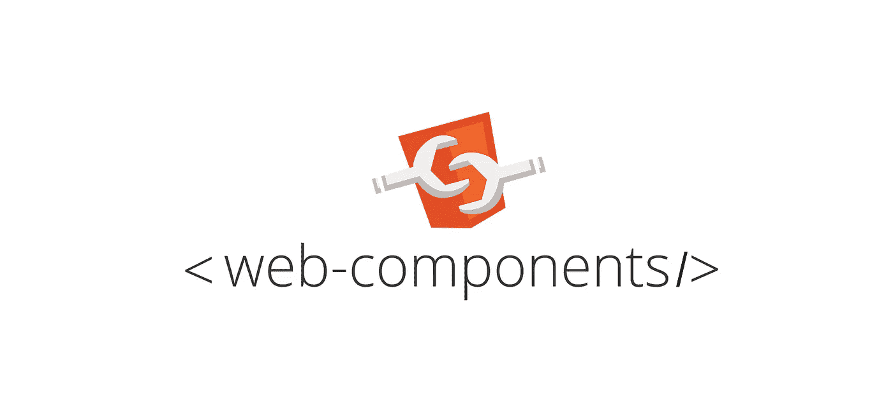
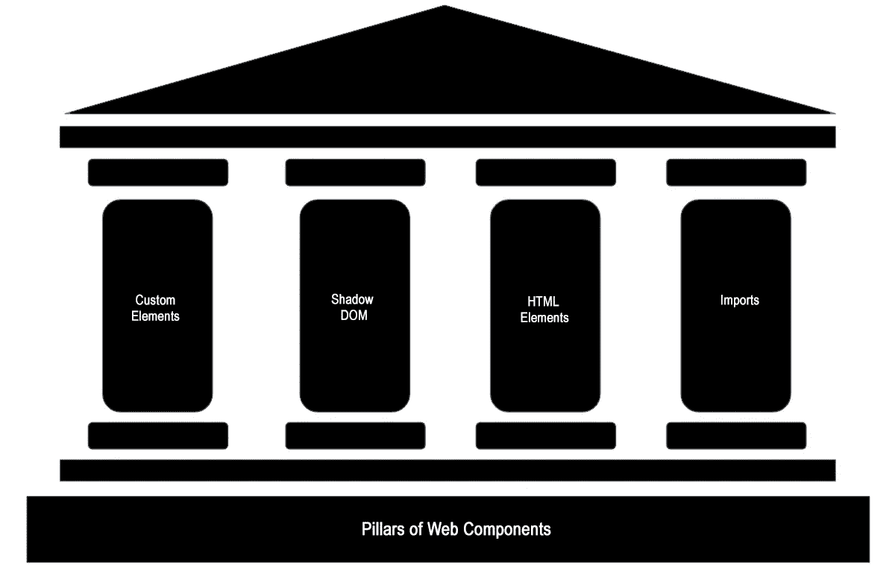
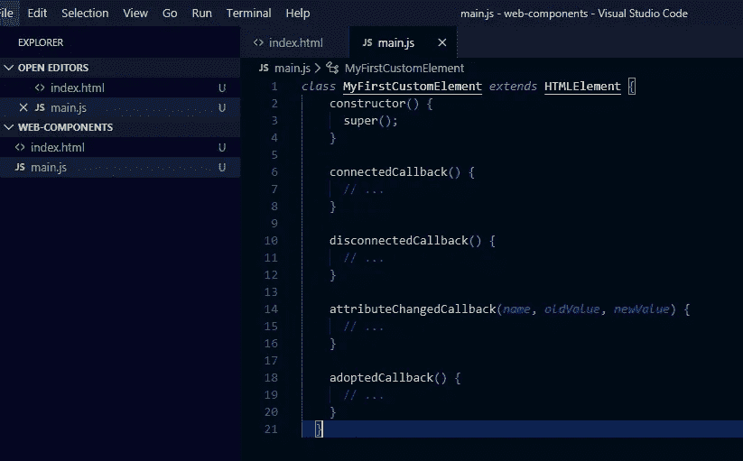
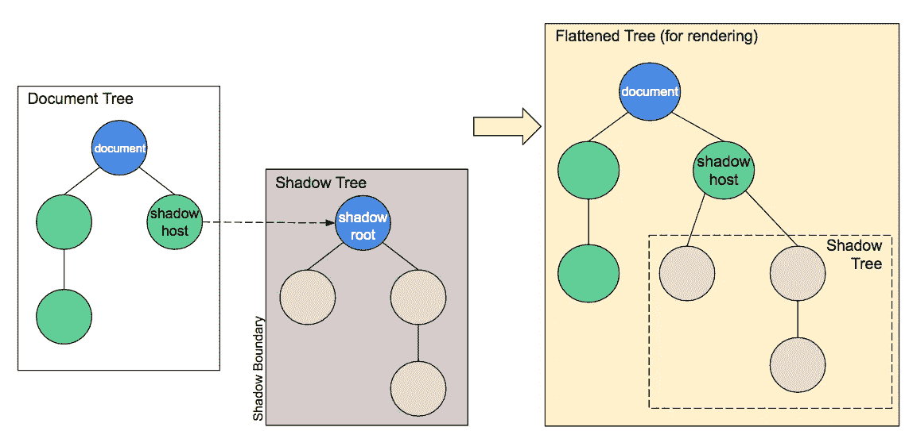

# 对 Web 组件的深入研究

> 原文：<https://javascript.plainenglish.io/a-deep-dive-into-web-components-3f7d6713da9e?source=collection_archive---------5----------------------->



在这篇文章中，我们将深入研究 [**Web 组件**](https://developer.mozilla.org/en-US/docs/Web/Web_Components) ，看看为什么前端开发人员使用它非常必要。

# **简介**

web components.org 将其定义为:

> Web 组件是一组 web 平台 API，允许您创建新的自定义的、可重用的、封装的 HTML 标记，以便在网页和 web 应用程序中使用。

简而言之，web 组件就像一个提供一些功能的盒子，有封装的数据，这意味着应用于 Web 组件的任何 css 和 js 代码都与其他元素完全隔离，因此任何更改/样式都不会影响其他元素。

Web 组件似乎解决了程序员在构建前端应用程序时不得不面对的最大问题之一，那就是 **DRY 原则**。DRY 代表**‘不要重复你自己’**是软件开发的一个基本原则，旨在通过封装和抽象减少重复，有了 web 组件，我们有能力让我们的标记遵循这个原则。现在我们可以创建我们自己的定制标记元素，这些元素以前编写起来很复杂。

也有各种 UI 框架可用，如 React、Angular 和 Vue，但自定义 Web 组件为许多可能性打开了大门。已经开发了一堆库，它们帮助我们很容易地构建 Web 组件，但是我们一会儿就要进入这个领域。

首先让我们回顾一下 Web 组件的架构。

# **Web 组件架构**



The Pillars of Olympus or so it seem like!

Web 组件由四个支柱组成。

1-自定义元素

双阴影 DOM

3- HTML 元素

4-进口

还有一种叫做 decorator，但是 decorator 目前并没有真正的规范，这导致了 web 组件范例只有四个支柱。

# 创建 Web 组件的步骤

实现 web 组件的基本方法应该如下所示:

1 -创建一个类或函数来指定 Web 组件的功能。

2 -注册新的自定义元素。

3 -如果需要，使用 Element.attachShadow()方法将阴影 DOM 附加到自定义元素。添加子元素、事件侦听器等。，使用常规 DOM 方法添加到影子 DOM。

4 -如果需要，使用<template></template>

既然我们已经讨论了 Web 组件中包含的主要细节，那么让我们使用 4 个支柱来深入研究代码。

## 1-自定义元素

创建自定义元素是 Web 组件的关键特性之一，因为它帮助我们将自定义功能封装到一个元素中，而不是键入很长的嵌套 html 元素。

创建自定义元素的主要原因是从开发人员的角度来看代码更少，创建更具语义的标签库，减少`div`标签的数量，等等。web 组件一旦开发出来，就可以被任何应用程序使用。

有两种类型的自定义元素:

自主定制元素。

定制的内置元素。

让我们一个一个地检查一下。

## i -自主定制元素

这些元素只是*独立的*元素，不需要被标准 Html *元素*继承。要使用它们，我们只需像编写普通 html 元素一样编写它们。

`<user-info>`，或者说`document.createElement("user-info")`。

现在让我们看看这个工作，以获得它的要点。

首先，我们已经为我们的自定义组件定义了一个名为 *HelloComponent* 的类，并用*html element****s .***扩展了它，自治的自定义元素将总是扩展 *HTMLElements* 。

在上面截取的代码中，我们扩展了 html 元素，但是为什么呢？

## html 元素

HTMLElements 基本上是 DOM 树的一个元素，如主体、表格和表单等。它包含所有的属性，属性，事件处理程序等。它提供了 HTML 特有的功能，这些功能在基本元素接口中是没有的。

当每个主体被创建时，它被附加到 HTMLElements。

## 构造器

接下来，我们在类中提供了一个构造函数，它也调用 super 方法。将总是首先调用 super()方法，以便建立正确的原型链。在构造函数的下面，我们定义了所有被实例化的函数。

最后，在最后一行中，我们调用了 CustomElement。

## 客户元素

CustomElement 是 HTML 元素的控制器，它是一个对象。它用于将定制元素注册到 DOM 中。要注册一个元素，只需调用 CustomElement.define()。它需要参数:

*   ***Name:***Name param 取新定制元素的名称。自定义元素名称必须包含连字符(-)。
*   ***构造函数:*** 新的自定义元素的构造函数将被插入到这里。
*   ***选项:*** 可选参数，取自定义元素要扩展的内置元素的字符串名称。这用于创建**定制内置元素**。

## ii —定制的内置元素。

这些元素继承自内置的 html 元素。为了编写它们，我们必须提供它们所扩展的元素的名称，并将它们编写为普通的 html 元素，但在“is”属性中使用自定义元素的名称。

`<p is="word-count">`或`document.createElement("p",{ is: "word-count" })`

第一个元素和这个元素的唯一区别是它扩展了一个不同的接口，而不是 *HTMLElements。*

Customized Build-in Elements

在上面截取的代码中，你可以看到我们现在扩展了 *HTMLUListElement 而不是 HTMLElements* ，这使得它具有内置属性*。*接下来，我们用 create element 创建它，但是这一次，我们使用一个 options 对象，它包含了它必须扩展的 ul 元素。

# 什么是生命周期挂钩？

从一个元素被创建到被销毁，发生了很多事情，同样，当我们谈论 html 元素时:

*   它们被创建并插入到 DOM 中
*   当事件被激发时，它们被触发。
*   它们被移走或销毁。

这些被称为生命周期事件，几乎每种编程语言都有生命周期。我们可以使用名为 ***的回调函数来挂钩这些自定义元素反应。***

这样做的一个很大的好处是 Web 组件有本地浏览器支持，这让我们不用写很长的代码。我们可以使用生命周期挂钩让事情在某个时间点发生。

# 可用的生命周期挂钩

以下是可供使用的生命周期挂钩:

*   构造函数()
*   connectedCallback()
*   disconnectedCallback()
*   attributeChangedCallback(名称，旧值，新值)
*   已采用回调()



All lifecycle hooks available

*   **构造函数**:构造函数是创建自定义元素时第一个被调用的函数。
*   **connectedCallback:** 一旦我们的定制元素被创建并追加到 DOM 中，这个回调就被调用。
*   **disconnectedCallback:** 每当我们的元素从 DOM 树断开时，这个回调被调用，这个事件被触发。当元素被移除时，我们也可以使用这个回调来清理代码并释放一些资源。这包括取消订阅 DOM 事件。释放未被自动垃圾收集的资源是至关重要的，就好像我们不释放未使用的资源(应用程序不再需要的内存)，它可能会导致内存泄漏。
*   **attributeChangedCallback:**每次在 DOM 中添加、更改或删除自定义元素属性时，都会调用这个回调函数。例如，删除输入字段和设置属性名称等。
*   **adoptedCallback:** 每当我们的定制元素被移动到一个新文档中时，这个回调就会被调用。

Lifecycle hooks example

在上面截取的代码中，我们为所有生命周期挂钩设置了事件。您可以在控制台中观察到，当我们添加、删除和更改属性时，不同的生命周期挂钩被触发。我们也对它进行了一些样式化，但是这里所有的样式都是全局的，并不仅仅封装到自定义元素中。这就是暗影 DOM 的用武之地。

# 双阴影 DOM

Web 组件的主要部分是封装。我们希望将我们的 html 标记结构、代码和样式与文件中的其他代码分开，避免它们相互冲突。目前，我们已经简单地创建了我们的自定义元素，它的 css 是全局的，这意味着它们也适用于其他元素。所以我们需要的是在元素内部封装所有的样式和功能，这样我们添加的每个样式都不会影响元素内部，外部元素也不会影响内部。这可以通过**影子 DOM API** 实现。

> *Shadow* DOM 允许将隐藏的 DOM 树附加到常规 DOM 树中的元素上——这个 shadow DOM 树从一个 Shadow 根开始，在它下面可以附加任何你想要的元素，就像常规 DOM 一样。

需要注意一些影子 DOM 术语:

*   **影子主机**:影子 DOM 附加的常规 DOM 节点。
*   **阴影树**:阴影 DOM 里面的 DOM 树。
*   **阴影边界**:阴影 DOM 结束的地方，常规 DOM 开始。
*   **影子根**:影子树的根节点。



Shadow DOM tree structure

让我们实现影子 DOM。

在这个例子中，我们创建了一个小进度条。首先，我们用 attachShadow 方法创建了阴影 DOM。attachShadow 方法的作用是将 shadow DOM 附加到调用它的元素上，该方法接受一个输入参数对象，该对象的键是 mode，值可以是 open 或 close。

如果您选择输入 close，那么 shadow DOM 将无法从整个页面外部的 javascript 访问，而如果您输入 open，则可以在整个页面访问它。

接下来，我们编写自己的自定义元素属性“complete ”,它将跟踪进度条。我们还为此属性制作了 getter 和 setter。

```
get complete() {
   return this._complete;
}

set complete(val) {
   this.setAttribute('complete', val);
}
```

这个属性将作为我们自定义元素的属性，所以要在自定义元素中设置属性，只需调用`setAttribute()`方法，该方法在第二个参数中接受属性名和值。

```
this.setAttribute('complete', val);
```

类似地，我们也可以使用`getAttribute()`来获取属性值。

我们可以定义我们的内联样式并将它们附加到 shadow DOM 中。最后，我们注册了自定义元素，如下所示。

```
window.customElements.define('progress-bar', MyProgressBar);
```

并且在 html 文件中，添加了一些脚本来实时显示它。这里的样式是内部的，但是我们完全可以创建一个外部样式表，并简单地将链接附加到 shadow DOM。

所以这只是 web 组件的一个小演示，我们仅仅触及了表面，还有更多的事情可以做。

# 3- HTML 元素

有几个内置的 Html 元素可以用来减少 HTML 的重复结构。模板就是其中之一。这是一个可以使用的内置模板。

```
<template id="my-paragraph">
  <p>My paragraph</p>
</template>
```

# 4-进口

导入允许您将包与 Web 组件一起使用。没有 Web 组件也可以使用。你可以加载任何类型的资源，从样式表，脚本和网页字体等。若要导入，请使用带有 rel 属性的 link 标记，并使其等于 import，这样您的 href 将包含您的资源的路径。

```
<link rel="import" href="myfile.html">
```

这基本上概括了 Web 组件的所有内容。现在也有一些库可以帮助我们创建自己的 Web 组件。

# 使用 Web 组件的库:

使用的顶级 Web 组件库:

*   **智能 HTML 元素:** jQWidgets Ltd .在 2018 年发布了智能 HTML 元素。智能 HTML 元素是一个现代的香草 JS 和 ES6 库和下一代前端框架。企业级 Web 组件包括可访问性特性，可以很容易地与 Angular、ReactJS、Vue.js、Bootstrap、Meteor 和任何其他框架集成。
*   **Hybrids:** 这是一个用于创建 Web 组件的 UI 库，它使用普通的对象和函数，并且不包括类和语法。它不支持属性的全局生命周期，但支持基于继承的合成。它支持强大的声明式和函数式方法。
*   **LitElements:** 这是一个简单的基类，用于使用 lit-html 创建快速、轻量级的 Web 组件。它使用 lit-html 将元素渲染到 shadow DOM 中，并通过添加 API 来管理属性。
*   **Polymer:** 被谷歌服务和网站使用。它有一个创建自定义元素的简化方法，总是以手势事件为特征的单向和双向数据绑定。

# **结论**

在这篇文章中，我们深入探讨了 Web 组件的根源，并详细讨论了每一个概念，这将使您能够在瞬间开始构建自己的 Web 组件，并一定会帮助您迈向更高的境界。再见了，朋友们！

## **用简单英语写的 JavaScript 笔记**

我们已经推出了三种新的出版物！为我们的新出版物献上一点爱心吧，请跟随他们:[**AI in Plain English**](https://medium.com/ai-in-plain-english)，[**UX in Plain English**](https://medium.com/ux-in-plain-english)，[**Python in Plain English**](https://medium.com/python-in-plain-english)**——谢谢，继续学习！**

**我们也一直有兴趣帮助推广高质量的内容。如果您有一篇文章想要提交给我们的任何出版物，请发送电子邮件至[**submissions @ plain English . io**](mailto:submissions@plainenglish.io)**，使用您的 Medium 用户名，我们会将您添加为作者。另外，请让我们知道您想加入哪个/哪些出版物。****