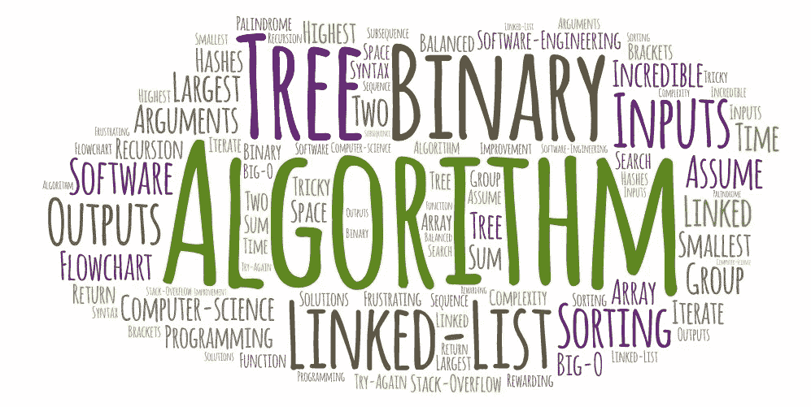

# 验证子序列算法:深入研究

> 原文：<https://javascript.plainenglish.io/a-deep-dive-of-one-of-the-algorithms-ive-solved-this-week-534f13e8f1e?source=collection_archive---------2----------------------->



Custom Word Art I created online- to make yours click [here](https://wordart.com/create)

就像爱情和金钱让世界运转一样，算法是让技术性工作面试运转的因素，当然还有一些数据结构基础知识。理解这两个主题并知道如何快速解决它们是为任何程序员掌握如何更好地编写高效代码的技能打下坚实基础的。

为什么会这样呢？为什么解决算法会让你成为更好的开发人员，有很多答案，但我想解决这个问题的最简单的方法是陈述一个事实。事实是算法只是程序的一个花哨的词。换句话说，它只是计算机执行任务的一系列步骤的列表(有时在结束前必须重复)。因此，如果你能编码一个过程来得到一个结果，那么将你过程中的模式应用到编码项目中就更容易了，这也就更容易写出更好的代码。

还是太复杂？可以这样想:蛋糕混合盒的指令被认为是一种算法。


A trip down memory lane before I knew how to make a cake from scratch…

作为软件开发人员，或许还有兼职的蛋糕师，我们的工作是编码列出计算机思考的方式，以尽可能平稳的方式完成手头的任务。

最近这个星期，我已经解决了一些算法挑战，但是为了尽我的一份力量帮助编程社区理解如何解决算法的概念，我将挑选一个，然后解释我在解决算法时的思维过程。之后，用一个测试实例在更深层次上进行解释。这个编码挑战的解决方案将用 JavaScript 编码。

# 验证子序列算法

**提示或问题陈述**:给定两个非空整数数组，写一个函数，判断第二个数组是否是第一个数组的子序列。

数组的子序列是一组数字，它们在数组中不一定相邻，但它们在数组中出现的顺序相同。例如这些数字

```
[2, 3, 5]
```

是数组的子序列:

```
[1, 2, 3, 4, 5]
```

请注意，数组中的单个数字和数组本身都是数组的有效子序列。

**一个样本输入**(进入参数的内容):array = [5，1，22，25，6，-1，8，10]

序列= [1，2，-1，10]

**一个样本输出**(一个算法过程应该产生的结果的例子):真

**第一步:根据输出结果，问自己一些关于解决方案的基本问题**

在试图解决这个问题时，我的第一个想法是问自己:“从函数中获得真或假结果的最好方法是什么？”我下一个回答我自己问题的想法当然是使用 if 语句，所以在那一点上，我知道在我的解决方案中我需要一个 if 语句。

然后我想，“我要如何遍历一个数组来确定一个条件是否为真？”它将使用一个循环来迭代(遍历)主数组中他们给我的所有数字。有很多方法可以迭代 JavaScript，比如使用 while 循环、for 循环和 for of 循环。我选择 for 循环，因为在我看来，索引更容易跟踪。

第二步:编写你的主结构，用合适的参数把所有东西组合在一起

有了这两个想法，我就有了算法解决方案的主要结构。我从关键字 function 开始，给函数取了一个合适的名字，并传入了他们在问题中谈到的两个参数:

```
function isValidSubsequence(array, sequence) {

}
```

**第三步:根据第一步编写主结构的代码。注意:必要时重复步骤 1。**

现在是时候写我的 for 循环了。我的 for 循环需要对照子序列数组检查主数组中的每个数字，所以我知道对于 for 循环的第一部分，我必须从 0 开始让 counter 变量检查主数组的第一个数字。

```
function isValidSubsequence(array, sequence) {
   for(i=0;
}
```

然后我知道我需要一直使用主数组，直到被检查的数字的索引到达列表的末尾，所以我在 for 循环中设置我的条件，说计数器变量值必须总是小于数组的长度。

```
function isValidSubsequence(array, sequence) {
   for(i=0; i < array.length;
}
```

现在我需要一种方法来说明每次在主数组中比较一个数字时，移动到列表中要比较的下一个数字，这就是为什么我使用了一个递增运算符。

```
function isValidSubsequence(array, sequence) {
   for(i=0; i < array.length; i++){ 
```

现在我需要一个 if 语句来查看数组中的当前数字是否等于序列数组中的当前序列号。如果相等，我需要一种方法来移动到序列数组中的下一个数字，以检查下一个数字。这就是为什么我设置了一个名为 j 的新变量，将它设置为 0，就像主数组的 counter 变量一样。这种情况最终看起来像下面这样，还有我的一些有用的评论。

```
function isValidSubsequence(array, sequence) {
   let j = 0 //set a variable equal to j, this represents the index      of the sequence array for(i=0; i < array.length; i++){//if the number we are on in the first array matches the number we are on in the second array then add 1 to the variable j 
   if (array[i] === sequence[j]) {
         j++//Add 1 to j
      }
   }}
```

**第四步:在某个时刻，通过返回请求的输出，找到某种方法来结束算法解。**

此时，for 循环将反复运行，检查每个数组中的每个数字是否匹配。现在我想“在这个循环结束后，必须有某种方法用 if 语句返回 true 或 false。”所以我决定写一个 if 语句，说如果序列数组的索引等于其数组的序列长度，那么返回 true 否则，返回 false。

```
function isValidSubsequence(array, sequence) {
   let j = 0 //set a variable equal to j, this represents the index      of the sequence array for(i=0; i < array.length; i++){ //if the number we are on in the first array matches the number  we are on in the second array then add 1 to the variable j 
   if (array[i] === sequence[j]) {
         j++//Add 1 to j
      }
   }
  if (j === sequence.length) {//if the final index of the sequence array is equal to the sequence's length then return true
  return true
 } else {//in all other cases return false
  return false
 }}
```

我这样编码是因为一旦发现整个序列与主数组相匹配，在序列的结束索引与序列中的项目数(长度)相匹配之后，序列就确实存在于主数组中。另一方面，如果不是序列中的所有数字都匹配主数组的某个部分，那么 j 将不会像我们的 for 循环中看到的那样递增。请记住，只有当主数组的编号与序列的编号匹配时，j 才能递增。这就是为什么在所有其他情况下，函数将返回 false。

我的算法解决方案到此结束。

# 将其付诸实践—一个测试用例示例

在这一点上，我想用我的解决方案来实现一个测试用例，因为我知道如果没有一个好的例子，整个事情看起来可能会令人困惑。

**测试用例输入:**数组= [1，1，6，1]，序列= [1，1，1，6]

**检测例输出:**假

好了，我们开始吧:

```
1 function isValidSubsequence(array, sequence) {
 2 let j=0
 3 for(i=0; i < array.length; i++){

 4 if (array[i] === sequence[j]) {
 5 j++
 6 }
 7 }
 8 if (j === sequence.length) {
 9   return true
 10 } else {
    11 return false
 12 }
13 }
```

第一次通过时，我们从主数组中第 0 位的 1(由 I 表示)和序列数组中第 0 位的 1(由 j 表示)开始。

在第 4 行，如果我们正在检查的数字，在这种情况下是 1，等于我们正在另一个数组中检查的数字，在这种情况下也是 1，那么增量 j. J 现在等于 1，只要 for 循环经过另一轮，我总是递增 1，所以现在 i = 1。(i=1，j=1)

for 循环不断重复，直到它遍历了主数组中的所有数字。它通过运行第 3 行到第 7 行来重复。

第二次，我们再次从主数组中第一位的 1(再次由 I 表示)和序列数组中第一位的 1(再次由 j 表示)开始。同样，我们检查的数字彼此相等，所以现在 j 和 I 再次递增。(i=2，j=2)

现在情况将在第三轮发生变化，主数组中的 6 与序列数组中的 1 相比。这次 j 不会增加，因为我们的条件是假的，但是变量 I 仍然会增加。(i=3，j=2)

for 循环再次运行，不会再增加 j，所以现在技术上 i=4 对 j=2。for 循环结束，因为数组中的所有元素都已被检查过，现在代码在第 8 行运行。

```
8 if (j === sequence.length) {
 9   return true
 10 } else {
    11 return false
 12 }
13 }
```

最后的检查表明，如果 j 等于数组中序列的长度，则返回 true。我们知道，代表 j 的 2 不等于 3，3 是序列数组的长度，从 0 开始计数，就像计算机一样。因此，这个测试用例示例在第 11 行返回 false。

这个算法肯定不是我做过的最难的一个，但绝对是一个让我在掌握一些更困难的挑战上有一个好的开始。很可能以后会有更多类似这样的博客文章出现在这条崎岖的算法道路上，可能是因为我对它们的着迷，以及我对它们对软件开发世界有多重要的理解。

如前所述，重要的是要记住算法只是过程列表，如果你能弄清楚列表的每一部分用什么来编码，最终得到测试用例工作的结果，那么你就找到了解决方案。

如果你自己想在算法方面变得更好，我强烈建议你试试 Algoexpert.io。我知道你可能已经看到了劣质的 YouTube 广告，但这个网站真的可以通过漂亮的用户界面使学习算法变得更容易。快乐的算法求解和蛋糕制作:)