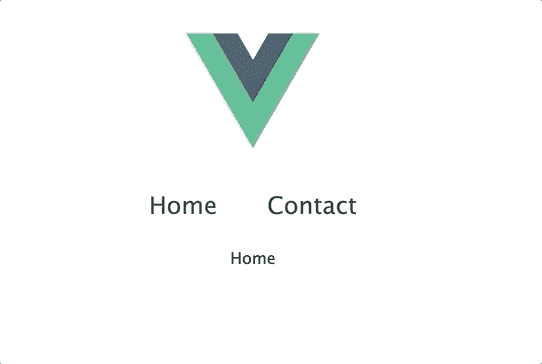

# Vue3 中的 Vue 路由器初探

> 原文：<https://javascript.plainenglish.io/a-first-look-at-vue-router-in-vue3-253bc61b2cf5?source=collection_archive---------2----------------------->


Photo by [Denys Nevozhai](https://unsplash.com/@dnevozhai?utm_source=medium&utm_medium=referral) on [Unsplash](https://unsplash.com?utm_source=medium&utm_medium=referral)

对于大多数单页面应用程序来说，管理路线是一个重要的特性。随着新版本的 Vue 路由器进入 alpha 阶段，我们已经可以开始检查它在下一个版本的 Vue 中是如何工作的。

Vue3 中的许多变化将稍微改变我们访问插件和库的方式，这包括 [Vue 路由器](https://router.vuejs.org/)。

我们将看看如何结合使用 [alpha 版本的 Vue 路由器](https://github.com/vuejs/vue-router-next)和[当前的 Vue3 Alpha 版本](https://learnvue.co/2020/01/a-first-look-at-vue3-alpha-release-example-app-in-15-minutes/)。

到本文结束时，您应该知道如何将 Vue 路由器添加到您的 Vue3 项目中，并拥有一个不错的小示例！

## 设置事物

首先，我们将使用尤雨溪发布的 [Vue3 网络包预览](https://github.com/vuejs/vue-next-webpack-preview/)。

让我们用`git clone [https://github.com/vuejs/vue-next-webpack-preview.git](https://github.com/vuejs/vue-next-webpack-preview.git)`克隆回购

然后，为了将 vue-router alpha 添加到我们的项目中，我们需要修改 package.json 文件。

在我们的依赖项中，我们希望添加以下版本的 vue-router

```
"dependencies": {
    "vue": "^3.0.0-alpha.10",
    "vue-router": "4.0.0-alpha.4"
}
```

现在，我们终于可以从命令行运行`npm install`来安装我们所有的依赖项了。

我们要做的最后一个设置是实际创建我们的路由器文件和一些视图。

在我们的`src/` 文件夹中，我们将添加三个文件。

*   路由器/index.js
*   views/Home.vue
*   views/Contact.vue

我们的路由器文件将——你猜对了——包含我们的路由器，我们的主页/联系人视图将只输出一个单词，因此我们可以看到发生了什么。

## 创建我们的路线

好了，一切准备就绪，让我们开始使用 Vue 路由器吧！

简单地说，Vue 路由器的 Vue3 版本的主要区别在于，我们必须导入新的方法才能让我们的代码工作。其中最重要的是`createRouter`和`createWebHistory`。

在 router/index.js 文件中，让我们导入这两个方法和前面的两个视图。

```
import { createRouter, createWebHistory } from 'vue-router'
import Home from '../views/Home.vue'
import Contact from '../views/Contact.vue'
```

接下来，我们要做的是使用 createWebHistory 方法创建一个 routerHistory 对象，如下所示。

```
import { createRouter, createWebHistory } from 'vue-router'
import Home from '../views/Home.vue'
import Contact from '../views/Contact.vue'

const routerHistory = createWebHistory()
```

以前，我们可以只说`mode: history`来从哈希模式切换到历史模式，但是现在我们使用`history: createWebHistory()`来实现

接下来，我们可以使用`createRouter`创建路由器。它接受一个对象，我们想要传递我们的`routerHistory`变量以及我们的两个路由的数组。

```
const router = createRouter({
  history: routerHistory,
  routes: [
    {
      path: '/',
      component: Home
    },
    {
      path: '/contact',
      component: Contact
    }
  ]
})
```

最后，让我们把文件导出到路由器。

```
export default router
```

如你所见，从高层次来看，[它仍然与 Vue2](https://learnvue.co/2020/02/building-the-same-component-in-vue2-vs-vue3) 非常相似。但是随着所有这些变化允许更好的类型脚本支持和优化，让[熟悉新方法](https://learnvue.co/2019/12/5-things-you-can-do-to-prepare-for-vue-3-0)是很好的。

## 让我们的应用程序使用 vue 路由器

现在，我们的 Vue 路由器文件实际上已经设置好了，我们可以将它添加到我们的项目中。以前，我们可以导入它并说`Vue.use(router)`，但在 Vue3 中这是不同的。

这实际上是对我们如何创建和挂载 Vue 应用程序的一个[很好的介绍。](https://learnvue.co/2020/03/build-your-first-vue3-application-our-vue3-course/)

在我们的 main.js 文件中，您会看到我们使用 Vue 的`createApp`方法来实际创建我们的项目。在默认项目中，它链接了 createApp 和`mount`方法。

我们要做的是像这样分开这些方法。

```
const app = createApp(App)

app.mount('#app')
```

然后，在我们安装我们的应用程序之前，我们想告诉它使用我们的路由器文件。

```
import router from './router'

const app = createApp(App)

app.use(router)

app.mount('#app')
```

最后，在我们的 App.vue 文件中，让我们实际显示我们的路由器视图，并提供一些路由器链接，以便我们可以导航。

```
<template>
  <div id='root'>
    
    <div id='nav'>
      <router-link to='/'> Home</router-link>
      <router-link to='/contact'>Contact </router-link>
    </div>
    <router-view />
  </div>
</template>
```

所以现在，如果我们点击一下，我们会看到我们实际上可以在两个页面之间导航！



但是，如果我们试图直接进入我们的 `/contact`路线，这是行不通的！我们得到了某种错误。

幸运的是，这是一个非常快速的 webpack 修复。

在我们的 webpack.config.js 文件中，我们希望通过更改我们的配置使 devServer 能够使用历史 api，如下所示。

```
devServer: {
    inline: true,
    hot: true,
    stats: 'minimal',
    contentBase: __dirname,
    overlay: true,
    historyApiFallback: true
}
```

现在，如果我们直接导航到我们的联系路线，一切都应该正常工作:)

## 结论

我们全部完成了——我们已经成功地将 vue-router 添加到我们的 Vue3 项目中。大多数其他功能，如导航守卫，处理卷轴，以及类似的工作基本相同。

[这是本教程中最终 Github repo](https://github.com/matthewmaribojoc/vue3-router-template) 的链接。如果你想在你的 Vue3 测试区域安装 vue-router，这是一个很好的模板代码。

一旦所有的 Vue3 正式发布，我肯定会写一个更深入的指南，但知道如何添加它已经是开始在新框架中玩的一个很好的方式。

我希望你学到了一些东西，并和我一样兴奋地开始尝试 Vue3 中的一些新功能。

编码快乐！

如果你有兴趣了解更多关于 Vue 3 的知识，请下载我的免费 Vue 3 备忘单，里面有一些基本知识，比如合成 API、Vue 3 模板语法和事件处理。

【JavaScript 用简单英语写的一句话:我们总是乐于帮助推广高质量的内容。如果你有一篇文章想用简单的英语提交给 JavaScript，用你的中级用户名发邮件到 submissions@javascriptinplainenglish.com[给我们，我们会把你添加为作者。](mailto:submissions@javascriptinplainenglish.com)