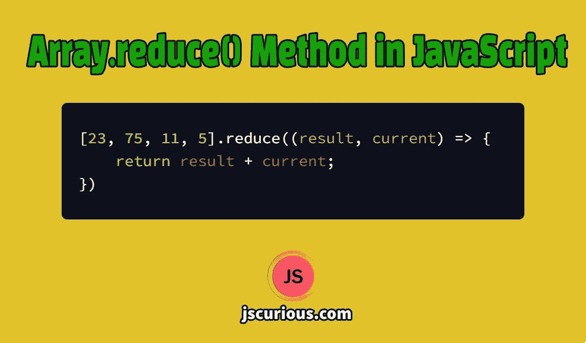

# JavaScript 中的 Array.reduce()指南

> 原文：<https://javascript.plainenglish.io/a-guide-to-array-reduce-method-in-javascript-and-its-use-cases-71fa655279f5?source=collection_archive---------12----------------------->



Array.reduce() by jscurious.com

`Array.reduce()`方法将数组缩减为单个值。`reduce()`方法将一个 reducer 函数作为第一个参数，将一个初始值作为第二个可选参数。reducer 函数对数组的每个元素执行，并返回一个值，该值进一步作为第一个参数(累加器)提供给下一个 reducer 函数调用。

```
array.reduce(reducerFunction, initialValue);
```

reducer 函数采用两个必需的参数，即累加器和当前值。累加器要么是初始值，要么是先前返回的值。第二个参数是当前元素的值。

```
function reducerFunction(accumulator, currentValue, currentIndex, array) {}
```

reducer 函数还带有两个可选参数，即 currentIndex 和 array。currentIndex 是数组中 currentValue 的索引，最后一个可选参数是调用了`reduce()`方法的数组。

# reduce()方法如何工作

让我们看一个对数组的所有值求和的例子。

```
let numbers = [25, 48, 13]; let total = numbers.reduce(reducerFunction); function reducerFunction(result, current) { 
  return result + current; 
} console.log(total); // 86
```

所以这里第一次调用`reducerFunction`，以 **25** 和 **45** 为参数，返回 **73** 。下一次第二次`reducerFunction`用先前返回值 **73** 和 **13** 调用并返回 **86** 。

我们可以通过在返回之前提供一个`console.log`语句来检查`reducerFunction`被调用了多少次以及参数的值。

```
function reducerFunction(result, current) { 
  console.log(result, current); 
  return result + current; 
}
```

`reducerFunction`的输出将是:

```
result:25 current:48 
result:73 current:13
```

如果我们将初始值传递给`reducerFunction`，那么对于第一次调用，初始值将是第一个参数，数组的第一个元素将是第二个参数。

```
let numbers = [25, 48, 13];

let initial = 0; let total = numbers.reduce(reducerFunction, initial); function reducerFunction(result, current) { 
   console.log(result, current); 
   return result + current; 
}console.log(total); // 86
```

输出

```
result:0 current:25 
result:25 current:48 
result:73 current:13 
86
```

再来看一些`reduce()`方法的例子。

# 查找数组中的最大值和最小值

如果我们有一个数字数组，那么我们可以通过比较数组中的每两个数字来找到最大值和最小值。

```
let numbers = [25, 48, 13, 83, 59]; let maxNumber = numbers.reduce((max, current) => { 
    return max > current ? max : current; 
}); console.log(maxNumber); //83
```

类似地，我们可以通过如下改变减速器函数来找到最小数量:

```
let minNumber = numbers.reduce((min, current) => { 
   return min < current ? min : current; 
});
```

# 将数组转换为对象

假设我们有一个学生对象数组。每个学生对象都有名字和他们的学期成绩。

```
let students = [ 
  {name: 'Joey', marks: 41}, 
  {name: 'Monica', marks: 83}, 
  {name: 'Ross', marks: 92}, 
  {name: 'Rachel', marks: 51}, 
  {name: 'Chandler', marks: 76}, 
  {name: 'Pheobe', marks: 45} 
];
```

现在我们想从数组中创建一个对象，用学生的名字作为键，用他们的分数作为值。让我们看看如何用`reduce()`来做这件事。

```
let result = students.reduce((obj, student) => { 
   obj[student.name] = student.marks; 
   return obj; 
}, {}); console.log(result);
```

输出

```
{ 
  Joey: 41, 
  Monica: 83, 
  Ross: 92, 
  Rachel: 51, 
  Chandler: 76, 
  Pheobe: 45 
}
```

# 有关系的

*   [JavaScript 中数组的 map()和 filter()方法快速指南](https://jscurious.com/map-and-filter-methods-of-array-in-javascript/)
*   [向数组添加项目的 6 种方式](https://jscurious.com/how-to-add-items-to-an-array-in-javascript/)
*   [5 种从数组中移除物品的方法](https://jscurious.com/how-to-remove-items-from-array-in-javascript/)
*   [寻找数组元素的 6 种方法](https://jscurious.com/how-to-find-elements-in-array-in-javascript/)

*感谢您的宝贵时间*jscurious.com
更多网络开发博客，请访问[](http://jscurious.com/)