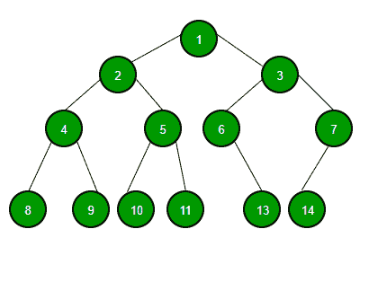
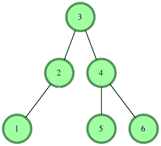
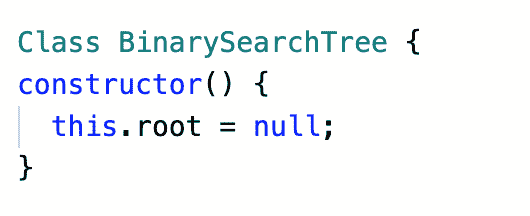
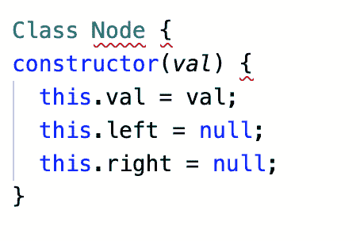

# 二叉树指南(第一部分)

> 原文：<https://javascript.plainenglish.io/a-guide-to-binary-trees-part-1-13660ade0343?source=collection_archive---------7----------------------->

在编程领域中有许多类型的数据结构。大多数新程序员都知道诸如数组和散列之类的结构，但是另一方面，二叉树，尤其是对于一个新兵训练营的毕业生来说，并不为人所熟知和/或理解。本系列将解释什么是二叉树，为什么使用它们，以及如何遍历它们，并展示一些在它们的实现中的真实例子。

在本系列的第 1 部分中，我们将讨论以下内容:

什么是树？

一棵树和二叉查找树有什么不同？

我们如何实现二叉查找树？

现在，什么是树？

树是一种数据结构，这种数据结构由父子关系中的**节点**组成，父子关系可以由任意数量的节点组成。更容易想象一棵真正的树是从一个“根”分支出来的


[马赫凯奥](https://unsplash.com/@mahkeo?utm_source=medium&utm_medium=referral)在 [Unsplash](https://unsplash.com?utm_source=medium&utm_medium=referral) 上的照片

一个树节点可以指向多个节点或者根本没有节点！就像链表(另一种数据结构，我将在以后的文章中介绍)一样，我们可以在每个节点中存储数据。另一件要记住的事情是树是非线性的。

什么是非线性？这意味着数据项不是按顺序组织的。换句话说，非线性数据结构的数据元素可以连接到一个以上的元素，以反映它们之间的特殊关系。非线性数据结构中的所有数据元素不能在一次运行中被遍历。



一个树形数据结构的例子

现在，树和二叉查找树有什么区别？

所以二叉查找树有几个不同的原因。首先，父节点不能有两个以上的子节点。同样，左边的子节点总是比父节点大< than the parent node, while the right child will always be >。



一个真正的二叉查找树

所以让我们实现我们的树吧！

首先，我们创建 BinarySearchTree 类并初始化根



根用 null 值初始化

接下来，让我们创建我们的节点类，并用值和拥有左右子节点的能力初始化它



现在让我们将值插入我们的二叉查找树。但是首先，让我们伪代码我们的过程。

让我们创建一个新节点。然后，从根节点开始，让我们检查是否有根节点，如果没有，那么根节点就变成了新的节点！如果有根，检查新节点的值是大于还是小于根的值。

*   如果它更大
*   检查右侧是否有节点
*   如果有，移动到该节点并重复这些步骤
*   如果没有，请将该节点添加为右侧属性
*   如果少…重复以上两步

现在让我们用 Javascript 把它写出来

```
class Node {
  constructor(val) {
    this.val = val
    this.left = null
    this.right = null
  }
}class BST {
  constructor() {
    this.root = null
  }
  insert(val) {
    let newNode = new Node(val);
    if (this.root === null) {
      this.root = newNode;
      return this;
    } else {
      let current = this.root;
      while (true){
        if (val < current.val) {
          if (current.left == null){
            current.left = newNode;
            return this
          } else { current = current.left}
        } else if (val > current.val) {
          if (current.right == null){
            current.right = newNode;
            return this;
          } else {current = current.right}
        }
      }
    }
  }
}let tree = new BST()
tree.insert(5)
tree.insert(7)
tree.insert(3)
console.log(tree)
```

我们做了第一棵树！在第 2 部分中，我们将学习如何使用几种不同的技术遍历树。我们还将讨论每种技术的重要时刻，并开始将我们的知识应用到现实世界的例子中。