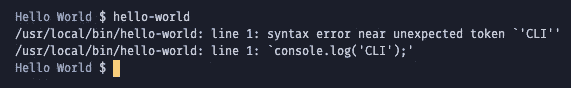
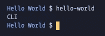
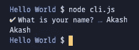
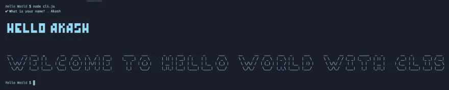
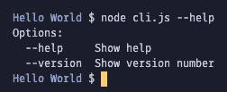

# node . js CLIs 指南

> 原文：<https://javascript.plainenglish.io/a-guide-to-clis-with-node-js-5f00b06abf7b?source=collection_archive---------24----------------------->

## 构建完整命令行应用程序的一站式指南。


Photo by [Jake Walker](https://unsplash.com/@jakewalker?utm_source=unsplash&utm_medium=referral&utm_content=creditCopyText) on [Unsplash](https://unsplash.com/s/photos/computer-terminal?utm_source=unsplash&utm_medium=referral&utm_content=creditCopyText)

有没有想过`create-react-app .`、`git init`或者简单的`node -v`是如何运作的？这些是 CLI 或命令行界面。我很确定我们中的大多数人在生活的某个时候使用过 CLI。即使是我们每天使用的命令，比如`ls`或`cd`也是 CLI。

今天，我将向您展示如何使用我们在 CLIs 中找到的一些常见功能来设置一个非常简单的 CLI。没什么太复杂的……让我们直接进入 CLIs 吧

# 什么是 CLi

CLI 是我们在终端运行的命令，用来做一些事情。如果你想要维基百科的定义🙄-

> *命令行界面以文本行的形式处理对计算机程序的命令。处理接口的程序被称为命令行解释器或命令行处理器。操作系统在外壳中实现命令行界面，以交互方式访问操作系统功能或服务~* [*维基百科*](https://en.wikipedia.org/wiki/Command-line_interface)

# 为什么需要 CLi？

在 GUI(图形用户界面)的现代世界里，你可能会问为什么我们应该了解 CLIs？它们不是在 80 年代使用的吗？我同意你的观点💯百分比。它们已经过时了，但是许多旧的应用程序仍然使用 CLIs。默认情况下，与 GUI 应用程序相比，终端/命令提示符通常具有更多的权限和访问权限。UX 允许 100 个权限运行一个应用程序是不好的。此外，人们把它当作开发者的“最好的朋友”(除了谷歌)。

# 为什么要用节点构建 CLI

主要优势是我们通过 Node 获得的超过 100 万个软件包的生态系统。使用这些，我们可以避免样板代码，并轻松实现功能。我们也可以跨项目重用代码/组件

# 开始使用 CLi

在做任何其他事情之前，我们需要创建一个`package.json`。

1.  创建一个空文件夹
2.  运行`npm init`并快速填写选项。否则，运行`npm init -y`NPM 自动填充选项。

让我们创建我们的 JavaScript 文件，我给它命名为`cli.js`。这是一个常见的惯例，文件会立即告诉我们它的功能。我将在我们的文件中添加一个`console.log('CLI')`，这样我们就可以知道一切都正常了。

我们需要更新`package.json`来运行我们的 CLI。将`bin`属性添加到文件中。

```
"bin": {
  "hello-world": "cli.js"
}
```

属性`hello-world`是我们想要运行的命令名，`cli.js`是文件名。如果您想要使用另一个名称或者您的文件存储在不同的路径中，请相应地更新它。

让我们安装我们的 NPM 软件包。在您的终端/命令提示符下运行以下命令-

```
npm i -g .
```

我们过去都遇到过`npm install`。我们添加了`-g`标志，这样 NPM 就可以在全球范围内安装这个包。`.`告诉 NPM 将软件包安装在这个文件夹中。NPM 安装在`package.json`的`main`属性中的文件。如果您已经从`cli.js`更改了文件名，请确保更新`package.json`中的`main`属性。

现在我们可以运行我们之前设置的命令名(`hello-world`)，我们的 CLI 应该会启动。

```
hello
```

然而，我们得到以下错误-



这个错误似乎告诉我们，编译器不能理解我们有 JavaScript 代码。所以，告诉编译器应该使用`node`来运行我们的文件。为此，我们使用一个 [shebang](https://en.wikipedia.org/wiki/Shebang_(Unix)#:~:text=In%20computing%2C%20a%20shebang%20is,bang%2C%20or%20hash%2Dpling.) 。将以下代码添加到文件的顶部。

```
#!/usr/bin/env node
```

> 确保这是正确的顶部，它才能正常工作

这是节点的路径。我们告诉*nix 系统我们文件的解释器应该在指定的路径。在 windows 中，这一行将被忽略，因为它被指定为注释，但 NPM 将在软件包安装时选择它。

好了，现在应该可以了。



除了记录一些数据，我们在 CLI 中实际上没有做任何事情。让我们从实现 CLIs 中的通用特性开始。

# 提示

提示是问用户的问题。您可能在 JavaScript 中通过调用`prompt()`函数遇到过它。我将使用[提示](https://www.npmjs.com/package/prompts)包。这个包简化了允许我们提示用户，并且只需要几行代码就可以得到响应。

通过运行以下命令来安装它

```
npm i prompts
```

接下来，将下面的代码添加到您的文件中，我们将一起浏览它。

> 生命是被立即调用的函数表达式。它缩短了将函数表达式保存到变量并调用它的时间。

我们的基本 CLI 如下所示-



很棒吧？我觉得终端看起来有点沉闷，让我们给它上色吧！

# 用粉笔上色

你知道终端是如何添加颜色的吗？ANSI 转义码用于此(听起来像是监狱的代码)。如果你曾经尝试过阅读二进制文件，阅读 ANSI 是非常相似的。


谢天谢地，有一些软件包可以帮助我们解决这个问题。在本教程中，我将使用[粉笔](https://www.npmjs.com/package/chalk)。

通过运行安装它-

```
npm i chalk
```

让我们从用以下内容替换原来的`console.log()`开始:

```
console.log(chalk.bgCyan.white(`Hello ${response.value}`)); 
console.log(chalk.bgYellowBright.black(`Welcome to "Hello World with CLIs"`));
```

如您所见，第一个`log`链接了`bgCyan`和`white`方法。查看[官方文件](https://github.com/chalk/chalk#readme)了解更多信息。

在这之后，我们的代码看起来像这样-

这是一个好的开始，现在让我们提高字体大小。我几乎什么都看不见。


# 玩字体

通过 JavaScript 改变字体是相当困难的，我花了很多时间寻找一个能做到这一点的包。谢天谢地，我明白了。我们将使用 [cfonts](https://www.npmjs.com/package/cfonts) 套件。继续运行以下程序安装它-

```
npm i cfonts
```

首先用以下内容替换我们之前的`console.log`

我们的 Hello World CLI 看起来像这样-



让我们添加一些基本的参数，比如`-n`或`--name`和`-v`或`--version`。我们将使用 [yargs](https://www.npmjs.com/package/yargs) 套件来简化流程。如果您不想使用它，可以使用`process.argv`访问参数。

首先安装`yargs`组件。

```
npm i yargs
```

让我们把它导入我们的代码-

```
const yargs = require('yargs/yargs');
const { hideBin } = require('yargs/helpers');
const argv = yargs(hideBin(process.argv)).argv;
```

`argv`代表用户指定的所有参数。我们用`hideBin()`方法去掉参数前的`--`。示例-

```
hideBin('--example'); // output -> example
```

现在我们可以为所提供的参数添加一系列`IF and ELSEIF`检查。您也可以使用`switch`语句。

因为 package.json 本质上是一个 javascript 对象，所以我们可以从其中提取属性。`yargs`提供指定参数的对象。我们可以检查所需的属性。还有一个`else`检查，看用户是否没有给出任何参数。现在让我向您展示 CLIs 中的其他一些常见功能。

# 装载机

在 CLI 中，异步和耗时的操作非常常见。我们不想让用户认为他的计算机已经挂起。我们将为加载器使用[或](https://www.npmjs.com/package/ora)包。首先安装`ora` -

```
npm i ora
```

让我们需要这个包并设置一个简单的加载器-

```
const ora = require('ora');
const spinner = ora('Loading...').start();
```

这个加载程序将永远运行，因为我们没有停止它。我们没有任何花费大量时间的代码(API 请求、数据处理等)，我们将使用`setTimeout()`来模拟加载的结束。

我已经把我们的生命函数放在了我们的`setTimeout()`里面，这样它只有在加载完成后才会被执行。我们的加载程序运行`2000`毫秒或`2`秒。

让我们快速重构一下。我们的`setTimeout()`中有一个回调函数，它可以被设置为`async`。我们现在可以删除`IIFE`功能了。

```
setTimeout(async () => {
  spinner.stop();
  // Body of IIFE function goes here.

}, 2000);
```

关于[或](https://www.npmjs.com/package/ora)还有很多，查看[官方文件](https://github.com/sindresorhus/ora#readme)了解更多。

# 列表

还记得我们为争论设置的`IF ELSEIF`吗？让我们添加一个列出所有命令的`--help`参数。列表是 CLI 的一个非常重要的部分。我正在使用一个有用的软件包 [listr](https://www.npmjs.com/package/listr) 来处理这些列表。让我们将下面的代码添加到我们的文件中有`IF`检查的地方。

我们为`--help`创建了一个新的 if 检查。在其中，我们将一组任务传递给了`Listr`类。这基本上会列出以下内容。这可以通过`console.log()`来完成，但是我之所以使用`listr`是因为在任务数组的每个对象中，我们也可以用一个箭头函数来指定一个任务属性。查看[文档](https://github.com/SamVerschueren/listr#readme)了解更多信息。

现在我们的命令行界面看起来像这样-



# 从代码执行命令

许多 CLI 想要访问其他 CLI 并运行命令，如`git init`或`npm install`等。出于本教程的目的，我使用了包 [execa](https://www.npmjs.com/package/execa) 。首先安装模块:

```
npm i execa
```

然后，需要文件顶部的模块

```
const execa = require('execa');
```

在我们的参数条件的`ELSE`块中，添加以下代码。如果您还记得，我们已经有一个`console.log()`要求我们指定一个命令。让我们运行前面的`--help`命令，并列出可用的命令。

```
else {
  console.log('Please specify a command');

  const { stdout } = await execa('hello-world', ['--help']);
  console.log(stdout);
}
```

我们调用`execa()`函数并传入命令的名称。然后，在一个数组中，我们传递要提供的参数。我们将`await`这个，然后析构输出。然后，我们将记录输出以模拟运行该命令。

我们的 CLI 最终应该是这样的-


作为奖励，我列出了一些在开发 CLI 时可以使用的包。

# 资源

这些是在开发 CLI 时可能对您有所帮助的软件包列表。请记住，这绝不是一份详尽的清单。NPM 上有超过 100 万个包裹，不可能一一涵盖。

## 输入

1.  [提示](https://www.npmjs.com/package/prompts)
2.  [询问者](https://www.npmjs.com/package/inquirer)
3.  [询问者](https://www.npmjs.com/package/enquirer)
4.  cli 提示
5.  [邮件提示](https://npmjs.com/package/email-prompt)

## 彩色输出

1.  [粉笔](https://www.npmjs.com/package/chalk)
2.  [克勒](https://www.npmjs.com/package/kleur)

**装载机**

1.  [cli-spinners](https://www.npmjs.com/package/cli-spinners)
2.  cli-spinner
3.  [奥拉](https://www.npmjs.com/package/ora)

**输出周围的方框**

1.  [博森](http://npm.im/boxen)
2.  对话框
3.  [ascii-art](https://www.npmjs.com/package/ascii-art)

## 命令行界面框架

[Oclif](https://oclif.io/) 是一个用于在 Node.js 中构建 CLI 的开源框架。使用一些标志或者有子命令的高级 CLI 来创建 CLI。oclif 使您可以很容易地为您的公司、服务或您自己的开发需求构建 CLIs。

就这样了，伙计们，谢谢你们阅读这篇文章。希望你们喜欢。如果你觉得这个帖子有用或者喜欢，请跟我来，获得关于新帖子的通知。如果你有问题，在评论中问他们，我会尽力回答。

*原载于 2020 年 3 月 5 日* [*dev.to*](https://dev.to/akashshyam/a-guide-to-clis-with-node-js-2obn)

**多内容于* [***中***](http://plainenglish.io/)*