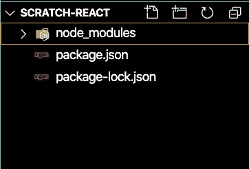
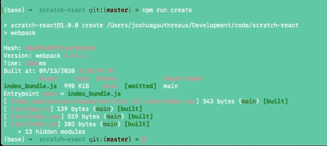
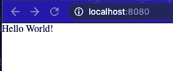

# 不使用 create-react-app 创建 React 应用程序的指南

> 原文：<https://javascript.plainenglish.io/a-guide-to-creating-a-react-app-without-create-react-app-5337c5ac2ea0?source=collection_archive---------0----------------------->

## 从头开始创建 React 应用程序

一个厨师知道，两个不同的厨师，一个更熟练，一个不太熟练，给同样的配料和指示，会做出两种截然不同的菜。

不太熟练的厨师可能会仔细遵循每一个步骤，精确测量每一种配料，但仍然会发现自己的菜不如对手的菜好吃。

熟练的厨师知道，要做出令人惊奇的东西，需要的不仅仅是正确的工具和良好的指导。理解和*为什么*不同的配料相互反应以及对烹饪过程的反应将会改变你烹饪它们的方式和结果，即使是在食谱或一套说明的范围内。

# 这和 React 有什么关系？

作为一名新开发人员，我依赖几种工具，其中许多工具我并不十分了解它们是如何工作的或者为什么工作。这不一定是一件坏事，这意味着我可以创建做酷事情的应用程序。

我想创建做真正酷的事情的应用程序，所以我的目标是更好地理解 T21 为什么和这些工具是如何工作的。

我从一个工具开始，这个工具是我最近创建的几乎每个项目都使用的。

我们开始做饭吧。

# 从头开始创建 React 应用程序:

*在这里* *找到已完成的指南库* [*并随意分叉克隆:)*](https://github.com/Josh-Gotro/react-from-scratch)

*   在您的终端中，为您的应用程序创建一个目录，并放入 cd。我正在调用我的目录`scratch-react`。

```
mkdir scratch-react
cd scratch-react
```

*   运行`init -y`创建一个`package.json`。
*   接下来，安装我们将使用的包。这是一个很长的列表，安装后，我们将看到一切是如何连接的。

```
npm install --save-dev @babel/core @babel/preset-env @babel/preset-react webpack webpack-cli webpack-dev-server babel-loader css-loader style-loader html-webpack-plugin
```

*使用标志* `*--save-dev*` *允许我们区分开发模式和实时模式。*



运行之后，您将看到熟悉的`node_modules`和`package-lock.json`文件出现在您的文件树中。

*   创建一个`index.html`文件，放一些简单的 HTML 开始。

index.html

您的 React 应用程序将使用`root` id 渲染到`<div>`。

指向`app.js`的`<script>`就是`webpack`和`babel`要造的东西。

package.json

*   将 babel 和 webpack 添加到`package.json`。

在这里，我们添加了`babel`和`scripts`部分，在那里我们调用了我们之前安装的一些包，这些包为我们翻译了我们的应用程序(babel)并为我们启动了我们的应用程序(webpack)

*   创建`index.js`、`index.css`、`App.js`、`.gitignore`文件。

```
touch index.js
touch index.css
touch App.js
touch .gitignore
```


现在是开始整理你的应用文件的好时机。创建目录，以任何你喜欢的方式组织它。对于本指南，我将创建一个`src`文件夹来保存我的`index.html`、组件和 CSS 文件。

*   在每个新文件中构建一些基本结构。

index.js

导入`index.js`文件中的`React`和`ReactDom`以及`index.css`和`App.js`组件。

通过`root` id 渲染`<App/>`。

App.js

一旦我们连接好所有的东西，这个基本的`App.js`组件将向浏览器打印“Hello World”。

index.css

在你的 CSS 文件中设置一个基线，以确保所有的浏览器从一个干净的石板开始。

.gitignore

点击查看关于`.gitignore`和 React 应用[的大量信息。](https://www.pluralsight.com/guides/creating-gitignore-for-clean-react-repository)

或者，可以随意复制这段代码。

*   为了编译成 App.js 文件，在您的主文件夹中创建一个文件，`webpack.config.js`并将以下内容添加到新文件中。

webpack.config.js

设置路径和 webpack 变量。

在`module.exports`中，指向 index.js 文件的入口。我将我的应用程序组织成包含一个`src`文件。如果没有，确保线`5`和`26`指向正确的位置。

`module:` `rules:`找到 JSX 文件并对其使用`babel-loader`，同时教会你的应用如何查看 CSS 和样式。



运行`npm run create`,在它运行之后，你应该在你的终端上看到类似这样的东西。

*   最后，运行`npm start`并说



react from scratch

我想以一段来自美国伟大的厨师兼教师茱莉亚·切尔德的视频来结束我的演讲。当我学习烹饪时，这个视频对我来说意义重大，在我学习编码时，我仍然能从中找到灵感。

在这里找到本指南的 Github 库[。](https://github.com/Josh-Gotro/react-from-scratch)

在 joshuagauthreaux@gmail.com 或通过我的网站联系我，[](https://www.joshgotro.com/)***。***

***一如既往的感谢阅读，保重身体！***

## *进一步阅读*

*[](https://bit.cloud/blog/how-to-create-a-composable-react-app-with-bit-l7ejpfhc) [## 如何用 Bit 创建一个可组合的 React App

### 在本指南中，您将学习如何使用 Bit 构建和部署一个成熟的可组合 React 应用程序。建立一个…

比特云](https://bit.cloud/blog/how-to-create-a-composable-react-app-with-bit-l7ejpfhc)* 

**更多内容看* [***说白了。报名参加我们的***](https://plainenglish.io/) **[***免费周报***](http://newsletter.plainenglish.io/) *。关注我们关于*[***Twitter***](https://twitter.com/inPlainEngHQ)，[***LinkedIn***](https://www.linkedin.com/company/inplainenglish/)*，*[***YouTube***](https://www.youtube.com/channel/UCtipWUghju290NWcn8jhyAw)*，以及* [***不和***](https://discord.gg/GtDtUAvyhW) *。对增长黑客感兴趣？检查出* [***电路***](https://circuit.ooo/) *。****