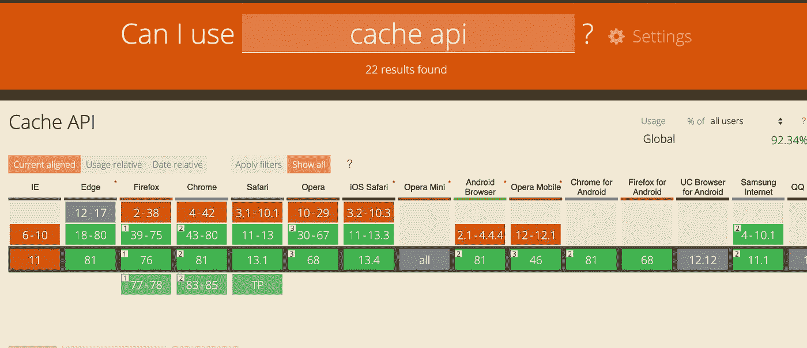

# 缓存 API 指南

> 原文：<https://javascript.plainenglish.io/a-guide-to-the-cache-api-88a81621dca8?source=collection_archive---------8----------------------->

## 缓存请求及其相应响应的快速指南


Photo by [Miguel Á. Padriñán](https://www.pexels.com/@padrinan?utm_content=attributionCopyText&utm_medium=referral&utm_source=pexels) from [Pexels](https://www.pexels.com/photo/store-text-signage-1591057/?utm_content=attributionCopyText&utm_medium=referral&utm_source=pexels)

缓存 API 为请求/响应对象对提供了一种存储机制。它允许您缓存资源，如资产、图像、javascript 文件、HTML、API 响应。

它最初是作为服务工作者规范的一部分创建的，用于缓存请求并提供快速离线响应，但它也可以用作通用存储机制。在这篇文章中，我们将讨论缓存 API 的一些基础知识。

# 检查可用性

*缓存*对象在窗口对象上直接可用，因此我们可以通过以下方式检查它是否存在:

```
'caches' in window && console.log('available')
```

如果浏览器支持缓存 API，则返回可用的**。**

## **打开缓存**

**打开一个缓存就像调用 *caches.open('cacheName')* 一样简单，它返回一个用缓存对象解析的承诺。**

```
caches.open('cacheName').then(cache => {
    //make use of cache object now
})
```

> ***注意:如果缓存不存在，它会创建一个新的缓存。***

## **检查缓存中是否有东西**

***cache.keys()* 可用于获取缓存中存在的所有键。它返回一个解析为缓存键数组的承诺。**

```
cache.keys().then(keys => {
    //array of cache keys
})
```

## **添加到缓存**

**将内容放入缓存的三种方法——add、addAll、put。**

1.  **cache.add(请求)**

**接受请求 URL，获取它并将响应添加到缓存中。**

```
const url = 'api/getPosts'
cache.add(url)
```

**2.cache.addAll(请求)**

**接受一组请求，获取它们，然后将它们的响应添加到缓存中。**

```
const urls = ['api/getPosts', 'api/getTodos']
cache.addAll(urls)
```

**3.cache.put(请求)**

**获取请求 URL 并缓存其响应。如果请求 URL 的响应已经存在，它将被新的响应覆盖。**

```
const url = 'api/getSinglePost'
cache.put(url)
```

## **从缓存中获取项目**

**缓存 API 为此提供了两种方法:match、matchAll。**

1.  **cache.match(请求)**

**将缓存中的第一个响应与请求 URL 进行匹配，并返回一个解决该问题的承诺。**

```
const url = 'api/getSinglePost';
cache.match(url).then(response => {
    //first matched response for the requested url
})
```

**2.cache.matchAll(请求)**

**这类似于 addAll，因为它接受一个请求 URL 数组。返回解析所提供请求的所有响应的承诺。**

```
const urls = ['api/getPosts', 'api/getTodos'];
cache.matchAll(urls).then(responses => {
    //all responses that match to request urls
})
```

## **从缓存中删除项目**

***cache.delete()* 可用于从缓存中删除请求或资产 URL。**

```
cache.delete('assets/icon.png')
```

## **删除整个缓存**

**接受一个缓存键并将其从缓存中完全删除。如果缓存被删除，则返回解析为 true 的承诺，否则返回 false。**

```
caches.delete('cacheName').then(status =>{
    //whether cache deleted or not
})
```

# **结论**

**还值得一提的是，浏览器对源可以使用的缓存存储量有一个硬性限制。因此，请确保随着时间的推移清除缓存条目。**

**浏览器兼容性如下所示:**

****

**[https://caniuse.com/#search=cache%20api](https://caniuse.com/#search=cache%20api)**

# ****用简单英语写的便条****

**你知道我们有四份出版物和一个 YouTube 频道吗？你可以在我们的主页 [**plainenglish.io**](https://plainenglish.io/) 找到所有这些内容——关注我们的出版物并 [**订阅我们的 YouTube 频道**](https://www.youtube.com/channel/UCtipWUghju290NWcn8jhyAw) **来表达你的爱吧！****