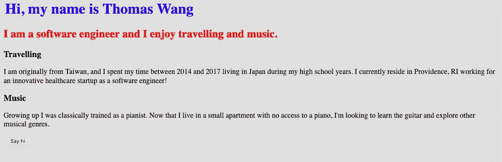

# 网络如何工作:网络开发指南

> 原文：<https://javascript.plainenglish.io/a-guide-to-web-development-how-the-web-works-81065ec4eef9?source=collection_archive---------9----------------------->

## 从长远来看，理解基础知识对一个 web 开发人员来说是非常宝贵的

Humans are more interconnected than ever in history.

# 动机

[截至 2017 年 7 月，全球活跃互联网用户达 45.7 亿。](https://www.statista.com/statistics/617136/digital-population-worldwide/)互联网的便捷使用已经成为人类自然行为的一部分。

然而，如果你渴望精通全栈 web 开发，超越用户级的 Web 交互的重要性怎么强调都不为过。就像汽车修理工必须知道的不仅仅是驾驶汽车的方法一样——你，开发者，必须透过屏幕，真正理解网络本身的内部运作。

虽然已经有很多有价值的(免费的)资源可以用来学习特定的 web 技术，但是本文并不想成为任何类型的教程。相反，我的目的是帮助你建立基本的网络知识，而不是深入本质。

# 互联网与万维网(WWW)

首先，一些术语。

T2 的互联网和 T4 的网络有区别吗？是的。

由于现在大多数人只通过网络浏览器访问互联网上的信息，这些术语通常——但却错误地——变成了同义词。

互联网指的是计算机网络的广阔网络，通过它数字信息可以通过不同的协议进行交换。互联网是世界上最流行的计算机网络，但肯定还有其他的计算机网络存在。

万维网(WWW)，或简称为 Web*，*是一种通过互联网获取信息的方式。网络只是互联网应用的一个突出例子。互联网应用的其他例子包括电子邮件、在线互动游戏、聊天应用。还有 BitTorrent。

# 网络的起源

1989 年，蒂姆·伯纳斯·李爵士在欧洲粒子物理研究所工作时，首次将我们今天所知的网络概念化。他在一份名为 [*信息管理:提案*](http://info.cern.ch/Proposal.html) 的文件中阐述了他的愿景，试图改善科学家在欧洲粒子物理研究所共享信息的方式。该文档描述了 HTML、URI 和 HTTP 等概念，所有这些技术在今天的 Web 基础设施中仍然非常重要。到 1990 年底，蒂姆·伯纳斯·李已经建成了世界上第一台网络服务器。

# 网络的主要组成部分

让我们看看构成现代网络基础设施的主要组件。

## 1.HTML——网页的骨架

HTML，或超文本标记语言，是创建网页的标准*标记语言*。与普遍的看法相反，HTML 不是一种编程语言，因为它不能执行逻辑运算。HTML 是静态的，专门用于定义网页的结构。HTML 使用*标签*向浏览器描述数据应该如何显示。HTML 标签的完整列表可以在[这里](https://developer.mozilla.org/en-US/docs/Web/HTML/Element)找到。

下面是一个 HTML 文件的简短示例:

正如您可能已经观察到的，标签通常是成对出现的。这对标签告诉浏览器它们之间的内容应该如何呈现。快速参考一下，`<h1>`、`<h2>`、`<h3>`标签只是默认字体大小不同的*表头*标签。`
`是一个*段的*标记。上面的代码呈现如下视图:

Nothing too exciting… yet

HTML 定义了网页的结构。

## 2.CSS——赋予网页一些风格

层叠样式表(CSS)是用来设计 HTML 文档样式的语言。正如我们在上面的视图中看到的，样式在各方面都有所欠缺。通过嵌入额外的 CSS，我们可以改变网页的风格。

Some basic CSS to modify the layout, font color, and background color

Still quite ugly… but at least not by 2000s standards!

当然，HTML 和 CSS 可以做更多的事情。这只是展示他们目的的一个例子。

几乎你在任何网站上看到的任何东西都是用 HTML 构建的，用 CSS 设计的。

## 3.JavaScript—赋予网页动态行为

很有可能，你以前可能听说过术语 *JavaScript* 。

单独使用 HTML 和 CSS，网页是完全静态的，没有任何功能，因为 HTML 和 CSS 专门负责*外观*。不幸的是，这对用户来说很快就变得很无聊，因为他们根本无法与网页互动。

然而，通过在我们的 HTML 代码中嵌入 JavaScript，我们的网页开始具备动态功能和交互功能。

Try guessing what this code does!

现在，当你点击我们示例网页中的按钮时，我们开始看到一些动作！

With some simple JavaScript, we can add dynamic behavior to the webpage

## 4.HTTP/HTTPS——计算机如何相互交流

超文本传输协议(HTTP)是计算机用于传输数据(如 HTML 文件)的应用层协议。

可以把 HTTP 看作是计算机交换信息的一个约定好的过程。HTTP 遵循*客户机/服务器模型*，其中客户机向服务器发起请求以执行某些动作。

The client initiates through requests. Source: MDN

HTTP 请求前面有一个*动词*，通知服务器采取哪种类型的动作。下面是几种最常见的 HTTP 动词类型:

*   GET(告诉服务器客户端想要检索资源)
*   POST(告诉服务器客户机想要创建新资源)
*   PUT(告诉服务器客户机想要更新预先存在的资源)
*   删除(告诉服务器客户端想要删除资源)

在收到来自客户端的请求时，服务器执行某些操作，并用一个*状态码*响应客户端。

Ever seen something like this? 404 is a “not found” status code sent by the server to indicate that the requested resource could not be found

要查看 HTTP 的运行情况，请前往 weather.com 的(或者任何网站，真的)并在页面的任何地方点击右键*。*然后，点击*检查元素*，导航到*网络*选项卡，并重新加载页面。您应该会突然看到一个网络请求列表。在这里，每一行都是浏览器发出的一个不同的 HTTP 请求。

HTTP(S)是您的浏览器用来与服务器通信的约定协议

Each row on the right is an HTTP(S) request made to retrieve some type of resource (could be HTML, CSS, vendor code, weather data, an image, etc.)

另外，在我们继续之前，HTTPS 只是一个安全的地方。 HTTP 传输未加密的数据，这意味着捕获任何传输数据的恶意中间人将能够查看原始数据。HTTPS 使用传输层安全性(TLS)对数据进行加密，并确保传输的数据仅可由目标接收方查看(至少清晰可辨)。你可以在这里阅读更多关于 HTTPS 的信息。

## 5.DNS —互联网的电话簿

既然我们知道了 HTTP 和 HTTPS 是怎么回事，一个问题自然就出现了。*计算机如何知道彼此的位置？*

记住，网络是在互联网上运行的，互联网是一个由互连的计算机节点组成的巨大网络。当你早些时候访问 weather.com 的时候，你的浏览器是如何确切地知道 weather.com 服务器在互联网上的位置的？

这就是域名系统(DNS)的用武之地。

DNS 的基本功能是将人类可读的域名(如 weather.com)转换为 IP 地址，IP 地址是分配给每一台连接到互联网的设备的唯一标识符。将设备的 IP 地址视为它们在互联网上的 SSN。你的手机、笔记本电脑、iPad、Roku——当连接到互联网时，它们都有自己的 IP 地址。

When the DNS Server fails to resolve a domain name

以下是当您请求访问 weather.com 时，您的浏览器在幕后执行的操作:

1.  检查 weather.com 的 IP 地址是否已经存在于缓存中。如果是的话，太好了！请继续执行第 3 步。否则，转到步骤 2)。
2.  查询 DNS 服务器(专门用于将域名解析为 IP 地址的服务器)以获得 weather.com 的 IP 地址。
3.  继续向由给定 IP 地址标识的服务器发出 HTTP/HTTPS 请求。此外，缓存 IP 地址，以避免将来访问 weather.com 时重复查询 DNS 服务器。

类似于电话簿让你通过名字查找联系人，DNS 让你找到服务器的 IP 地址。

# 把东西放在一起

万维网(WWW)是一种互联网应用程序，可以通过网络协议共享信息。早在 1989 年，蒂姆·伯纳斯·李爵士就提出了这个想法，作为解决欧洲粒子物理研究所数据共享挑战的解决方案。

当你在 Web 上访问一个网站时，你的浏览器实际上是*请求*资产(如 HTML、CSS、JavaScript 代码、图片等。)从互联网上的 Web 服务器下载。HTML 定义网页的结构，CSS 设计布局，JavaScript 支持动态行为。

由于 DNS，您的电脑能够在互联网上找到服务器，DNS 是一种将人类可读的域名(如 weather.com)解析为 IP 地址的系统。IP 地址是分配给连接到互联网的设备的唯一标识符。

浏览器使用 HTTP(或 HTTPS，HTTP 的加密扩展)与 Web 服务器通信，并使用*动词*向服务器传达它正在发出的请求类型。在执行完客户端请求的操作后，服务器会用一个状态代码进行响应。

# 这只是你旅程的开始

希望这篇文章能帮助你对网络有一个全面的了解。如果你有兴趣学习更多与 Web 相关的技术(我希望你有兴趣)，请关注我，因为我会发表更多的文章！