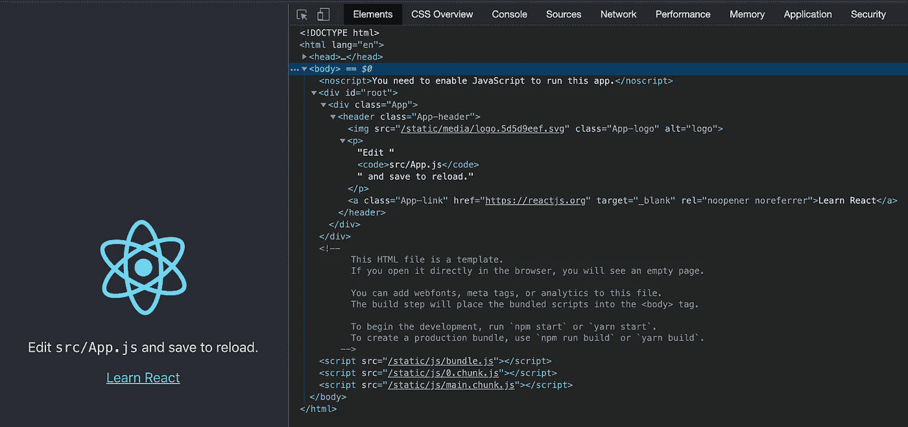
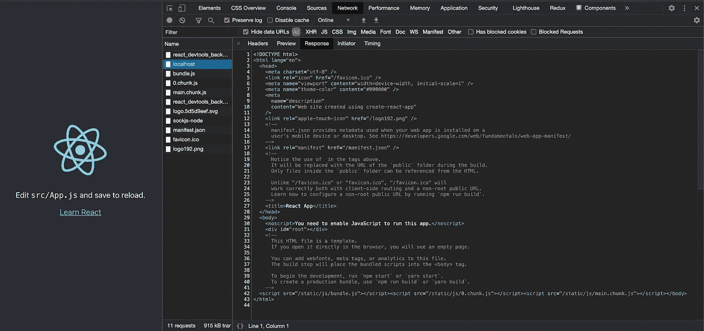
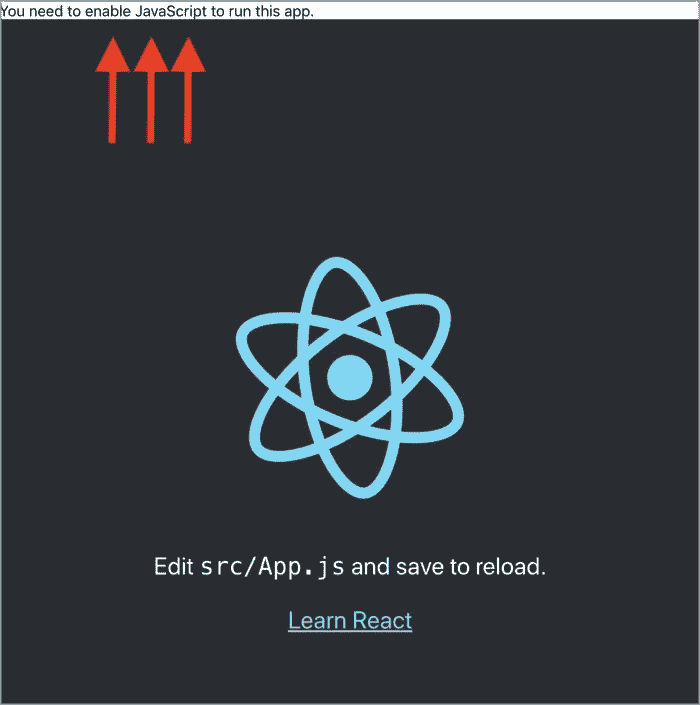

# 服务器端渲染 React 应用的实践指南

> 原文：<https://javascript.plainenglish.io/a-hands-on-guide-for-a-server-side-rendering-react-app-dd1efa3ec0d8?source=collection_archive---------1----------------------->

## 创建 React 应用程序和服务器端渲染


Image credit: Author

> 本文更新了 React 18，Create React App 5，React Router 6。这篇新文章是[服务器端渲染 React 18 应用](https://medium.com/p/4e630aae274c)的实践指南。

在前一篇文章的[中，我们描述了如何进行产品构建并将其部署到服务器上。自然，下一步就是服务器端的渲染了。我们将通过将](https://medium.com/javascript-in-plain-english/a-hands-on-guide-for-creating-a-production-ready-react-app-864ad98e7497) [Create React App](https://medium.com/better-programming/10-fun-facts-about-create-react-app-eb7124aa3785) 转换为服务器端呈现的应用程序来完成这个过程。

# 术语

## 什么是客户端渲染(CSR)？

它是一种浏览器下载最小 HTML 页面，使用 JavaScript 渲染并填充内容的技术。

初始页面加载的 CSR 时间可能会更长，但后续加载会更快。它减轻了服务器的负担，并依靠 JavaScript 库的力量。然而，搜索引擎优化(SEO)很难，因为没有静态的内容可以抓取。

## 什么是服务器端渲染(SSR)？

它是一种浏览器下载完整的 HTML 页面的技术，该页面已经由服务器呈现。

SSR 的优势是为了 SEO。初始页面加载速度更快。但是它需要重新加载整个页面以进行后续更改。这可能会使服务器过载。

## 什么是单页应用程序(SPA)？

这是一个使用客户端渲染的应用程序。它在浏览器中直接动态地呈现每条路线，而不是每条路线都有不同的 HTML 页面。

## 什么是通用(同构)JavaScript？

它是一个运行在客户机和服务器上的 Javascript 应用程序。它在客户端将 HTML 呈现为 SPA，在服务器端也呈现相同的 HTML，然后发送到浏览器进行显示。

我们为 CSR 编写 React 代码。相同的代码库可用于 SSR。React 是通用 JavaScript。

SSR 先于 CSR 存在。今天，随着通用 JavaScript 的出现，它又复活了。当今天提到 SSR 时，它很可能意味着带有通用 JavaScript 的 SSR。

# 创建 React 应用程序和 CSR

安装 [Create React App](https://medium.com/better-programming/10-fun-facts-about-create-react-app-eb7124aa3785) ，运行`npm start`。



在`Elements`选项卡中，它显示了 JavaScript 渲染的旋转标志的 HTML (JSX)和一些文本信息。

这是一个典型的 CSR，HTML 内容由 JavaScript 呈现。从`Network`标签中，我们可以读取从服务器下载的内容。



HTML 的主体有一堆 JavaScript 文件，但没有实际内容。SEO 很难获得任何有意义的信息。

# 使用 Express 部署生产版本

[创建生产就绪型 React 应用的实践指南](https://medium.com/javascript-in-plain-english/a-hands-on-guide-for-creating-a-production-ready-react-app-864ad98e7497)为服务器端渲染奠定基础。

这里是一个简短的回顾。

如下创建`server/index.js`:

执行`npm run build`来创建一个生产版本。然后运行`nodemon server`用 Express 服务器部署它。

在`Network`选项卡中，它显示了从服务器中检索到的内容:

有 3 个 JavaScript 文件(第 17 - 124 行、第 125 行、第 126 行)带有空的标记内容(第 16 行)。因此，这是企业社会责任。

# 在 Express 服务器内部构建 SSR

在 Express 服务器中构建 SSR 有 3 个步骤。

## 步骤 1:使用 ReactDOM.hydrate()或 react DOM . hydrate root()*来显示服务器呈现的标记。*

> *下面是一个前 [React 18](https://betterprogramming.pub/the-complete-guide-to-react-18-dd8763430345) 的解决方案，它使用的是使用 serviceWorker 的 Create React App 的旧版本。*

*`ReactDOM.hydrate()` 类似于 as `ReactDOM.render()`。它用于合并一个容器，该容器的 HTML 内容已经由`ReactDOMServer`对象呈现。它的语法是`ReactDOM.hydrate(element, container[, callback])`，和`ReactDOM.render(element, container[, callback])`几乎一模一样。*

*由于`ReactDOM.hydrate()`是在一个已经有服务器呈现标记的节点上调用的，React 将保留它，并且只附加事件处理程序。这使得初始负载性能良好。*

*`ReactDOM.hydrate()`用于`src/index.js`:*

*在第 7 行，`ReactDOM.render()`被替换为`ReactDOM.hydrate()`。*

> *下面是一个 [React 18](https://betterprogramming.pub/the-complete-guide-to-react-18-dd8763430345) 的解决方案:`*hydrate*`替换为`*hydrateRoot*`，从`*react-dom/client*`导出。它的语法是`*hydrateRoot(container, element)*`。新的根提供了并发性改进。*
> 
> *它还使用了使用 reportWebVitals 的 Create React 应用程序的新版本。*

*`ReactDOM.hydrateRoot()`用于`src/index.js`:*

## *步骤 2:使用 ReactDOMServer 对象将组件呈现为静态标记。*

*React 提供了`[ReactDOMServer](https://reactjs.org/docs/react-dom-server.html)`对象来将组件呈现给静态标记。它向浏览器发送一个已经填充了数据的页面。*

*React 代码是通用的 JavaScript，在客户端和服务器上都可以运行。*

*实现 SSR 有不同的方案和方法。`@babel/register`就是其中一个包。它作为`[devDependencies](https://medium.com/better-programming/package-jsons-dependencies-in-depth-a1f0637a3129)`的一部分与`babel-plugin-transform-assets`一起安装。*

```
*"devDependencies": {
  "@babel/register": "^7.11.5",
  "babel-plugin-transform-assets": "^1.0.2"
}*
```

*以下是`server/index.js`中的 SSR 实现。我们不使用 [ES 模块](https://betterprogramming.pub/what-might-be-coming-in-npm-9-6985cf2678a6)来编写代码，因为`@babel/register`不支持动态编译 native Node.js ES 模块。据说目前还没有稳定的 API 来拦截 ES 模块的加载。*

> *注意:从[反应 18](https://betterprogramming.pub/the-complete-guide-to-react-18-dd8763430345) ，`*renderToString*`仍然工作，但是有有限的`Suspense`支持。React 18 改版服务器端 API，放入`react-dom/server`。这些新的 API 完全支持服务器上的`Suspense`和流 SSR。*

*在第 1 行，我们通过`require`钩子设置了 Babel，它可以动态地自动编译文件。如果没有这个钩子和相关的预置，我们将会遇到`SyntaxError: Cannot use import statement outside a module`。*

```
*$ nodemon server
[nodemon] 2.0.4
[nodemon] to restart at any time, enter `rs`
[nodemon] watching path(s): *.*
[nodemon] watching extensions: js,mjs,json
[nodemon] starting `node server`
/Users/fuje/app/react-app1/src/App.js:1
import React from "react";
^^^^^^SyntaxError: Cannot use import statement outside a module
    at wrapSafe (internal/modules/cjs/loader.js:1071:16)
    at Module._compile (internal/modules/cjs/loader.js:1121:27)
    at Object.Module._extensions..js (internal/modules/cjs/loader.js:1177:10)
    at Module.load (internal/modules/cjs/loader.js:1001:32)
    at Function.Module._load (internal/modules/cjs/loader.js:900:14)
    at Module.require (internal/modules/cjs/loader.js:1043:19)
    at require (internal/modules/cjs/helpers.js:77:18)
    at Object.<anonymous> (/Users/fuje/app/react-app1/server/index.js:3:13)
    at Module._compile (internal/modules/cjs/loader.js:1157:30)
    at Object.Module._extensions..js (internal/modules/cjs/loader.js:1177:10)
[nodemon] app crashed - waiting for file changes before starting...*
```

*在第 2 行，我们设置了两个预设:*

*   *`@babel/preset-env`，一个智能预设，它使用最新的 JavaScript，而不需要微观管理目标环境所需的语法转换。*
*   *`@babel/preset-react`，智能预设，自动导入 JSX 转换到的功能。*

*第 3 - 14 行是`babel-plugin-transform-assets`的插件。它设置了如何转换静态媒体文件的规则。如果没有这个，它会抛出`SyntaxError: Unexpected token ‘<’`作为`svg`标签。*

```
*$ nodemon server
[nodemon] 2.0.4
[nodemon] to restart at any time, enter `rs`
[nodemon] watching path(s): *.*
[nodemon] watching extensions: js,mjs,json
[nodemon] starting `node server`
/Users/fuje/app/react-app5/src/logo.svg:1
<svg ae lv" href="http://www.w3.org/2000/svg" rel="noopener ugc nofollow" target="_blank">http://www.w3.org/2000/svg" viewBox="0 0 841.9 595.3">
^SyntaxError: Unexpected token '<'
    at wrapSafe (internal/modules/cjs/loader.js:1071:16)
    at Module._compile (internal/modules/cjs/loader.js:1121:27)
    at Module._extensions..js (internal/modules/cjs/loader.js:1177:10)
    at Object.newLoader [as .js] (/Users/fuje/app/react-app5/node_modules/pirates/lib/index.js:104:7)
    at Module.load (internal/modules/cjs/loader.js:1001:32)
    at Function.Module._load (internal/modules/cjs/loader.js:900:14)
    at Module.require (internal/modules/cjs/loader.js:1043:19)
    at require (internal/modules/cjs/helpers.js:77:18)
    at Object.<anonymous> (/Users/fuje/app/react-app5/src/App.js:2:1)
    at Module._compile (internal/modules/cjs/loader.js:1157:30)
[nodemon] app crashed - waiting for file changes before starting...*
```

*在第 16 行，需要 React。*

*第 17 行需要`ReactDOMServer`。*

*在第 18 行，需要默认导出`src/App.js`。*

*我们将`app.use()`移到第 47 行，在`app.get()`之后(第 25 - 45 行)。否则，`app.use()`将为根路由服务包括`index.html`在内的静态文件，执行将没有机会到达`app.get()`中间件。*

*第 26 行显示了被调用的请求 URL。对于创建 React 应用程序，它们列出如下:*

```
*Request URL = /
Request URL = /static/css/main.519b5a55.chunk.css
Request URL = /static/media/logo.5d5d9eef.svg
Request URL = /static/js/main.fdf902fb.chunk.js
Request URL = /static/js/2.bc7ff9af.chunk.js
Request URL = /static/css/main.519b5a55.chunk.css.map
Request URL = /static/js/main.fdf902fb.chunk.js.map
Request URL = /static/js/2.bc7ff9af.chunk.js.map
Request URL = /manifest.json
Request URL = /logo192.png*
```

*第 27 - 29 行确保只有根路径被`app.get()`渲染。静态资产将跳到第 47 行的下一个中间件。*

*在第 30 行，`ReactDOMServer.renderToString(element)`用于在服务器上生成 HTML。从理论上讲，可以写成`ReactDOMServer.renderToString(<App />)`。但那会抛出`SyntaxError: Unexpected token ‘<’`。*

```
*$ nodemon server
[nodemon] 2.0.4
[nodemon] to restart at any time, enter `rs`
[nodemon] watching path(s): *.*
[nodemon] watching extensions: js,mjs,json
[nodemon] starting `node server`
/Users/fuje/app/react-app5/server/index.js:42
  const reactApp = ReactDOMServer.renderToString(<App />);
                                                 ^SyntaxError: Unexpected token '<'
    at wrapSafe (internal/modules/cjs/loader.js:1071:16)
    at Module._compile (internal/modules/cjs/loader.js:1121:27)
    at Object.Module._extensions..js (internal/modules/cjs/loader.js:1177:10)
    at Module.load (internal/modules/cjs/loader.js:1001:32)
    at Function.Module._load (internal/modules/cjs/loader.js:900:14)
    at Function.executeUserEntryPoint [as runMain] (internal/modules/run_main.js:74:12)
    at internal/main/run_main_module.js:18:47
[nodemon] app crashed - waiting for file changes before starting...*
```

*要求`@babel-register`对被要求的文件不起作用，但对以后被要求的文件起作用。将包含`ReactDOMServer.renderToString(<App />)`的代码移动到所需的单独文件中，或者直接使用`React.createElement()`。*

*第 31 行显示了服务器呈现的标记代码:*

```
*<div class="App" data-reactroot=""><header class="App-header"><p>Edit <code>src/App.js</code> and save to reload.</p><a class="App-link" href="https://reactjs.org" target="_blank" rel="noopener noreferrer">Learn React</a></header></div>*
```

*33 号线装载产品`index.html`。*

*第 34 - 44 行读取`index.html`的内容。如果没有错误，服务器生成的标记(第 42 行)被呈现给根标签，然后最终的`index.html`响应初始加载。*

*执行`nodemon server`。从`Network`选项卡中，下载的脚本显示了服务器呈现的标记。*

*从`Elements`选项卡，以下是 HTML 的新主体:*

*正文内容包含完整的内容，SEO 可以使用它来获取有意义的信息。*

*虽然有一堆 JavaScript 文件，但是不执行。这可以通过关闭 bowser 中的 JavaScript 来证明。*

**

*这是 SSR。禁用 JavaScript，代码继续工作。*

## *步骤 3:处理页面特定的需求。*

*我们让单页 React 应用程序发挥了作用。多条路线的 app 怎么样？*

*首先，将`react-router-dom`作为`[dependencies](https://medium.com/better-programming/package-jsons-dependencies-in-depth-a1f0637a3129)`之一安装。*

```
*"devDependencies": {
  “react-router-dom”: “^5.2.0”,
  ...
}*
```

*修改`src/App.js`如下:*

*执行`npm run build`，然后运行`nodemon server`。*

```
*Error: Invariant failed: Browser history needs a DOM
    at invariant (/Users/fuje/app/react-app5/node_modules/tiny-invariant/dist/tiny-invariant.cjs.js:13:11)
    at Object.createHistory [as createBrowserHistory] (/Users/fuje/app/react-app5/node_modules/history/cjs/history.js:273:16)
    at new BrowserRouter (/Users/fuje/app/react-app5/node_modules/react-router-dom/modules/BrowserRouter.js:11:13)
    at processChild (/Users/fuje/app/react-app5/node_modules/react-dom/cjs/react-dom-server.node.development.js:2995:14)
    at resolve (/Users/fuje/app/react-app5/node_modules/react-dom/cjs/react-dom-server.node.development.js:2960:5)
    at ReactDOMServerRenderer.render (/Users/fuje/app/react-app5/node_modules/react-dom/cjs/react-dom-server.node.development.js:3435:22)
    at ReactDOMServerRenderer.read (/Users/fuje/app/react-app5/node_modules/react-dom/cjs/react-dom-server.node.development.js:3373:29)
    at Object.renderToString (/Users/fuje/app/react-app5/node_modules/react-dom/cjs/react-dom-server.node.development.js:3988:27)
    at /Users/fuje/app/react-app5/server/index.js:42:35
    at Layer.handle [as handle_request] (/Users/fuje/app/react-app5/node_modules/express/lib/router/layer.js:95:5)*
```

*不幸的是，`BrowserRoute`在幕后使用了 HTML5 [推送状态历史 API](https://developer.mozilla.org/en-US/docs/Web/API/History_API#Adding_and_modifying_history_entries) ，Node.js 不支持。*

*对于 SSR，应该在通用 JavaScript 中使用`[StaticRouter](https://reactrouter.com/core/guides/static-routes)`。但是，`StaticRouter`目前是一个 alpha 软件。*

> *我们正在开发一个软件包，用于静态路由配置和反应路由器，以继续满足这些用例。它现在正在开发中，但我们希望您能尝试一下并提供帮助。*
> 
> *[React 路由器配置](https://github.com/reacttraining/react-router/tree/master/packages/react-router-config)*

*另一种选择是 MemoryRouter，它将 URL 历史记录保存在内存中(不读写地址栏)。它在测试和非浏览器环境中很有用。*

*下面是`src/App.js`:*

*35 线和 39 线使用`MemoryRouter`。*

*执行`npm run build`，然后运行`nodemon server`。转到`http://localhost:8080`，我们看到如下页面:*

**

*该应用程序的工作，虽然在地址栏的网址不会更新。*

*路由工作有一个警告。还有其他事情需要处理，比如数据获取、Redux 等。服务器端的工作不像客户端那么简单。根据要求，每个页面可能都需要特别注意。*

# *结论*

*我们已经展示了如何为 Create React 应用程序设置 SSR。这些是步骤:*

1.  *使用`ReactDOM.hydrate() or ReactDOM.hydrateRoot()`显示服务器渲染的标记。*
2.  *使用`ReactDOMServer`对象将组件呈现为静态标记。*
3.  *处理页面特定需求*

*我们使用`ReactDOMServer`对象将组件呈现给静态标记。它可以用于 SSR 和静态渲染。*

*当请求文件时，SSR 按需发生。静态呈现在构建时发生一次。两者都是 SEO 友好的。*

*如果页面只包含静态数据，静态呈现会更快。但是，如果响应是动态的，SSR 是更好的选择。有时，混合方法可能是最适合这种情况的。静态呈现超出了本文的范围。*

*Remix 是一个全栈的 web 框架，专注于用户界面，并通过 web 基础工作。它包括 SSR 和其他开箱即用的特性，没有样板文件。*

*感谢阅读。我希望这有所帮助。你可以在这里看到我的其他媒体出版物。*

## *进一步阅读*

*[](/5-tips-to-scale-up-your-react-apps-8fb68319062e) [## 扩展 React 应用的 5 个技巧

### 1.将 Bit 用于可组合设计 2。设计令牌 3。网络请求的定制钩子 4。客户端与服务器状态 5。一个…

javascript.plainenglish.io](/5-tips-to-scale-up-your-react-apps-8fb68319062e)* 

**更多内容看* [***说白了就是***](https://plainenglish.io/) *。报名参加我们的* [***免费周报***](http://newsletter.plainenglish.io/) *。关注我们关于* [***推特***](https://twitter.com/inPlainEngHQ) ， [***领英***](https://www.linkedin.com/company/inplainenglish/) *，*[***YouTube***](https://www.youtube.com/channel/UCtipWUghju290NWcn8jhyAw)*，以及* [***不和***](https://discord.gg/GtDtUAvyhW) *。对增长黑客感兴趣？检查* [***电路***](https://circuit.ooo/) *。**