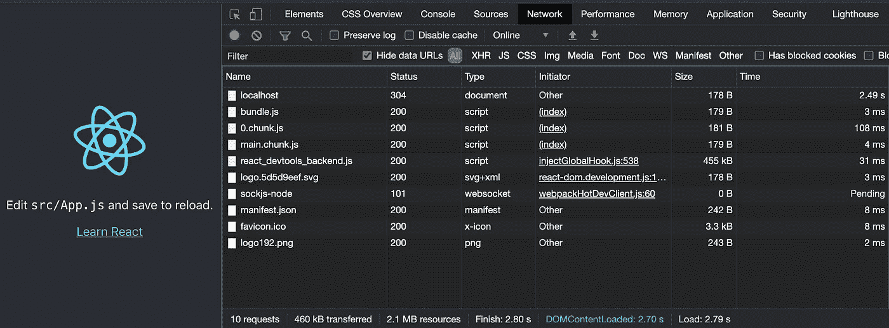
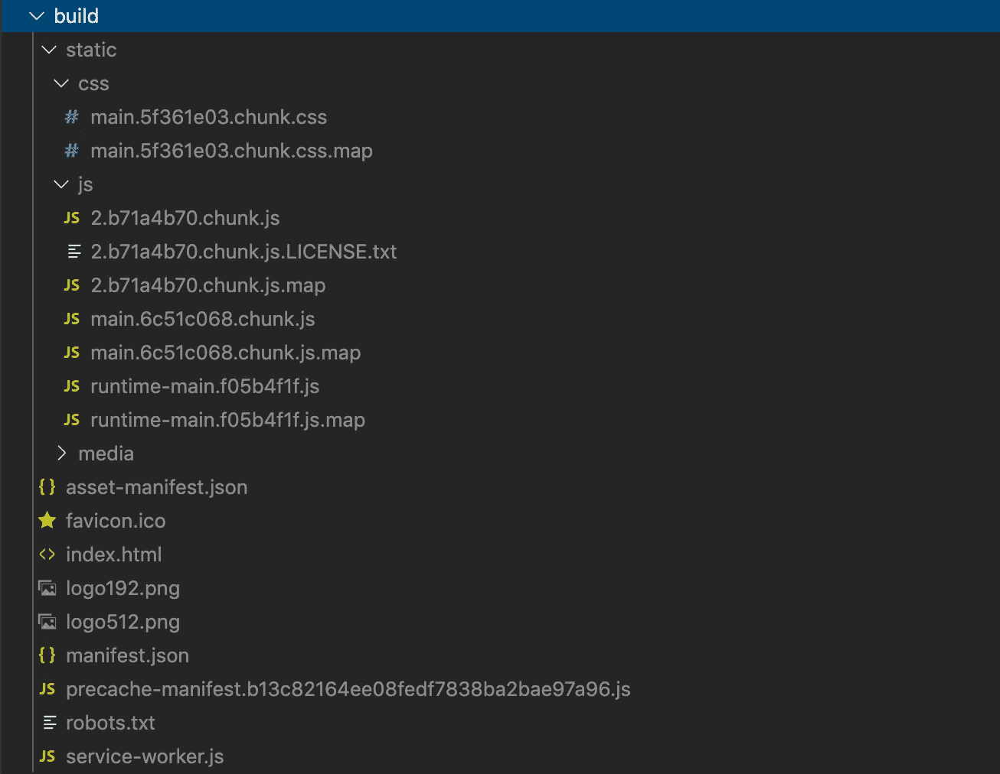
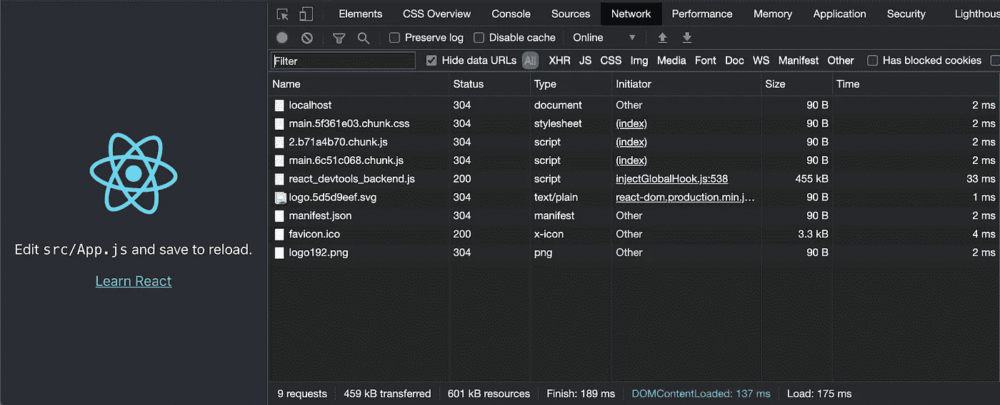
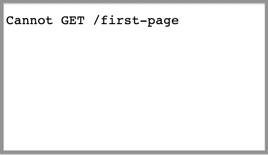

# 创建生产就绪型 React 应用的实践指南

> 原文：<https://javascript.plainenglish.io/a-hands-on-guide-for-creating-a-production-ready-react-app-864ad98e7497?source=collection_archive---------0----------------------->

## 创建 React 应用程序和生产版本


Image credit: Author

Create React App 是一个集成的工具链，为用户和开发者提供最佳体验。它有许多现成的东西，我们可以直接跳到上面开始编码。

完成开发后，我们需要进行生产构建，并将其部署到服务器上。在本文中，我们将介绍构建和部署过程。

# 在开发模式下运行创建 React 应用程序

安装 Create React 应用程序，并立即运行它:

```
npx create-react-app my-app
cd my-app
npm start
```



从`Network`选项卡中，我们可以看到开发模式中的 10 个请求:

*   `localhost`:根目录的主入口`index.html`
*   `bundle.js`:web pack 捆绑文件
*   `0.chunk.js`和`main.chunk.js`:分割后的代码文件
*   `react_devtools_backend.js`:`[react-devtools](https://www.npmjs.com/package/react-devtools)`的源代码
*   `logo.5d5d9eef.svg`:杂凑名称的 logo SVG 文件
*   `sockjs-node`:热模块重装的自定义 web socket 路径
*   `manifest.json`:JSON 格式的 app 元数据
*   `favicon.ico`:网站图标
*   `logo192.png`:logo 图像文件

# 用 Serve 制作一个静态服务器

完成开发后，我们需要进行生产构建。 [React 文档](https://create-react-app.dev/docs/deployment)声明最简单的方法是使用 [serve](https://github.com/zeit/serve) 并让它处理剩下的事情。最好是全球安装 serve:`npm i serve -g`。

以下是执行`npm run build`的输出:

```
$ npm run build> react-app1@0.1.0 build /Users/fuje/app/react-app1
> react-scripts buildCreating an optimized production build...
Compiled successfully.File sizes after gzip:39.39 KB  build/static/js/2.b71a4b70.chunk.js
  774 B     build/static/js/runtime-main.f05b4f1f.js
  648 B     build/static/js/main.6c51c068.chunk.js
  547 B     build/static/css/main.5f361e03.chunk.cssThe project was built assuming it is hosted at /.
You can control this with the homepage field in your package.json.The build folder is ready to be deployed.
You may serve it with a static server:serve -s buildFind out more about deployment here:bit.ly/CRA-deploy
```

build 命令生成要部署的`build`目录。



执行`serve`命令运行生产构建:

```
$ serve -s build
   ┌───────────────────────────────────────────────────┐
   │                                                   │
   │   Serving!                                        │
   │                                                   │
   │   - Local:            [http://localhost:5000](http://localhost:5000)       │
   │   - On Your Network:  [http://192.168.1.213:5000](http://192.168.1.213:5000)   │
   │                                                   │
   │   Copied local address to clipboard!              │
   │                                                   │
   └───────────────────────────────────────────────────┘
```

转到`http://localhost:5000`或`http://192.168.1.213:5000`并验证 Create React App 运行正常。

默认情况下，生产版本在端口 5000 上运行。但是端口号是可配置的:`serve -s build -l <port number>`。



在`Network`选项卡中，我们看到生产模式中有 9 个请求。正如我们所预料的，不需要热模块重载的定制 web 套接字路径`sockjs-node`。这些包用不同的散列名称分开，有一个名为`main.5f361e03.chunk.css`的文件。

有时我们会看到少于 9 个请求，因为有些请求使用缓存的数据。`Empty Cache and Hard Reload`将总是以 9 个请求结束。

# 使用 Express 部署生产版本

[Express](https://expressjs.com/) 是一个面向 web 和移动应用的极简灵活的 Node.js web app 框架。Express server 是部署生产版本的常见选择。

由于 Express 是 Create React App 的一部分，所以不需要再次安装。

在`server/index.js`设置 Express 服务器的配置文件:

`app.use()`第 4 行在指定的路径安装指定的中间件功能。该函数的签名为`app.use([path,] callback [, callback…])`。由于`path`默认为`“/”`，没有路径挂载的中间件将会为每个对 app 的请求执行。

中间件功能是按顺序执行的，因此中间件包含的顺序很重要。如果中间件已经被执行，剩余的路由将不会被执行。

第 4 行是一个内置的中间件函数，提供静态文件，如图像、CSS 文件和 JavaScript 文件。该函数有一个签名为`express.static(root, [options])`，其中`root`参数指定了为静态资产提供服务的根目录。

设置给`express.static()`函数的路径相对于启动`node`进程的目录。由于 Express 可以从任何地方启动，所以使用绝对路径更安全。`__dirname`是包含源文件的目录的绝对路径。然后，`path.join(__dirname, "../build")`或`path.resolve(__dirname, "../build")`将以`build`目录的绝对路径结束。

运行`node server`并验证 Create React App 运行正常。

如果我们打印出第 4 行的请求，我们可以看到 9 个请求:

```
Request URL = /static/css/main.5f361e03.chunk.css
Request URL = /static/media/logo.5d5d9eef.svg
Request URL = /static/js/2.bc7ff9af.chunk.js
Request URL = /static/js/main.47e3d1e1.chunk.js
Request URL = /static/css/main.5f361e03.chunk.css.map
Request URL = /static/js/2.bc7ff9af.chunk.js.map
Request URL = /static/js/main.47e3d1e1.chunk.js.map
Request URL = /manifest.json
Request URL = /logo192.png
```

有时，如果节点进程崩溃或没有正确退出，我们可能会遇到以下错误:

```
Error: listen EADDRINUSE: address already in use :::8080
```

我们可以使用`lsof`(列出打开的文件)命令来报告所有打开的文件和打开它们的进程:

```
$ lsof -i tcp:8080
COMMAND PID USER FD TYPE DEVICE SIZE/OFF NODE NAME
node 46666 fuje 23u IPv6 0xeecea4b504853bd9 0t0 TCP *:http-alt (LISTEN)
```

然后使用`kill`发送信号结束过程:

```
$ kill -9 46666
```

到目前为止一切顺利。

我们安装`npm i react-router-dom`，并修改`src/App.js`如下:

该页面定义了 3 条路由，根路由、`first-page`和`second-page`。执行`npm run build`，重启`node server`。转到`http://localhost:8080`，我们看到如下页面:


点击`First Page`链接。页面转到`first-page`路径:


然后我们刷新页面，看到以下错误:



发生了什么事？

刷新页面到`http://localhost:8080/first-page`，在文件结构`build/first-page`下寻找`index.html`，找不到。

上面的代码使用了 [React 路由器](https://github.com/ReactTraining/react-router)，它调用了引擎盖下的 HTML5 [pushState 历史 API](https://developer.mozilla.org/en-US/docs/Web/API/History_API#Adding_and_modifying_history_entries) 。服务器需要配置为通过服务`index.html`来响应对`/first-page`或任何非根路由的请求。

修复方法是添加`app.get()`函数(第 6 - 8 行)，该函数使用指定的回调函数将 HTTP GET 请求路由到指定的路径。该函数的签名为`app.get(path, callback [, callback …])`，其中 path 是匹配的路由，回调是中间件函数的列表。

因为我们对匹配的路由使用通配符，所以任何路由都将以`index.html`结尾。

重启`node server`并刷新`http://localhost:8080/first-page`。现在页面显示正确。

重启`node server`会不会太麻烦？

我们可以使用`nodemon`，当目录中的文件发生变化时，它会自动重启节点应用程序。

安装一次`npm i nodemon -g`，运行`nodemon server`启动 Express。

# 将 ES 模块用于生产构建

我们已经使用 [CommonJS (CJS)格式](https://betterprogramming.pub/what-are-cjs-amd-umd-esm-system-and-iife-3633a112db62)来为生产构建编写服务器代码。ES 模块(ESM)从 ES2015 年开始成为 JavaScript 使用的官方标准，广泛应用于 JavaScript 客户端开发。它还被作为附加类型的超集的 TypeScript 所采用。下面是 ESM 版的`server/index.mjs`:

`__dirname`是 CJS 变量，ES 模块中没有。它可以通过`import.meta.url`复制(第 5 行)。

参照[ES 模块](https://betterprogramming.pub/what-might-be-coming-in-npm-9-6985cf2678a6)的说明，可以用`nodemon server/index.mjs`执行。

# 利用 process.env

我们如何通过编程知道它是否是一个生产版本？

`process.env`可以方便地判断系统环境的状态。它是一个全局变量，由节点在运行时注入。

增加第 33 行打印出`process.env.NODE_ENV`，不同情况下可以是不同的值:

*   `development`:如果执行`npm start`。
*   `production`:如果执行`nodemon server`。
*   `test`:如果执行测试用例。

通常的做法是根据执行环境编写不同的执行分支，例如，如果`process.env.NODE_ENV === ‘development’`则只打印出`console.log`。

# 结论

我们已经演示了如何运行生产构建。如果应用程序从后端获取 API，重要的是应用服务器和 API 从同一个地方提供服务(`origin`)。否则，我们可能会遇到 [CORS 问题](https://developer.mozilla.org/en-US/docs/Web/HTTP/CORS)。

创建产品版本是服务器端渲染的垫脚石。

感谢阅读。我希望这有所帮助。你可以在这里看到我的其他媒体出版物。

## 进一步阅读

[](https://bit.cloud/blog/theming-react-apps-with-styled-components-and-bit-l7epurug) [## 使用风格化组件和位对 React 应用程序进行主题化

### 作为 UI 开发人员，我们经常希望将表示与交互分开，这样我们就可以应用相同的 CSS…

比特云](https://bit.cloud/blog/theming-react-apps-with-styled-components-and-bit-l7epurug) [](https://bit.cloud/blog/how-to-create-a-composable-react-app-with-bit-l7ejpfhc) [## 如何用 Bit 创建一个可组合的 React App

### 在本指南中，您将学习如何使用 Bit 构建和部署一个成熟的可组合 React 应用程序。建立一个…

比特云](https://bit.cloud/blog/how-to-create-a-composable-react-app-with-bit-l7ejpfhc) [](/5-tips-to-scale-up-your-react-apps-8fb68319062e) [## 扩展 React 应用的 5 个技巧

### 1.将 Bit 用于可组合设计 2。设计令牌 3。网络请求的定制钩子 4。客户端与服务器状态 5。一个…

javascript.plainenglish.io](/5-tips-to-scale-up-your-react-apps-8fb68319062e) 

*更多内容请看*[***plain English . io***](https://plainenglish.io/)*。报名参加我们的* [***免费周报***](http://newsletter.plainenglish.io/) *。关注我们关于*[***Twitter***](https://twitter.com/inPlainEngHQ)[***LinkedIn***](https://www.linkedin.com/company/inplainenglish/)*[***YouTube***](https://www.youtube.com/channel/UCtipWUghju290NWcn8jhyAw)*[***不和***](https://discord.gg/GtDtUAvyhW) *。对增长黑客感兴趣？检查* [***电路***](https://circuit.ooo/) *。***