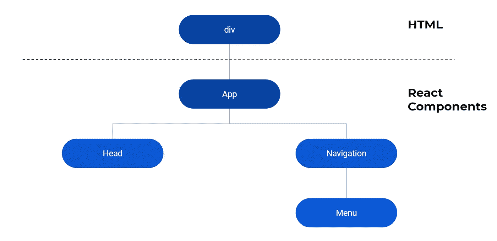

# React 渲染之旅

> 原文：<https://javascript.plainenglish.io/a-journey-through-react-rendering-be174acac5e7?source=collection_archive---------9----------------------->


[@kumpan_electric](https://unsplash.com/@kumpan_electric) unsplash.com

## React 如何在页面上呈现的深入概述

在我们头脑中获得反应模型所必需的理解中，渲染的概念是关键。我们使用 JSX 的语法来设计我们的用户界面，并将其转化为屏幕上的输出，这就是渲染。

现在假设在一个 HTML 文档中有`<div id="root> </div>`。我们可以用它来创建 React 应用程序。

我们称之为根 DOM 节点。事实上，应用程序只在 React 中构建，通常只有一个根 DOM 节点。

从 React 应用程序最简单的构建块开始，我们有了元素，它们是在 JSX 中创建的，可以在页面上呈现。随着复杂性的增加，我们将元素捆绑成一个组件。该组件变得很多，并且这些组件通常包含在一个更大的组件下，我们创造性地称之为“App”。



Relationship between the HTML and React Components

我们用 React 创建的所有东西都在这个“根”DOM 节点中得到管理。在我们进入复杂的兔子洞之前，首先我们应该理解如何在谈论呈现组件之前呈现一个元素。我们将理解 React 管理这个`<div>`元素中的一切是什么意思。

# 呈现元素

所以我们知道，React 必须将 JSX 翻译成最终将出现在屏幕上的东西。我们称之为渲染。React 有一个名为`ReactDOM.render()`的函数，它允许我们将 React 元素作为一个参数，以及我们想要在 HTML 中放置代码的位置。ReactDOM 是一个 React 库，它有许多处理 DOM 的函数。

ReactDOM 方法用在应用程序的顶部。它为代码提供了一种逸出并显示在页面上的方法。它是 React 和 DOM 之间的主要网关。

让我们看看这是如何工作的

```
const element = <h1> Hello World </h1>
ReactDOM.render(element, document.getByElementId('root'))
```

屏幕输出

```
Hello World
```

现在我们应该知道，React 元素是不可变的，它每次只提供潜在用户界面的快照。你可以想象这真的不是一种制作应用程序的方式！

让我们先讨论一下`render()`功能。它需要的参数如下

1.  反应元素
2.  要追加到的选定 DOM 节点
3.  回调函数(可选)

这个选定的 DOM 节点充当所有 react 元素的树结构的根。正是这种结构允许多个组件被视为根 React 元素的子元素。下图显示了这一点。

现在应该说，渲染可以由组件内部发生的事情触发，实际上也只是在屏幕上显示一个静态页面。这种“重新渲染”可能是我们希望在网页上发生的变化，并且这些重新渲染可以多次发生，这就是 React 的妙处。它允许发生许多变化或存储数据以供最终使用，而不会变得复杂。

从 JSX 来到屏幕上。React 呈现一个新的虚拟 DOM，并将其与旧的虚拟 DOM 进行比较。一个叫做 diffing 的过程会计算这些虚拟 DOM 之间的差异。然后将它与实际的 DOM 进行比较，只对 DOM 进行需要的更改。这个过程叫做和解。在本文中，我们不会深入探讨这个问题，只是对渲染所达到的效果有一个高层次的概述。

# 为什么要用 render()？

现在我们知道了它的作用以及我们能从它的使用中得到什么。

**单页应用**

你一定听说过单页应用程序。React 非常适合这种类型的应用程序。我们可以有一个几乎空白的 HTML 页面，在那里我们可以直接将应用程序添加到 div 容器中，就像我们上面解释的那样。React 允许我们多次修改 DOM 上的内容，而不必刷新页面。我们通过在 React 应用程序中多次触发重新呈现来做到这一点，按照我们想要的方式更新页面。这使我们能够在页面上创建动态内容，而不必无缝地刷新它。为了充分理解这一点，我们必须深入研究状态的概念，这里不做探讨！

# 结论

ReactDOM 充当 React、组件树和 DOM 之间的接口。最常见的函数是 render()函数。它充当 React 和 DOM 之间的媒介。

一旦 React 根元素和子组件树被呈现，协调过程就处理与页面更新相关的所有事情。如果我们决定更新其中一个子组件，那么只有该组件内的更改才会发生。

# 其他文章

[](https://medium.com/javascript-in-plain-english/why-you-should-care-about-how-the-browsers-work-in-react-749bcbecc32f) [## 为什么您应该关心浏览器在 React 中的工作方式

### 了解 DOM 与 JavaScript 的关系

medium.com](https://medium.com/javascript-in-plain-english/why-you-should-care-about-how-the-browsers-work-in-react-749bcbecc32f) [](https://medium.com/javascript-in-plain-english/why-do-we-have-to-wrap-react-components-b168232dbd3a) [## 为什么我们必须包装 React 组件？

### 理解 React 应用程序中的 div 包装！

medium.com](https://medium.com/javascript-in-plain-english/why-do-we-have-to-wrap-react-components-b168232dbd3a) [](https://medium.com/javascript-in-plain-english/why-you-should-be-using-react-fragments-a5d8314a59ff) [## 为什么应该使用 React 片段

### 如何使用 React 提升 React 应用程序？碎片

medium.com](https://medium.com/javascript-in-plain-english/why-you-should-be-using-react-fragments-a5d8314a59ff) 

# 关于作者

我是一名执业医师和教育家，也是一名网站开发者。请看[这里](https://dev.to/aaronsm46722627/www.coding-medic.com)关于我在我的博客和其他帖子上关于项目的更多细节。如果你想和我联系，请在这里联系:[aaron . Smith . 07 @ aberdeen . AC . uk](mailto:aaron.smith.07@aberdeen.ac.uk)或者在推特上@aaronsmithdev。