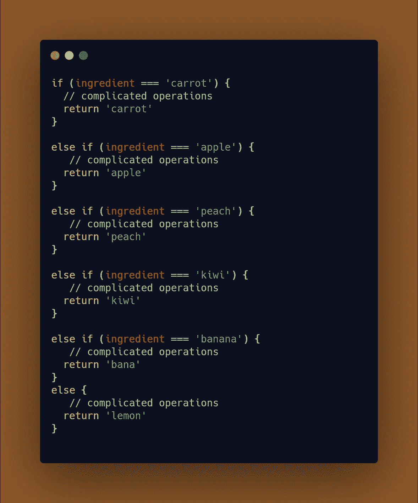
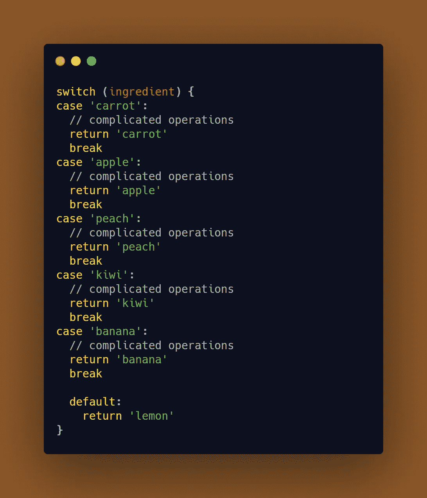
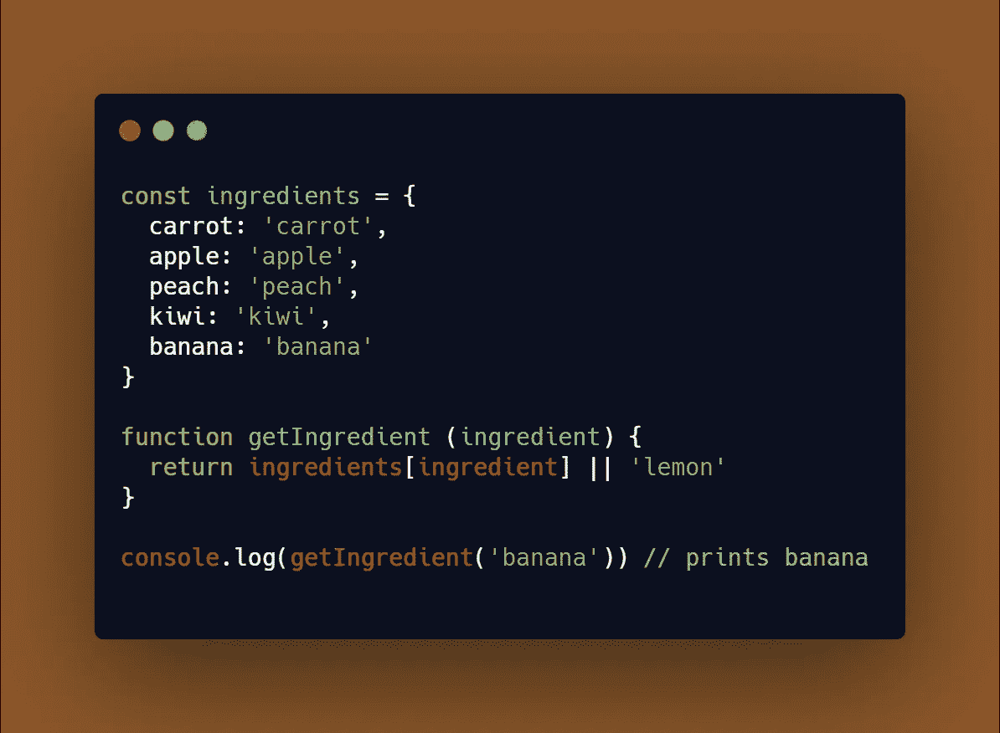
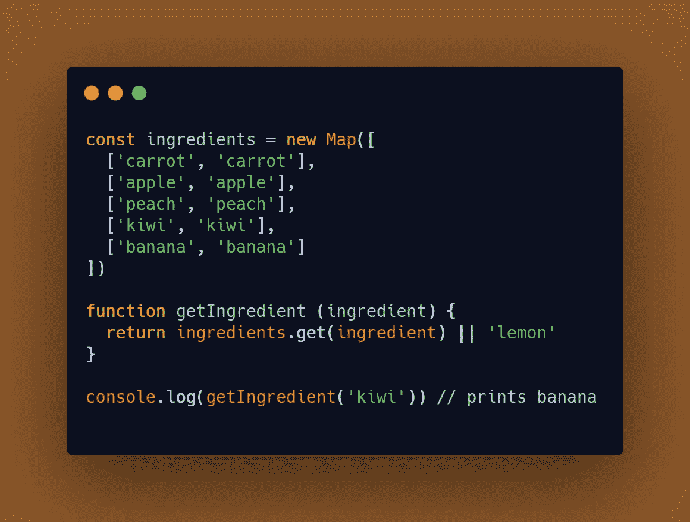

# 一种不为人知的摆脱 Switch 语句的方法

> 原文：<https://javascript.plainenglish.io/a-little-unknown-way-to-get-rid-of-switch-statements-15c2584f51b9?source=collection_archive---------0----------------------->

## 如何善待你的代码

Icons from beautiful [https://icons8.it](https://icons8.it)

像我一样，你可能已经学会在你的源代码中避免大量的`if` *语句*。**它们很难读懂；代码很难理解，一般来说，很难看。**

看一看:

An ugly bunch of conditions

当然，这只是一个从真实应用的上下文中推断出来的例子。想象一下，我们在语句中执行函数调用。或者更多的条件检查。

## 大多数编码人员采用的解决方案是什么？

让我们分析一下提供的例子。将一个表达式与一堆值进行比较，然后在其中一个值为`true`时执行一些代码。你猜对了吗？就用一个`switch`的说法。

An uglier bunch of conditions

我故意留下了`break`，即使因为`return`的陈述，它们在这里是不必要的。

你能找出这个例子的错误吗？

通过这样写，你并没有真正减少代码的冗长。老实说，甚至在复杂性上也没有。你的代码看起来仍然很奇怪，很难管理。也许这样会更容易理解你想做什么。

## 解决方案

我认为你应该非常好奇的是重构过程是如何工作的。为什么这个例子很有启发性。大多数人倾向于以这种方式编写代码:

*   想想问题。
*   实施解决方案草案或原型。
*   写代码。
*   调整它的某些部分，使其看起来、执行起来或工作起来更好。

最后一部分通常被认为是*重构。*这不应该是一个千载难逢的问题。不要在完成后快速重构代码，然后离开文件。

这个过程不是这样的。更像是一个循环。你实现了一些东西。尽量做的好看一点。那就短一点。然后分离代码的关注点。

> **“代码是灵活的。你通过对它进行这种持续的仁慈行为来保持它的灵活性”。**

所以，试着更深入地挖掘你的重构，不要在第一轮就停止。当你在处理一些已经存在的代码时，试着一接触它就让它变得更好。需要循序渐进的小步骤。

让我们以我们条件的最后一幕来结束。为什么不用函数代替`switch`？

A better way to perform multiple conditions

注意我们如何定义`ingredients`对象以避免每次调用`getIngredients.`时都创建它，或者`||`用于管理我们返回`lemon`的默认情况。

更简单、更美观、更易维护。这就是重构做得好可以做到的。根本就不要第一眼就停下来。

请记住，您也可以使用地图:

## 结论

本文的重点不仅仅是向您展示如何改进代码。但是这给重构过程带来了光明。以及为什么我们大多数人都弄错了。我希望这有所帮助！

— *皮耶罗*

## **简明英语笔记**

你知道我们推出了一个 YouTube 频道吗？我们制作的每个视频都旨在教给你一些新的东西。点击此处 查看我们，并确保订阅该频道😎