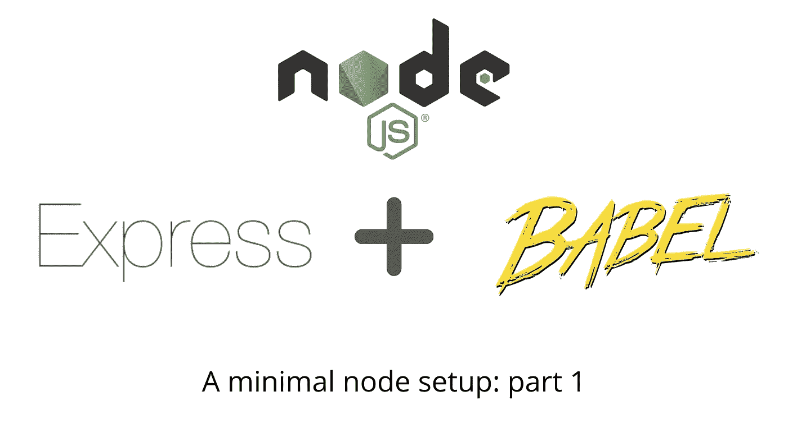

# 一个最小的 Node.js、Express 和 Babel 设置:第 1 部分

> 原文：<https://javascript.plainenglish.io/a-minimal-node-js-express-babel-setup-part-1-6be7b3f3bb55?source=collection_archive---------6----------------------->



让我们设置一个使用 Babel 的基本 Node.js / Express.js API。出于兼容性目的，Babel 将把我们的 ES2015+代码和模块语法“移植”到旧风格的代码中。我将使用一个基本的 Express API 作为例子，通过 Babel 添加绝对导入，并简要讨论我们在 2020 年是否需要 Babel 来设置我们的节点。

[在这个最小设置的第 2 部分](https://neightjones.medium.com/a-minimal-node-js-setup-part-2-eslint-prettier-vs-code-7963768dbb30)，我将添加 eslint 和 prettier 的设置，并向您展示如何让它们很好地一起玩。然后我们将更新 VS 代码中的一些设置来完成这个过程。

最终存储库可在此处找到:

[](https://github.com/neightjones/node-babel-template) [## 邻居/节点巴别塔模板

### 该模板使用 babel 创建了一个基本的 Node.js / Express.js API。它还为 eslint 和…设置了很好的默认值

github.com](https://github.com/neightjones/node-babel-template) 

# 1.节点版本和快速框架

首先，让我们关心一下我们的节点版本。我喜欢使用 nvm 来管理不同项目中的节点版本。[请遵循他们提供的安装说明](https://github.com/nvm-sh/nvm#installing-and-updating)。

我们将在[nodejs.org](https://nodejs.org/en/)使用“当前”版本，也就是在撰写本文时的`15.4.0`。运行这两个命令:

```
nvm install 15.4.0
nvm alias default 15.4.0
```

这将把节点版本`15.4.0`安装到我们机器上的 nvm 版本列表中(运行`nvm ls`查看你有哪些版本)。我们将很快再介绍一个 nvm 配置，但是让我们继续看代码。

为了让我们的代码开始运行，我们将使用[Express application generator](https://expressjs.com/en/starter/generator.html)创建一个新项目(在我的新 repo `node-babel-template`中运行):

```
npx express-generator .
```

这个工具为我们生成了一个超级简单的 Express API(`bin/www`是入口文件，`app.js`设置 Express 应用程序，`routes`目录中有几个简单的路线处理程序)。

我们如何指定我们的项目要使用哪个节点版本呢？

1.  在项目的根目录下创建一个名为`.nvmrc`的文件，并将`15.4.0`放入该文件中。在终端的项目根目录中，键入`nvm use` —该命令告诉 nvm 查找`.nvmrc`文件并使用指定的版本
2.  在您的`package.json`中，添加一个名为`engines`的部分，如下所示:

`package.json`的这一部分指定了构建工具和代码在指定版本上工作的其他工具。您还可以指定一些更通用的东西，比如“至少节点 15”，但这目前有效。

在我们开始进行更改之前，让我们确保事情按预期进行。运行初始的`npm install`来安装包，然后运行 Express generator 放在我们的`package.json`中的已经定义好的`npm start`脚本。服务器应该在监听(默认情况下在端口 3000 上)，生成器为我们创建了一条“回家”路线`[http://localhost:3000](http://localhost:3000)`——在浏览器中访问它，您应该会看到快速欢迎消息。

让我们做几个快速的更改来简化接下来的步骤——在我们的项目的根目录下创建一个`src`目录，并将这些内容移动到其中:`bin`、`public`、`routes`、`views`和`app.js` …这将破坏当前的`npm start`脚本，但我们还是要替换它。其次，将文件`www`(在`src/bin`中)改为`[www.js](http://www.js.)`。

现在让我们开始把这变成一个巴别塔项目。

# 2.基本巴别塔设置

```
npm install --save-dev [@babel/core](http://twitter.com/babel/core) [@babel/cli](http://twitter.com/babel/cli) [@babel/preset-env](http://twitter.com/babel/preset-env) [@babel/node](http://twitter.com/babel/node)
```

*   `@babel/core`给了我们 B [abel 核心编译器](https://babeljs.io/docs/en/usage#core-library)
*   `@babel/cli`给了我们[命令行工具](https://babeljs.io/docs/en/usage#cli-tool)
*   `@babel/preset-env`是[官方预置](https://babeljs.io/docs/en/presets#official-presets)之一，可通过巴别塔获得。什么是预设？Babel 通过一系列插件工作，每个插件都定义了 Babel 应用于代码的转换。你可以在没有任何插件的情况下运行 Babel，在这种情况下，它会吐出和你开始时完全一样的代码。假设你找到了[这个插件—*@ Babel/plugin-transform-arrow-functions*](https://babeljs.io/docs/en/babel-plugin-transform-arrow-functions)*，并在你的 Babel config 中设置它。这很好，因为现在你可以使用 es6 arrow 函数语法，Babel 会把它转换回普通的`function`语法。但是—您不希望为 es6 及更高版本管理所有这些规则！幸运的是，Babel presets 包含了许多这样的规则——*Babel preset-env*将为您提供使用最新最好的语法所需的一切*
*   *`@babel/node`的工作方式[就像节点 cli 本身](https://babeljs.io/docs/en/babel-node)一样，但是当然也运行巴别塔进程。因此，不用运行`node index.js`来运行节点流程，您可以使用`babel-node index.js`(在开发中…在生产中，您将通过 Babel 构建 transpiled 代码并运行普通的节点流程…您很快就会在我们的`package.json`脚本中看到)*

*我们很快就会回到`package.json`，但是首先让我们制作一个简单的 B [abel 配置文件](https://babeljs.io/docs/en/config-files)，当它运行时，Babel 将会识别并相应地采取行动。在项目的根级别创建一个名为`.babelrc.json`的新文件，并赋予它以下内容:*

*随着我们的核心 Babel 包的安装和`.babelrc.json`的设置，让我们更新我们的 npm 脚本。在`package.json`的`scripts`部分，删除 Express generator 为我们制作的`start`命令，并添加以下新命令:*

*scripts section of package.json so far*

*看着每一个人:*

*   *`dev` —使用我们安装的`@babel/node`包，这是进行本地开发的简单方法。就像使用`node`，但是为我们处理巴别塔翻译*
*   *`clean`—`build`命令(next)将巴别塔构建的结果输出到一个`dist`文件夹中……这只是删除了构建的目录，这样我们每次都可以重新开始*
*   *`build` —在我们的源文件上运行`babel`过程，这样我们就有一个`dist`目录，其中包含我们传输的代码，可以在生产中正常运行`node`*
*   *`prod` —假设我们已经用`build`命令构建了我们的代码，现在我们可以用`node`运行它*

*测试我们的新脚本*

*`dev`:作为健全性检查，我们应该能够立即使用我们的`dev`命令。我们还没有任何需要转换的代码，因为 Express generator 生成的代码不使用 ES2015+语法，不过没关系……我们还是*可以*使用`babel-node`来运行我们所拥有的。*

*运行`npm run dev`，一切都应该像以前一样工作。*

*让我们确保可以用巴别塔来构建我们的代码。运行`npm run build`,你会看到一个`dist`目录，它是用 transpile 文件创建的(当然，我们还没有多少要 trans pile 的)。*

*`prod`:最后`npm run prod`将使用普通的`node`来运行位于`dist`目录中的入口文件——运行它，看看你仍然可以在你的浏览器中访问`localhost:3000`。*

***又一个与巴别塔相关的项目…***

*我们设置了上面的构建过程，以利用 Babel 及其`preset-env`将 ES2015+代码(我们将很快编写)的语法转换回旧样式的语法，以便它可以在更多环境中运行。转换语法的一个例子是将箭头函数`const x = () => {}`转换成普通函数`function x() {}`。然而, **polyfill** 的概念略有不同……poly fill 是一段代码，它实际上使用了该语言的旧目标版本的原语来**添加该语言的**功能，因此它与我们的新代码兼容。比如我们在 web 开发中经常用到的`fetch`调用。没有将语法从 ES2015+ fetch 转换到旧版本的概念，而是编写了一个 polyfill 来**添加**一个兼容的 fetch 调用。这篇文章在更深入的解释方面做得很好。*

*那么，为了我们的目的，我们如何确保正确的东西是为我们填充的呢？[这个巴别塔文档](https://babeljs.io/docs/en/usage#polyfill)告诉我们`@babel/polyfill`已经被弃用，取而代之的是直接使用它的两个主要组成库:`core-js`和`regenerator-runtime`。让我们安装这两个:*

```
*npm install --save core-js regenerator-runtime*
```

*然后，正如他们在巴别塔文档中建议的那样，将这些作为前两行添加到`src/bin/www`(在`#!/user/bin/env node`之后):*

```
*import 'core-js/stable';
import 'regenerator-runtime/runtime';*
```

*您应该仍然能够运行`npm run dev`并在浏览器中访问您的页面。事实上，我们刚刚介绍了我们的第一个 ES2015+代码(ES 模块导入语法)！由于我们的代码仍然工作，这意味着我们的`dev`脚本中的`babel-node`工作正常。如果您将该脚本更改为`node ./src/bin/www.js`，它将会失败并说*“不能在模块外使用导入语句”，*因此我们知道 Babel(与`preset-env`结合)正在完成它的工作。*

*接下来，我们将更新我们的 Express generator 代码以使用现代语法。*

# *3.将代码更新为现代语法*

*请记住，所有代码都可以在顶部链接的 repo 中找到，但这里是我们将在样板文件中进行的主要更新:*

1.  *转换成 ES 模块(`export`、`export default`和`import`语法，而不是常见的 JS `module.exports`和`require`语法)*
2.  *切换到`const`变量(块范围的)而不是`var`变量*
3.  *使用箭头功能*

*我们从 Express generator 开始的结果文件现在看起来像这样:*

*Updated [www.js](http://www.js) file*

*updated app.js file*

*updated routes/index.js file*

*updated routes/users.js file*

*重新运行`npm run dev`，你会发现一切仍然完美运行。同样，我们让所有这些新语法贯穿于`babel-node`，使用`preset-env`，已经触发了我们需要的所有转换。*

*怎么能像预期的那样进行复查呢？让我们测试一下我们的`build`命令，现在我们依靠 Babel 来传输我们的代码。运行`npm run build`并打开`dist/routes/index.js`——这是我们上面更新的传输索引路径文件。它看起来会像这样:*

*Babel-transpiled routes/index.js file (now in dist)*

*这里有很多，但是基于我们的语法更新，请注意两点:*

*   *自从我们切换到 ES 模块风格`export default router`，一堆 transpiled 代码负责使其与旧环境兼容*
*   *在第 16 行，我们可以看到我们创建的箭头函数被切换回了一个普通的函数声明*

*我们都准备好了巴别塔管道！我们可以用 ES2015+语法编写任何代码，包括在`preset-env`中，并且知道它会被正确编译。`npm run prod`可以成功地使用普通的`node`来运行你内置的`dist`代码。*

# *额外收获:绝对进口*

*我总是喜欢从一开始就设置绝对进口。你曾经像`../../../directoryX/thing`一样在你的代码中写导入吗？使用绝对导入，我们可以为我们想要的任何目录创建名称，并在“绝对”意义上使用这些名称——之前的路径可以简化为例如`directoryX/thing`(注意没有前导点或斜线)。使用 Babel 插件很容易做到这一点。*

*让我们用以下代码安装插件:*

```
*npm install --save-dev babel-plugin-module-resolver*
```

*[点击这里查看巴别插件模块解析器](https://www.npmjs.com/package/babel-plugin-module-resolver)。正如它所说的，它允许你添加包含你的模块的新的“根”目录。设置很好也很简单。*

*首先，将你的`.babelrc.json`更新成这样:*

*你会看到我们添加了一个新的`plugins`部分，在这里我们使用了新的插件。最重要的是，看到`alias`对象。在这里，我们可以在整个代码的 import 语句中使用我们想要的别名。作为一个例子，您可以看到`#routes`现在是我们在`src`下的`routes`目录的别名。`#`字符不是必需的，但是我见过其他人使用它作为一种简单的方法，在你的代码中看到你正在使用一个定制的别名。*

*使用我们的新别名，回到您的`src/app.js`文件。对于我们的`routes`，这里有两个导入:*

```
*import indexRouter from './routes/index';
import usersRouter from './routes/users';*
```

*这些导入非常简单，所以您不一定需要/想要在这里使用别名，但是我们还是在示例中使用别名。现在它们看起来像这样(注意没有前导点或斜杠):*

```
*import indexRouter from '#routes/index';
import usersRouter from '#routes/users';*
```

*重启你的节点服务器，一切都会像以前一样。请注意，这只是一个开发依赖——当您运行`npm run build`并查看`dist/app.js`时，您会看到 Babel 将那些绝对导入改回了相对 require 语句。*

# *最后一个想法——2020 年你需要巴别塔吗？*

*在我看来，在这一点上是否值得使用带有 Node 的巴别塔设置是一个艰难的决定。[看看这个网站](https://node.green/)，它追踪了 Node 的各种版本的语言特性(本文使用的是 15.4.0)。*

*ES 模块呢？[从节点 13.2.0 开始，ES 模块已经可用，没有任何实验标志。](https://nodejs.medium.com/announcing-core-node-js-support-for-ecmascript-modules-c5d6dc29b663)这意味着如果您将`type: "module"`添加到您的`package.json`文件中(或者使用`.mjs`文件扩展名)，您现在可以在节点中使用`import` / `export`模块语法。但是，有几个小问题需要注意:*

*   *[正如 LogRocket 提到的](https://blog.logrocket.com/es-modules-in-node-today/)(截止到 2020 年 3 月)*“ES 模块仍被标记为实验性的，因为该功能尚未完全为生产环境做好准备，”*他们还注意到 ES 模块和 CommonJS 模块之间的一些兼容性问题(后者在 Babel 中不是问题，它会转换回 CommonJS 模块)*
*   *[在 Node 的文档这里](https://nodejs.org/api/esm.html#esm_differences_between_es_modules_and_commonjs)，你可以看到更多关于 es 模块细微之处的注释。例如，你需要包含文件扩展名，`__dirname`超出范围，JSON 文件导入改变等。*

*更普遍的是，在[那些相同的文件](https://nodejs.org/api/esm.html)，你可以看到一些作品仍然是实验性的。尽管如此，支持似乎主要在这里。*

*那么，您需要为您的节点设置而烦恼 Babel 吗？我认为在这一点上任何一个决定都是好的。就我个人而言，目前我更倾向于坚持使用本文中的 Babel 工作流，但也许在未来的几个月里会有所改变。*

1.  *我想坚持使用我习惯的导入语法(特别是这样我就可以在例如 Create React App 应用程序中使用相同的语法)*
2.  *我喜欢巴别塔插件生态系统——我可以继续使用像上面我们看到的`babel-plugin-module-resolver`这样的插件。插件让这一切变得非常灵活*
3.  *Node / Babel 工作流在这一点上已经相当成熟，所以你可以在网上找到大量的资源和问答*

*请看下面这个系列的第 2 部分，我们在项目中配置了 ESlint & Prettier 来帮助语法和样式:*

*[](https://neightjones.medium.com/a-minimal-node-js-setup-part-2-eslint-prettier-vs-code-7963768dbb30) [## 最简单的 Node.js 设置第 2 部分:ESlint、Prettier 和 VS 代码

### 这是我关于使用 Babel 建立一个最小的 Node.js & Express 项目的系列文章的第 2/2 部分。点击此处查看第 1 部分:

neightjones.medium.com](https://neightjones.medium.com/a-minimal-node-js-setup-part-2-eslint-prettier-vs-code-7963768dbb30)*