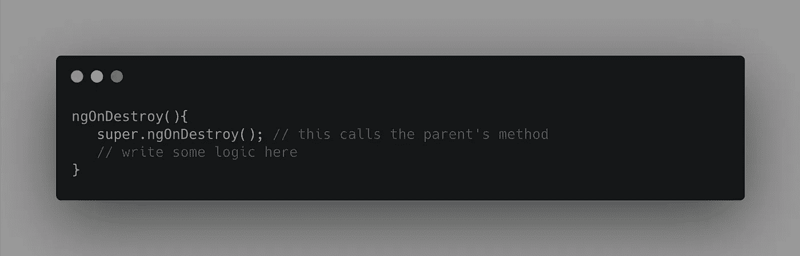

# 对角度生命周期方法的误解

> 原文：<https://javascript.plainenglish.io/a-misconception-about-angular-life-cycle-methods-346f1be73d7?source=collection_archive---------1----------------------->

Photo by [Robert Ruggiero](https://unsplash.com/@robert2301?utm_source=unsplash&utm_medium=referral&utm_content=creditCopyText) on [Unsplash](/s/photos/confusion?utm_source=unsplash&utm_medium=referral&utm_content=creditCopyText)

解释当一个组件类扩展另一个组件类时，如何调用生命周期方法。

继承是重用代码的最佳方式之一。通过继承，我们可以将常见的方法、属性转移到一个新的类中，只要扩展它，这个类就可以在任意数量的实例中重用。

# 角度分量的继承:

组件类只是带有装饰器的类。装饰者提供元数据，Angular 使用这些元数据来构建组件实例，并在运行时通过依赖注入将请求的服务注入到构造函数中。那么，我们可以从一个组件类扩展另一个组件类吗？是的，但是有一些问题我们现在要讨论一下。

# 角度编译和变化检测过程的一些背景:

让我们后退一步，理解 Angular 组件是如何编译的，以及如何在运行时调用组件的生命周期方法。

考虑这个简单的应用程序。它有一个根组件`AppComponent`，并在`AppModule`中配置用于引导进程。
在 app 组件模板中，我们增加了子组件元素选择器`<app-child></app-child>`。

Example

谈到子组件实现，它有一个模板和一个样式表。这个子组件扩展了另一个组件`ParentComponent`，和其他组件一样，它有自己的模板和`@Component` 装饰器。如果我们现在运行我们的应用程序，引导过程在`main.ts`文件中启动，它从创建平台、提供者开始，然后从根组件`AppComponent`开始实例化组件。由于我们在`AppComponent`中有了子组件选择器，angular 将为`ChildComponent`创建一个实例，并将其保存在`LView`中——这是 angular 组件的内部表示，用于更新 DOM、运行变更检测和执行生命周期方法等。

现在，我们知道 Angular 没有为`ParentComponent`创建任何实例，因为这个组件不属于任何组件。所以，现在的问题是 Angular 在`ParentComponent`中调用生命周期方法了吗？

答案是**否**。为什么？因为生命周期方法的执行是由 Angular 处理的，它使用`LView`来完成。由于父组件不是视图的一部分，该组件中的生命周期方法不会被执行，但是`ChildComponent`方法会像我们期望的那样作为角度变化检测周期的一部分被执行。

因此，当一个组件扩展另一个组件类时，就像扩展一个没有任何元数据的类一样，这些类上方法的执行与原型继承的工作方式相同。

**继承中的方法执行:**

1.  `ChildComponent`和`ParentComponent`都有方法`ngOnInit`
    的实现→在这种情况下，`Childcomponent` 上的`ngOnInit`方法被执行。
2.  只有`ParentComponent`实现了`ngOnInit` →在这种情况下，来自`ParentComponent`的`ngOnInit`方法被执行
3.  只有`ChildComponent`有`ngOnInit` 的实现→在这种情况下，来自`ChildComponent`的`ngOnInit`方法被执行

Logging `this` of child component

# 如何确保两个组件的生命周期方法都被调用？

在扩展和扩展组件实现相同方法的情况下，我们可以使用`super`从扩展组件的方法中调用父组件的方法。这里有一个简单的例子。

Calling parent’s life-cycle method from child component

# 结论:

Angular 不会调用扩展类组件上的生命周期方法。简单地说，从另一个组件类扩展一个组件类与扩展一个普通的 JavaScript 类完全一样。

希望这对你有用。感谢阅读！关注我的新文章。

## **简单英语的 JavaScript**

你知道我们有四份出版物和一个 YouTube 频道吗？在[**plain English . io**](https://plainenglish.io/)和 [**找到它们订阅我们的 YouTube 频道**](https://www.youtube.com/channel/UCtipWUghju290NWcn8jhyAw) **！**