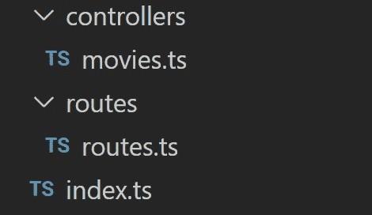

# Node.js 开发人员 Deno 指南

> 原文：<https://javascript.plainenglish.io/a-nodejs-developers-guide-to-deno-562804a58a2f?source=collection_archive---------8----------------------->

## Deno 炒作已经不可逾越，破坏 node.js 社区的安宁显然是可以理解的。

Node.js 的创始人 yan Dahl 为 JavaScript 和类型脚本开发了一个新的运行时，名为 [Deno](https://deno.land/) 。鉴于它的预览版刚刚在 2020 年 5 月 12 日发布，它的社区已经在相当数量上增长。Deno 在一个可执行文件中完成运行时和包管理器的功能看起来很吸引人。它与 Node.js 形成对比，node . js 具有现成的 TypeScript 支持，并且在默认情况下是安全的。

我很难观看 Ryan Dahl 在 JSConf EU 2018 中发表的“[Node.js 的 10 件令我后悔的事情](https://www.youtube.com/watch?v=M3BM9TB-8yA&t=56s)”，因为他暗示 Deno 在几个方面比 node . js 更好。我已经是 Node.js 的粉丝很多年了，我有理由相信 Node.js 不会很快去任何地方。尽管如此，我还是决定给德诺一个机会。

在短短时间内就有 68，000 多名 GitHub 明星，Deno 炒作已经变得不可逾越，破坏 Node.js 社区的和平显然是可以理解的。


本文旨在从 node.js 开发人员的角度深入探讨这个问题。我将第一次使用 Deno，我希望它不会让我失望。我会写下一路上我所做的和学到的一切。我们将在 Deno 中构建一个简单但完整的 CRUD REST API 服务器。我将写在打字稿，并会在最后提供项目 Github 回购。

# 安装和基本命令

我刚刚上了这个 Deno 官方网站[链接](https://deno.land/manual/getting_started/installation)，在我的系统上安装了 Deno。我在 windows 上，因此我在 PowerShell 中运行了以下命令:

```
iwr https://deno.land/x/install/install.ps1 -useb | iex
```

出于好奇，我在安装结束后从命令行中的命令 deno 开始。Deno REPL(Read Eval Print Loop)开始，如果你以前有过 Nodejs 的经验，你可能会很熟悉。你可以在这里运行标准的 JavaScript。

正如我所料，以下命令返回了可用命令的可用列表:

```
 deno --help
```

# **运行代码:**

首先，我试着运行他们官方网站上的一个示例代码。

```
deno run [https://deno.land/std/examples/welcome.ts](https://deno.land/std/examples/welcome.ts)
```

它正如我所预料的那样起作用了。


我只是在我的系统上本地尝试了一下，用下面的代码创建了一个简单的 index.ts 文件:

```
console.log(“Deno the Dinasaur”)
```

您应该运行以下命令来执行该文件

```
deno run index.ts
```

# **现在让我们写一些真正的代码**

> 我们将使用标准的 HTTP 库在 Deno 中制作一个简单的 web 服务器。

我刚发现 Deno 是用去中心化的包工作的，不像 Node.js. Package.json 和 node_modules 一直是我们的好朋友，在 Node 这里没有入口。deno 好像会直接从一个 URL 下载包，加载时缓存在磁盘上。

*现在让我们用 Deno 构建一个简单的 web 服务器。*


我刚刚完成了我的第一个 deno web 服务器的编写。

我首先从[标准库](https://deno.land/std)中的 HTTP 模块导入 serve 来创建一个没有任何第三方库的服务器。

```
import { serve } from “https://deno.land/std/http/server.ts";
```

然后，我在端口 8000 上使用 serve 创建了一个服务器对象

```
const server = serve({ port: 8000 });
```

我使用 utf-8 文本编码，这是使用 TextEncoder.encode()方法在网页中表示 Unicode 文本的最广泛使用的方法。

```
const body = new TextEncoder().encode(“Deno is definitely impressive\n”);
```

令人惊讶的是，我发现 Deno 支持第一个类 await，所以我们可以在 async 函数之外自由使用 await。我使用了语句的*for await…来处理异步/同步迭代，如下所示:*

```
for await (const req of server) {req.respond({ body });}
```

服务器的 index.ts 文件的完整代码如下所示

```
import { serve } from “https://deno.land/std/http/server.ts";const server = serve({ port: 8000 });const body = new TextEncoder().encode(“Deno is definitely impressive\n”);for await (const req of server) {req.respond({ body });}
```

现在让我们运行代码:

```
deno run index.ts
```

哦，我弄错了。等一下。


我想大多数人在运行代码的时候都会出错。唷！！代码没有问题。发生这种情况是因为 Deno 在默认情况下是安全的，我们需要显式地授予访问权限来执行系统操作。

在这个命令的帮助下，我们可以看到我们的系统正在运行:

```
deno run --allow-net index.ts
```

# **框架**

> 我对 deno 的可用框架做了一些研究。Oak 框架似乎在这里很受欢迎，就像我们对 node.js 使用的 express 一样。

橡树是一种阔叶树。它们是众所周知的温带顶极植物……*哦，等一下！这是不同的橡树。抱歉浪费了你三秒钟的时间。现在，让我通过直接编写初始化应用程序的代码来掩盖这一时间。*

```
*import { Application } from “https://deno.land/x/oak/mod.ts";const port = 8000;const app = new Application();console.log(`server is running at ${port}`)await app.listen({ port });*
```

*为什么看起来像快递？为什么代码不起作用？是的，我能读懂你的大部分想法。*

*这段代码在 Node 中运行良好，但是抛出了一个错误，指出“没有中间件来处理请求”。所以，我想我需要用中间件添加路由来处理对我们服务器的请求。再次提醒你，await 是在没有 async 的情况下使用的，因为动作是异步的，deno 似乎支持 [**顶级 await**](https://v8.dev/features/top-level-await) **。***

# *路线和中间件*

*所以首先我会从 Oak 导入一个路由器，然后在应用程序中使用路由。*

**

*这是我新的启用路由器的 index.ts 文件:*

```
*import { Application, Router } from “https://deno.land/x/oak/mod.ts";const port = 8000;const app = new Application();const router = new Router();app.use(router.routes());app.use(router.allowedMethods());console.log(`Open: [http://localhost:${port}/api/movies`)](http://localhost:${port}/api/movies`))router.get(‘/api/movies’, ({response}: {response: any}) => {response.body = ‘This is my movie list’;});await app.listen({ port });*
```

*在上面的代码中，我们已经使用 **app.use()** 初始化了我们的**中间件**，以使用我们的**路由器**。*

***router.allowedMethods()** 允许中间件**使用所有 HTTP 方法**。另一方面， **router.get** 将一个箭头函数作为第二个参数，第二个参数又将一个**对象**作为参数，通常称为**上下文**。*

*I **析构**那个对象为{response},只取那个对象的**响应部分**。我指定了“any”类型，因为我们一直在使用 Typescript。在方法内部，提供了一个随机响应体。*

*现在，我们可以向*localhost:8000/API/movies*发送请求，以接收“这是我的电影列表”的响应*

*现在我们已经构建了最简单的服务器，我将按照惯例重构文件夹结构。它将如下*

**

*Project Structure*

*以下是**每个**单独**文件**的单独代码:*

**控制器/movies.ts**

```
*const getMovies = ({response}: {response: any}) => {response.body = “This is my movie list.”;}export { getMovies }*
```

*routes/routes.ts*

```
*import { Router } from “https://deno.land/x/oak/mod.ts";import { getMovies } from ‘../controllers/movies.ts’;const router = new Router();router.get(‘/api/movies’, getMovies);export default router;*
```

*index.ts*

```
*import { Application } from “https://deno.land/x/oak/mod.ts";import router from ‘./routes/routes.ts’;const port = 8000;const app = new Application();app.use(router.routes());app.use(router.allowedMethods());console.log(`Open: [http://localhost:${port}/api/movies`)](http://localhost:${port}/api/movies`))await app.listen({ port });*
```

*现在，所有主要的服务器文件、路由和路由处理程序都已经被分离出来，并进行适当的结构化。*

# ***在项目中做一些随机的改变***

*我刚刚完成为电影添加一点模拟数据，现在是一个硬编码的 JSON 对象。我在根目录中添加了一个名为 **types.ts 的新文件，并导出了一个简单的 **IMovies 接口**，我们将在 movies.ts 中使用它***

*types.ts*

```
*export interface IMovies {id: string;name: string;genre: string;}*
```

*现在我的 controllers/movies.ts 看起来如下:*

```
*import { IMovies } from “../types.ts”;let movies: IMovies[] = [{id: ‘1’,name: “Inception”,genre: “mystery”},{id: ‘2’,name: “The Dark Knight”,genre: “fiction”},{id: ‘3’,name: “IO”,genre: “sci-fi”},]const getMovies = ({response}: {response: any}) => {response.body = {success: true,data: movies};}export { getMovies }*
```

*我之前回了一条短信“这是我的电影列表”。现在 JSON 对象返回了两个属性:success 和 data，其中保存了我们的 movies 数组的值。*

*现在我们可以向位于 **api/movies** 的 URL 发出 GET 请求，以获取电影 JSON。我计划添加一条路线来获得电影的具体细节。我们需要的是从 **/api/movies/:id** 定义另一条路径。我很快就会回来。*

**

*好吧，没那么久。我更新后的 movies.ts 文件如下所示:*

```
*import { IMovies } from “../types.ts”;let movies: IMovies[] = [{id: ‘1’,name: “Inception”,genre: “mystery”},{id: ‘2’,name: “The Dark Knight”,genre: “fiction”},{id: ‘3’,name: “IO”,genre: “sci-fi”},]const getMovies = ({response}: {response: any}) => {response.body = {success: true,data: movies};}const getMovie = ({ params, response }: { params: { id: string }, response: any}) => {const movie: IMovies | undefined = movies.find(m => m.id === params.id);if(movie) {response.status = 200;response.body = {success: true,data: movie}} else {response.status = 404;response.body = {success: false,message: “No movies found”}}}export { getMovies, getMovie }*
```

*在这里，**与之前的代码相比唯一的区别**是**的 getMovie 函数**。它需要两个参数和响应。参数**保存路由 URL 参数**。*

*现在，您可以在 **/api/movie/1** 发出 GET 请求(我使用了 POSTMAN ),这可能是您将看到的内容:*

```
*{“success”: true,“data”: {id: ‘1’,name: “Inception”,genre: “mystery”}}*
```

> *让我们快速尝试将数据发送到服务器。*

*所以，首先我在 movies.ts 中增加了一个新的函数 addMovie，它需要两个参数:请求和响应。*

```
*import { v4 } from “https://deno.land/std/uuid/mod.ts";………const addMovie = async ({ request, response }: { request: any, response: any}) => {const body = await request.body()if(!request.hasBody) {response.status = 404;response.body = {success: false,message: “No data received”}} else {const movie: IMovies = body.value;movie.id = v4.generate();movies.push(movie);response.status = 201;response.body = {success: true,data: movie}}}*
```

*如果你还记得上一次，我**没有**使用 **async with await** ，你可能会困惑为什么这次我使用了它。正如我前面提到的，await 只能在 Deno 模块的顶层的使用**，否则，需要在异步函数中使用。***

*接下来，我们检查**是否使用 request.hasBody 传递了**电影细节。*

*我们正在从 **uuid** 包中**导入 v4** ，以便**为每部电影生成一个唯一的 id** 。*

*最后，我们在 route.ts 中使用 **route.post** 来**创建**一个 post 端点。*

**route.ts**

```
*import { Router } from “https://deno.land/x/oak/mod.ts";import { getMovies, getMovie, addMovie } from ‘../controllers/movies.ts’;const router = new Router();router.get(‘/api/movies’, getMovies).get(‘/api/movies/:id’, getMovie).post(‘/api/movie’, addMovie )export default router;*
```

*当您尝试向我们的新路由发送一个空 POST 请求时，您可能会看到如下内容:*

```
*{“success”: false,“message”: “No data received”}*
```

*您可以尝试将 POST 请求发送到相同的路由，但其正文类似于以下内容:*

```
*{“name”: “yourmoviename”,“genre”: “genreofyourmovie”}*
```

*您将得到以下响应:*

```
*{“success”: true,“data”: {“name”: “yourmoviename”,“genre”: “genreofyourmovie”“id”: “randomlygenerated12–4213123fsd_312”}}*
```

***为了验证**它已经被添加，您可以再次**向/api/movies 发送一个 GET** 请求*

*既然我们已经使用了 **POST** 和 **GET** ，那么让我们也为 **DEL** (删除)和 **PUT** (更新)快速构建两条路径。*

**

*因此，创建一个**更新函数**的主要概念是给它一个 **get** 以及 **post 的特性，因此**会有一段较长的代码:*

```
*const updateMovie = async ({ params, request, response}: { params: { id: string}, request: any, response: any}) => {const movie: IMovies | undefined = movies.find(b => b.id === params.id);if(movie) {const body = await request.body()const updateData: { name?: string; genre?: string; } = body.value;movies = movies.map(m => m.id === params.id ? {...m, ...updateData} : m);response.status = 200;response.body = {success: true,data: movies}} else {response.status = 404;response.body = {success: false,message: “No data received”}}}*
```

***首先**，我们**通过检查是否存在任何具有该 id 的电影来请求更新电影**的 id** 。如果**是**，我们使用 request.body()，**destruct**它来获取**唯一名称和流派**，最后**将**它存储在一个 **updateData** 变量中。***

*您可能会注意到分号前面的**问号**，我保留了这个问号，因为用户**可能会**选择**只更新请求体的单个属性**或这些属性的任意组合。*

*最后，我们**通过 **movies 数组**映射**，并使用 spread 操作符更新 id 与 params.id 匹配的电影。最后，我们**向**发送一个状态码 200 以及**更新后的数组**。*

*在运行文件之前，不要忘记在 routes.ts 中添加 **PUT route** ，如下所示:*

```
*//routes.tsimport { Router } from “https://deno.land/x/oak/mod.ts";import { getMovies, getMovie, addMovie, updateMovie} from ‘../controllers/movies.ts’;const router = new Router();router.get(‘/api/movies’, getMovies).get(‘/api/movies/:id’, getMovie).post(‘/api/movie’, addMovie).put(‘/api/movies/:id’, updateMovie)export default router;*
```

*现在，您可以通过向 URL /api/movies/1 和以下主体发送 PUT 请求来测试它:*

```
*{ “name”: “home alone” }*
```

*在响应中，您可以看到 id 为 1 的电影更新了您的姓名。*

> *请注意，数据没有保存在数据库中，如果我们重新启动服务器，这些数据将被删除。*

*现在，**最后的任务**是**删除**一部特定的电影。*

*所有之前的代码都是一样的，你只需要**添加一个新的**函数**删除电影**并在以后给它分配合适的路线。*

```
*const deleteMovie = ({ params, response}: { params: { id: string}, response: any}) => {const movie: IMovies | undefined = movies.find(m => m.id === params.id);if(movie) {movies = movies.filter(m => m.id !== params.id);response.status = 200;response.body = {success: true,message: “Selected movie is removed”,data: movies}} else {response.status = 404;response.body = {success: false,message: “No movie found”}}}*
```

*这里，您可以注意到只有参数和响应，没有请求属性，因为我们不会使用请求体。*

*这种方法类似于前面的代码，我们首先通过电影的列表**来过滤**，以检查是否有任何电影的 id 与 params.id 的 id 相匹配。*

*这是您最后一次看到我们的 routes.ts 文件:*

```
*import { Router } from “https://deno.land/x/oak/mod.ts";import { getMovies, getMovie, addMovie, updateMovie, deleteMovie} from ‘../controllers/movies.ts’;const router = new Router();router.get(‘/api/movies’, getMovies).get(‘/api/movies/:id’, getMovie).post(‘/api/movie’, addMovie).put(‘/api/movies/:id’, updateMovie).delete(‘/api/movies/:id’, deleteMovie)export default router;*
```

*现在，如果您尝试向 **/api/movies/1** 发送一个**删除**请求，您将会看到 id 为**1 的电影被从电影列表中删除**。*

*所以，我们已经成功地用 Deno 和 Oak 创建了一个简单的 CRUD REST API。我刚刚发现 Oak 最初是受 Koa 框架(Node.js)的启发，这可能是我觉得开发体验如此熟悉的另一个原因。*

*因此，与 Node.js 相比，它有许多细微的差异。运行时架构及其处理模块和库的方式似乎与 Node.js 形成了对比，但对于以前有 node.js 经验的人来说，这种体验会非常友好。但是说实话，Deno 看起来更安全、更轻量级，并且在这里设置模块和库似乎要快得多。因此，我称它为兄弟，而不是 node.js 的替代品。它似乎克服了 node.js 的一些缺点，但从编码的角度来看仍然是相似的，不像其他同类产品。在我未来的博客中，我会试着挖掘更多关于 Deno 世界的东西。*

*项目回购的链接是:[https://github.com/kaylinkhanal/denoroad](https://github.com/kaylinkhanal/denoroad)*

*编码快乐！*

*喜欢这篇文章吗？如果是这样，通过 [**订阅获取更多类似内容解码，我们的 YouTube 频道**](https://www.youtube.com/channel/UCtipWUghju290NWcn8jhyAw) **！***