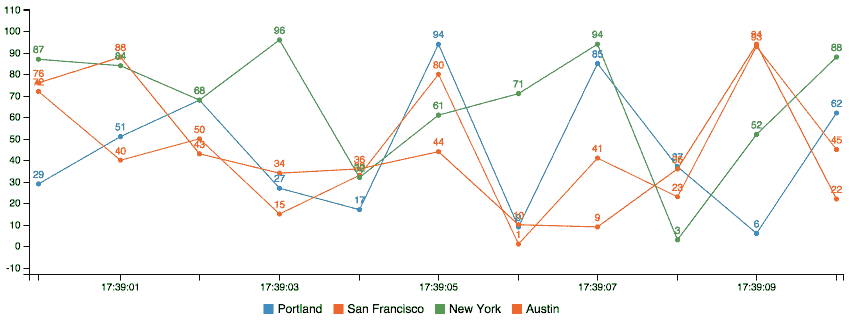
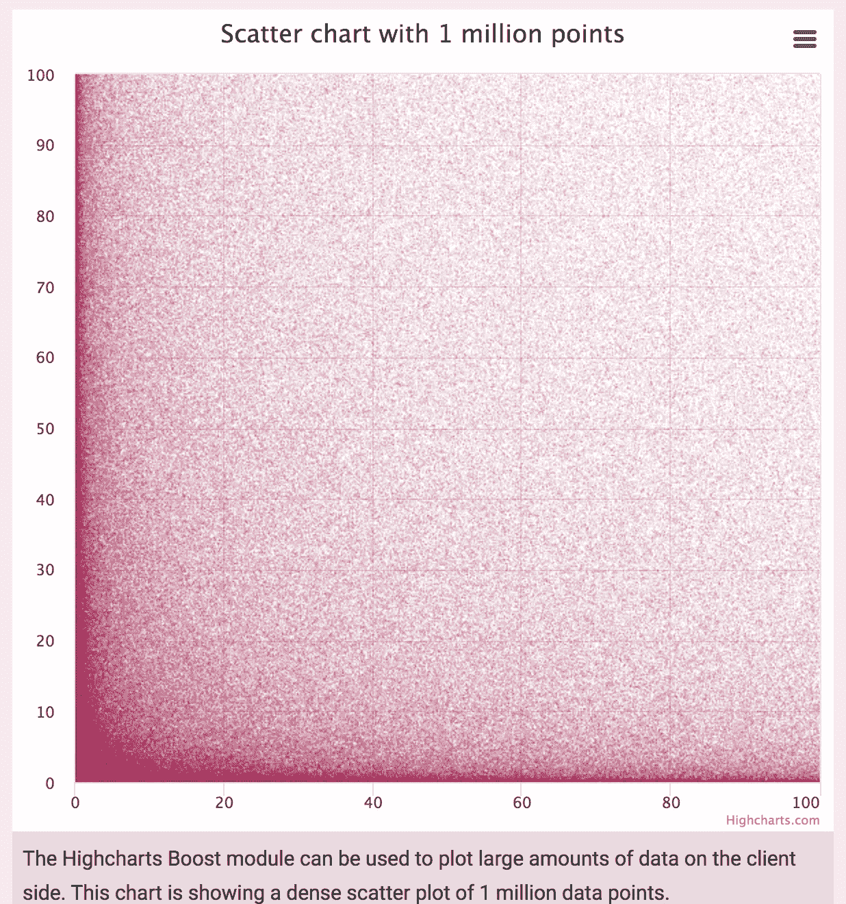
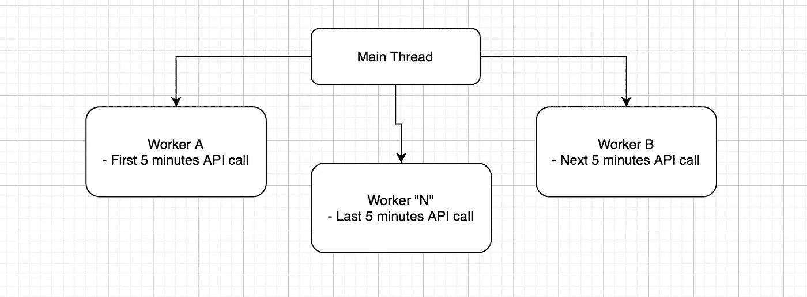
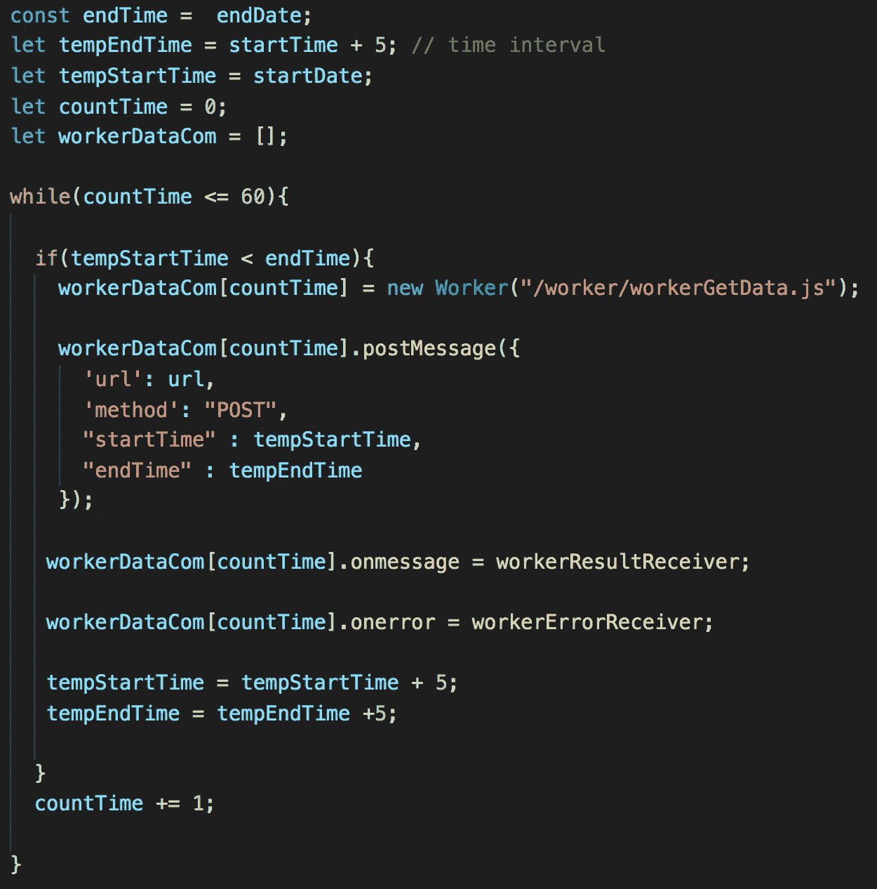
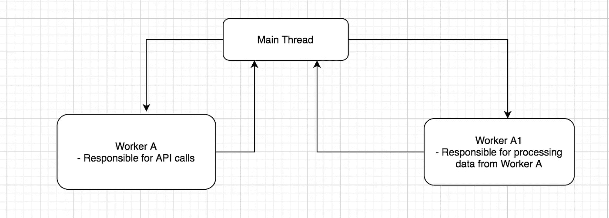
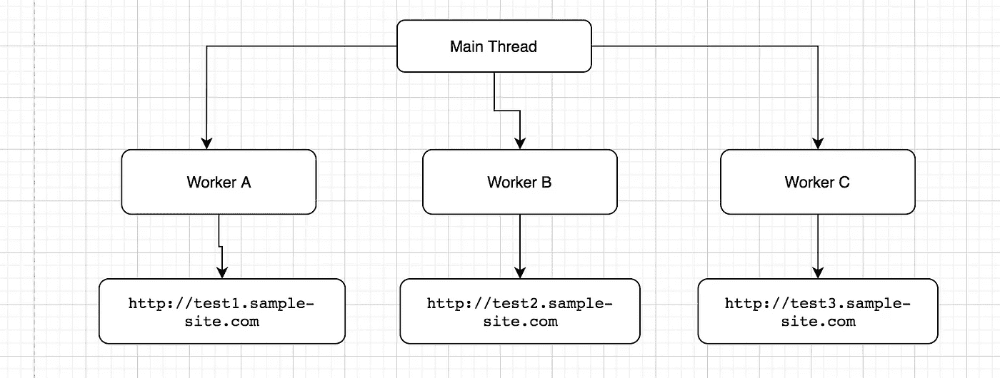
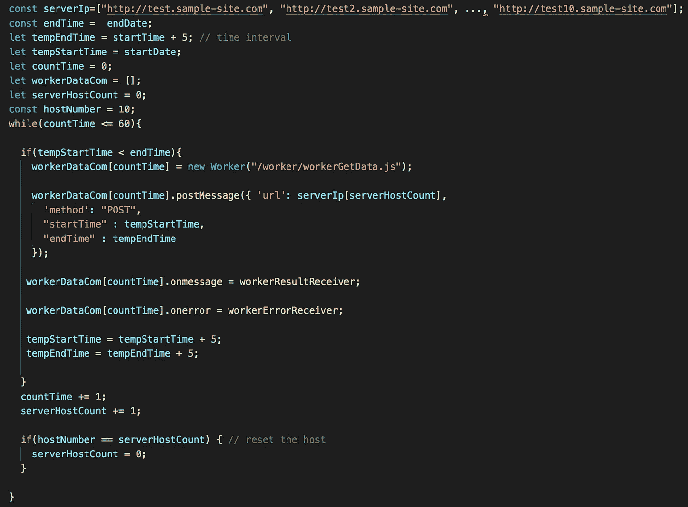
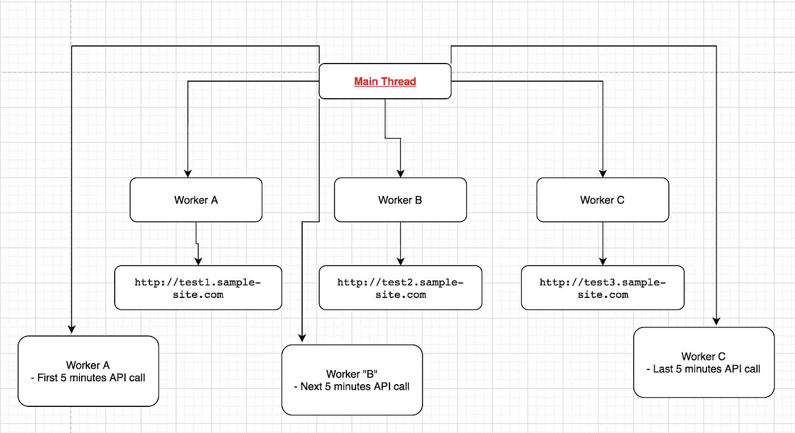

# 一群 Web 工作者如何帮助解决 UI 性能问题。

> 原文：<https://javascript.plainenglish.io/a-pool-of-web-workers-a2bb07fd1519?source=collection_archive---------3----------------------->

JavaScript 是一种单线程语言，要执行大型计算和操作，首选多线程。

我们可以借助 HTML Web Workers API 在 JavaScript 中实现多线程。

web worker 是在后台运行的 JavaScript，独立于其他脚本。想了解更多关于网络工作者的信息，请阅读 [*这里*](https://developer.mozilla.org/en-US/docs/Web/API/Web_Workers_API/Using_web_workers)

# **怎么开始的？**

回到 2015 年，我正在开发一个产品，我使用的技术堆栈是 React & [Flux](https://facebook.github.io/flux/) 。

产品需求是创建一个具有多个图表的仪表板来绘制不同的数据集。
有很多 JavaScript 库可以绘制图表，我选择[*【C3】*](https://c3js.org/)*来渲染图表。*

*图表必须根据时间范围显示数千个数据点。
在多个图表上绘制数千个数据点的含义、*

*   *更大的 DOM 大小*
*   *增加油漆，和*
*   *阻塞主线程。*

*总的来说，它相当昂贵，如果你有一台低配置的电脑，你的系统会开始冻结或浏览器会崩溃。*

*我在做开发时遇到了同样的问题，我试图渲染图表，在页面加载几秒钟后，我的浏览器崩溃了。*

**

*我开始调试这个问题，打开开发者工具，找出了崩溃的原因。*

*DOM 中有成千上万的 SVG 元素。
我使用的是 C3 库，它使用 [*SVG*](https://developer.mozilla.org/en-US/docs/Web/SVG) 来绘制图表，如果你有数千个数据点要绘制，你的 DOM 大小会增加，CPU 使用率也会增加，导致浏览器崩溃。*

## *利用帆布。*

*对于任何问题，我们总是从谷歌那里获得帮助，并发现我可以使用 canvas 来绘制图表，因为它不会增加 DOM 的大小。
发现了这个名为 [*chart.js* **，**](https://www.chartjs.org/) 的库，它在画布上绘制图表，并且不增加 DOM 大小和元素。*

*我开始使用 chart.js，但我们的要求有点不同，我想像实时流一样每 5 分钟更新一次图表中的数据点。*

**

*Source: [https://www.pubnub.com/blog/building-realtime-charts-live-updating-data/](https://www.pubnub.com/blog/building-realtime-charts-live-updating-data/)*

*不幸的是，该版本的库不支持更新实时图表，我停止使用 chart.js。*

**

# ***HighCharts —救世主***

*我找到了 [*highCharts*](https://www.highcharts.com/) *，*这个库拥有我想在我的产品中拥有的所有功能，它还可以支持图表上的实时数据流。*

*这个库可以在图表上绘制一百万个数据点。*

**

*Source: [https://www.highcharts.com/demo/scatter-boost](https://www.highcharts.com/demo/scatter-boost)*

*我开始使用它，结果很好，我很兴奋，因为我的工作已经完成了一半，但是，这并不是我的问题的结束。*

> *为了绘制成千上万个数据点，我必须发出成千上万个请求。*

***Detailing :**
一个带有日期选择器的仪表盘，在这里选择开始日期为 2020 年 1 月 1 日，结束日期为 2020 年 1 月 31 日，并希望在一个月内每隔 5 分钟绘制一个图表。*

***这意味着需要在图表上绘制 43800(大约)个数据点***

*如果您使用上面提到的开始和结束日期从客户端(UI)进行后端 API 调用，API 响应时间将会很长，因为后端每天每 5 分钟处理一次数据，然后将响应发送回 UI，这意味着您的最终用户将不得不等待几分钟或几小时才能看到图表上的真实数据。*

**

## *我是怎么修好的？*

*为了减少 API 响应时间，我想每隔 5 分钟从客户端(UI)发出一次 ajax 请求。*

*例子*

> *mapi.com/charts?startDate=1Jan2020，12:00&endDate=1Jan2020，12:05
> mapi.com/charts?startDate=1Jan2020,12:05&end date = 1 Jan 2020，12:10
> mapi.com/charts?startDate=1Jan2020,12:10&end date = 1 Jan 2020，12:15
> …
> …。
> mapi.com/charts?startDate=31Jan2020,23:55&结束日期= 2020 年 1 月 31 日 24:00*

*它帮助我减少了 API 响应时间，所以现在我们可以更快地绘制图表。*

> *但是我的问题并没有就此结束，
> 我需要运行 *for 循环，*在客户端进行一些计算，处理数据，并将其传递给 high-chart，这导致我的主线程阻塞了更长时间，导致浏览器崩溃。*

## *网络工作者如何帮助我们？*

*我在网上阅读了关于如何减少主线程时间的文章，并了解到我可以利用网络工作者*

*如果你想知道网络工作者是如何工作的，请阅读这里的。*

# *网络工作者群体*

*您可以从主线程启动一个 web worker，但是正如上面所分享的，我希望每隔 5 分钟发出多个请求，以减少 API 加载时间。*

*因此，我需要一个 web 工作人员池，每个工作人员将发出不同的 ajax (API)请求，例如*

**

> *工人甲【mapi.com/charts?startDate=1Jan2020,12:00】&结束日期= 2020 年 1 月 1 日 12:05
> 工人乙
> mapi.com/charts?startDate=1Jan2020,12:05&结束日期= 2020 年 1 月 1 日 12:10
> 工人丙
> mapi.com/charts?startDate=1Jan2020,12:10&结束日期= 2020 年 1 月 1 日 12:15*

*比方说，我创建了一个 web worker A，这个 worker 将发出一个 API 调用来获取开始日期前 5 分钟的数据，一旦 API 响应可用，worker A 就会将数据发送回主线程*

*检查实施情况*

**

*正如你所看到的，我们正在运行一个 while-loop 直到 60，这将从主线程中创建 60 个 web workers，并且我们每 5 分钟增加一次开始和结束时间。在 worker 文件中，我每隔 5 分钟调用一次 ajax。*

*通过上面的方法，我知道了如何从工作线程创建多个请求。但是还有一个问题，来自后端 API 的数据需要按照 highcharts 的要求进行重组，而数据的处理仍然阻塞了我的主线程。*

*所以我定义了工人类型*

*   *负责 API 调用的一类工作人员*
*   *另一个将负责处理数据*

**

*现在，系统有多个工作线程发出多个请求，*工作线程 A* 从 API 获取数据，它将数据发送到主线程，主线程接收来自工作线程 A 的消息，它创建一个新的工作线程，比如说 *A1* ，它将执行计算并为我的图表处理数据。*

*这就是我如何创建一个网络工作者池，做不同的操作。*

*这个问题还没有解决，因为 API 需要 55-58 秒来获得所有间隔的完整数据，而我们希望在 10 秒内完成。*

# *增加主机名可以减少加载时间。*

*到目前为止，我可以和 60 名网络工作者一起工作，如上图所示。*

*但是我用的是*http 1.1**浏览器每台主机只能允许 6 个请求。

我想把我的主机名增加到 10 个并稍微改变一下我的方法，**

**该系统能够使用 60 个 web worker，我想利用一个 web worker 在一个主机名上发出请求，第二个 web worker 在第二个主机名上发出请求。**

****

> ***工人 A 将对* `*http://test1.sample-site.com*` *进行 ajax 调用，工人 B 将对* `*http://test2.sample-site.com*` *进行 ajax 调用，工人 C 将对* `*http://test3.sample-site.com*`进行 ajax 调用**

**履行**

****

**我们有一个`serverIp`数组，其中有从`1`到`10`的多个 URL。**

**每个工作者可以向不同的子域发出请求并获取数据。
这些域中的每一个都解析到*同一个*服务器，并且网络浏览器将打开到每个域的 6 个连接。**

**使用这种方法，我们几乎减少了加载时间，完整的 API 请求和响应操作在 10-15 秒内完成。**

**此外，我们缓存每个间隔的 API 响应，这有助于减少 API 响应时间。**

**这个问题花了我将近一个月的时间来弄清楚使用哪些库，如何减少主线程工作，DOM 大小等等。**

**下面是完整的工作流程，每个工人如何与主线程连接和通信。**

****

**我希望你喜欢阅读这篇文章。**

## ****谢谢！****

*****附言*** 👋 ***嗨，我是 Aatif！如果你喜欢这个，一定要关注我的*** [***推特***](https://twitter.com/aatifbandey) ***！*****