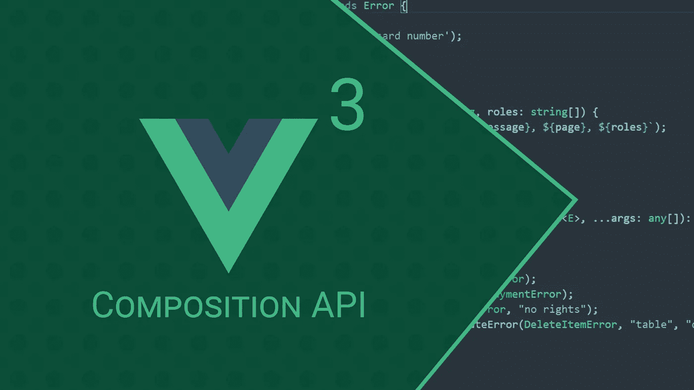
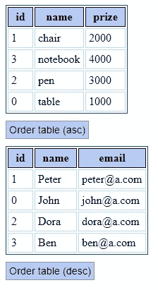

# Vue 3 组合 API 的实用介绍

> 原文：<https://javascript.plainenglish.io/a-practical-intro-to-the-vue-3-composition-api-628b6ff15b2f?source=collection_archive---------6----------------------->

Composition API 是在 Vue.js 中的组件之间共享应用程序逻辑的一种很好的方式。您不仅可以将重复的代码片段组织到单独的文件中，还可以使它们易于重用。

Composition API 允许您在共享的代码片段中保持变量的活性，这与以前版本的 Vue 中构建的实现相比是一个巨大的改进，即使对于企业规模的应用程序也是如此。根据官方文档，部署复合 API 是必要的，因为在大型应用程序中，组件之间的高效代码共享是一个问题。

尽管过去有突出公共部分的解决方案，如 mixin、renderless compontent 或 HOC，但这些都不能提供与组合 API 一样高的灵活性。这个新特性的最大优点是，我们可以同时提取以前必须在给定组件的数据、计算和方法部分中实现的部分(使用选项 API)。让我们举一个简单的例子来说明如何在现实世界中使用复合 API。

首先，使用 Vue.js(版本 3)创建一个项目。为了提高速度，我将使用 vue cli 来实现这一目的。一旦项目完成，删除示例组件，我们将不再需要它。阐明我们将组织代码的项目结构。我将我的组件放在 *src* 下的*组件*文件夹中，同时我创建了一个*服务*文件夹，在其中我打包了实现业务逻辑的可重用但“非组件”的代码。一个文件包含一个服务。如果我必须给出一个常见服务的例子，例如，有实现各种排序和过滤或 http 调用的服务。

我们通常不希望把它们写成组件，它们只能被适当地参数化，但是我们希望在总体上看到给定的逻辑，作为代码中的一个模块。作为实现解决方案的组合 API 完全符合这一思想。

组合 API 为组件代码引入了一个新的部分，称为 *setup* 。这是一个可以有两个参数的函数，上下文和道具。在设置中，我们可以使用之前已知的选项 API 实现我们在数据、计算和方法部分中编写的部分。这里我们可以定义组件的内部状态和功能，这里我们也可以使用我称为服务的公共代码片段。

在我的许多项目中，我需要可以按列升序或降序排序的表格。我们将创建两个使用相同 director 服务的表。这是一个很好的真实例子，说明了为什么组合 API 作为一种思想是有效的。

当然，在一个企业规模的项目中，我们必须将所有的表格逻辑外包给一个通用的表格组件，然后该组件使用排序服务，但是我们现在不会这样做，因为本文旨在介绍组合 API，它足以从表格中提取服务代码。

我们的应用程序的聚合组件叫做 HomePage，它只显示这两个表。这两个表也很简单，一个列出了**用户**，另一个列出了**产品**。Composition API 允许我将排序操作创建为一个单独的服务，如果需要，我可以在其中处理反应值，然后我可以在使用该服务的组件中使用这些值。

在这个例子中，我将把排序方向存储在我的服务自己的反应变量中。我在我的两个表组件中的数据下面的按钮文本中打印这个订单值。我将在必要时以清晰可见的方式仅在分类服务中更改分类顺序，组件将立即被通知这一更改，证明存在反应性。

# 最终结果

Result: 2 different tables use the same service to sort data

**主页**组件包含这两个表格(以及几行 css 代码以在后台突出显示表格):

# ProductTable 和 UserTable 组件

**ProductTable** 组件显示了一个包含 3 列的简单表格和一个用于排序的按钮。为了简单起见，它从 25 的**行定义数据行。**

**第 33 行:**使用订单服务获取其返回值，即 orderState 和 orderItems。OrderState 是订单服务的内部状态，包含方向值(“asc”或“desc”)，OrderItems 是排序函数本身。正如你所看到的，整个排序逻辑是从组件使用中分离出来的。想象一下，如果在一个组件中包含 10 个或更多服务，这个解决方案会多么有用。

**第 35 行:**在组件“加载时”对服务进行排序(参见 vue 3 生命周期方法)。

**第 37 行:**返回一个包含状态(component own - reactive -state)、orderItems(排序函数)和 orderState(order service own state 带方向值)的对象。**这是一个重要的时刻，因为组合 API 需要这种返回才能正常工作。**在你带着那些东西返回后，组件的模板可以使用 orderItems 和 orderState.direction，正如你在 14 的**行看到的。**

第 8 行:状态可以直接在模板中使用。

**用户表**组件与之前分析的产品表几乎相同。唯一不同的是 25 的**线上的数据行。该组件可以像 ProductTable 组件一样受益于排序服务。**

排序服务没什么特别的，只是一个超级简单的排序功能。它可以根据内容的 name 属性对给定的数据数组进行排序。我不验证输入值，因为从组合 API 示例的角度来看，这无关紧要。重要的部分是服务(或函数或任何您称之为它的东西)内部的反应状态以及特性结束时的返回值。

**记住:你必须从服务中返回所有的东西(函数、变量等),以使它在组件级可用。**

Composition API 中很酷的一点是，一个特性的整个逻辑连接可以提取到一个单独的部分，因为如果你愿意，你可以在一个代码块中“模拟”Vue.js 的数据、方法和计算特性。有了这个想法，我可以以同样的方式在任何组件中使用我的分离排序特性。

# 结论

我知道，我知道，这是个超级简单的例子。本文的唯一目的是将您的注意力吸引到组合 API 的最大好处上。如果你和我一样，用 Vue.js 做企业软件，下次试着替换常用的 Options API，你不会失望的。你对这个话题有什么看法？请在评论中分享你的想法和经验。万事如意！