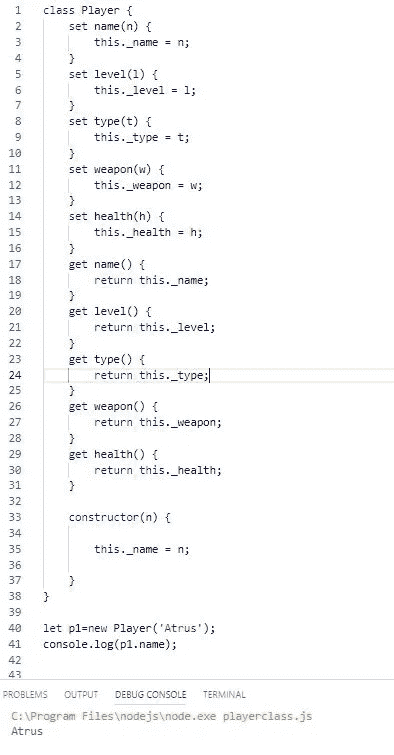
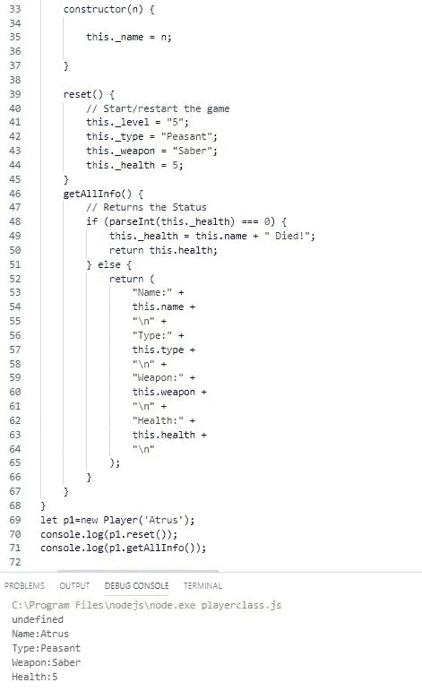
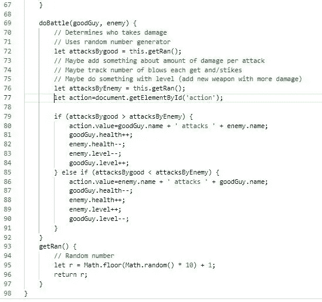
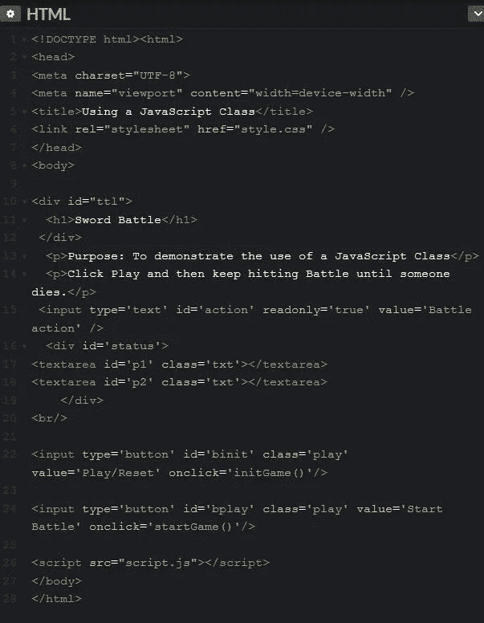
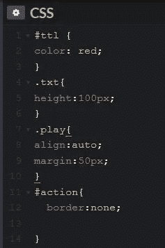
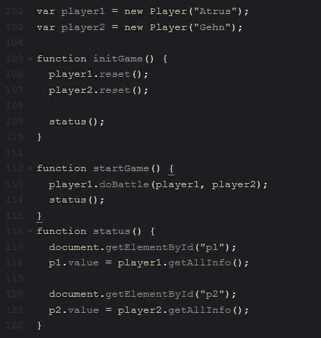
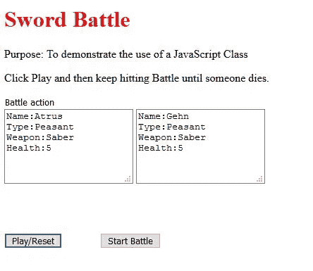
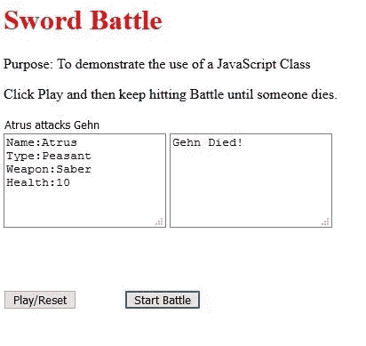

# JavaScript 类的一个实际用例

> 原文：<https://javascript.plainenglish.io/a-practical-use-case-for-javascript-classes-8558f2ee1b09?source=collection_archive---------1----------------------->

## 一个有趣、实用的用途——一个简单的游戏。

Photo by Henry Hustava on [Unsplash](https://unsplash.com)

> 让我们创建一个非常简单的游戏！
> 
> 目标是使用一个 JavaScript 类。

在这个由多个部分组成的系列中，我一直在深入研究 JavaScript 类([第 1 部分](https://link.medium.com/USs9sPFoyZ)、[第 2 部分](https://link.medium.com/5tVIHlNvyZ)、[第 3 部分](https://medium.com/p/ecadd02addbc)、[第 4 部分](https://link.medium.com/nrwjRHTQH0))。这里我想创建一个 JavaScript 类并使用它。

> 这个项目不会占用你太多时间，你可以尝试，扩展它，享受乐趣。

## 游戏

很简单。我们将有两个玩家(好人，敌人)互相战斗，直到一个玩家的生命值为零，那个人死亡。

> 玩家对象将是玩家类的实例。

我们不会创建任何复杂的界面或复杂的 JavaScript。那将由你在闲暇时去做。但是会有用的！

> **在这里** 你可以看到所有的代码，如果需要可以播放和复制 [**。(随着时间的推移，我可能会改变它，因为这让我在一天的编程后分心。)**](https://codepen.io/GravityWell/pen/ExYzEgv)

## 玩家阶层

这个 JavaScript 类将包含几个基本属性。大多数是让你自己去试验/实现。对我们来说，健康的 T21 将是最重要的。但是你会有一个你可以实现的武器、类型和等级，来增加很多有趣的功能。

在您喜欢的编辑器中创建这个类并测试它。我最初使用 VSCode。按需保存。(为了测试播放器类，我把它保存为 playerclass.js，但是后来，在添加了一些函数之后，我把它保存为 script.js，以便在网页中引用。)

我们将对此进行修改和添加，但这是我们播放器的核心。

接下来，我希望我们在构造函数后添加两个方法。

*   reset()方法将用于初始化我们的播放器并重新启动。
*   getAllInfo()方法将给出我们的球员的所有属性的当前信息。还是那句话，对于这一点，只有生命值(等级也是但我不用)会改变。基本上它返回一个状态。

在构造函数和测试之后添加这两个方法，以确保它能够工作。

Note line 49

最后，我们将添加一个完成战斗的类方法，以及一个随机数生成器来确定谁发起了恶意攻击。

*   doBattle()方法将从 getRan()方法中获得一个随机数。我们将为每个玩家获得一个随机数，并根据谁的价值更大来调整他们的健康。

**重要的**。在第 77、80 和 86 行有一个对 HTML 元素 action 的引用，我们还没有创建它。

*注意:我调整玩家的等级，但不做任何事情。至少现在不是！*

## HTML

接下来，我们将创建简单的 HTML 文件。在中，我们将引用一个非常简单的 CSS 文件，在中，script.js 包含我们的 Player 类和三个 JavaScript 函数来帮助我们玩游戏。根据需要命名 HTML 文件。

***注意:我切换到一个 HTML 编辑器，虽然我可以继续使用 VSCode，所以图像看起来不同。***

*同样，保持 HTML 非常简单，这样你就可以快速完成，以后再做改进。*

它引用了一个 CSS 文件，第 6 行，这将是下一个。在第 26 行中，我引用了我的 script.js，它是 Player 类和三个附加函数。

## CSS

这里没什么特别的。创建一个名为 style.css 的文件，如下所示。

For you to enhance!

## 最终的 JavaScript 文件

我把它命名为 script.js，它包含了 Player 类和三个帮助我们玩游戏的函数。

创建一个文件，命名为 script.js，把你的 Player 类和下面的三个函数放进去玩游戏。HTML 文件的第 26 行引用了 script.js。

*   函数 initGame()基本上设置了玩家。
*   函数 startGame()开始战斗！它让玩家 1 和玩家 1 竞争。谁会受到伤害？好奇的人想知道。
*   status()函数显示了每个球员的当前状态，同样，健康对我们来说很重要。

Atrus battling Gehn (Myst)

## 运行游戏

在浏览器中打开你的 HTML 文件，试一试。单击“播放/重置”后，它应该如下所示。继续打“开战”看卫生。当一达到零时，那个玩家就死了。

The HTML file after clicking Play/Reset

Yay! Gehn died after a ferocious battle by repeatedly clicking Start Battle.

# 结论:

这样做的目的不是为了展示任何花哨的东西，而是为了使用 JavaScript 类并从中获得乐趣。

我希望你能尝试一下，增加功能，改进界面，扩展类，增加类——谁知道呢。

玩得开心的同时学习就好。

编码快乐，感谢阅读！

有关 JavaScript 类的更多信息，

 [## JavaScript 类。深入的观察。第一部分。

### 我们要做什么？

link.medium.com](https://link.medium.com/USs9sPFoyZ)  [## JavaScript 类。深入的观察。第二部分。

### 欢迎回来

link.medium.com](https://link.medium.com/5tVIHlNvyZ)  [## JavaScript 类:深入研究(第 3 部分)

### 做一名优秀的 JavaScript 开发人员

medium.com](https://medium.com/javascript-in-plain-english/javascript-classes-an-in-depth-look-part-3-ecadd02addbc)  [## JavaScript 类。深入的观察。第四部分。

### 您现在是一名优秀的 JavaScript 开发人员了，欢迎回到本系列。第 1 部分集中讨论了一个类的核心结构…

link.medium.com](https://link.medium.com/nrwjRHTQH0)