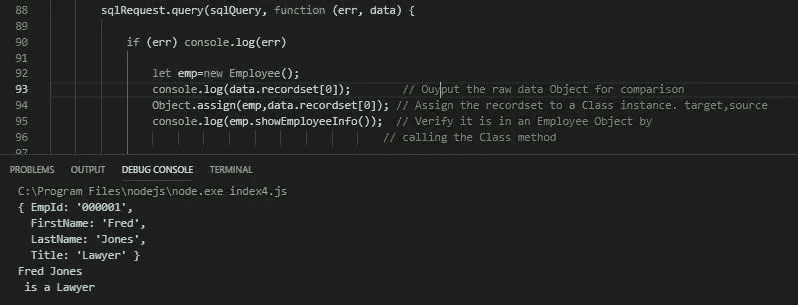

# JavaScript 的 Object.assign()的一个实际用例

> 原文：<https://javascript.plainenglish.io/a-practical-use-case-for-javascripts-object-assign-3c37e2e42d42?source=collection_archive---------4----------------------->

## 将数据库记录集对象分配给 JavaScript 类对象


Photo by Louis Hansel on [Unsplash](https://unsplash.com/)

## 用例

[Object.assign()](https://developer.mozilla.org/en-US/docs/Web/JavaScript/Reference/Global_Objects/Object/assign) 有很多。但是，在基本级别上，它将一个对象的属性分配给另一个对象。

语法是，

```
Object.assign(target, ...sources)
```

我将向您介绍 Object.assign()以及如何使用它来帮助用数据填充 JavaScript 类。特别是从数据库查询返回的数据。

在上一篇文章中，我讨论了用 node.js 查询 SQL Server 数据库的[。我将使用那篇文章的组件来演示如何使用 Object.assign()。](https://link.medium.com/5tVIHlNvyZ)

## 对象.分配基础

如上所示，语法是，

```
Object.assign(target, ...sources)
```

*   **目标** —这是您想要分配的对象。在我们的例子中是一个类对象的实例。
*   **来源** —这些是数据将来自的来源。在我们的案例中，只有一个来源。一个数据库记录(集)。

如 [MDN 上关于 Object.assign](https://developer.mozilla.org/en-US/docs/Web/JavaScript/Reference/Global_Objects/Object/assign) 所述，

> 如果目标对象中的属性具有相同的键，它们将被源对象中的属性覆盖。较新的源的属性同样会覆盖较早的属性。
> 
> `Object.assign()`方法只将*可枚举的*和*拥有的*属性从源对象复制到目标对象。它在源上使用`[[Get]]`,在目标上使用`[[Set]]`,因此它将调用 getters 和 setters。因此，它*分配*属性，而不仅仅是复制或定义新属性。

最后一段对我们来说非常重要。

> 它将调用 getters 和 setters

正如我稍后将重申的，我们的类拥有存储数据所需的[属性](https://link.medium.com/5tVIHlNvyZ)以及存储数据所需的 ***set()*** 方法是非常重要的。

虽然您可以在 MDN 上查看 Object.assign()的例子，但是我想展示第一个例子，也是最基本的一个例子，因为它实际上适用于我们想要实现的目标。

**MDN 上的示例**

const target = { a: 1，b:2 }；
常量源= { b: 4，c:5 }；
const returned target = object . assign(target，source)；
console.log(目标)；
//预期输出:Object { a: 1，b: 4，c:5 }
console . log(returned target)；
//预期输出:对象{ a: 1，b: 4，c: 5 }

在他们的例子中，他们将一个对象(源)分配给目标对象。最终结果是它们有相同的数据。

为什么这个简单的例子对我们有用？我将在本文的下一节中更详细地介绍，但在基本层面上，我们的数据库数据将如下所示。

{EmpId: "000001 "，名字: " Bob "，姓氏:" Jones "，头衔:"律师" }

> 为定义明确的类对象赋值的完美结构。

换句话说，如果我们有一个能够存储 EmpId、FirstName、LastName 和 Title 的 JavaScript 类，我们就可以从数据库对象和 ***返回数据，并将其放入我们自己的数据结构中。***

## 从数据库返回的记录(集)的结构

让我们看看 node.js 中数据库查询返回的数据是什么样子的。

此图像包含代码片段和控制台输出。点击[此处](https://link.medium.com/5tVIHlNvyZ)查看[查询 SQL Server 数据库](https://link.medium.com/5tVIHlNvyZ)的完整代码。


console.log(data)

注意第 60 行， **sqlRequest.query()** ，这是我们从数据库请求数据的地方。

现在，关注控制台输出。当使用 console.log( **data** )时，我们看到从数据库返回的数据是一个格式良好的对象数组，四个记录中的每一个都有一个。

*遗憾的是，在我们对其采取措施之前，这些数据都保存在控制台中。*

如果我们查看第一条记录， **data.recordset[0]** ，我们会看到，

{EmpId: "000001 "，名字: " Fred "，姓氏:" Jones "，头衔:"律师" }

## JavaScript 类

所以现在我们只需要一个定义良好的 JavaScript 类来放置记录集数据。

记住一个*类只是一个蓝图*，它是创建一个对象的类的实例，我们可以在这个对象中放置数据。

JavaScript 类应该用属性和必要的 ***set()*** 方法很好地定义，以便将从数据库返回的数据存储到这些类属性中。在这里找到了[的类结构类型。](https://link.medium.com/5tVIHlNvyZ)

> 回想一下前面的语句， **Object.assign()** 将使用目标的 **set()** 方法将数据放入**目标**对象的属性中。

我们的类至少应该如下所示(我确实包含了一个类方法 showEmployeeInfo()，这样我们就可以在使用 Object.assign()后验证数据是否确实存储在类对象中。_


Notice the setters. Object.assign will use these.

我们的 Employee 类具有存储 EmpId、FirstName、LastName 和 Title 所需的属性，以及 Object.assign()将数据放入属性所需的 set()方法。

## 使用 Object.assign

在我们的演示中，为了只关注 Object.assign()，我们将代码限制为只存储一个记录(集合)。当然，一个循环可以用来创建不止一个类对象(Employee ),还可能创建一个数组来存储我们所有的雇员。



Notice the last two lines

注意第 92–95 行以及控制台输出。

*   我们在第 92 行创建了一个空的 Employee 对象 emp。
*   为了比较，我们显示了原始对象数据 data.recordset[0]，第 93 行。
*   **使用 Object.assign()将原始数据分配给 Employee 对象，第 94 行。**
*   调用类方法来验证原始数据在雇员对象中，第 95 行。

维奥拉。

# 结论

相当酷。我们现在有了一种将格式良好的(数据库或非数据库)对象分配给类对象的方法。有了我们自己的数据结构中的数据，我们可以根据需要操纵它，也可以利用我们决定包含的任何类方法。

感谢您的阅读和快乐编码！