# 使用 JavaScript，画布和雅达利 VCS 琐事制作一个基本的 HTML 游戏

> 原文：<https://javascript.plainenglish.io/a-quick-example-of-using-js-canvas-and-atari-vcs-trivia-to-make-a-basic-html-game-bdd52a41dd36?source=collection_archive---------5----------------------->

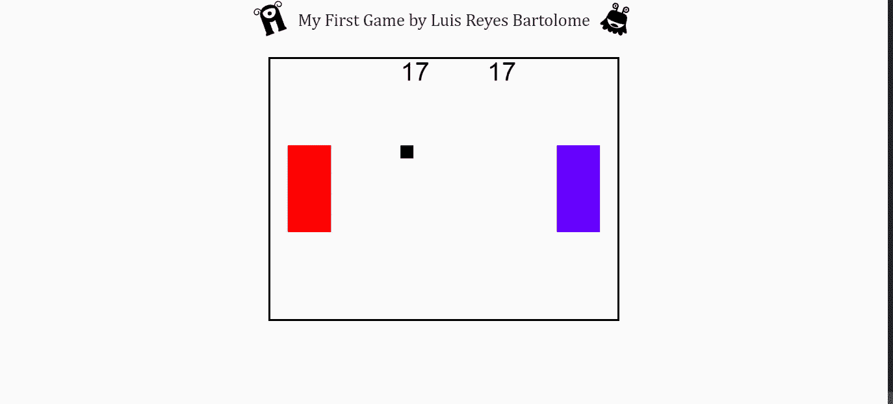

By the end of this article, we’ll make a game that would make Allan Alcorn and Nolan Bushnell proud!

如果你和我一样，你带着制作自己的视频游戏的幻想进入了编程世界。也许梦想在 PS360 或 Xbox Advance 上做点什么。但是你不必把自己局限在等待，直到你为一家视频游戏公司工作。你现在就可以为你正在使用的浏览器做一些东西。这里有一个使用 HTML、画布、Javascript 和一些雅达利 VCS(又名雅达利 2600)知识制作浏览器游戏的简单例子。

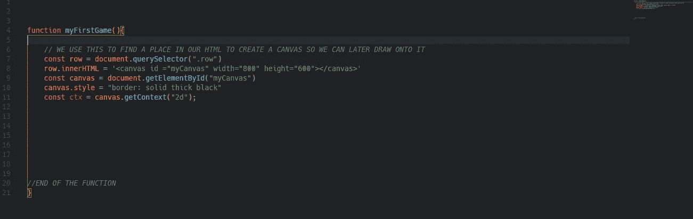

我们要做的第一件事是设置我们的基本 html 页面，并为我们的屏幕设置一个部分。我们的屏幕基本上将成为

<canvas>标签。在我们创建 html 之后，我们想要创建一个 js.file，并确保网站将它带到页面上。因为我们将继续引用该元素，所以您可以创建一个基本的 selectQuery，该查询将找到一个父标记并将它附加到页面上，如所附示例所示。当我们创建

<canvas>时，我们需要给它一个宽度和高度，这样它就知道画布有多大。输入的数字是应该派上用场的像素。这块画布最终将作为我们显示游戏“图形”的屏幕。</canvas>

</canvas>

在设置我们的 js 文件并创建画布之后。我们将会创建一系列你将会在整个游戏中使用的变量。当您创建变量时，请注意，您会希望这些变量中的一些发生变化(并且经常发生变化)，而您会希望其他变量始终保持不变。

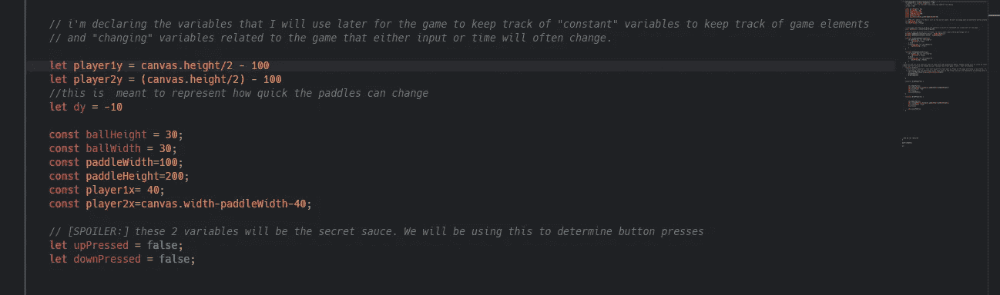

Don’t be think that just because you are setting these down now, that these will never change or that you won’t be adding more to it. you will find yourself darting back up to add some more.

在这之后，你应该开始做一些“管理”游戏的事情。这包括创建几个事件监听器来监听按钮的按下。对于这个游戏，我们想做一个游戏，玩家可以上下移动他们的“精灵”进行互动。查看事件侦听器，您会注意到一些 if 语句和 us 将前面声明的变量设置为 true 或 false。让我们分析一下我们在那里做什么

> 1)我们在按键 up 和 down 上做事件监听器。这使得它可以做两件不同的事情，取决于用户按下按钮或释放按钮
> 2)在事件侦听器中，我们有一个 if 语句检查特定的按钮是否被按下，并运行一些代码。这使得我们可以指定用户的控制，而不会被我们的“游戏手柄”之外的其他按钮所困扰。这样做将有助于进一步解决问题，但最终，将我们后面要使用的所有逻辑都放在事件侦听器中可能不是一个好主意

我们稍后将回到这一点，但你想要创建 const gameStart，这是一个 setInterval，我将使用它来“绘制”游戏，
并使用毫秒设置 FPS。我们正在传递一个回调函数，我们将在后面声明它。我们后面做的函数应该会让这个更有意义，但是最终这个 setInterval 被设计来继续绘制游戏，并且基本上保持一个永久的循环。通过将它保存到一个变量中，如果我们需要清除设置的时间间隔并停止游戏运行[剧透:你可能会想要这样做]

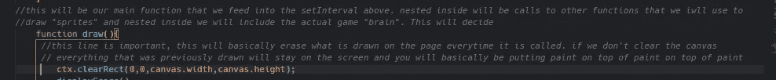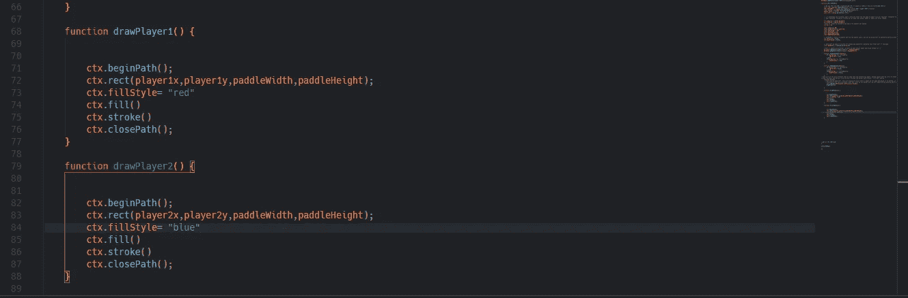

This is set up so that it will always draw the 2 paddles. This will be very handy

下一步是创建一个 draw 函数，当 setInterval 运行时，该函数总是会调用。这个函数要做几件事，但最重要的是，它要充当设计用来绘制图像的其他函数的包装器。我们想在 draw 函数中加入的第一个东西是 ctx.clearRect，它的作用是擦除 canvas 内部的内容，这样脚本就可以安全地移动 canvas 上正在绘制的内容，并给你一个干净的石板来开始显示新的对象。因为游戏运行的速度更快，人眼可以注意到(每秒 60 帧)，所以你不会真正注意到屏幕在应该有东西的地方擦除和重绘。

然后我们创建两个函数来绘制每个桨。在我们深入研究这个之前，你应该看看下面的[文档](https://developer.mozilla.org/en-US/docs/Web/API/Canvas_API/Tutorial/Drawing_shapes)，以准确理解 canvas 到底发生了什么。但是在这里，我们在特定的位置绘制桨，这些位置可能会根据游戏中发生的事情而变化。使用同样的逻辑，我们将画出我们的球

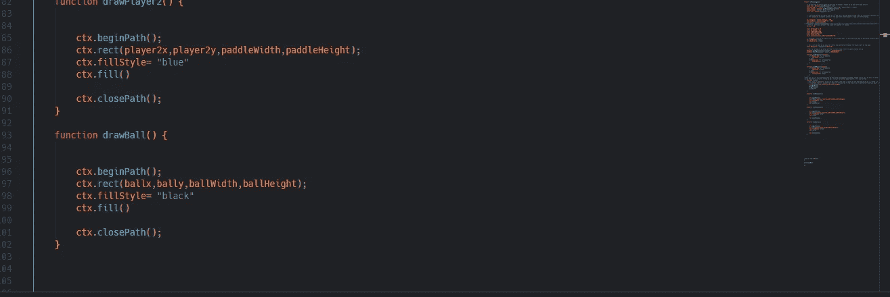

Now we are drawing the ball

在创建了这些函数并将它们放入 draw 函数之后，我们现在应该看到 canvas 在我们用不同颜色(现在)设置的初始位置绘制了球拍，并绘制了一个球。所以我们解决了至少在屏幕上显示一些东西的第一部分。现在我们想让它动起来。

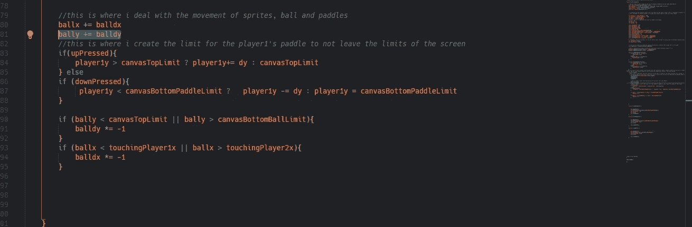

Here is our logic to make everything move (which I added into the draw function). The ball will start to launch once the game starts and it should be bouncing off of the top and bottom parts of the canvas. In here we are also creating our first version of collision detection. it is detecting if it is pushing onto the top and bottom of the screen.

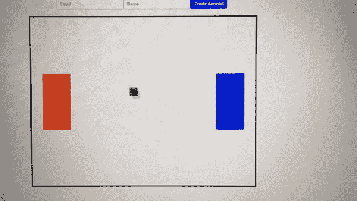

所以在一切都完成后，我们让球移动并从球拍上反弹。但是你可以看到它在 player1 开始的地方反弹，但是在空白的地方反弹。这意味着我们必须重构这部分。

如果我们注意我们画桨的方式，我们可以开始思考如何解决碰撞。我们开始用 ctx.rect 构建它，给它 x，y 坐标，然后给它高度和宽度。因此，当我们进行收集时，我们希望确保当球的 x 轴位于球拍的边界时。除此之外，我们要确保球的顶部位于球拍的顶部或底部。在我们这样做之后，我们需要确保如果球位于桨的底部上方，它也会“碰撞”。通过将这些条件变成带有一串& &的 1 if 语句，我们可以确保逻辑是合理的，并且检查都是一次性进行的。尤其是球在桨顶部下方和桨底部上方的比较。因为两个都为真，球会位于中间的某个地方。因为桨是实心矩形，这意味着我们肯定希望它“碰撞”。逻辑应该是这样的

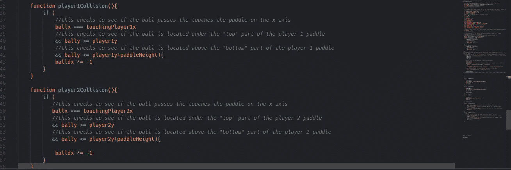

This is a lot easier than it looks. The spirit is to see if the ball is in the x-axis at the paddle, and that its y-axis falls within the range of the paddles “ends”.

现在我们有了要显示的东西，我们有了运动，我们有了碰撞检测，是时候通过引入得分来使这成为一个真正的游戏了。与我们刚刚做的相比，这应该相对容易。我们将制作另一个绘图函数，但这次我们将绘制文本而不是矩形。但在此之前，我们想回到存储变量的代码顶部，并添加一个玩家 1 得分和一个玩家 2 得分变量。从本质上来说，这是我们想要增加的，所以请确保不要用“常量”来忽略它。既然我们已经用桨进行了收集检测，我们只需要做一个最基本的检查。我们知道，如果球碰到球拍，它会反弹回来，所以我们不需要再计算得分。在这种情况下，我们只需查看球的 x 轴是否接触过画布的任何边缘。一旦它这样做了，它就需要给另一个玩家一分，并重置球。下面是这段代码的一个例子

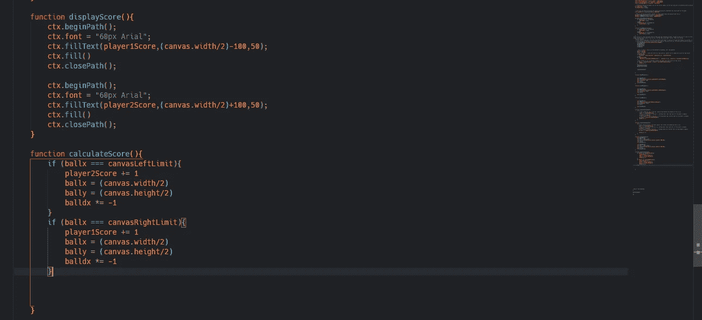

This would draw the scoreboard dynamic and assign points on who won the match

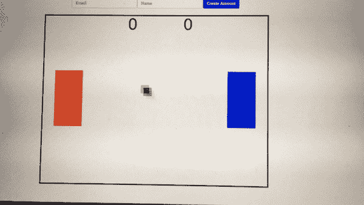

现在我们有了游戏设置，它将能够控制球拍，记录分数，并在重新开始球的位置时使球正确反弹。我们唯一剩下的事情就是决定如何处理蓝桨，以及如何结束一场比赛。

这两种情况基本上都导致了设计师(你知道)的决定。关于蓝桨，你可以让它成为一个双人游戏，也可以把蓝桨分配给一台电脑，让它成为一个单人游戏。如果你想让它成为一个双人游戏，这应该很容易，因为我们之前已经包含了逻辑。你会想去事件监听器，为玩家 2 添加你想要的按钮。然后你只需要找到变量，并给它们赋值和用来存储的变量相似的变量。再使用几行代码，现在你就有了一个双人游戏。要使这成为一个单人对抗机器人的游戏，你需要创建某种功能，使玩家 2 的划水动作保持增加或减少其 y 轴。通过改变这个变量，桨会上下移动，给你一个基本的人对机器人游戏。

结束游戏是留给你的想象。你希望游戏根据玩家分数结束，还是在一定时间后停止。两者都需要你创建另一个函数，这样更容易跟踪正在发生的事情。

现在，在你继续之前，你还记得我说过我们过会儿要看的那句叫做 gameStart 的台词吗？现在是时候了。因为我们将 setInterval 赋给了一个变量。我们现在可以使用该变量删除 setInterval(这也将停止游戏渲染)。基本上停止了游戏。所以我们应该再做一个函数，用你想要的东西填充它。如果你想把你的胜利建立在分数的基础上，你可以在 draw 函数中调用这个函数，让它把你声明的玩家分数变量和分数限制进行比较。一旦到达那个点，你就使用线清除间隔(gameStart ),这是杀死永久循环并结束你的游戏。如果你决定根据时间结束游戏，而不是在 draw 里面调用这个函数。您应该在名为 setTimeout 的东西下调用这个函数。setTimeout 的工作方式类似于 setInterval 的工作方式，只是它在执行一个会使用 clearInterval 终止 setInterval 的函数之前倒计时到某个时刻。但是不管怎样，一旦你做了决定并把它添加到你的代码中，你现在可以说你刚刚创建了一个函数游戏！！

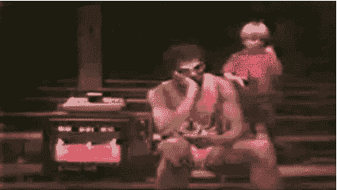

Congrats on making this browser game

所以我们已经使用了 HTML，我们已经使用了 Javascript，所以现在我们可以使用一些雅达利 VCS(又名雅达利 2600)琐事来捆绑一切&扩展我们的游戏和可能性。准备好了吗？嗯，雅达利 VCS 有一个交互式精灵的限制，2 桨，2 导弹精灵，和一个球。它不能更自然地计算。根据一些人的说法，这个系统最初是用 Pong 和 Tank 来设计的，只使用这些东西。但是如果你简单的搜索一下这个系统发布的游戏数量，就会发现很多游戏都有这样的限制。当创作者为这个系统制作游戏时，他们利用了这些限制并运用了一些独创性。他们知道他们有办法在屏幕上显示/跟踪精灵，他们知道他们可以做一些类型的碰撞检测，以及一种保持分数的方法。通过这个，他们能够制作赛车游戏、益智游戏、动作游戏等等。我相信你可以用它来做一些对你来说特别的东西。

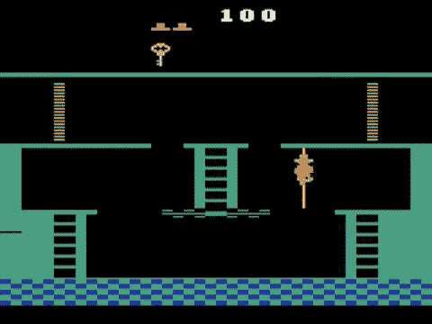

## **用简单英语写的 JavaScript**

你知道我们有三份出版物和一个 YouTube 频道吗？在[T3【plain English . io找到一切的链接！](https://plainenglish.io/)