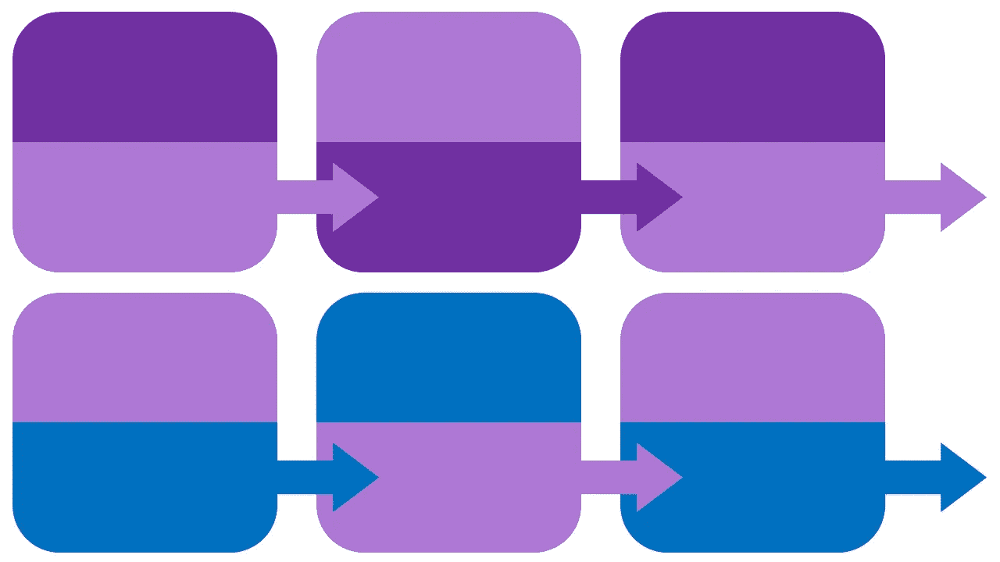
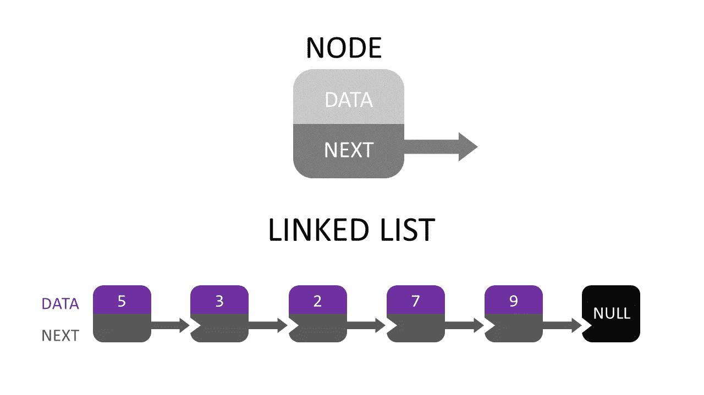
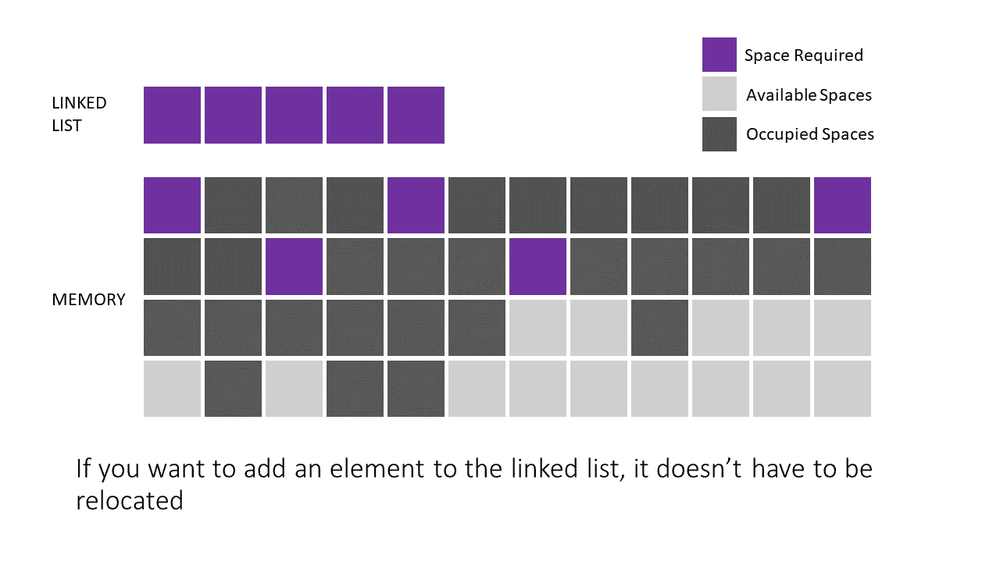
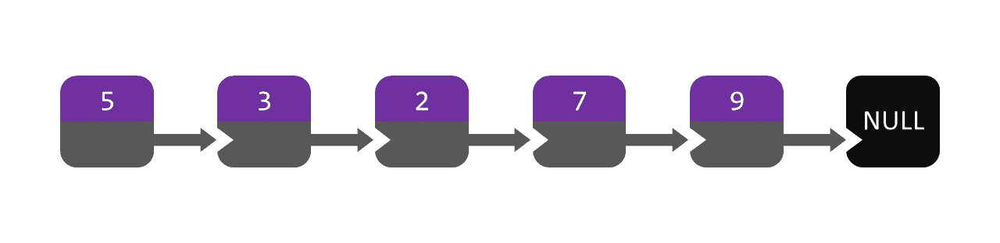
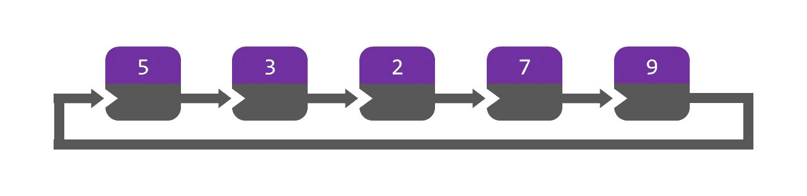
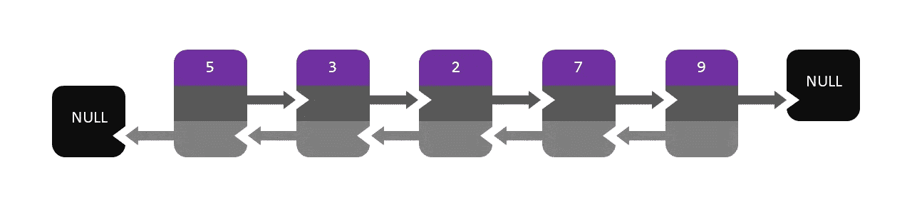
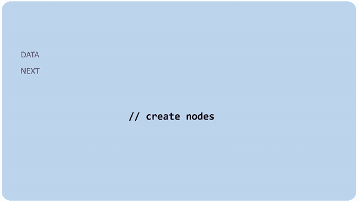
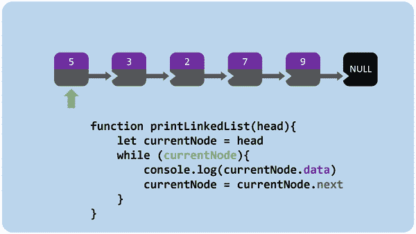

# JavaScript 中链表的快速指南

> 原文：<https://javascript.plainenglish.io/a-quick-guide-to-linked-lists-in-javascript-27ea7046bc56?source=collection_archive---------3----------------------->

# 理解链表

image by Gabriela Rivera Mejias © 2019

什么是链表？

它们是组织数据的一种方式。这是一个由**个节点**组成的列表，其中每个节点**只有**可以访问其数据，并且知道列表中的下一个元素在哪里。

Singly Linked List — image by Gabriela Rivera Mejias © 2019

在代码中，典型的链表如下所示

Node class example for a singly linked list

链表具有挑战性的地方在于，你不能使用对数组或对象有效的方法，也不能以同样的方式迭代、添加、移除或任何其他常见操作。他们**不同**，需要**不同**的思维方式。

为什么要用链表而不是数组？

Array in Memory — image by Gabriela Rivera Mejias © 2019

在内存中，当你创建一个数组时，你必须分离出与数组大小相等的空间。如果大小改变了(你添加了一个元素)，那么你必须重新定位整个数组，如果它所在的位置没有空间的话。

Linked List in Memory — image by Gabriela Rivera Mejias © 2019

链表在内存方面更有效。由于它们知道它们的邻居在哪里，所以你可以将它们分别存储在内存中。

有四种类型的链表:

1.  单链表—最后一个节点指向空。

Singly Linked List Example — image by Gabriela Rivera Mejias © 2019

2.循环链表—最后一个节点指向第一个节点。

Circular Linked List Example — image by Gabriela Rivera Mejias © 2019

3.双向链表——每个节点都有一个 next 和一个 previous。第一个节点的 previous 设置为 null。最后一个节点的 next 设置为 null。

Doubly Linked List Example — image by Gabriela Rivera Mejias © 2019

4.循环双向链表——每个节点都有一个 next 和一个 previous。第一个节点的 previous 设置为最后一个节点。最后一个节点的 next 设置为第一个节点。

Circular Doubly Linked List Example — image by Gabriela Rivera Mejias © 2019

## 使用链表创建元素列表

创建所有节点，并将它们的下一个节点设置为正确的节点。

Code example of how to create nodes for a singly linked list and link them together

GIF of how to create nodes for a singly linked list — GIF by Gabriela Rivera Mejias © 2019

## 遍历链表

来迭代链表，while 循环非常有用。您唯一可以访问的是给定的节点。也就是说，你只有它的数据，它是下一个。您可以一直调用每个节点的 next，直到到达最后一个节点。像这样:

Code example of how to iterate over a singly linked list

GIF of iterating over a singly linked list — GIF by Gabriela Rivera Mejias © 2019

## 向链接列表添加元素

添加元素有点棘手。在链表中需要一个节点，这样就可以添加一个节点。在这种情况下，我将分三步在给定节点后插入一个新节点**。**

1.  用给定的值创建一个新节点
2.  将新节点的 next 赋值为等于给定节点的 next
3.  将给定节点的 next 赋值为等于新节点

Code example of how to add en element to a singly linked list

GIF of adding an element to a singly linked list — GIF by Gabriela Rivera Mejias © 2019

肯尼斯·扬·卡斯特罗 2019