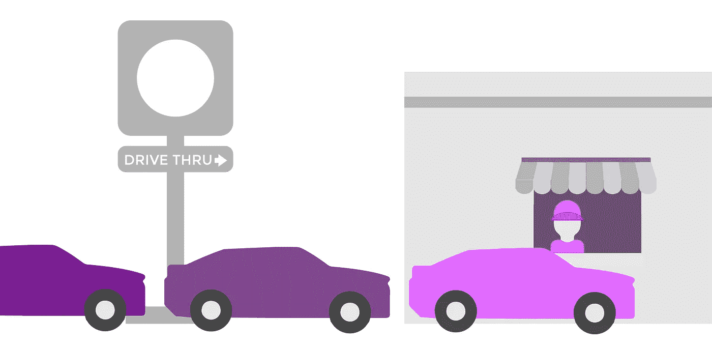
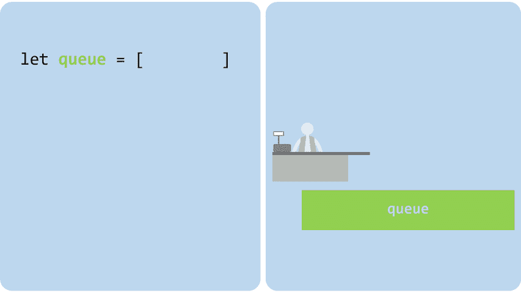
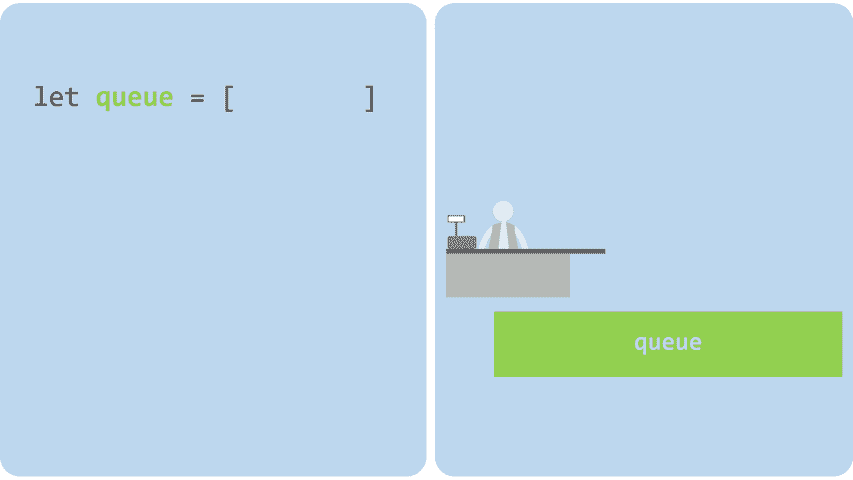
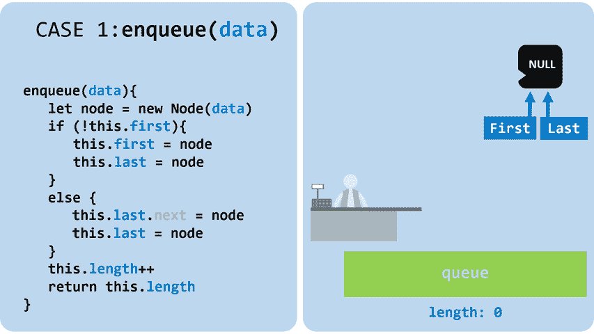
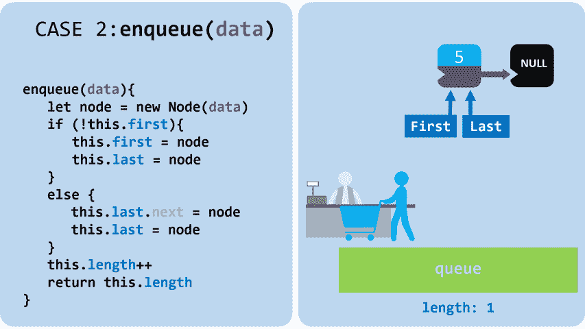
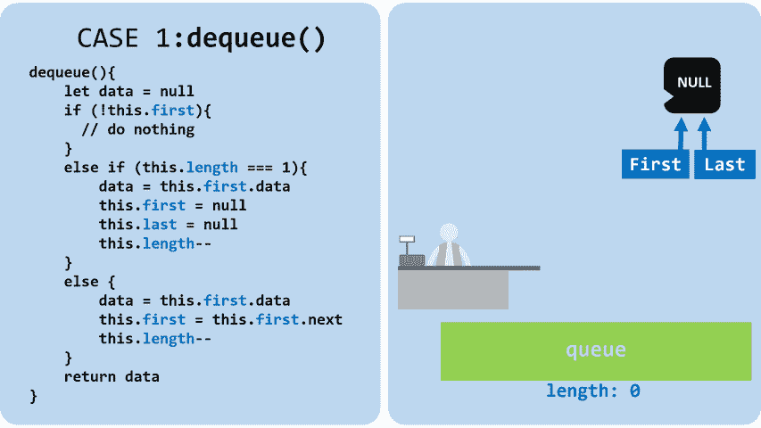
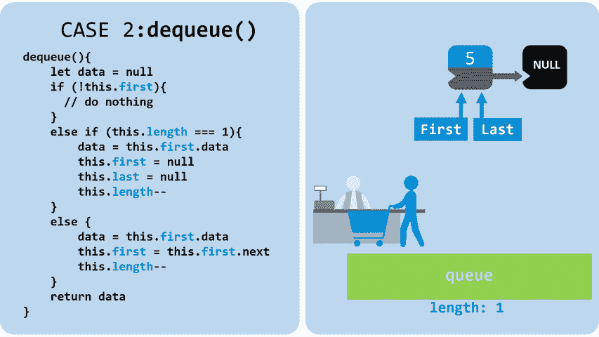
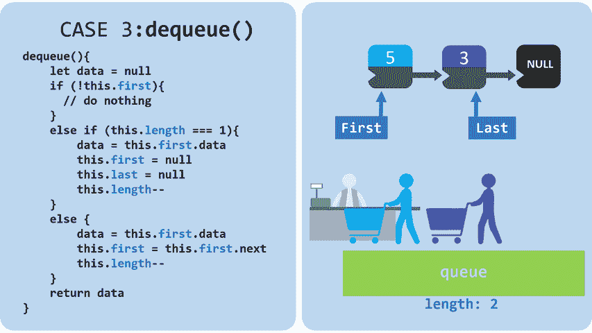

# JavaScript 队列快速指南

> 原文：<https://javascript.plainenglish.io/a-quick-guide-to-queues-in-javascript-4367354ca005?source=collection_archive---------5----------------------->

## 理解和实现队列

Queues — image by Gabriela Rivera Mejias © 2019

## 什么是队列？

队列非常类似于[栈](https://medium.com/javascript-in-plain-english/a-quick-guide-to-stacks-in-javascript-ecbf78515dc1)。他们经常一起学习，因为他们有很多相似之处。队列是一种组织数据的方式。它们基于先进先出的概念。它们可以通过各种方式实现(稍后将会介绍)，但其思想是有两种与数据交互的方式:在列表末尾添加一个元素(**入队**)和从列表开头删除一个元素(**出列**)。

## 为什么使用队列？

为了处理 FIFO 逻辑，队列有一个大的 O:

1.  插入 O(1)
2.  移除 O(1)
3.  查找元素 O(n)
4.  存取元素 O(n)

使用它们是因为它们几乎可以即时插入和移除元素。同样，与[栈](https://medium.com/javascript-in-plain-english/a-quick-guide-to-stacks-in-javascript-ecbf78515dc1)非常相似，它们都几乎即时地处理元素的插入和移除。区别在于，队列用于需要 FIFO(先进先出)逻辑的数据，而堆栈用于需要 LIFO(后进先出)逻辑的数据。

## 队列用在哪里？

*   将你和其他用户配对的游戏服务器(任何处理拥塞的网络)
*   有等候的队伍吗
*   后台任务
*   打印机进程
*   遍历二叉查找树或图形
*   编程面试

## JavaScript 数组作为队列

使用队列最简单的方法是使用数组。您不需要实现任何代码，因为 JavaScript 数组已经有了移除和插入元素的方法。重要的是你遵循先进先出的逻辑。添加的第一个元素必须是第一个输出的元素。

下面是使用数组处理队列的两种不同方式:

1.  您可以使用 Array 的 push 和 shift 方法(添加到列表的末尾，从列表的开头删除)

Array as Queue example with push and shift

Arrays as queues example with push and shift— GIF by Gabriela Rivera Mejias © 2019

2.您可以使用 Array 的 unshift 和 pop 方法(添加到列表的开头，从列表的结尾移除)

Array as Queue example with unshift and pop

Arrays as queues example with unshift and pop — GIF by Gabriela Rivera Mejias © 2019

# 用链表创建你自己的队列

对链表使用队列比对数组更难。你必须自己实现代码，这比较难，但是值得。链表在内存方面比数组更有效。你可以在这里阅读更多关于那个[的内容。](https://medium.com/javascript-in-plain-english/a-quick-guide-to-linked-lists-in-javascript-27ea7046bc56)

## 实现节点类

一个节点有两个属性:**数据**和**下一个**。看起来是这样的:

Node class example

## 实现队列类

队列有三个属性:第**个**节点、最后**个**节点和队列的**长度**。看起来是这样的:

Queue constructor example

# 队列入队和出队方法

处理**入队**和**出列**有两种方式。类似于数组，我们可以在末尾插入并从开头移除，或者我们可以在开头插入并从末尾移除

他们之间有巨大的**差异。他们在这里:**

1.  在链表的末尾插入并从开头移除(想想数组的 push 和 shift 方法)

*   插入 O(1)
*   移除 O(1)

2.在链表的开头插入并从末尾移除(想想数组的 unshift 和 pop 方法)

*   插入 O(1)
*   去除 O(n)

从链表的末尾移除需要 O(n)。要从末尾移除，您必须将队列的最后一个属性重新分配为它的前一个节点。因为它是一个单链表，如果不遍历整个队列，你就不能访问前一个元素，因此，O(n)。

因此，Queue 类的**入队**和**出列**的实现类似于 Array 的 push 和 shift 方法，也就是将新节点添加到列表的末尾，并从列表的开头删除节点。这样，插入和移除都是 O(1)。

## 实现队列入队(推送)方法

向队列添加元素时，有两种不同的情况需要处理:

1.  队列是空的。
2.  队列中有个元素。

在这两种情况下，您都必须用给定的数据创建一个新节点，并将队列的**长度**增加 1。

在代码中， **enqueue** (push)如下所示:

Queue enqueue example

情况 1:当队列为空时

使队列的**第一个**和**最后一个**属性成为新节点。

Case 1: enqueue with no elements in the Queue— GIF by Gabriela Rivera Mejias © 2019

情况 2:当队列有元素时

将队列的下一个**最后一个**节点设为新节点，然后将**最后一个**节点设为新节点。

Case 2: enqueue with elements in the Queue — GIF by Gabriela Rivera Mejias © 2019

## 实现队列出列(移位)方法

从队列中删除元素有三种不同的情况:

1.  队列中没有元素。
2.  队列中只有一个元素。
3.  队列中有多个元素。

在代码中，**出列** (shift)看起来像这样:

Queue dequeue example

情况 1:当队列中没有项目时

什么都不做，返回 null。

Case 1: dequeue with no elements in the Queue — GIF by Gabriela Rivera Mejias © 2019

情况 2:当队列中只有一个元素时

通过将第**个**和最后**个**都设置为空，删除包含该元素的节点。将队列的**长度**减一，并返回被移除节点中的数据。

Case 2: dequeue with one element in the Queue — GIF by Gabriela Rivera Mejias © 2019

情况 3:当队列中有多个元素时

通过将队列的 **first** 属性设置为列表中的下一个节点来删除第一个节点。将队列的**长度**减一，并返回被移除节点中的数据。

Case 3: dequeue with elements in the Queue — GIF by Gabriela Rivera Mejias © 2019

## 完整的队列代码

总之，用链表实现的堆栈看起来像这样:

Queue class example

如果你想玩代码，这里有一个 [repl 链接](https://repl.it/@KennethYoung/Queues)。

谢谢你能走到这一步！这是 JavaScript 中队列的快速指南。如果您对未来的主题或问题有任何想法，请在下面回复！如果你觉得这有帮助，这里是我以前的一些文章，都是 gif 格式的！

以前的文章:

 [## JavaScript 堆栈快速指南

### 理解和实现堆栈

medium.com](https://medium.com/javascript-in-plain-english/a-quick-guide-to-stacks-in-javascript-ecbf78515dc1)  [## JavaScript 中链表的快速指南

### 理解链表

medium.com](https://medium.com/javascript-in-plain-english/a-quick-guide-to-linked-lists-in-javascript-27ea7046bc56)  [## 递归举例说明

### 大部分程序员都听说过这个概念，都很恐惧。他们倾向于远离它。这是一个可怕的话题，但它…

medium.com](https://medium.com/javascript-in-plain-english/recursion-explained-with-example-62473f311230)