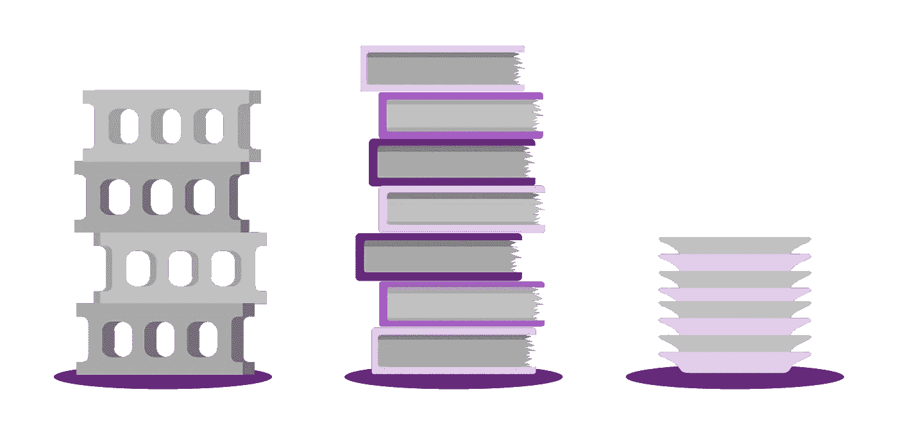
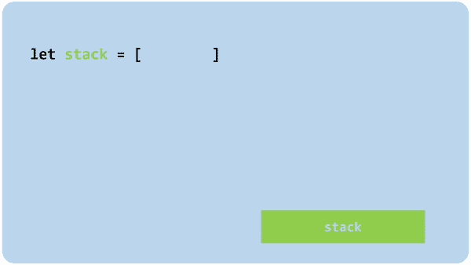
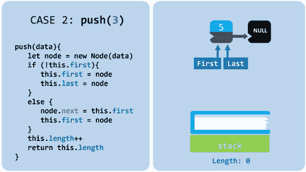
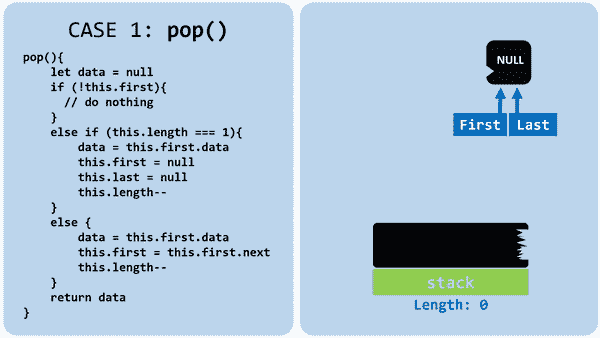
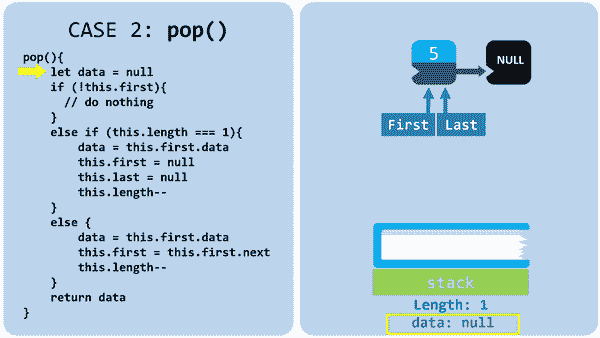
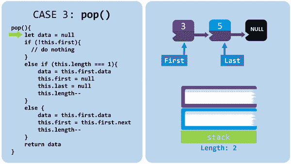

# JavaScript 堆栈快速指南

> 原文：<https://javascript.plainenglish.io/a-quick-guide-to-stacks-in-javascript-ecbf78515dc1?source=collection_archive---------5----------------------->

## 理解和实现堆栈

Stacks — image by Gabriela Rivera Mejias © 2019

## 什么是堆栈？

堆栈是一种结构化数据的方式。它们基于后进先出的概念。它们可以通过各种方式实现(稍后将会介绍)，但是有两种方式可以与数据交互:将一个元素放入栈顶或者从栈顶移除一个元素。

## 为什么使用堆栈？

为了处理后进先出逻辑，堆栈有一个大的 O:

1.  插入 O(1)
2.  移除 O(1)
3.  查找元素 O(n)
4.  存取元素 O(n)

使用它们是因为它们几乎可以即时插入和移除元素。在其他一些数据结构中，处理插入需要 O(n ),因为你首先要找到插入的位置(看看你的二分搜索法树！).在其他情况下，要删除，您必须先找到要删除的元素，或者像在数组中一样，您必须重新定位内部的每个元素。

## 栈用在哪里？你可能认识其中一些。

*   JavaScript [调用堆栈](https://www.freecodecamp.org/news/understanding-the-javascript-call-stack-861e41ae61d4/)
*   实现撤消/重做的应用程序
*   包括最近使用的应用程序
*   任何需要用后进先出逻辑处理的数据
*   编程面试——所以记笔记吧👀

## 作为堆栈的 JavaScript 数组

您可以使用 JavaScript 数组处理堆栈。尽管它们比其他替代方法慢一点，但已经用 JavaScript 实现了。它完全开箱即用。**记住**，一叠叠需要实现两件事；他们必须能够删除添加到列表中的最后一个元素，并且能够将一个元素添加到列表的末尾。

这里有两种使用数组处理堆栈的方法:

1.  您可以使用 Array 的 push 和 pop 方法(添加到末尾，从末尾删除)

Arrays as stacks example with push and pop

Arrays as stacks example with push and pop — GIF by Gabriela Rivera Mejias © 2019

2.您可以使用 Array 的 unshift 和 shift 方法(添加到开头，从开头删除)

Arrays as stacks example with unshift and shift

Arrays as stacks example with unshift and shift — GIF by Gabriela Rivera Mejias © 2019

# 用链表创建你自己的栈

如果你想提高速度，使用链表堆栈是一个不错的方法。它们不是用 JavaScript 实现的，但是它们比数组快。这是因为当你从数组中移除一个元素时，你必须重新定位数组的索引。当你从链表中移除一个元素时，几乎是即时的。如果链接列表听起来令人困惑，看看这个用图片和 gif 解释的[指南](https://medium.com/javascript-in-plain-english/a-quick-guide-to-linked-lists-in-javascript-27ea7046bc56)。

## 实现节点类

节点有两个属性:数据和下一个。看起来是这样的:

Node class example

实现堆栈类

一个栈有三个属性:栈的第一个节点**，最后一个**节点**和栈的长度**。看起来是这样的:****

**Stacks constructor example**

# **堆栈推送和弹出方法**

**有两种处理 push 和 pop 的方法。类似于数组，我们可以在链表的末尾，或者在链表的开头插入和删除。**

**他们之间有巨大的差异。他们在这里:**

1.  **在链表的末尾插入和移除(想想数组的 push 和 pop 方法)**

*   **插入 O(1)**
*   **去除 O(n)**

**2.在链表的开头插入和移除(想想数组的 unshift 和 shift 方法)**

*   **插入 O(1)**
*   **移除 O(1)**

**虽然它通常被称为 push 和 pop，但我们将把它当作 unshift 和 shift 来实现。这是因为如果你在链表的**端**插入和移除，移除最后一个节点需要遍历整个栈。这是因为您必须将堆栈的最后一个**元素**更改为其之前的元素。由于我们不能访问 previous with 链表，所以你必须遍历整个栈才能得到它。**

**在链表的**开始**处插入和移除不涉及使用前面的元素，只涉及后面的元素，我们在链表中可以访问这些元素。这使得插入和移除在恒定的时间内发生，实现了我们的 O(1)的目标。**

## **实现堆栈推送(非移位)方法**

**向堆栈添加元素时，有两种不同的情况需要处理:**

1.  **堆栈是空的。**
2.  **堆栈中有个元素。**

**在这两种情况下，都必须用给定的数据创建一个新节点，并将长度增加一。**

**在代码中，push (unshift)看起来像这样:**

**Stacks push method example**

**情况 1:当堆栈为空时**

**使堆栈的第**个**和最后**个**属性成为新节点。**

****

**Case 1: push with no elements in the Stack — GIF by Gabriela Rivera Mejias © 2019**

**情况 2:当堆栈有元素时**

**使新节点指向堆栈的第**个**属性，然后将第**个**更改为新节点。**

****

**Case 2: push with elements in the Stack — GIF by Gabriela Rivera Mejias © 2019**

## **实现堆栈弹出(移位)方法**

**从堆栈中移除元素有三种不同的情况:**

1.  **堆栈中没有元素。**
2.  **堆栈中只有一个元素。**
3.  **堆栈中有多个元素。**

**在代码中，pop (shift)看起来像这样:**

**Stacks pop example**

**情况 1:当堆栈中没有项目时**

**什么都不做，返回 null。**

****

**Case 1: pop with no elements in the Stack — GIF by Gabriela Rivera Mejias © 2019**

**情况 2:当堆栈中只有一个元素时**

**通过将第**个**和最后**个**都设置为空，删除包含该元素的节点。将堆栈的**长度**减一，并返回被移除节点中的数据。**

****

**Case 2: pop with one element in the Stack — GIF by Gabriela Rivera Mejias © 2019**

**情况 3:当堆栈中有多个元素时**

**通过将堆栈的第一个**元素设置为列表中的下一个元素来删除第一个节点。将堆栈的**长度**减一，并返回被移除节点中的数据。****

****

**Case 3: pop with multiple elements in the Stack — GIF by Gabriela Rivera Mejias © 2019**

## **完整的堆栈代码**

**总之，用链表实现的堆栈看起来像这样:**

**Stack class example**

**谢谢你能走到这一步！这是 JavaScript 堆栈的快速指南。如果你觉得这很有帮助，请鼓掌。如果您对未来的主题或问题有任何想法，请在下面回复！**