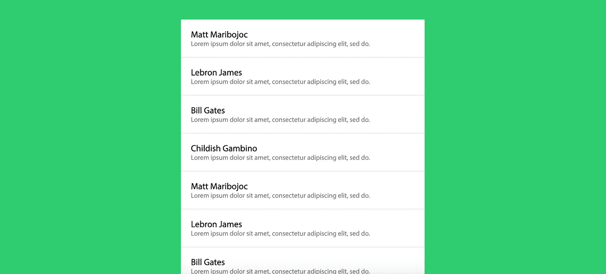
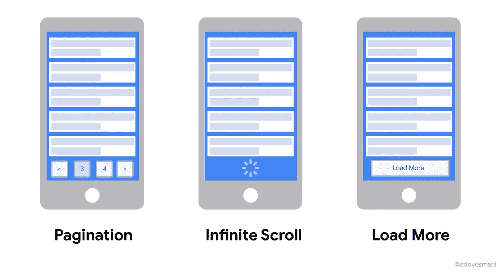
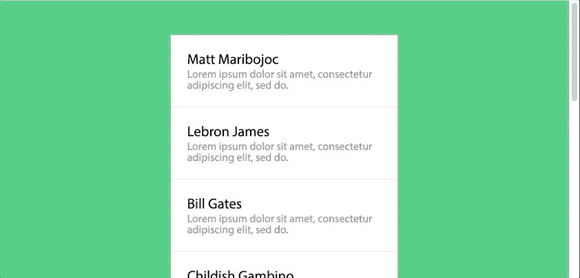

# 快速 Vue3 无限滚动组件—每日 Vue 提示#4

> 原文：<https://javascript.plainenglish.io/a-quick-vue3-infinite-scrolling-component-daily-vue-tips-4-20c7052ccda4?source=collection_archive---------5----------------------->



如果你发现自己在社交媒体上呆的时间太长，那么你所在的网站很可能使用了一个无限滚动组件。

无限滚动组件是指当用户向下滚动页面时加载新内容，而不是将其分成多个页面。

它们对于特定类型的内容(如用户生成的内容)非常有效。

这里有一个无限滚动的例子。



[https://addyosmani.com](https://addyosmani.com)

在本教程中，我们将使用[组合 API](https://learnvue.co/2020/01/4-vue3-composition-api-tips-you-should-know/) 创建一个 Vue3 无限滚动组件。这里先睹为快，看看我们最终会构建什么。如你所见，它无限滚动，屏幕右侧的滚动条反映了这一点。



[现场演示](https://matthewmaribojoc.github.io/learnvue-tutorials/tutorials/vue-infinite-scrolling)

好吧，让我们直接开始吧。

## 为什么还要使用无限滚动组件？

我们都见过使用无限滚动来显示内容的网站的例子，但是什么时候这比使用典型的分页系统更好呢？

Nick Babich 有一篇关于无限滚动/分页的利弊的文章。我绝对推荐读一读，不过我总结一下要点。

无限滚动的优点:

*   用户参与和内容发现
*   滚动比点击更好(更好的可用性)
*   滚动对移动设备有好处

无限滚动的缺点:

*   页面性能和设备资源
*   项目搜索和定位——用户不能将页面加入书签并保留位置
*   无关滚动条

像所有 web 开发的事情一样，选择任何一个选项都有正当的理由。只是一定要考虑哪个最适合你的网站！

不管怎样，学习如何构建一个 Vue3 无限滚动组件是非常有趣的，而且将来可能会对你有用。

## 好吧。让我们按时到达。

首先，让我们从较高的层面来看一下这个系统是如何工作的。

将有三个主要部分:

1.  生成帖子的模拟 API 调用
2.  呈现单个帖子的后置组件
3.  ListComponent 包含所有的 post 组件并处理从 API 加载 post

## 模仿 API 调用

对于本教程，我们将编写一个返回硬编码数据的伪 API 调用。如果你在一个真实的后台和数据库中实现它，重要的是你可以根据数据库的大小和位置来决定限制你的结果。

这个 API 调用可以是任何东西，从简单应用程序中的简单数据库查询，一直到更高级应用程序中的复杂推荐算法。

以下是社交媒体网站常用的内容加载算法的一些不同想法:

*   发布日期
*   与当前用户的相关性
*   帖子上的活动

然而，为了简单起见，我们的算法将只生成随机的帖子数据，并根据给定的参数返回 X 个帖子。

```
var names = ['Matt Maribojoc', 'Lebron James', 'Bill Gates', 'Childish Gambino'] // used to generate posts for this tutorial

const getPosts = (number) => {
	// generate a number of posts
	// in a real setting, this would be a database call or algorithm

	let ret = []

	for (var i = 0; i < number; i++) {
		ret.push({
			author: names[i % names.length],
			content: 'Lorem ipsum dolor sit amet, consectetur adipiscing elit, sed do.'
		})
	}	

	return ret
}

export default getPosts
```

## 制作我们的 post 组件

既然我们已经有了生成帖子的方法，让我们创建一个组件来呈现它们。

这段代码没有任何花哨的地方，我们只需通过组件的道具接收帖子，然后呈现作者和内容。这里也有一些风格来美化一些东西。

```
<template>
	<div class='post'>
		<h2> {{ post.author }} </h2>
		<p> {{ post.content }} </p>
	</div>
</template>
<script>
export default {
	props: {
		post: Object
	}
}
</script>
<style scoped>
	.post {
		background: #fff;
		padding: 1.5em;
	}

	.post:not(:last-child) {
		border-bottom: 1px solid #ddd;
	}

	.post h2 {
		font-size: 1.3em;
		padding-bottom: 0.25rem;
	}

	.post p {
		color: #888;
	}
</style>
```

## 显示我们的帖子

接下来，让我们实际上弄清楚如何在屏幕上显示一些帖子。这就是`ListComponent.vue`组件派上用场的地方。

如果你没有任何 Vue3 的经验，这段代码可能会让你觉得有点奇怪。但是看看这个[vue 3](https://learnvue.co/2020/01/a-first-look-at-vue3-alpha-release-example-app-in-15-minutes/)入门指南。

简而言之，Vue3 用组合 API 替换了选项 API，这意味着代码([生命周期挂钩](https://learnvue.co/2020/03/how-to-use-lifecycle-hooks-in-vue3/)，数据等)都被组织在一个`setup`方法中。

首先，我们想导入一些东西:

*   我们的 API 调用
*   我们的后组件
*   `ref`用于创建反应数据
*   `onMounted`和`onUnmounted`来访问这些生命周期挂钩

```
import PostComponent from './PostComponent.vue'
import { ref, onMounted, onUnmounted } from 'vue'
import getPosts from '../scripts/post-loader'
```

接下来，在我们的设置方法中——我们想要设置一个反应性的 posts 变量来调用我们的`getPosts` API 调用。不要忘记返回它，以便我们的模板可以访问它！

```
setup () {

		const posts = ref(getPosts(10))

		return {
			posts,
		}
}
```

最后，为了在模板中显示我们的数据，我们想运行一个`v-for`循环来遍历我们的帖子，并为每个帖子呈现一个后置组件。我们的模板应该是这样的(注意`.list-component`有一个引用，我们稍后会讲到)

```
<template>
	<div class='scrolling-component' ref='scrollComponent'>
		<post-component v-for='post in posts' :post="post" />
	</div>
</template>
<script>
```

我们当前的页面应该呈现 10 个帖子，看起来像这样。

但是如果我们滚动到底部，什么也不会发生。所以让我们进入激动人心的部分:无限滚动！

## 处理 Vue3 无限滚动

现在我们已经设置好了一切，当用户向下滚动到文章底部时，我们可以开始加载更多的数据。

让我们首先创建一个方法，一次加载 10 篇文章，并将它们附加到我们的 posts 变量中。

```
setup () {

		// ...

		const loadMorePosts = () => {
			let newPosts = getPosts(10)
			console.log(newPosts)
			posts.value.push(...newPosts)
		}
  // ...
}
```

现在，我们只需要一个方法来触发这个方法。我们将通过添加一个事件侦听器来实现这一点，该侦听器侦听一个滚动事件并调用一个方法。我们将在安装组件时添加它，在卸载(销毁)组件时删除它。

```
setup () {

		// ... 

		onMounted(() => {
			window.addEventListener("scroll", handleScroll)
		})

		onUnmounted(() => {
			window.removeEventListener("scroll", handleScroll)
		})
const handleScroll = (e) => {

		}
                // ...
}
```

太好了。我们已经准备好开始加载更多的帖子。如果您还记得上一节，我们向`.list-component` 元素添加了一个 refs 属性。如果你以前在 Vue 中使用过 refs，这是一个熟悉的概念，但是我们在 Vue3 中设置它们的方式有点不同。

我们将再次使用`refs`方法实例化我们的 ref，然后从我们的 setup 方法返回它。

```
setup () {

		const posts = ref(getPosts(10))
		const scrollComponent = ref(null)
return {
			posts,
			scrollComponent
		}
}
```

通过使用`refs`访问我们的元素，我们可以完成我们的方法来确定我们是否被滚动到我们内容的底部。

下面的代码检查内容的底部在屏幕上是否可见。如果是，我们调用我们的方法来加载更多的帖子！

```
const handleScroll = (e) => {
			let element = scrollComponent.value
			if ( element.getBoundingClientRect().bottom < window.innerHeight ) {
				loadMorePosts()
			}
		}
```

就是这样！当我们向下滚动到当前帖子的底部时，新帖子应该会自动加载进来。让我们看看我们有什么。

完美！

## 无限滚动组件的可能扩展

这只是对创建 Vue3 无限滚动组件的介绍。有很多不同的方向可以改进它。

如果你在一个真实的系统中构建它，我会考虑添加一些想法。

*   因为 API 调用是异步的，所以创建一些在加载新数据时显示的[加载微调器](https://learnvue.co/2020/04/vue-skeleton-loading-screen-using-suspense-components-daily-vue-4/)
*   创建一个更复杂的 API 算法，并将其连接到数据库
*   给每篇文章添加更多的数据，并寻找新的方式来展示它

## 结论

现在你知道了！我希望这篇教程既能帮助你适应 Vue3，又能创建一个非常酷的组件。

如果你想亲眼看看，这里有 Github 最终回购的链接。

如果你建立这个/添加任何扩展，我很想看看你做什么！炫耀你的项目或如果你有任何问题，只需留下一个答复。

编码快乐！

如果你有兴趣学习更多关于 Vue 3 的知识，下载我的免费的 Vue 3 备忘单，里面有一些基本的知识，比如组合 API、Vue 3 模板语法和事件处理。