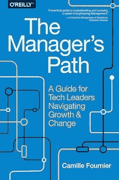
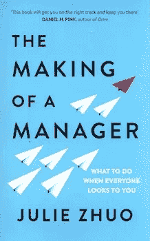
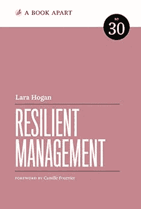
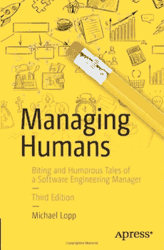

# 有抱负的科技领军人物的阅读清单

> 原文：<https://javascript.plainenglish.io/a-reading-list-for-the-aspiring-tech-lead-5c4e7b7bc7b6?source=collection_archive---------9----------------------->

作为一名技术领导者，我喜欢的一点是它给了我机会，让我能够对与我一起工作的其他工程师的职业生涯产生积极的影响。

这个机会伴随着为我管理的每一位工程师做正确的事情的责任，我认为应该非常认真地对待这件事。考虑到这一点，我试着看了很多关于不同管理技术的演讲，并且与本文更加相关。我也喜欢阅读书籍和博客帖子。

无论如何，说到这篇文章的重点，我认为分享我读过的一些最好的书籍和博客的阅读清单会很好，这样任何有抱负的技术领导者也可以从这些伟大的资源中受益。

# 经理之路

卡米尔·福尼尔写的《经理人之路》是我读的第一本关于经理人的书。当时，我在 Beamly 担任工程经理，我在寻找一些东西来帮助我驾驭管理向我报告的人和管理与我一起工作的利益相关者的复杂性。经理之路能够在这两方面帮助我。

我喜欢这本书的一个原因是，它非常有用，可以用来翻阅。它分为几个章节，涵盖了管理复杂性的递增水平，这使您可以阅读与您当前职业阶段相关的部分。

## 在线购买

**亚马逊**https://amzn.to/3jtePsr

# 经理的素质

我想推荐的第二本书是朱莉·卓的《经理人的形成》。我喜欢这本书的一点是，它详细讲述了我们作为管理者遇到的许多事情，从反馈的艺术到如何为你的团队招聘人才。

## 在线购买

【https://amzn.to/3nenP7a 

# 弹性管理

我想推荐的下一本书是劳拉·霍根的《弹性管理》。当这本书首次发布时，我很幸运地在 Lead Dev 会议上拿到了一本签名本。

我喜欢这本书的地方是它如何带你认识你的团队，进行有效的沟通，并最终在你的团队中建立信心。在当前的世界形势下，我觉得你在团队中建立的这种适应性是非常重要的。

## 在线购买

[https://abookapart.com/products/resilient-management](https://abookapart.com/products/resilient-management)

# 管理人类:一个软件工程经理辛辣而幽默的故事

我想推荐的最后一本书是迈克尔·洛普的《管理人类》。我喜欢这本关于成为软件工程经理的书的原因是它不是超级严肃的。相反，它需要一种更幽默的方式来教你成为一名伟大的管理者。

## 在线购买

**亚马逊**https://amzn.to/2Sl23QT

# 博客

虽然我提到的书籍对我作为经理的成长有很大影响，但我也喜欢阅读一些真正鼓舞人心的软件工程经理的管理博客。

## 劳拉·霍根

我想强调的第一个博客是 Lara Hogan 的一个很棒的博客，它涵盖了工程管理相关领域的广泛内容。

我最喜欢的一些文章:

*   **如何向你的队友提供挑战** 提供了关于如何确保你管理的那些人被给予适当的挑战以加速他们成长的有用见解。 [https://larahogan.me/blog/benefits-offering-challenges/](https://larahogan.me/blog/benefits-offering-challenges/)
*   向上管理是一件坏事吗？
    有趣的帖子，讲述了你如何影响经理的决策以及这样做的好处。[https://larahogan.me/blog/is-managing-up-bad/](https://larahogan.me/blog/is-managing-up-bad/)
*   一套有用的工具，帮助你的团队向内看，检查团队的角色和职责。
    [https://larahogan.me/blog/team-introspection/](https://larahogan.me/blog/team-introspection/)

## 梅里·威廉姆斯

我要感谢的第二位博主是 Meri Williams，她是今年在冠状病毒之前在世界各地举行的首席开发者大会的组织者(我参加过伦敦大会 3 次)。

与我之前提到的 Lara Hogan 的博客不同，Meri 发布了她在会议上做的演讲和简短的实用文章，这两者对一个有抱负的技术领导者都有好处。特别是，你可能会发现下面的实用文章值得一读。

*   WFH 安装技巧对于我们中的许多人来说，现在是第一次在家里工作，这是一篇关于安装的有用文章。
    [http://blog.geekmanager.co.uk/2020/04/09/wfh-setup-tips/](http://blog.geekmanager.co.uk/2020/04/09/wfh-setup-tips/)
*   处理大量的电子邮件作为一个领导者，你可能会收到更多的电子邮件，梅里威廉姆斯提供了一些她如何优化这一点的技巧。
    [http://blog . geek manager . co . uk/2014/12/14/处理大量电子邮件/](http://blog.geekmanager.co.uk/2014/12/14/dealing-with-lots-of-email/)

# 概括起来

我想用最后一个评论来结束这个阅读清单。我推荐的书籍和博客会让你对成为一名伟大的管理者有所了解，但你可能会在工作中遇到一些他们可能没有涉及到的情况。如果是这样的话，我的建议是永远对你的同事保持同情和理解。