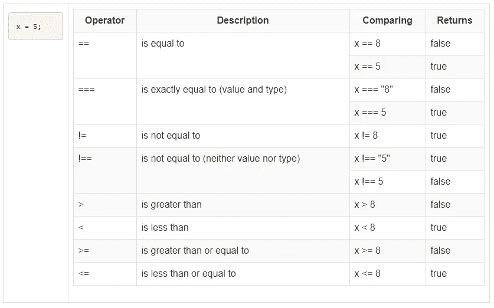
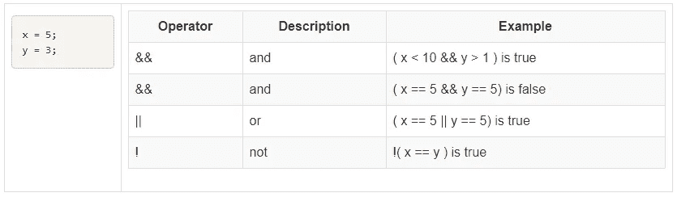

# Javascript (JS)快速介绍

> 原文：<https://javascript.plainenglish.io/a-rough-introduction-to-javascript-js-49762f2a19dd?source=collection_archive---------0----------------------->


Photo by [Pankaj Patel](https://unsplash.com/@pankajpatel?utm_source=medium&utm_medium=referral) on [Unsplash](https://unsplash.com?utm_source=medium&utm_medium=referral)

# JavaScript 如何与其他 Web 技术保持一致

1.  HTML 是用于内容的
2.  CSS 是用来展示的
3.  JavaScript 是为了交互性

*   在将数据发送到服务器之前，验证 HTML 表单中的用户输入；
*   构建无需访问服务器即可响应用户输入的表单；
*   更改 HTML 文档的外观并将数据写入浏览器窗口；
*   打开和关闭新的浏览器窗口或框架；
*   构建小而全的客户端程序。

# 您可以用 JavaScript 做的事情—一些例子:

1.  验证用户输入

*   检查输入字段中的值
*   检查密码
*   检查数值

2.无需访问服务器即可响应用户输入的表单

*   加载 URL 的表单
*   计算表单

3.使用 Javascript 语句将信息写入 HTML 文档

*   通过 document.write()编程输出；
*   调整文档颜色
*   更改/重写文档中的图像

4.打开和关闭浏览器窗口和框架

*   使用文档或编程输出创建新的浏览器窗口

5.构建小而全的客户端程序

*   计算器
*   比赛

6.控制机器人

7.无人驾驶飞机控制(IOT)

# `<script> </script>`标签

```
<html>
<head>
  <title>The Script Tag 1</title>
  <script>
  document.write("<p>Script tags can be placed in the head of an HTML document.</p>");
  </script>
</head>
<body>
  <h1>The Script Tag: Example 1</h1>
  <p>
     Script tags can also be placed in the body of an HTML document.
  </p>
  <script>
document.write("<p>Script tags will be ignored by other browsers that do not understand them.</p>");
  </script>
</body>
</html> 
```

# JavaScript 语法基础

# 评论

Javascript 支持单行和多行注释:

```
// Single and multi line comments.
// this is an example of a single line comment.

/*
 * this is an example
 * of a
 * multi line
 * comment.
 */
```

# 空白

JavaScript 中也忽略空白。

```
var hello = "Hello";

var world     =      "World!";
```

下面是一个添加空格以提高可读性的示例:

```
var foo = function() {
  for ( var i = 0; i < 10; i++ ) {
    alert( i );
  }
};foo();
```

和没有空格的相同代码。它更难阅读！

```
var foo=function() {for(var i=0;i<10;i++){alert(i);}};foo();
```

# 保留字

在声明用户定义的变量和函数时，有一些保留字不能使用。这些保留字有些是当前实现的，有些是保存下来供将来使用的，有些是由于历史原因而保留的。

在[Mozilla Developer Network JavaScript Reference](https://developer.mozilla.org/en-US/docs/JavaScript/Reference/Reserved_Words)网站上可以找到单词列表和对每个单词的深入解释。

# 标识符

标识符用来给变量和函数一个唯一的名字，这样它们就可以被这个名字引用。标识符的名称必须遵循一些规则:

*   不能是保留字。
*   只能由字母、数字、美元符号和下划线组成。
*   第一个字符不能是数字。

最佳实践是以一种对您和其他开发人员有意义的方式命名标识符。

```
// Valid identifier names.
var myAwesomeVariable = "a";
var myAwesomeVariable2 = "b";
var my_awesome_variable = "c";
var $my_AwesomeVariable = "d";
var _my_awesome_variable_$ = "e";
```

# 类型

JavaScript 中的类型分为两类:原语或对象。原始类型包括:

*   线
*   数字
*   布尔代数学体系的
*   空
*   不明确的

# 线

字符串是用单引号或双引号括起来的文本。最佳实践是始终使用其中一种。有时，字符串中包含的引号可能会与用于创建字符串的引号冲突。在这种情况下，要么使用\反斜杠对字符进行转义，要么在字符串两边使用不同的引号。

字符串可以用双引号或单引号创建。

```
var a = "I am a string";
var b = 'So am I!';

alert( a ); 
alert( b );
```

有时字符串可能包含引号。

```
var statement1 = 'He said "JavaScript is awesome!"';
var statement2 = "He said \"JavaScript is awesome!\"";var welcome = "Hello World";
```

在文字字符串“Hello World”赋值后，welcome 是一个字符串对象。

```
result = welcome.length; //result is the number 11

result = welcome.toUpperCase(); //result is HELLO WORLD

result = welcome.toLowerCase(); //result is hello world

result = welcome.charAt( 0 ); //result is the character H

result = welcome.substring( 0, 5 ); //result is the string Hello

result = welcome.indexOf( "World", 0 ); //return is the number 6\. 
//If the string is not found indexOf returns -1
```

# 数字

数字类型可以是任何正数或负数。整数和浮点值之间没有区别。

```
var num1 = 100;
var num2 = 100.10;
var num3 = 0.10;
```

JavaScript 是一种松散类型的语言。习惯于 C++或 Java 等强类型语言的程序员发现这很难适应。例如在 C/C++/Java 中下列语句，包括整数除法、

```
int result;
result = 5/10;
```

结果将等于 0。在 JavaScipt 中，没有显式的整数或浮点数。“非正式地”，你会得到一个或另一个回来。

```
result = 5/10;
```

结果将被赋值为 0.5

## JavaScript 精度

整数被认为精确到 15 位。

最大小数位数是 17，但浮点运算并不总是 100%准确:

```
var result;
result = 0.2 + 0.1; // result will be 0.30000000000000004
```

这个问题的解决方案取决于你正在处理的问题的类型。您可以对结果进行四舍五入、截断或采用更小的单位。

JavaScript 中的数字是“双精度 64 位格式的 IEEE 754 值”。

```
0.1 + 0.2 == 0.3; //false
```

您可以使用 parseInt 将字符串转换为“整数”

```
parseInt("20", 10); //20
```

如果字符串是非数字，则返回一个特殊值 NaN(“非数字”)。

```
parseInt("ABC", 10) //NaN
```

## 类型强制

每当 JavaScript 需要对两个需要相同类型但不相同的操作数执行运算时，它都会使用类型强制。

```
8 == "8" // true
```

依赖类型强制不是一个好主意。

```
null == udefined   // true
false == undefined // false
false == "false"   // false'' == '0'          // false
0 == ''            // true
0 == '0'           // true
```

若要避免类型强制，请使用===和！==运算符。

```
8 === "8"           // falsenull === udefined   // false
false === undefined // false
false === "false"   // false'' === '0'          // false
0 === ''            // false
0 === '0'           // false
```

# 布尔代数学体系的

布尔类型要么为真，要么为假。

```
var okay = true;
var fail = false;
```

# 空且未定义

Null 和 undefined 是 JavaScript 中的特殊类型。与许多其他编程语言类似，空类型是一种表示缺少值的值。未定义的类型表示一种根本没有赋值的状态。创建这种类型有两种方法:使用 undefined 关键字或根本不定义值。

```
// Achieve a null value
var foo = null;// Two ways to achieve an undefined value. 
var bar1 = undefined;
var bar2;
```

# 目标

JavaScript 中的其他内容都被认为是对象。虽然有许多内置对象，但在这里我们将介绍:

*   目标
*   排列
*   功能

# 条件语句

在 JavaScript 中，我们有以下条件语句:

*   **if 语句** —仅当指定条件为真时，使用该语句执行某些代码
*   **if…else 语句** —如果条件为真，使用该语句执行一些代码，如果条件为假，使用另一个代码
*   **如果…否则如果…else 语句** —使用该语句选择一个要执行的代码块
*   **switch 语句** —使用该语句选择要执行的多个代码块之一

# 如果语句

仅当指定的条件为真时，才使用 if 语句执行某些代码。

## 句法

```
if (condition) {
  // code to be executed if condition is true
}
```

## 例子

```
if ( age < 16 ) {
  entry = "free";
}
```

# If…else 语句

使用 if…else 语句在条件为真时执行一些代码，在条件不为真时执行另一个代码。

## 句法

```
if ( condition ) {
  // code to be executed if condition is true
} else {
  // code to be executed if condition is not true
}
```

## 例子

```
if ( age < 16 ) {
  entry = "free";
} else {
  entry = "£10";
}
```

# 如果…否则如果…else 语句

使用 if…else if…else 语句选择要执行的几个代码块之一。

## 句法

```
if ( condition1 ) {
  // code to be executed if condition1 is true
} else if ( condition2 ) {
  // code to be executed if condition2 is true
} else {
  // code to be executed if neither condition1 nor condition2 is true
}
```

## 例子

```
if ( age < 12 ) {
  entry = "free";
} else if ( age < 18 ) {
  entry = "£10";
} else {
  entry = "£20";
}
```

## 问题

这些是等价的吗，为什么？

```
if ( age < 12 ) {
  entry = "free";
} else if ( age < 18 ) {
  entry = "£10";
} else {
  entry = "£20";
}if ( age < 18 ) {
  entry = "£10" ;
} else if ( age < 12 ) {
  entry = "free";
} else {
  entry = "£20";
}
```

# JavaScript Switch 语句

## 句法

```
switch( n ) {
case 1:
  // execute code block 1
  break;
case 2:
  // execute code block 2
  break;
default:
  // code to be executed if n is different from case 1 and 2
}
```

## 例子

```
var day = new Date().getDay();
switch ( day ) {
  case 0:
    message = "Today is Sunday";
    break;
  case 1:
    message = "Today is Monday";
    break;
  case 2:
    message = "Today is Tuesday";
    break;
  case 3:
    message = "Today is Wednesday";
    break;
  case 4:
    message = "Today is Thursday";
    break;
  case 5:
    message = "Today is Friday";
    break;
  case 6:
    message = "Today is Saturday";
    break;
}document.write( message );
```

## 默认示例

```
var day = new Date().getDay();
switch ( day )
{
  case 0:
    message = "Today is Sunday";
    break;
  case 6:
    message = "Today is Saturday";
    break;
  default:
    message = "Looking forward to the weekend";
}document.write( message );
```

# 比较运算符

比较运算符在逻辑语句中用于确定变量或值之间的相等或不同。



# 逻辑运算符

逻辑运算符用于确定变量或值之间的逻辑



# JavaScript 循环

在 JavaScript 中，我们有以下循环:

*   **for** —多次循环通过一个代码块
*   **for/in** —遍历一个对象的属性
*   **while** —当指定的条件为真时，循环通过一个代码块
*   **do/while** —当指定的条件为真时，也循环通过代码块

# For 循环

for 循环通常是您想要创建循环时使用的工具。

## 句法

```
for (initial statement; boolean expression; statement) {
  // the code block to be executed
}
```

*   **初始语句**该语句在循环开始前执行。
*   **布尔表达式**该表达式被评估为真或假。如果为真，则进入循环。
*   **语句**该语句在每个循环结束时执行。

## 例子

```
for ( counter=0; counter < 10; counter++ ) {
   document.write( "<p>" );
   document.write( "Counter is: " + counter );
   document.write( "<p>" );
}
```

# While 循环

for 循环通常是您想要创建循环时使用的工具。

## 句法

```
while ( boolean expression ) {
   // the code block to be executed
}
```

*   **布尔表达式**该表达式被评估为真或假。如果为真，则进入循环。
*   **要执行的语句**代码块

## 例子

```
counter = 0;
while( counter < 10 ) {
   document.write( "<p>" );
   document.write( "Counter is: " + counter );
   document.write( "</p>" );
   counter++;
}
```

# 中断语句

**break** 语句中断循环并继续执行循环后的代码(如果有):

## 例子

```
counter = 0;
while ( true ) {    //potentially infinite loop
   if ( counter > 5 ) break;
   counter++;
}
```

# Continue 语句

**continue** 语句中断一次迭代(在循环中)，如果出现指定的条件，则继续循环中的下一次迭代。

## 例子

```
counter = 0;
while ( counter < 6 ) {
   counter++;
   if ( counter % 2 == 0 ) continue;
   document.write( "Counter is now: " + counter );
}
```

# JavaScript 对话框

# alert()；

显示带有消息的对话框

## 例子

```
alert( "Your Message Goes Here!" );
```

# confirm()；

显示一个对话框并返回一个布尔值

## 例子

```
var answer = confirm( "Are you sure you want to close...." );
if ( answer == true ) {
  alert( "You said OK!" );
} else {
  alert( "You said Cancel!" );
}
```

# 提示()；

显示对话框并返回一个字符串

## 例子

```
var answer = prompt( "Enter something here:", "anything will do" );
alert( "You said " + answer );
```

# 对话框中的换行符

要在弹出框中显示换行符，请使用反斜杠后跟字符 n。

## 例子

```
alert( "Hello,\nHow are you?" );
```

> 愿原力与你们所有的书呆子同在！