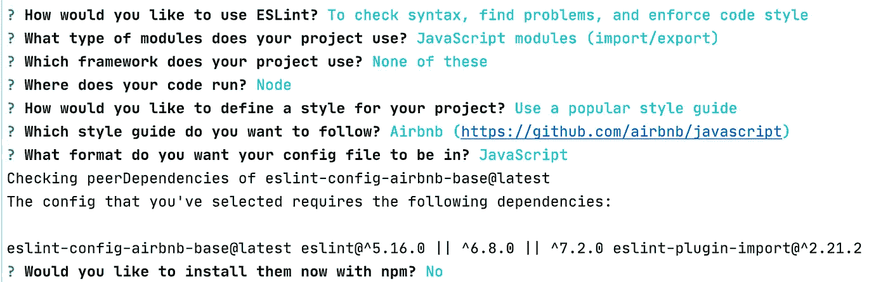
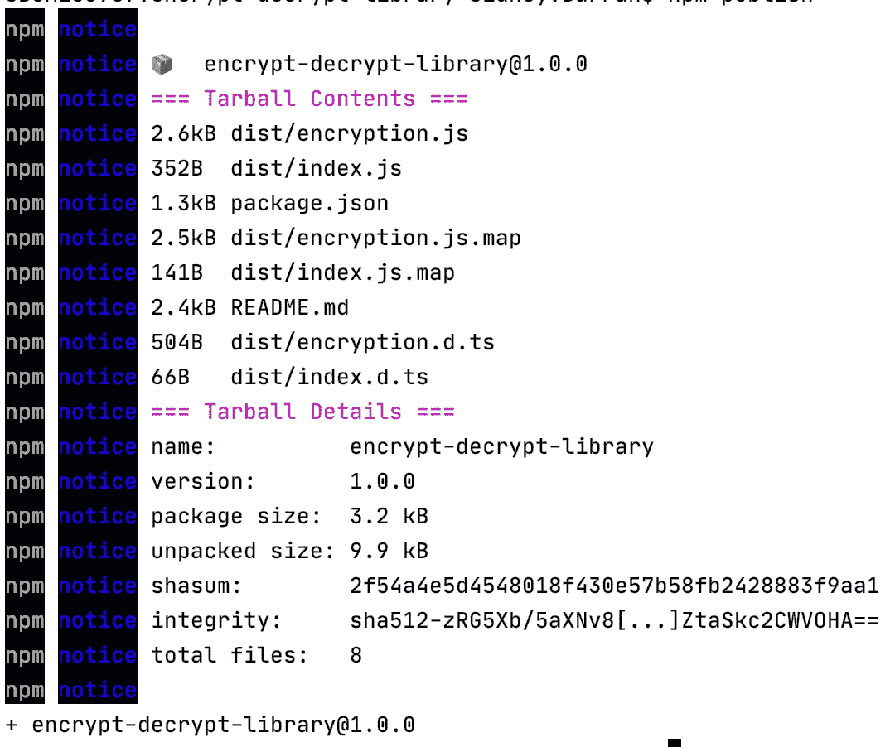

# Node.js 中带有 Typescript 的简单加密库

> 原文：<https://javascript.plainenglish.io/a-simple-encryption-library-in-node-js-with-typescript-d72c294998bf?source=collection_archive---------0----------------------->

## 如何对简单数据进行编码和加密


Photo by [Fidel Fernando](https://unsplash.com/@fifernando?utm_source=medium&utm_medium=referral) on [Unsplash](https://unsplash.com?utm_source=medium&utm_medium=referral)

在我不久前参与的一个项目中，我遇到了一个不是很独特的问题。它涉及到我们如何安全地传递可识别的用户信息，比如由 Ruby 中的第三方服务编码和加密的电话号码，以便解密和解码到我们的用户应用程序中。

```
//Link with encrypted token
https://example.com?token=XXXXX
```

Ruby 使用`[**pack()**](https://apidock.com/ruby/Array/pack)`和`[**unpack()**](https://apidock.com/ruby/String/unpack)`方法访问底层的位和字节，为有符号和无符号的大端字节序提供了直接的处理。然而，Javascript 存在不能正确处理大整数的问题，因为它只能存储最多 53 位的有符号或无符号整数。见[号。MAX_SAFE_INTEGER](https://developer.mozilla.org/en-US/docs/Web/JavaScript/Reference/Global_Objects/Number/MAX_SAFE_INTEGER) 。


Photo by [Austin Distel](https://unsplash.com/@austindistel?utm_source=medium&utm_medium=referral) on [Unsplash](https://unsplash.com?utm_source=medium&utm_medium=referral)

在这种情况下，我们共享同一个加密密钥，这个过程被称为对称加密。这意味着必须使用相同的加密密钥来解密数据。

在该项目和某些应用中，我们希望对敏感数据进行编码和加密，我们还需要能够在需要时在应用中的任何地方对这些信息进行解码和解密，这样解密后的值就不会在确保数据完整性的过程中被更改。本质上:

```
const value = 0123456789 // Initial valueconst token = encrypt(value) // Encrypted tokenconst decryptedValue = decrypt(token) // Decrypted valuevalue === decryptedValue // Must be TRUE
```

简单地使用`Base64`编码，这将混淆和创建短令牌不是一个可靠的安全解决方案，因为`Base64`字符串可以很容易地被解码。在这篇文章中，我将演示如何创建一个简单、安全和快速的对称加密解决方案来加密数据，并使用以下工具应用于任何应用程序，甚至作为简短、SEO 友好的 URL 参数:-

*   [类型脚本](https://www.typescriptlang.org/) —向 JavaScript 添加静态类型定义
*   [对称加密](https://en.wikipedia.org/wiki/Symmetric-key_algorithm) —加密技术，使用相同的加密密钥对数据进行加密和解密
*   [Crypto](https://nodejs.org/api/crypto.html) —提供加密功能的内置 Node.js 模块
*   [Buffer](https://nodejs.org/api/buffer.html)—JavaScript 的`[**Uint8Array**](https://developer.mozilla.org/en-US/docs/Web/JavaScript/Reference/Global_Objects/Uint8Array)`类的子类，用于字符编码和解码
*   使用[摩卡](https://mochajs.org/)和[柴](https://www.chaijs.com/)进行测试
*   使用 [GitHub](https://github.com/) 、 [CircleCI](https://circleci.com/) 和[语义发布](https://github.com/semantic-release/semantic-release)进行自动化测试、版本管理和软件包发布


Photo by [Fotis Fotopoulos](https://unsplash.com/@ffstop?utm_source=medium&utm_medium=referral) on [Unsplash](https://unsplash.com?utm_source=medium&utm_medium=referral)

# 发展

你还需要在全球范围内安装`**npm**`和/或`**yarn**`。参见如何[安装纱线](https://classic.yarnpkg.com/en/docs/install/)和 [NPM](https://docs.npmjs.com/downloading-and-installing-node-js-and-npm) 。我也更喜欢使用 NVM 来管理我的节点版本。

接下来，我们创建项目文件夹并设置 typescript:

```
$ mkdir encrypt-decrypt-library
$ cd encrypt-decrypt-library
```

为项目初始化`**package.json**`:

```
$ yarn init -y
```

接下来，我们需要安装 Typescript 作为开发依赖项。这是因为我们将把我们的 Typescript 代码编译成 JavaScript 用于我们的产品构建。

```
$ yarn add -D typescript
```

接下来，我们需要安装`**ts-node**`,使我们能够执行类型脚本文件，而不需要编译它们，还有`**@types/node**`。

```
// TypeScript execution for node
$ yarn add -D ts-node @types/node
```

接下来，我们需要为我们的 Typescript 配置添加一个`**tsconfig.json**`文件到项目的根目录。我们如下初始化一个`**tsconfig.json**`文件:

```
$ yarn tsc --init --rootDir src --outDir dist
```

这将在项目的根目录下生成一个初始的`**tsconfig.json**`文件，包含可能的配置选项，不重要的选项被注释掉。我已将此文件更新如下:

接下来，我们需要为我们的库安装一些额外的包。注意，NPM 的 [**crypto**](https://www.npmjs.com/package/crypto) 模块已经被弃用，因为它现在是一个内置的节点模块。这个模块为我们提供了加密功能，如 OpenSSL 的散列、加密、解密、签名、验证和 HMAC 函数。

我们将使用 [Buffer](https://nodejs.org/api/buffer.html) 类来读写无符号 64 位整数，因为 JavaScript 的最大安全整数[为 53 位，我们的库必须能够处理 64 位 big endian，尤其是当我们需要加密和解密大整数(如电话号码)时。](https://developer.mozilla.org/en-US/docs/Web/JavaScript/Reference/Global_Objects/Number/MAX_SAFE_INTEGER)

我们还需要安装 [dotenv](https://www.npmjs.com/package/dotenv) 来将环境变量从`**.env**`文件加载到`**process.env**`中。

```
$ yarn add -D dotenv
```

接下来，我们需要创建我们的`**src**`目录，然后我们的库文件如下:

```
$ mkdir src
$ touch src/encryption.ts
```

我们还需要创建一个`**.env**`文件来存储我们的环境变量和`[**.env.example**](https://gist.github.com/s-barrah/a85649c4660bf5adfc6b5ecb110661ad)`文件来放置`[**.env**](https://gist.github.com/s-barrah/7503fd5bd92b182f62c549243da3656e)`变量的所有键。出于安全原因，在`[**.gitignore**](https://gist.github.com/s-barrah/333a4ea0c8e47e8f53bc0a99b9a3bb17)`文件中必须忽略`**.env**`文件，以防止我们的环境变量进入源代码控制。

```
$ touch .env .env.example .gitignore
```

Encryption Key as Hex value

接下来，我们通过更新`**encryption.ts**`创建我们的加密类，如下所示:

在浏览器上，Javascript 提供了两个解码和编码 base64 字符串的函数，`**btoa()**`和`**atob()**`，参见 [Base64](https://developer.mozilla.org/en-US/docs/Glossary/Base64) 。由于我们的代码在浏览器之外运行，并且由于与编码和解码 UTF-16 位 [DOMString](https://developer.mozilla.org/en-US/docs/Web/API/DOMString) 相关的问题，我们将使用 [Buffer](https://nodejs.org/api/buffer.html) 类(包括`[**writeBigUInt64BE()**](https://nodejs.org/api/buffer.html#buffer_buf_writebiguint64be_value_offset)`和`[**readBigUInt64BE()**](https://nodejs.org/api/buffer.html#buffer_buf_readbiguint64be_offset)`方法)将 64 位大整数编码和解码为大端字节，反之亦然:

```
*// allocate Buffer instance*
const buf = Buffer.*allocUnsafe*(8);*// Write value to Buffer instance at the specified offset as big-endian.* buf.writeBigUInt64BE(BigInt(value));*// Read an unsigned, big-endian 64-bit integer from the Buffer instance at the specified offset
// and returns as a string* buf.readBigUInt64BE(0).toString();
```

接下来，我们还需要在我们的`**encrypt()**`和`**decrypt()**`函数中实现加密功能。我已经更新了**加密**类**T21 如下:**

为此，我们使用内置节点 [Crypto 库](https://nodejs.org/api/crypto.html)并实现[**Crypto . createcipheriv()**](https://nodejs.org/api/crypto.html#crypto_crypto_createcipheriv_algorithm_key_iv_options)和[**Crypto . createdecipheriv()**](https://nodejs.org/api/crypto.html#crypto_crypto_createdecipheriv_algorithm_key_iv_options)方法，分别使用以下参数创建并返回一个`**Cipher**`和`**Decipher**`实例:

*   `**algorithm**` —使用的底层算法，基于 OpenSSL
*   `**key**` —算法使用的原始密钥
*   `**iv**` — [初始化向量](https://en.wikipedia.org/wiki/Initialization_vector)

为了加密数据，我们使用[**crypto . createcipheriv()**](https://nodejs.org/api/crypto.html#crypto_crypto_createcipheriv_algorithm_key_iv_options)方法创建一个`**Cipher**`实例，然后使用 [cipher.update()](https://nodejs.org/api/crypto.html#crypto_cipher_update_data_inputencoding_outputencoding) 和 [cipher.final()](https://nodejs.org/api/crypto.html#crypto_cipher_final_outputencoding) 方法生成加密的数据。为了解密数据，我们使用[**crypto . createdecipheriv()**](https://nodejs.org/api/crypto.html#crypto_crypto_createdecipheriv_algorithm_key_iv_options)方法创建一个`**Decipher**`实例，并使用 [decipher.update()](https://nodejs.org/api/crypto.html#crypto_decipher_update_data_inputencoding_outputencoding) 和 [decipher.final()](https://nodejs.org/api/crypto.html#crypto_decipher_final_outputencoding) 方法生成未加密的数据。关于`**crypto**`方法和选项的更多信息，请参见 [CreateCipherIV](https://nodejs.org/api/crypto.html#crypto_crypto_createcipheriv_algorithm_key_iv_options) 和 [CreateDecipherIV](https://nodejs.org/api/crypto.html#crypto_crypto_createdecipheriv_algorithm_key_iv_options) 。

我们的`**encrypt()**`和`**decrypt()**`方法都使用[对称加密](https://en.wikipedia.org/wiki/Symmetric-key_algorithm)算法，确保用于加密数据的相同加密密钥必须用于解密数据。了解有关对称加密算法的更多信息。接下来，我们需要向我们的库添加一些测试。

## 试验

为了向我们的库添加测试，我们需要安装一些依赖项，即 [Mocha](https://mochajs.org/) 和 [Chai](https://www.chaijs.com/) :

```
$ yarn add -D mocha @types/mocha chai @types/chai
```

我们需要为我们的`**encrypt**`和`**decrypt**`方法添加一些测试。首先，我们需要在项目的根目录下创建一个`**tests**`文件夹。这个文件夹将包含我们的测试文件。接下来，我们创建一个测试文件，`**encryption.test.ts**`:

```
$ mkdir tests
$ touch tests/encryption.test.ts
```

更新`**encryption.test.ts**`文件如下:

`**ALGORITHM**`、`**ENCRYPTION_KEY**`和`**SALT**`是我们设置的环境变量。`env`文件。

接下来，我们需要用我们的`**test**`命令更新我们的`**package.json**`中的`**scripts**`属性:

```
**//** package.json**"scripts": {
  "test": "./node_modules/.bin/mocha \"tests/**/*.ts\" --require ts-node/register --require dotenv/config"
},**
```

我们能够定义在我们的`**package.json**`文件的`**scripts**`属性中运行的节点脚本。

我们使用节点 CLI 参数运行测试——Mocha 需要`**ts-node**`,这样我们就可以执行 Typescript 测试文件，而不需要编译它们。我们通过使用`**ts-node/register**`注册`**ts-node**`加载器。我们还指定了测试文件的路径。它将运行与模式匹配的`**tests**`文件夹中的每个测试文件。它还需要`**dotenv/config**`，这允许我们使用在`**.env**`文件中设置的变量。

要开始测试，我们只需在命令行中运行`**yarn run test**`。

```
$ yarn run test**yarn run v1.22.4**$ ./node_modules/.bin/mocha "tests/**/*.ts" --require ts-node/register --require dotenv/configEncryption
    Ensuring encrypting and decrypting of string and number
      ✓ should encrypt and decrypt the string correctly
      ✓ should encrypt and decrypt the number as a big integer correctly
      ✓ should encrypt and decrypt the number as a string correctly
    Ensure decrypting of Big Integer token into a valid number
      ✓ should decrypt the encoded slug to a Big Integer correctly
    Ensure decrypting of string token into a valid string or number
      ✓ should decrypt the encoded slug to a valid string correctly
    Ensure decrypting of an 8-byte Big integer token into a valid number
      ✓ should decrypt the encoded slug to a Big Integer correctly
    Ensure validation of encrypt or decrypt methods 
      ✓ should return an error message if encrypt has no value
      ✓ should return an error message if decrypt has no value
    Ensure validation of library with no configuration
      ✓ should fail to encrypt the string correctly
      ✓ should fail to decrypt the string correctly10 passing (25ms)
```

## 林挺

为了确保我们的库中有一个清晰一致的编码约定，添加林挺是很重要的。林挺通过强制执行代码风格、识别、报告和修复我们代码中的任何不一致和错误来帮助开发。对于我们的加密库，我选择了使用 [**ESLint**](https://eslint.org/) ，因为它同时支持 JavaScript 和 TypeScript。

首先，安装所有必需的开发依赖项:

*   [**诚信通**](https://www.npmjs.com/package/eslint) —诚信通林挺图书馆
*   [**@ typescript-ESLint/parser**](https://www.npmjs.com/package/@typescript-eslint/parser)—ESLint 的 TypeScript 解析器
*   [**@ TypeScript-eslint/ESLint-plugin**](https://www.npmjs.com/package/@typescript-eslint/eslint-plugin)—具有类型脚本特定 ESLint 规则的插件

```
// Install ESLint and plugins
$ yarn add -D eslint @typescript-eslint/parser @typescript-eslint/eslint-plugin
```

我们还需要安装[更漂亮的](https://www.npmjs.com/package/prettier)，它与 [ESLint](https://eslint.org/) 配合得非常好，在处理代码格式化方面非常棒。

*   [](https://www.npmjs.com/package/prettier)**—核心漂亮库**
*   **[**eslint-config-appellister**](https://www.npmjs.com/package/eslint-config-prettier)**—禁用可能与 appellister 冲突的 ESLint 规则****
*   ****[**eslint-plugin-appellister**](https://www.npmjs.com/package/eslint-plugin-prettier)—作为 ESLint 规则运行起来更漂亮****

```
**// Install Prettier and plugins
$ yarn add -D prettier eslint-config-prettier eslint-plugin-prettier// Installs husky and lint
$ yarn add -D husky lint-staged**
```

****我们还安装了 lint-staged[](https://github.com/okonet/lint-staged#readme)**，确保文件在提交前运行林挺。这确保了提交给 GIT 的所有文件没有任何林挺或格式错误。 [**Husky**](https://github.com/typicode/husky#readme) 与 lint-staged 结合使用，使我们能够在预提交时运行指定的林挺命令，并有助于使 git 挂钩更容易。你可以在这里阅读更多关于 [Git 钩子的内容。](https://git-scm.com/book/en/v2/Customizing-Git-Git-Hooks)******

****然后，我们需要为 ESLint 设置一个配置文件:****

```
**$ npx eslint --init**
```

********

****ESLint init****

****这将生成一个配置文件`.**eslintrc.js**`。我对我们的插件和规则做了一些修改:****

****接下来，创建一个`.**eslintignore**`文件，告诉 ESLint 要忽略的目录或文件，并添加以下内容:****

```
**node_modules
dist
tests
coverage
styleguide.config.jssrc/**/*.test.tsx
src/**/*.md
src/serviceWorker.ts**
```

****通过将 lint 命令添加到`**scripts**`属性来更新我们的`**package.json**`:****

```
**// **package.json****"scripts": {
  ...
  "lint": "eslint 'src/**/*.{js,ts}' --quiet --fix"
},****
```

****上述脚本可以使用`**npm run lint**`或`**yarn lint**`从命令行运行。该命令将通过所有的`.js`和`.ts`文件运行 ESLint。它将自动修复任何 ESLint 错误，但任何其他错误都将在命令行中打印出来。****

****为了配置`**lint-staged**`和`**husky**`，我们还向`**package.json**`添加了以下配置:****

```
**// package.json**"husky": {
  "hooks": {
    "pre-commit": "lint-staged"
  }
},
"lint-staged": {
  "src/**/*.{js,ts}": [
    "prettier --single-quote --write",
    "eslint --fix"
  ]
},****
```

****有了上面的配置，每当对 git 进行提交时，`**lint-staged**`将在任何具有匹配扩展名的暂存文件上运行得更漂亮和 ESLint。它将自动修复任何可以修改的错误，并将它们添加到当前提交中。但是，如果存在无法自动修复的林挺错误，它将会失败。在尝试再次提交代码之前，需要手动修复这些错误。****

********

****Husky -pre-commit****

# ****生产****

****要将我们的加密库用作 NPM 模块，我们需要导出我们的加密类，然后将我们的 Typescript 文件编译成 JavaScript。****

****首先，我们在`**src**`文件夹中创建导出文件`**index.ts**`，如下所示:****

```
**$ touch src/index.ts**
```

****并导出我们的加密类，如下所示:****

```
**import Encryption from "./encryption";

export default Encryption;**
```

****为了生产，我们将一个`**build**`脚本添加到我们的`**package.json**`的`**scripts**`属性中:****

```
**// package.json**"scripts": {
  ...
  "build": "NODE_ENV=production tsc"
},****
```

****`**tsconfig.json**`文件中编译器选项的`**rootDir**`和`**outDir**`属性指定了输入文件的根目录和编译后文件的输出目录。运行`**yarn build**`会将 TypeScript 文件编译成 JavaScript 文件放在`**dist**`文件夹中。****

****我们还需要安装`[**rimraf**](https://www.npmjs.com/package/rimraf)` dev 依赖项，它的作用类似于`**rm -rf**`命令。****

```
**$ yarn add -D rimraf**
```

****接下来，我们通过更新我们的`build`脚本来更新`**package.json**`，并添加`**main**`和`**module**`属性来设置我们的库的入口点，这是我们编译的 Javascript 文件，而`**types**`属性指向我们的 Typescript 声明入口文件:****

```
**// package.json**"scripts": {
  ...
  "build": "****rimraf ./dist &&** **NODE_ENV=production tsc"
},
......
"main": "dist/index.js",
"module": "dist/index.js",
"types": "dist/index.d.ts"****
```

****现在，当我们运行`**yarn build**`时，`**rimraf**`将在 TypeScript 编译器向`**dist**`发出新代码之前删除我们旧的`**dist**`文件夹。****

## ****证明文件****

****包含可靠的文档来帮助我们跟踪应用程序的各个方面总是很重要的。它有助于提高代码的质量，并使其更易于进一步开发、维护和知识转移。****

****接下来，我们需要在项目的根目录下创建一个`**README.md**`文件:****

```
**$ touch README.md**
```

****并更新如下:****

## ****出版****

****在发布我们的库之前，我们希望从最终的包中排除某些文件。我们将通过向我们的`**package.json**`添加一个`**files**`属性来实现这一点，该属性告诉 [NPM](https://www.npmjs.com/) 哪些`**files**`和/或`**directories**`要包含在我们的包中:****

```
**// package.json**"files": [ "dist" ],****
```

****我们还在项目的根目录下创建了一个`.**npmignore**`文件，它也指定了 [NPM](https://www.npmjs.com/) 要忽略的目录或文件:****

```
**// .**npmignore**src
node_modules
tests
.idea
coverage**
```

****接下来，我们通过在命令行运行`**npm publish**`将我们的包发布给 [NPM](https://www.npmjs.com/) 。您需要在 [NPM](https://www.npmjs.com/) 上拥有一个帐户，并且可能需要运行`**npm login**`来登录您的 [NPM](https://www.npmjs.com/) 帐户，然后您才能发布。NPM 的账户是免费的。NPM 还要求您的包的名称是唯一的。****

********

****npm publish CLI****

## ****自动化工作流程****

****我们将发布过程自动化是很重要的，因为这可以节省时间并提高代码质量。它允许我们能够自动化上面的各个步骤，例如安装依赖项、林挺、测试、版本控制和将我们的库发布到 NPM。****

****请参阅我的文章 [**如何自动化持续集成和开发、版本化和发布**](https://medium.com/@sidneyb231/how-to-automate-continuous-integration-and-development-versioning-and-publishing-a7d4b3311f3) 以获得如何使用 Github、CircleCI 和 Semantic Release 设置 CI/CD 以自动化您的工作流的分步指南，包括测试自动化、林挺、版本化、部署和发布到 NPM。****

## ****状态徽章****

****我们可能需要在我们的项目中包含构建徽章，以提供对我们的包的构建状态的公共访问。状态徽章可以嵌入到项目自述文件的顶部。****

****我们将在项目的自述文件顶部添加 CircleCI 和语义发布状态徽章。参见 [**CircleCI —添加状态徽章**](https://circleci.com/docs/2.0/status-badges/) 。****

```
**# **CircleCI Template:** 
[](<LINK>)# **Semantic Release Template**: 
[](<NPM-PACKAGE-LINK>)// **CircleCI Build Status**
[](*https://app.circleci.com/pipelines/github/s-barrah/encrypt-decrypt-library*)// **Semantic Release** 
[](*https://github.com/semantic-release/semantic-release*)// **NPM Status**
[](*https://www.npmjs.com/package/encrypt-decrypt-library*)**
```

********

****Status Badges****

## ****使用****

****要在任何项目中使用我们的库，请使用`YARN`或`NPM`进行安装:****

```
**// Via Yarn$ yarn add encrypt-decrypt-library// Via NPM$ npm install --save encrypt-decrypt-library**
```

****我们可以在项目的任何地方导入和使用:****

```
**import Encryption from "encrypt-decrypt-library";const config = {
   algorithm: process.env.ALGORITHM,
   encryptionKey: process.env.ENCRYPTION_KEY,
   salt: process.env.SALT,
} 
const encryption = new Encryption(config);// Encrypt a string
encryption.encrypt('Hello world')// Encrypted as an unsigned 64-bit Integer
encryption.encrypt(123, true)// Encrypted as string
encryption.decrypt('gmmBh17Q4QA=')

// Encrypted as an integer
encryption.decrypt('NF1r855MimY=', true)**
```

# ****结论****

****我们需要加密和解密数据的原因有很多。我们可能希望将敏感信息作为 URL 参数传递，并希望用户对其进行混淆。Base64 编码可以创建简短且 SEO 友好的 URL 令牌，在 Node 中，`[**atob**](https://www.npmjs.com/package/atob)`和`[**btoa**](https://www.npmjs.com/package/btoa)`等库可以模拟浏览器的功能，但是 Base64 编码并不安全。你可以阅读更多关于 [JavaScript Base64](https://developer.mozilla.org/en-US/docs/Glossary/Base64) 的内容。****

****本文的目的是演示如何创建一个简单易用的加密库，可以导入并在我们的任何项目中使用，将简单的字符串和数字编码和加密成简短、安全且 SEO 友好的 URL 参数。****

****有一些 NPM 图书馆提供加密和编码，比如 [CryptoJS](https://www.npmjs.com/package/crypto-js) 。您还可以探索这个 JavaScript 加密库列表，并决定哪一个适合您的用例。****

****如果对您有帮助，请随意克隆、派生或启动下面的我的简单加密库 GitHub 存储库:****

****[](https://github.com/s-barrah/encrypt-decrypt-library) [## s-barrah/加密-解密-库

### 多级加密库，用于将字符串和大整数加密成唯一的令牌，可安全用于 URL 路径…

github.com](https://github.com/s-barrah/encrypt-decrypt-library) 

# 进一步阅读

*   [对称密钥加密——在银行业中使用的原因、地点和方式](https://www.cryptomathic.com/news-events/blog/symmetric-key-encryption-why-where-and-how-its-used-in-banking)
*   [哈希函数之间的差异，对称&非对称算法](https://www.cryptomathic.com/news-events/blog/differences-between-hash-functions-symmetric-asymmetric-algorithms)
*   [Crypto-Web API 接口](https://developer.mozilla.org/en-US/docs/Web/API/Crypto)
*   [打字稿 ESLint](https://github.com/typescript-eslint/typescript-eslint)
*   [在 TypeScript 项目中使用 ESLint 和 appearlier](https://www.robertcooper.me/using-eslint-and-prettier-in-a-typescript-project)
*   [二进制字符串](https://developer.mozilla.org/en-US/docs/Web/API/DOMString/Binary)
*   [红宝石包装和解包](https://blog.bigbinary.com/2011/07/20/ruby-pack-unpack.html)
*   [JavaScript 中的高速公钥加密](https://medium.com/sharenowtech/high-speed-public-key-cryptography-in-javascript-part-1-3eefb6f91f77)****