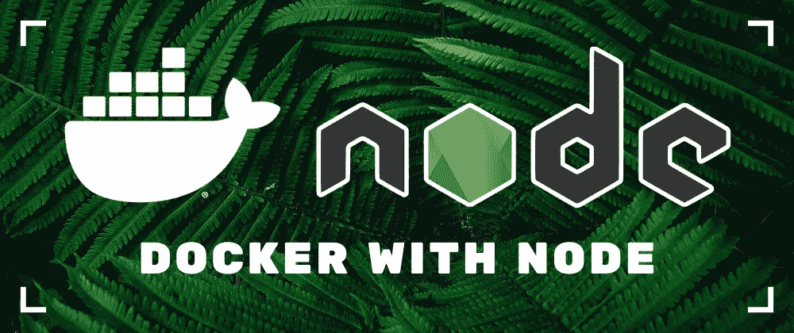

# 简单的 Node.js Docker 工作流

> 原文：<https://javascript.plainenglish.io/a-simple-node-js-docker-workflow-2ee5db1960a7?source=collection_archive---------4----------------------->



Docker 是一个很棒的工具，可以帮助开发人员以标准化的方式更有效地构建、部署和运行应用程序。我们可以在与生产中运行的应用程序相同的环境中进行开发。通过在本地进行相同的设置，可以加快调试速度，甚至防止即将出现的错误。在[之前的文章](https://dev.to/blacksonic/frontend-development-with-docker-simplified-254i)中，我已经写了一个使用 Docker 进行前端开发的简化方法，现在我将展示同样的方法用于 Node.js 项目。

# 应用程序

作为一个例子，我组装了一个基本的应用程序，并试图让它尽可能简单。如果你喜欢自己试验，你可以[克隆库](https://github.com/blacksonic/node-docker-workflow)并开始修改，看看效果如何。

```
// src/index.js
'use strict';
const express = require('express');
const port = process.env.PORT || 3000;
const app = express();

app.get('/', (req, res) => res.send('Hello World!'));

app.listen(port, () => console.log(`App listening on port ${port}!`));
```

该应用程序由一个文件组成，它启动一个 web 服务器并响应请求。我使用了众所周知的 [Express web 框架](https://expressjs.com/)来响应请求，并通过环境变量来配置端口。我们需要它是可配置的，因为这个端口可以从开发中使用的端口改变。

# 发展

为了发展，我们希望

*   与生产环境相同的环境
*   轻松设置环境
*   在浏览器中查看文件自动更改
*   在编辑器中使用代码完成

为了完成所有需求，我们将使用 Docker 和 Docker Compose 为开发和生产创建一个相同的容器，并使用 [Nodemon 包](https://nodemon.io/)在文件更改时重启应用程序。

我们可以通过将启动脚本从`node src/index.js`更改为`nodemon --watch src src/index.js`来重启文件更改。它的功能和以前一样，只是在`src`文件夹中的文件发生变化时会重新启动。

让我们进入更令人兴奋的部分，我们在本地旋转容器。

```
# docker-compose.yml
version: "3"

services:
  server:
    image: node:12
    working_dir: /app
    volumes:
      - ./:/app
    ports:
      - 3000:3000
    environment:
      - PORT=3000
    command: sh -c "npm install && npm run dev"
```

您可能注意到的第一件事是 Docker 合成配置文件不包含定制的 Docker 图像。大多数情况下，我们不需要它，但是如果有必要，我们总是可以用`build`属性来添加它。在我们的设置中，我们将使用节点基础映像。

我选择用`volumes`双向同步文件，而不是复制 Dockerfile 文件中的文件。这比复制文件更耗费资源，但是安装的 NPM 软件包出现在提供代码完成功能的主机上，这一事实使它成为一个显而易见的方法。

我们不应该想当然:我们设置可配置的环境变量。在我们的例子中，端口是可配置的，服务器在这里监听传入的呼叫。在配置中设置它使它更具可读性，因为它紧挨着`ports`定义:在这里我们声明我们希望在主机上公开哪些内部容器端口。

最后一步是用`command`属性启动应用程序。我们总是运行`npm install`命令，这可能会对启动性能产生一点影响，但也确保了容器运行时依赖项仍然是最新的。您可以从`command`中删除它，但是这样，您必须在启动容器之前或者当`package.json`文件的内容改变时手动运行它。

# 生产

我们可以愉快地使用前面的设置来开发应用程序，但是我们还必须创建一个可部署到生产环境的容器。此时，不可能进一步推迟自定义 docker 映像的创建。让我们看看它如何成为最优的。

```
# Dockerfile
FROM node:12 AS base
WORKDIR /app
COPY package*.json ./
RUN npm ci --only=production

FROM node:12-alpine
WORKDIR /app
COPY --from=base /app .
COPY . .

EXPOSE 3000

CMD npm start
```

该文件从声明起始图像开始，该图像称为“base”。命名它是不必要的，但是在使用 Dockers [多阶段构建](https://docs.docker.com/develop/develop-images/multistage-build/)时可以澄清很多。

我们必须只复制包文件，因为它们是安装用于开发的相同版本所必需的。命令`npm install`变为`npm ci --only=production`。它有两个主要区别。`npm ci`安装锁文件中定义的相同版本，并且不像`npm install`那样尝试更新它们。第二个是跳过安装`devDependencies`的`--only=production`标志，我们在生产中不需要。

我们通过跳过`devDependencies`从图像中节省了很多宝贵的空间，但是图像仍然很重要(大约 500 MB)。Node 有一个小得多的映像叫做 alpine，它只包含必要的包:更少的包意味着更少的磁盘空间、内存、更好的速度和安全性。包安装有时需要标准映像，但是使用 Docker 多阶段构建，我们可以在包安装后切换到较小的映像，并复制上一步中的包。这样，我们得到了两个世界的好处:小的映像大小和安装任何东西的能力。

如果我们用`docker images`来看图像的大小，可以看到它缩小到了 100 MB 以下。图像准备好了；我们可以将其部署到生产中。

# 摘要

起初，我并不觉得我为什么要用另一种开发所必需的技术来复杂化我的日常生活。其他人不得不向我展示，使用带有`volumes`的同步文件夹，我将无法区分在我的本地机器上开发。之后，我可以在我的本地计算机上测试相同的基础设施，他们说服我每天使用 Docker。我希望上面的工作流程能帮助其他人也了解爱 Docker 的好处。

*原载于 2020 年 1 月 28 日*[*https://dev . to*](https://dev.to/blacksonic/a-simple-node-js-docker-workflow-18dh)*。*