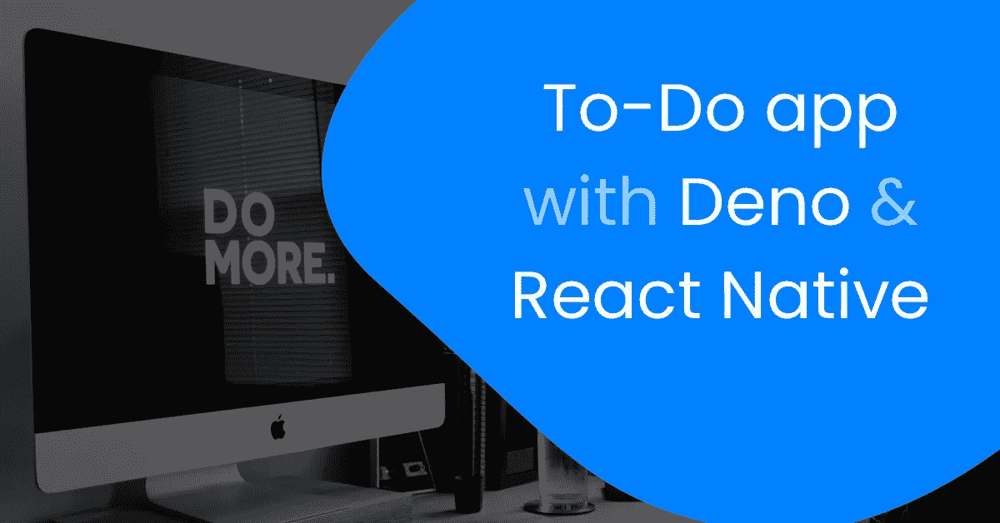

# 带有 Deno & React Native 的简单待办应用程序

> 原文：<https://javascript.plainenglish.io/a-simple-to-do-app-with-deno-react-native-fe54b9c6b460?source=collection_archive---------6----------------------->

## 使用 Deno 和 React Native 构建待办事项应用程序



Unsplash: [Carl Heyerdahl](https://unsplash.com/@carlheyerdahl)

最近 Deno(node . js 的替代品)发布了。许多人都在谈论它，因为它是新的，听起来有一些很酷的功能。今天我们就用 Deno 做一个简单的待办 app 作为 REST API。

我们会看到这些不同的东西:

*   Oak(类似 Express.js 的 HTTP 框架)
*   denon(node mon 的替代)
*   实现一个 CRUD

我们的申请将非常简单，但我们会很开心。

# 设置环境

由于我们不熟悉 Deno，我们需要安装它:

在 macOS / Linux 上:

```
curl -fsSL https://deno.land/x/install/install.sh | sh
```

在 windows 上:

```
iwr https://deno.land/x/install/install.ps1 -useb | iex
```

一旦您安装了 Deno，您将能够启动它:

```
deno
```

由于我们不喜欢每次修改时都重新运行应用程序，我们将使用[Denon](https://deno.land/x/denon)(node mon 的替代方案):

```
deno install --allow-read --allow-run --allow-write --allow-net -f --unstable https://deno.land/x/denon@v2.2.0/denon.ts
```

**奖金**

如果使用的是 VS 代码，可以安装 [Deno 扩展](https://marketplace.visualstudio.com/items?itemName=denoland.vscode-deno):

*   通过 URL 查找模块
*   缓存远程导入
*   …

# 创建我们的项目

现在我们的环境已经准备好了，我们可以开始编码了。让我们创建一个新文件夹并运行以下命令:

```
denon --init
```

它将生成一个 Denon 文件来运行您的脚本(有点像 package.json):

denon.json

我们现在可以在 src/index.ts 下创建条目文件

index.ts

这个文件非常简单，它:

*   在端口 3000 上创建带有 Oak 的服务器
*   提供来自“router.ts”的路由

因此，我们需要创建路由器文件:

router.ts

路由器将导入控制器并在不同的 URL 上为其服务。

现在我们需要创建控制器，但在此之前，我们将创建一个连接到 MongoDB 数据库的文件。因此，我们将创建一个新文件“utils/db.ts ”,如下所示:

utils/db.ts

我们用的是 [deno_mongo 模块](https://deno.land/x/mongo)(暂时不是很稳定)。

## 创建任务控制器

在创建控制器之前，我们将创建一个模型来定义我们的任务对象。创建一个新文件 **models/Task.ts** :

models/Task.ts

## **创建任务**

createTask

## **获取任务**

getTasks

## **更新任务**

你可以看到我正在使用`checkOid`功能。这个函数有助于检查 id 是否是 mongo ObjectId。在我写这篇文章的时候，mongo 模块是不稳定的，如果 ObjectId 不正确，就会崩溃。我已经在 **utils/checkOid.ts** 下创建了函数:

utils/checkOid.ts

## **删除任务**

## 修改 denon.json

现在我们的应用程序已经编写好了，我们需要修改 **denon.json** 文件来运行它:

denon.json

现在我们的 API 已经可以使用了，我们可以创建我们的 React 本地应用程序了。

你可以在这里找到 API 的代码:[dmg.link/blog-todo-api-repo](http://dmg.link/blog-todo-api-repo)

# 反应本地零件

我们现在可以创建我们的应用程序了。我们将使用 Expo 最低配置:

```
expo init ToDo
```

我们现在可以创建组件了:

*   主屏幕(所有任务和创建任务)
*   撰写任务
*   工作

## 让我们从**主屏幕**开始:

HomeScreen.tsx

它将获取任务并在平面列表中显示它们。

## 我们的任务组件:

Task.tsx

在这个组件中，我们显示任务，并允许用户将其标记为完成✅或删除它🗑

## 然后编写任务组件:

ComposeTask.tsx

我们的应用程序可以使用我们的新 Deno API。你可以在这里找到代码和样式:【dmg.link/blog-todo-app-repo】T2。

GitLab 回购:

*   app:【dmg.link/blog-todo-app-repo 
*   API:[dmg.link/blog-todo-api-repo](http://dmg.link/blog-todo-api-repo)

**你可以在这里** **找到我的其他文章并关注我** [**。感谢阅读，我希望你今天学到了一些新东西🚀**](https://dmg.link/blog)

[](https://levelup.gitconnected.com/automate-your-react-native-app-with-fastlane-ea516b4a893) [## 使用浪子自动化您的 React 原生应用程序

### 简化截图、测试版部署、应用商店部署和 React 原生应用的登录🚀

levelup.gitconnected.com](https://levelup.gitconnected.com/automate-your-react-native-app-with-fastlane-ea516b4a893) [](https://medium.com/swlh/how-to-use-face-id-with-react-native-or-expo-134231a25fe4) [## 如何在 React Native 或 Expo 中使用 Face ID

### 将生物认证应用到 React Native 或 Expo 应用中。让您的用户使用它登录。

medium.com](https://medium.com/swlh/how-to-use-face-id-with-react-native-or-expo-134231a25fe4) 

## 坦白地说

喜欢这篇文章吗？如果有，通过 [**订阅我们的 YouTube 频道**](https://www.youtube.com/channel/UCtipWUghju290NWcn8jhyAw) **获取更多类似内容！**