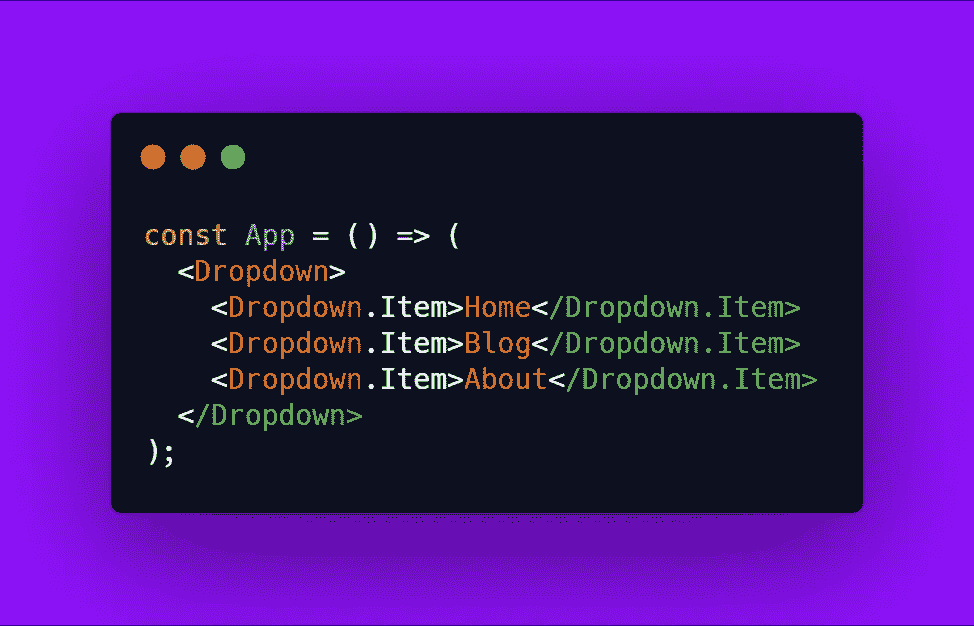
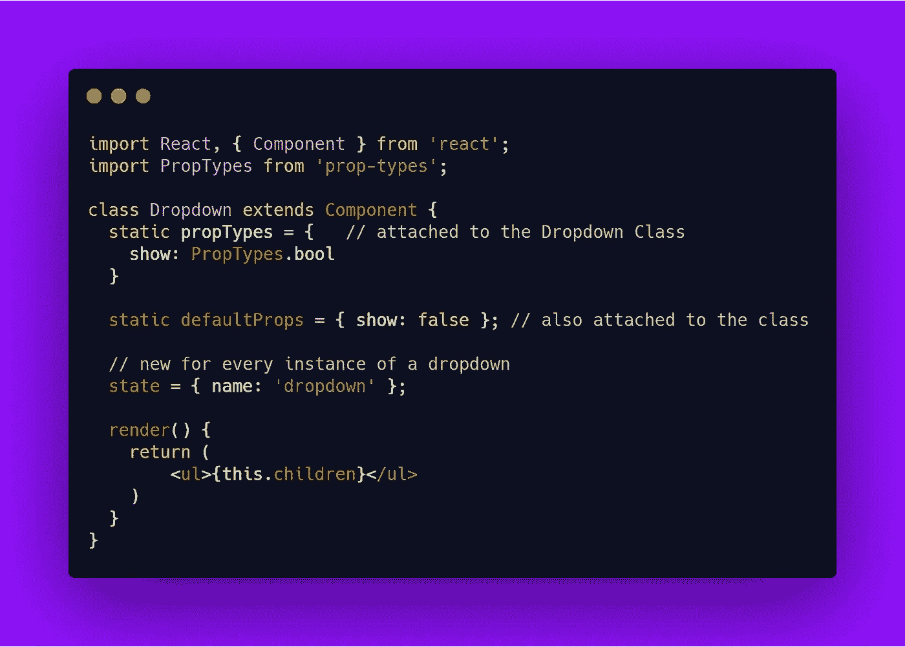
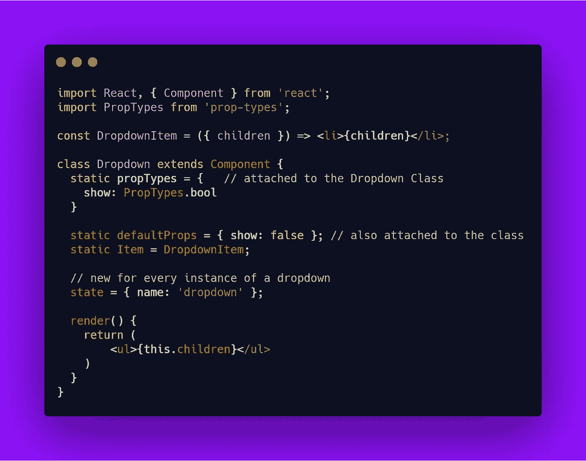

# 立即提高 React 代码可读性的一个简单技巧

> 原文：<https://javascript.plainenglish.io/a-simple-trick-to-immediately-improve-your-react-code-readability-c75ab29ab6bf?source=collection_archive---------1----------------------->

## 一个简单的关键字来管理它们

Fixing your UI like a king

当我第一次开始查看我新工作项目的 [React](https://it.reactjs.org/) 代码库时，我注意到了一个**有趣的模式**。它引起了我的注意，因为我可以理解发生了什么，但现在如何。

Finding this in my code was.….weird.

实际上，我发现这并不罕见，而且对我的代码库来说很特别。但是，仍然有些人没有意识到这一点，我想向你展示这个技巧。

**外观:**我们正在创建下拉菜单的子组件**。**

****这实际上是:**我们利用`static`关键字将一个组件“附加”**到另一个组件上。****

## ****理解“静态”****

****你可能对这个来自语言的关键字很熟悉，比如 **Java** 或者 **C++** 。这是有意义的，因为`static`的概念与类严格相关，因为****

> ****静态属性是类的属性，而不是类的实例的属性****

****举个使用 React 的例子，你可能将这个关键字与`propTypes` `defaultProps`或`displayName`结合使用。****

****让我们假设你在一个组件中定义了这些**实体******

********

****Using static in our classes****

****现在，如果你有两个下拉列表实例**，那么`propTypes`和`defaultProps` **在两个**中保持不变。而状态可以独立地为每个实例**突变**。**********

## **用“静态”更好地记录你的代码**

**回到第一个例子，现在我们知道`static`做什么，我们可以进一步**利用它**。让我们将下拉列表的`item`定义为它的静态属性**

****

**“Attaching” a component to another**

**现在我们可以用这个小技巧来创建这样的列表**

****

**A new tool under your belt**

**我相信就像这样简单，它可以带来**自文档化**您的组件的优势。并且还提供这种**接口**，用户在编写 UI 的新部分时可以依赖它。**

**唯一的缺点是，当然，因为我们正在使用`static`，我们的`Dropdown`组件**被要求是一个类**。**

## **结论**

**分析你的代码，理解它，并且**试图让它变得更好**。这些是使用代码库的基本支柱。我确信，使用一种面向**的方法，总是用小的改变来改进** **你的代码**，应用程序可以在**可用性、管理和可扩展性方面受益。****

**但是不要忘记，代码是写来被机器解释的，但是被人类阅读的。所以找到这些提高可读性的小方法总是好的。**

**—皮耶罗**

## ****用简单英语写的 JavaScript 笔记****

**我们已经推出了三种新的出版物！请关注我们的新出版物:[**AI in Plain English**](https://medium.com/ai-in-plain-english)[**UX in Plain English**](https://medium.com/ux-in-plain-english)[**Python in Plain English**](https://medium.com/python-in-plain-english)**——谢谢，继续学习！****

****我们也一直有兴趣帮助推广高质量的内容。如果您有一篇文章想要提交给我们的任何出版物，请发送电子邮件至[**submissions @ plain English . io**](mailto:submissions@plainenglish.io)**，并附上您的 Medium 用户名，我们会将您添加为作者。另外，请让我们知道您想加入哪个/哪些出版物。******