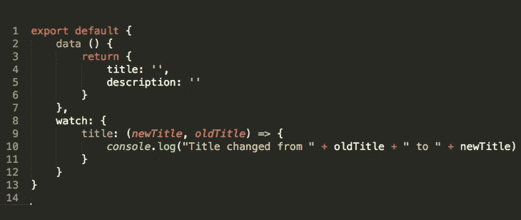

# 一个简单的初学者 Vue 观察教程

> 原文：<https://javascript.plainenglish.io/a-simple-vue-watcher-tutorial-for-beginners-4054cb696185?source=collection_archive---------5----------------------->



在开发 Vue 应用的整个过程中，您将拥有**吨**的反应式数据属性。您的应用程序将跟踪输入字段、数据计算和一系列其他属性，并且可能需要在值更新时执行操作。Vue 观察者观察特定的属性，并且能够检测该属性何时改变。它本质上充当特定数据属性的事件侦听器。

我认为理解 watchers 如何在 Vue 中工作的最好方法是看一个例子。别浪费时间了！我们来举个例子。

# 如何使用 Vue 观察器？

Vue Options API 提供了一个观察器选项，您可以在其中定义观察器。要使用它，您必须首先在您的数据对象中有一个要跟踪的属性。该代码将如下所示。

```
export default {
   data () {
      return {
         title: '',
         description: ''
      }
   },
   watch: {
      // your watchers will go in here!
   }
}
```

然后，我们必须看看一个观察器方法的结构。你所要做的就是声明一个与你想要观察的属性同名的函数。它应该有两个参数:第一个是属性的旧值，第二个是新值。每当值改变时，该功能将被触发。

例如，这是 title 属性的监视器。

```
watch: {
   title: (newTitle, oldTitle) => {
      console.log("Title changed from " + oldTitle + " to " + newTitle)
   }
}
```

简单对！观察者并不是一个令人困惑的话题。事实上，它们是任何框架中反应性的**基本原则之一。观察家们带来的最大的优点和缺点是他们的灵活性。从积极的一面来看，它们适应性很强，可以用来进行 API 调用、触发辅助动作等等。相反，在很多情况下，Vue 为您的使用情形提供了替代解决方案，说到…**

# 警告！Vue 观察器通常不是解决方案

从更广泛的角度来说，观察器是 VueJS 中计算方法的一种更一般化的形式。有几次，我看到人们不必要地使用观察器，而一个计算属性只需较少的工作就能满足需要。

如果您不熟悉计算属性，请查看本教程。

计算属性非常擅长处理用例，例如:

*   **从现有数据创建新数据**值(例如，fullName = fName + lName)
*   将令人困惑的 JS 表达式提取到可读性更好的属性中
*   你希望一个属性有超过一个数据依赖关系

在这些情况下，无论是从可读性**还是可维护性**的角度来看，使用计算属性对你的项目来说都是更好的。此外，在一些用例中，只需使用简单的老方法就可以解决问题，而无需进入 Vue 组件的更复杂选项。

我不能确切地告诉你你的项目需要用什么。但是如果你需要帮助来决定什么是最适合你的，我推荐一份来自 [Flaviocopes](https://flaviocopes.com/vue-methods-watchers-computed-properties/) 的清单。

# 那么我什么时候应该使用观察器呢？

读完最后一部分，你可能会想，*“等等。所以读这篇文章毫无意义？”*答案是否定的——在非常常见的用例中，使用观察器仍然是最佳选择。

基本上，如果您需要在属性更改时执行一些额外的操作，那么 watchers 是一个不错的选择。

一些使用案例包括:

*   观察一个值，直到它达到一个**特定值**
*   当值改变时，进行异步的 **API 调用**
*   您不需要将现有的数据合并到一个新的属性中

# 这应该足够让你开始了。

这个快速的小教程中的信息是一个很好的开始。和往常一样，如果你想了解更多关于技术细节的信息，我建议看一下[文档](https://vuejs.org/v2/guide/computed.html#Watchers)——这是我对任何框架的最爱之一。

[如果你有兴趣了解更多关于 Vue 3 的知识，请下载我的免费 Vue 3 备忘单，里面有一些基本知识，比如组合 API、Vue 3 模板语法和事件处理。](https://learnvue.co/vue-3-essentials-cheatsheet/)