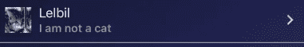

# 用 Jest 测试 React 本地组件

> 原文：<https://javascript.plainenglish.io/a-simplified-real-world-example-of-testing-a-react-native-component-with-jest-45dc7b1a31ad?source=collection_archive---------5----------------------->


Photo by [Rodion Kutsaev](https://unsplash.com/@frostroomhead?utm_source=medium&utm_medium=referral) on [Unsplash](https://unsplash.com?utm_source=medium&utm_medium=referral)

今天我将向你展示如何用**React-Native-testing-library**和 **Jest** 测试你的 React 原生组件。

我们将使用一个简单的组件来呈现一个**列表项**，看起来像这样:



I am a person. Not even a cat person. I like dogs better.

我假设您已经运行了一个 expo/react-native 项目，因此您可以向其中添加下面的组件代码:

```
import * as ***React*** from 'react';
import { StyleSheet, Image } from 'react-native';
import { ListItem } from 'react-native-elements';

export default function UserListItem(props) {
    const { user, onPressItem } = props

    return (
        <ListItem
            testID={'userListItemTestID'}
            key={user.id}
            avatar={<Image source={{uri: user.profile_pic }} style={styles.avatarImage}/>}
            title={user.username}
            titleStyle={{ color: 'white' }}
            subtitle={user.bio}
            onPress={() => { onPressItem(user) }}
        />)
}

const styles = StyleSheet.create({
    avatarImage: {
        height:35,
        width:35,
    }
})
```

现在一切都准备好了，让我们开始测试吧。
首先，我们需要用这些命令安装依赖项(这些步骤来自 expo 的 [Testing with Jest](https://docs.expo.io/versions/latest/guides/testing-with-jest/) guide，稍作调整，使用 react-native-testing-library 代替 react-test-renderer):

```
npm i jest-expo react-native-testing-library --save-dev
```

现在将它添加到您的`package.json`文件中:

```
"scripts": {
  ...
  "test": "jest"
},
"jest": {
  "preset": "jest-expo",
  "transformIgnorePatterns": [
    "node_modules/(?!(jest-)?react-native|react-clone-referenced-element|@react-native-community|expo(nent)?|@expo(nent)?/.*|react-navigation|@react-navigation/.*|@unimodules/.*|unimodules|sentry-expo|native-base|@sentry/.*)"
  ]
}
```

## 现在我们准备好编写我们的第一个测试了！

让我们从创建一个`__tests__`文件夹开始。因为我们组件的文件叫做`UserListItem.js`，所以只有调用我们的测试`UserListItem.test.js`才是相关的，这样 jest 会把它当作一个测试文件。我们将把我们的测试文件放到新创建的`__tests__`文件夹中，文件的内容如下:

```
import ***React*** from 'react';
import { ***render***, ***cleanup***, ***fireEvent*** } from 'react-native-testing-library';

import UserListItem from '../Components/UserListItem';

***describe***('<UserListItem />', () => {
    afterEach(***cleanup***)

    ***it***('calls onPress event to triger onPressItem with user as argument', () => {
        const onPressItemMock = ***jest***.fn()
        const user = {
            "id": "123",
            "profile_pic": "[**http://placekitten.com/g/200/300**](https://placekitten.com/g/200/300)",
            "username": "Lelbil",
            "bio": "I am not a cat"
        }

        const { getByTestId } = ***render***(<UserListItem user={user} onPressItem={onPressItemMock} />)

        ***fireEvent***.press(getByTestId('userListItemTestID'))
        ***expect***(onPressItemMock).toHaveBeenCalledWith(user);
    });
});
```

测试非常简单，当我们的 **UserListItem** 组件中的 **ListItem** 被按下时，我们启动一个要调用的模拟函数，然后我们触发 press 事件并检查我们的模拟是否用正确的参数调用。`afterEach`钩子确保每次测试运行后所有的东西都被清理干净，所以测试是等幂的。当然，还有更多的事情可以做或者测试，比如孩子，风格..等等

现在，关键时刻到了。转到终端，键入`npm run test`并按回车键。您的测试应该开始运行，几秒钟后，您应该会看到世界上最美丽的绿色在说:

```
PASS  __tests__/UserListItem.test.js
  <UserListItem />
    ✓ calls onPress event to triger onPressItem with user as argument (51ms)Test Suites: 1 passed, 1 total
Tests:       1 passed, 1 total
Snapshots:   0 total
Time:        3.526s, estimated 4s
Ran all test suites.
```

恭喜你。您刚刚成功运行了您的第一个测试。狂野一点。

# 快照测试

有些人可能会认为人类是一种极其懒惰的动物。如果你们中的一些人是人，因此懒惰，你可以让 Jest 为你写测试。这被称为[快照测试](https://jestjs.io/docs/en/snapshot-testing)。

快照测试实际上是获取组件的快照，然后对于每个未来的测试，将组件与第一次获取的快照进行比较。如果它们不同，测试就失败了。就这么简单。这对于确保我们不会意外更改组件非常有用。让我们一起编写我们的第一个快照测试。

因此，在第一个场景之后，我们将添加另一个场景，如下所示:

```
***it***('matches the snapshot', () => {
    const onPressItemMock = ***jest***.fn()
    const user = {
        "id": "123",
        "profile_pic": "http://placekitten.com/g/200/300",
        "username": "Lelbil",
        "bio": "I am not a cat"
    }
    const { toJSON } = ***render***(<UserListItem user={user} onPressItem={onPressItemMock} />)

    ***expect***(toJSON()).toMatchSnapshot()
})
```

这比第一个更简单。我们用`npm run test`再次运行测试。测试通过了，因为这是我们第一次运行快照测试，所以没有可用的快照。所以 Jest 为我们创造了一个。

您现在应该会注意到一个名为`__snapshots__`的新文件夹，您将在其中找到您的快照文件。现在，如果您再次运行测试，它将毫无问题地通过。但是如果有一天我不小心更改了 UserListItem 组件中的某个内容，这个测试就不会再通过了，我就会知道我破坏了我的小而美的组件。幸运的是，我将是第一个知道的人，而不是我的用户。

就这样，孩子们，现在出去写那些测试。你会对你的代码更有信心，引入更少的错误。记住:

> 未经测试的代码是被破坏的代码——莫里茨·范·里斯

有用链接:
[https://call stack . github . io/react-native-testing-library/docs/API](https://callstack.github.io/react-native-testing-library/docs/api)
[https://jestjs.io/docs/en/expect](https://jestjs.io/docs/en/expect)

## **简明英语笔记**

你知道我们有四种出版物吗？给他们一个 follow 来表达爱意:[**JavaScript in Plain English**](https://medium.com/javascript-in-plain-english)[**AI in Plain English**](https://medium.com/ai-in-plain-english)[**UX in Plain English**](https://medium.com/ux-in-plain-english)[**Python in Plain English**](https://medium.com/python-in-plain-english)**—谢谢，继续学习！**

**此外，我们总是有兴趣帮助推广好的内容。如果您有一篇文章想要提交给我们的任何出版物，请发送电子邮件至[**submissions @ plain English . io**](mailto:submissions@plainenglish.io)**，并附上您的媒体用户名和您感兴趣的内容，我们将会回复您！****