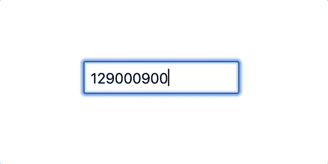
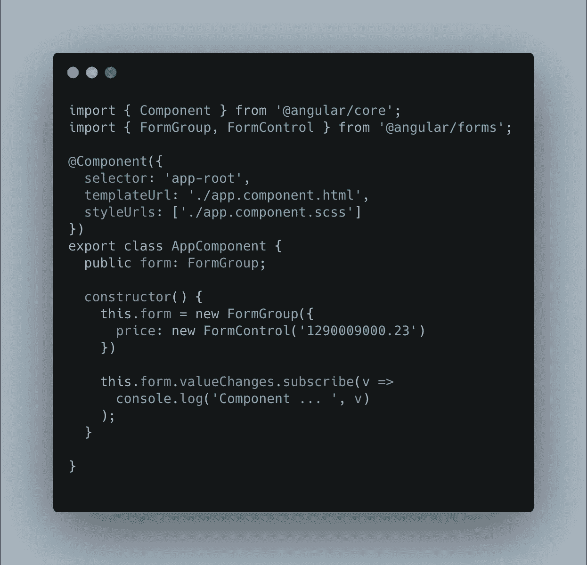
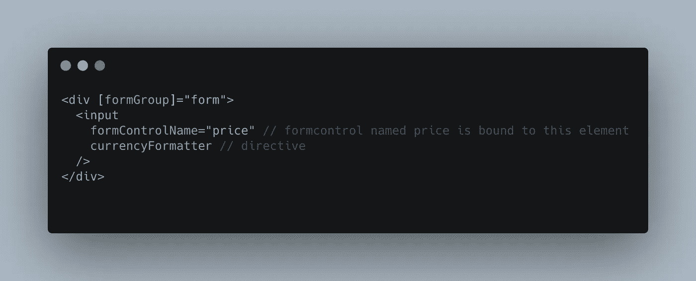
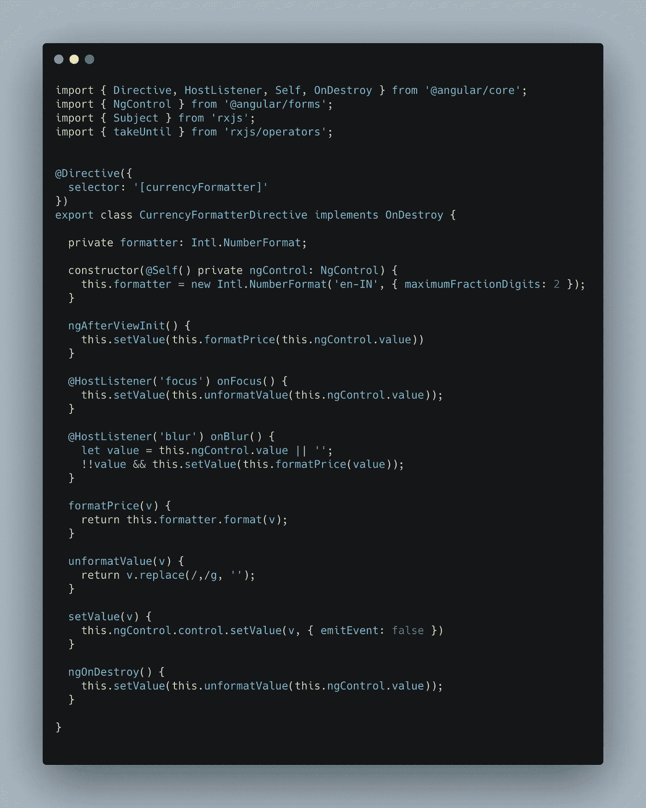
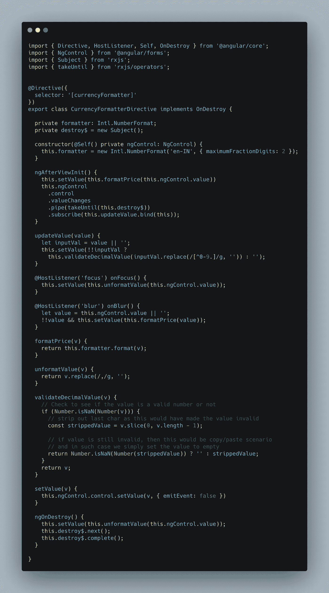

# 角度反应形式的货币格式器

> 原文：<https://javascript.plainenglish.io/a-step-by-step-guide-to-build-a-currency-formatter-directive-for-angular-reactive-form-controls-d7e2c230d05b?source=collection_archive---------0----------------------->

Photo by [Niels Steeman](https://unsplash.com/@nielssteeman?utm_source=unsplash&utm_medium=referral&utm_content=creditCopyText) on [Unsplash](/s/photos/currency?utm_source=unsplash&utm_medium=referral&utm_content=creditCopyText)

一般来说，几乎所有的应用程序都需要表单来处理用户输入，货币就是其中之一。随着 UX 设计的出现，让货币输入具有交互性和易用性的方法发生了很大变化。

我认为，许多人都同意，货币输入是在其他事物中很难开发的事物之一。在 Angular 中，实现这种特性的指令很方便，因为它很容易改变元素的行为和外观。在本文中，我想一步一步地介绍如何构建自定义指令 currency-formatter。

首先，我开始列出货币输入所需的功能。这些都是通用的，适用于大多数应用程序。

1.  在初始化期间，输入应该具有格式化的货币值
2.  当聚焦时，该值应该变回原来的数字格式
3.  当用户开始键入时，它应该验证输入，并且应该只允许数字和小数点分隔符(' . '))除非它不存在。
4.  当粘贴事件发生在输入上时，如果输入是有效的，则应该只使用新值更新输入，否则应该将输入置空。

为了展示这个输入应该是什么样子的 gif 表示，这里是

A gif representation of currency input working

**实现/消费者(本例中的组件):**

让我们创建一个带有输入元素的组件，并用反应式表单控件进行配置。

App component ts file

这里我们创建了一个表单组，它有一个名为`price`的控件。默认情况下，我们在表单创建过程中为 price 设置一些随机值。在实时场景中，这个值可能是空的或者来自后端。

HTML for app component

HTML 部分很简单，我们只是添加了一个由 div 元素包装的输入。div 元素上的`formGroup`绑定定义了表单的开始，通过使用传入的名称，`formControlName`动态地将表单控件绑定到输入。

另外，如果你注意到我们已经为 input 添加了一个指令`currencyFormatter`，我们现在就要实现它。

**指令执行:**

首先，指令应该控制表单控件，以便在需要时可以更新格式化和未格式化的值。

> Angular 有一个名为 NgControl 的类，这正是我们在这里所需要的
> Angular docs 链接:[https://angular.io/api/forms/NgControl](https://angular.io/api/forms/NgControl)
> Angular 在放置在主机元素上的所有指令中使用 DI 动态注入 NgControl，如果它们绑定到一个表单控件。

因此，在我们的例子中，我们唯一需要做的事情就是将`ngControl`添加到我们的构造函数中，Angular 在构造指令时会注入这个函数。

如果我们快速查看我们的指令实现，它看起来像这样

现在，我们可以访问表单控件了。下一步是通过指令在宿主元素上插入模糊和焦点事件，这样我们就可以格式化和取消格式化输入值。

为了格式化该值，我们使用了`Intl.NumberFormat` API。该应用编程接口采用可选的`locale`和`NumberFormatOptions`，这使得格式化值更灵活。

> 更多关于国际号码的信息。数字格式可以在这里找到
> [https://developer . Mozilla . org/en-US/docs/Web/JavaScript/Reference/Global _ Objects/Intl/NumberFormat](https://developer.mozilla.org/en-US/docs/Web/JavaScript/Reference/Global_Objects/Intl/NumberFormat)

未格式化值就像删除所有出现的`,`一样简单，它是千位分隔符。所以现在我们已经处理了`blur`和`focus`了，在这里我们格式化和未格式化值。下面是我们到目前为止的代码

如果您注意到`setValue`方法，我们通过用`{ emitEvent: false }`传入可选的`options` 对象来更新控制值。这是为了避免表单控件和父表单组上的`valueChanges`和`statusChanges`触发不必要的事件。

> 来自 Angular docs:[https://angular.io/api/forms/FormControl#setvalue](https://angular.io/api/forms/FormControl#setvalue)
> 
> `emitEvent`:当为真或不为真(默认)时，`statusChanges`和`valueChanges`可观测值在控制值更新时均发出最新状态和值的事件。如果为 false，则不会发出任何事件。

现在是处理用户输入和复制/粘贴场景的真正部分。
为了验证用户输入，我创建了一个订阅来倾听表单控件上的值变化，我们在其中验证和更新值。

这是货币格式化程序指令的最终代码

我创建了一些 util 方法来验证用户输入值，以使它们可重用。此外，当指令被销毁时，也就是当宿主元素被销毁时，我们正在用未格式化的值更新表单控件值，同时也完成了我们的订阅。

就这样。现在，我们都准备好将这个货币格式化程序添加到任何需要表现得像货币输入的输入中，并在本文开头列出我们想要的特性。

谢谢你的阅读！

**源代码链接:**
[https://github.com/kondareddyyaramala/currency-input](https://github.com/kondareddyyaramala/currency-input)