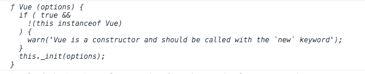

# 构建第一个 VueJS 插件的分步指南

> 原文：<https://javascript.plainenglish.io/a-step-by-step-guide-to-building-your-first-vuejs-plugin-72a50b289dd6?source=collection_archive---------5----------------------->


Photo by [Max Duzij](https://unsplash.com/@max_duz?utm_source=medium&utm_medium=referral) on [Unsplash](https://unsplash.com?utm_source=medium&utm_medium=referral)

随着 VueJS 越来越受欢迎，社区创建的 VueJS 插件变得越来越普遍，也越来越强大。

事实上，有一些插件我觉得*非常有用。例如，有惊人的 [UI 库](https://learnvue.co/2019/12/8-free-vue-icon-libraries-to-pretty-up-your-web-app/)和实用插件，节省了我大量的开发时间。*

虽然创建你自己的插件看起来是一项艰巨的任务，但它实际上比你想象的要可行得多。本教程结束时，您将拥有…

*   创建了您的第一个 VueJS 插件
*   它们如何工作的概述
*   学习了构建更复杂插件的所有工具

是时候投入进去了！！

# 如何设置你的插件

广义地说，我们的插件只是一个暴露了*的 Javascript 模块。安装*方法。这个方法有两个参数

1.  Vue 构造函数
2.  可供选择的对象

让我们按时到达。

在我们的 Vue 项目中，在 *src/plugins 创建一个新文件夹。*

然后在我们的新文件夹中，我们可以实际创建我们的插件文件。对于本教程，我将其命名为 *first-plugin.js*

在我们的新插件文件中，我们应该遵循一个典型的 [ES6 模块模式](https://tylermcginnis.com/javascript-modules-iifes-commonjs-esmodules/)也就是整个“导出默认”的东西。默认导出允许我们从文件中导出插件，并允许其他文件导入它。

接下来，就像我们之前讨论的，我们的插件**必须**公开一个. install(Vue，options)方法。这是我们安装插件时 Vue 实际调用的。

所以现在，框架代码应该看起来有点像这样。

```
export default {
   // called by Vue.use(FirstPlugin)
   install(Vue, options) {

   }
}
```

现在，让我们实际上添加一些东西到这个代码。

# 向插件添加功能

既然我们已经建立了插件的轮廓，我们可以开始构建它了。有几个不同的选项可以用来添加功能。现在，我们将只讨论一个快速简单的方法(不要担心，稍后我们将讨论更高级的技术)。

## 构建您的第一个插件

一个简单的方法是创建一个全局 mixin，它将包含在所有的 Vue 实例中。这可以通过使用 [Vue.mixin](https://vuejs.org/v2/guide/mixins.html#Global-Mixin) 功能来实现。

如果你不熟悉，这是关于 [VueJS mixins](https://learnvue.co/2019/12/how-to-manage-mixins-in-vuejs/) 的基本概述。本质上，它们允许您注入额外的组件选项。它们是提取和重用组件间通用功能的好方法。Mixins 也允许你的插件访问 Vue 生命周期挂钩。

为了给插件添加 mixin，我们在 Vue.mixin 函数中声明了我们的附加组件选项。首先，我用 console.log 语句添加了一个已创建的生命周期挂钩。

我们的插件代码现在应该是这样的。

```
export default {
  // called by Vue.use(FirstPlugin)
  install(Vue, options) {

    // create a mixin 
    Vue.mixin({
      created() {
        console.log(Vue);
      }
    });
  }
}
```

# 安装您的插件

如果你现在运行你的项目，你会发现什么都没有改变。那是因为我们还没有安装我们的插件。

谢天谢地，这是一个超级简单的两行程序。在我们的 src/main.js 文件中——声明我们的 Vue 构造函数的文件——我们只需导入并安装我们的插件文件。

这是通过这几行代码完成的。

```
import FirstPlugin from "./plugins/first-plugin.js"; Vue.use(FirstPlugin);
```

Vue.use 的一个优点是它可以确保你的插件只安装一次。如果你不小心添加了两次，它会降低你的应用程序的速度，并且可能会弄乱一些功能。谢天谢地，Vue 开发者提供了这个安全网。

最后。我们已经安装了插件。现在，如果我们运行我们的项目并检查日志，我们应该在控制台中看到一些输出。



# 让我们让它变得真正有用

好极了。你已经正式创建了你的第一个插件。但是它并没有真正做什么太有用的事情。

让我们来看看一些使你的插件实用的好方法。

# 声明全局属性

全局数据/方法是向代码添加广泛功能的有用方式。也超级好做。假设我们希望我们的应用程序的当前版本是一个全局属性。大概是这样的…

```
install(Vue, options) {
   // define a global property
   Vue.VERSION = 'v2.0.3';
}
```

需要注意的一点是过度使用全局变量。全球范围过于拥挤，使用起来很痛苦，这是非常容易的。

# 定义实例属性

这是我最喜欢的添加插件的方式之一。实例属性是向 Vue 项目添加数据和方法的一种便捷方式。我更喜欢使用实例属性，以保持我的全局范围整洁和易于理解。

在这个例子中，我刚刚创建了一个实例方法，它接受一个字符串并放在*标签中。*

*注意:$不是必要的语法；这只是 Vue 为实例属性使用的命名约定，以避免冲突。*

```
// define an instance method
Vue.prototype.$italicHTML = function (text) {
      return '<i>' + text + '</i>';
}
```

然后，我们可以像这样在任何 Vue 实例中使用它…

```
<div v-html='$italicHTML(content)'>
</div>
```

# 构建全局过滤器

VueJS 过滤器是我最喜欢的技术之一，因为它们让文本转换变得如此简单。同样，我们所要做的就是调用 Vue 构造方法 Vue.filter 和 boom——我们在整个 Vue 项目中有一个可重用的全局过滤器。

使用我以前的过滤器教程中的一个例子，假设我们想使用过滤器从一个较长的文本中生成预览片段。我们希望在插件中做类似的事情。

```
// define a global filter
Vue.filter('preview', (value) => {
      if (!value) {
        return '';
      }
      return value.substring(0, userOptions.cutoff) + '...';
})
```

# 添加自定义指令

定制指令是对特定元素进行低级 DOM 访问的好方法。

请看来自 [VueJS docs](https://vuejs.org/v2/guide/custom-directive.html) 的例子，让我们在插件中创建一个自定义指令，它自动聚焦页面上的一个元素。

在 install 方法中，我们只需使用 Vue.directive 方法来声明我们的新指令。

```
// add a custom directive
Vue.directive('focus', {
      // When the bound element is inserted into the DOM...
      inserted: function (el) {
        // Focus the element
        el.focus();
      }
})
```

然后，我们可以把它添加到一个元素上。这就是我们在页面加载时自动聚焦文本输入的方式。

```
<input type='text' placeholder='Type...' v-focus />
```

# 合并选项对象

至此，我们还没有触及 install 方法的第二个参数。这种方法允许你的插件在不同的场景下更加灵活。

为了使用选项对象，我们首先要给插件传递一些选项。

使用 options 对象的一个**最佳实践**是创建一些默认值。我们可以通过在插件文件中定义默认选项对象，然后使用 Javascript 的[扩展语法](https://developer.mozilla.org/en-US/docs/Web/JavaScript/Reference/Operators/Spread_syntax)将默认选项和参数选项合并起来。

回头看看前面的例子，假设我们想要添加一个选项来设置文本预览的截止点。大概是这样的…

```
const defaultOptions = {
  cutoff: 50
};

export default {
  // called by Vue.use(FirstPlugin)
  install(Vue, options) {

    // merge default options with arg options
    let userOptions = {...defaultOptions, ...options};

    // REST OF PLUGIN CODE
  }
}
```

现在，即使没有选项传递给插件，它仍然会以默认值运行。

如果我们想传递选项，这很简单。在我们的 *src/main.js* 文件中，我们所要做的就是向我们的 Vue.use 方法添加第二个参数。该参数将是一个 options 对象。

```
Vue.use(FirstPlugin, { cutoff: 100 });
```

因为我们将参数选项放在了 spread 语法的右侧，所以它覆盖了我们的默认值。

# 我们最后的 Hodge-Podge 插件

实现这些技术后。这是我们最终的插件代码。

```
const defaultOptions = {
  cutoff: 50
};

export default {
  // called by Vue.use(FirstPlugin)
  install(Vue, options) {

    // merge default options with arg options
    let userOptions = {...defaultOptions, ...options};

    // create a mixin 
    Vue.mixin({
      created() {
        console.log(Vue);
      }
    });

    // define a global property
    Vue.VERSION = 'v2.0.3';

    // define an instance method
    Vue.prototype.$italicHTML = function (text) {
      return '<i>' + text + '</i>';
    }

    // define a global filter
    Vue.filter('preview', (value) => {
      if (!value) {
        return '';
      }
      return value.substring(0, userOptions.cutoff) + '...';
    })

    // add a custom directive
    Vue.directive('focus', {
      // When the bound element is inserted into the DOM...
      inserted: function (el) {
        // Focus the element
        el.focus();
      }
    })
  }
}
```

是的。就功能而言，这个插件绝对无处不在。但是，如果您已经学习了，那么您现在已经熟悉了构建更高级插件所需的大多数工具、方法和技术。

# 结论

看到了吗？没那么糟！你制作了你的第一个插件。我希望这篇教程对创建 VueJS 插件的可能性是一个很好的介绍。

我很想看看你创建的插件或者你最喜欢的插件是什么。只需在 [Twitter](https://twitter.com/learnvueco) @learnvueco 上提及我们，或者在我们的[脸书群](https://www.facebook.com/learnvueco/)上发帖🙂

[如果你有兴趣了解更多关于 Vue 3 的知识，请下载我的免费 Vue 3 备忘单，里面有一些基本知识，比如组合 API、Vue 3 模板语法和事件处理。](https://learnvue.co/vue-3-essentials-cheatsheet/)

*原载于 2020 年 1 月 7 日*[*【https://learnvue.co】*](https://learnvue.co/2020/01/how-to-make-your-first-vuejs-plugin/)*。*