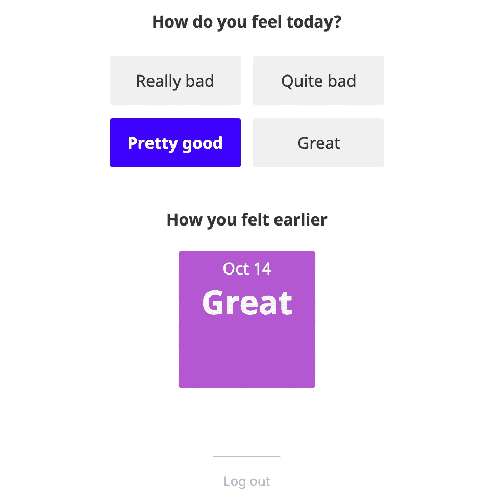

# 一个带有认证和存储的瘦应用程序

> 原文：<https://javascript.plainenglish.io/a-svelte-application-with-authentication-and-storage-f4a41a73bd5d?source=collection_archive---------4----------------------->

## 如何在 Svelte / Sapper 中建立一个带有 API、安全 SQL 存储和认证的极简情绪跟踪器？

最近，Svelte 受到了越来越多的关注，但有时缺乏如何使用它来构建现实生活中的应用程序的例子。本教程演示了如何构建一个将数据存储在数据库中并需要登录的极简应用程序。

你可以在 [Github](https://github.com/ehrencrona/sapper-mood) 上找到完整代码。

## **项目设置**

我们将使用 [Sapper](https://sapper.svelte.dev/) ，一个轻量级的服务器，用于轻松构建同构应用程序。您可以用一个命令建立一个新项目:

```
npx degit “sveltejs/sapper-template#rollup” sapper-mood
```

“工蜂情绪”是你正在创建的项目的名称。

默认情况下，该项目是普通的 JavaScript。要切换到 TypeScript，运行`node scripts/setupTypeScript`然后运行`yarn`来安装依赖项，运行`yarn run dev`来启动开发服务器。

## **存储**

我们会将数据存储在 Postgres 数据库中。我们将使用 [Knex](http://knexjs.org/) 来构建 SQL 查询，而不是在应用程序代码中手工编写 SQL。Knex 不是一个完全成熟的 ORM(对象-关系映射),这通常是不值得的；它只是一个构建 SQL 查询和管理迁移的 API。

确保 Postgres 在本地运行，然后为您的数据库创建一个新数据库和一个可选的新用户:

```
> psql
# create database coaching;
CREATE DATABASE
# create user mooduser with password 'mysecretpassword';
CREATE ROLE
```

使用`yarn add knex pg`添加 Knex 和 Postgres 驱动程序，后跟`npx knex init`，这将创建 Knex 的配置文件`knexfile.js`。

编辑文件以输入本地 Postgres 的凭证，例如

```
development: {
  client: 'postgresql',
  connection: {
    database: 'mood',
    user:     'mooduser',
    password: 'mysecretpassword'
  }
}
```

我们现在需要建立一个数据库模式。将有一个按用户和日期存储情绪数据的单一表格。运行`npx knex migrate:make create_schema`创建一个迁移文件(名为`create_schema`)。Knex 将自动运行任何尚未运行的迁移，从而使它们保持最新的数据库模式。

在`migrations`目录中，您现在将拥有一个名为`<timestamp>_create_schema.js`的文件。它应该导出一个`up`函数(应用迁移)和一个`down`函数(撤销`up`，以防您需要回滚:

```
exports.up = (knex) =>
 knex.schema.createTable('mood', (table) => {
  table.increments();
  table.string('user').notNullable();
  table.date('date').notNullable();
  table.integer('score').notNullable();
  table.unique(['user', 'date']);
 });exports.down = (knex) => knex.schema.dropTable('mood');
```

使用`npx knex migrate:up`运行迁移以创建模式。

现在，我们可以使用来检索到数据库的连接

```
import * as Knex from 'knex';
import knexfile from '../knexfile';let connection: Knex;export function connectToDb() {
 connection = Knex.default(
  process.env.NODE_ENV === 'production'
   ? knexfile.production
   : knexfile.development
 );
}
```

`connection`实例具有用于执行所有通用 SQL 命令的方法。例如，我们可以使用检索用户的情绪历史

```
export async function getMoodHistory(user: string) {
 return await connection
   .select('date', 'score')
   .from('mood')
   .where('user', user)
   .orderBy('date', 'desc')
}
```

我们应该添加一些类型和一个`storeMood`功能，为用户更新当前的情绪。完整的代码可以在`[src/db.ts](https://github.com/ehrencrona/sapper-mood/blob/master/src/db.ts)`找到。

别忘了在你的`server.ts`里加上一个到`connectToDb`的电话。

这样就完成了存储层。目前还不能真正测试它，所以接下来我们将添加一个 API 来访问它。

## **API**

使用 Sapper 可以非常轻松地创建 API 终结点。只需创建一个名为`src/routes/api/mood.ts`的文件，并使用`get`和`put`方法来处理这两个 HTTP 谓词。

`get`方法应返回当前用户的情绪历史。这是必需的基本代码:

```
import { getMoodHistory } from '../../db';
import { formatDate, getToday } from '../../date';export function getUserId(req: IncomingMessage) {
  return 'noidea';
}export async function get(req, res) {
  const user = getUserId(req); let history = await getMoodHistory(user); res.setHeader('Content-Type', 'application/json');
  res.end(JSON.stringify({ history });
}
```

get 方法的工作原理类似于 Express 中的[路由，只是我们不需要进行路由；Sapper 根据文件名称为我们执行此操作。](https://expressjs.com/en/guide/routing.html)

如果你在浏览器中打开`[http://localhost:3000/api/mood](http://localhost:3000/api/mood)`，你会得到`{history:[]}`的结果，因为——事实上——数据库是空的。

剩下的就是:要分清今天的心情和前几天的心情，加上一些类型，实行`put`法。结果可以在`[src/routes/api/mood.ts](https://github.com/ehrencrona/sapper-mood/blob/master/src/routes/api/mood.ts)`找到。

## **认证**

为了构建一个简单的身份验证层，我们将使用 [Auth0](http://auth0.com/) ，这是一个商业服务，但有一个免费层。它允许您使用外部 OAuth 提供商(如 Google 或脸书)即时添加注册、登录和身份验证。

首先，您需要[创建一个 Auth0 帐户](https://auth0.com/signup)并从仪表板创建一个应用程序。应用程序的类型应为“简单 Web 应用程序”

唯一需要的配置是将允许的回调 URL 设置为`http://localhost:3000/callback`，允许的注销 URL 设置为`http://localhost:3000`，允许的 Web 源设置为`http://localhost:3000`。

如果您知道以后将在哪里托管您的应用程序，您可以添加多个用逗号分隔的域。

Auth0 提供了中间件，使得集成到 Express 应用程序变得简单，但是 Sapper 模板使用了一个不同的服务器，叫做 Polka。还好 Express 也支持。所以从`server.ts`中用 Express 代替波尔卡开始；你可以直接搜索并替换:

```
// instead of: import polka from 'polka';
import express from 'express'; // ...express().use(...) // instead of polka().use(...)
```

[auth 0 中间件](https://github.com/auth0/express-openid-connect/blob/master/EXAMPLES.md)被称为`express-openid-connect`，所以使用`yarn add express-openid-connect`将其添加为依赖项。

然后，您需要在`server.ts`中添加中间件:

```
import authConfig from './authConfig';express.use(
  // ...
  // the following replaces the sapper.middleware() line:
  auth(authConfig),
  (req, res, next) =>
   sapper.middleware({
    session: () => ({
     user: req['oidc'].user
    })
   })(req, res, next)
```

`auth()`处理认证，仅允许通过认证的用户访问以下路由。我们在 Sapper 中间件中覆盖了`session`来从 Auth0 获取用户，并将其放入 [Sapper 会话](https://sapper.svelte.dev/docs#Seeding_session_data)。这使得它在客户端和服务器端都可用于每个路由的`preload`功能。

将您的 Auth0 配置放入`src/authConfig.ts`:

```
export default {
 authRequired: false,
 auth0Logout: true,
 baseURL: '[http://localhost:3000'](http://localhost:3000'),
 clientID: '<long sequence of letters and numbers>',
 // a.k.a. "domain" in the Auth0 admin; prepend "https://"
 issuerBaseURL: '[https://<an ID>.<eu/us>.auth0.com'](https://dev-ylt2rw9o.eu.auth0.com'),
 // choose a long, random string.
 secret: 'AyBYwCy73cBystBD6iZgYFNdquqqP'
};
```

当您登录到 Auth0 时，您会在您的应用程序中找到客户端 ID 和域(`issueBaseURL`)。参见`[src/authConfig.ts](https://github.com/ehrencrona/sapper-mood/blob/master/src/authConfig.ts)`了解如何将该配置应用于生产环境。

现在我们可以为上面添加的`getUserId`函数提供一个更好的实现:

```
function getUserId(req) {
  return req['oidc'].user;
}
```

还有一点:上面的配置说不需要认证。这会阻止用户立即被重定向到登录页面。但是我们仍然希望 API 路由总是需要登录。我们可以通过在`auth()`之后的`server.ts`中添加更多的中间件来解决这个问题:

```
(req, res, next) => {
  if (req.path.startsWith('/api') && !req['oidc']?.user) {
    notAuthorized(res);
  } else {
    next();
  }
},
```

如果请求路径以`/api`开始，并且没有用户登录，发送 401 响应，否则一切正常。401 响应可能是这样的:

```
function notAuthorized(res: Response) {
 res.setHeader('Content-Type', 'application/json');
 res.status(401).send(JSON.stringify({ error: 'Not authorized' }));
}
```

这就完成了认证。如果现在加载`[/api/mood](http://localhost:3000/api/mood)`，应该会得到`Not authorized`。如果你去`[http://localhost:3000/login](http://localhost:3000/login)`,你应该会看到一个登录/注册页面，一旦完成，会将你重定向回应用程序。

## **前端**

在前端，我们希望获取情绪历史并呈现它。Sapper 有一个负责获取数据的“预加载”函数的概念。

将以下内容放入`index.svelte`:

```
<script context="module" lang="ts">
 export async function preload() {
   let history;
   const res = await this.fetch(`/api/mood`); if (res.status == 200) {
     ({ history } = await res.json());
   } return { history }
 }
</script>
```

预加载功能将在服务器端和客户端执行。如果用户通过了身份验证(这是通过 cookie 实现的)，状态将是 200(“OK”)，我们可以检索历史记录。

无论`preload`返回什么，都可以作为当前组件的属性。我们需要声明我们需要历史属性，然后我们准备使用它:

```
<script lang="ts">
 export let history: Day[];
</script><ul>
  {#each history as day}
    <li>
      <div class="date">{day.date}</div>
      <div class="score">{day.score}</div>
    </li>
  {/each}
</ul>
```

要设置您当前的心情，我们需要调用 API 的`PUT`方法。在带有`history`声明的`<script>`内添加`storeMood`函数(不是带有预加载函数的那个):

```
const storeMood = (score: number) => {
  fetch("/api/mood", {
    method: "PUT",
    headers: {
      "Content-Type": "application/json"
    },
    body: JSON.stringify({ today: score })
  })
};
```

我们现在可以从模板中调用它:

```
<h3>How do you feel?</h3><button on:click={{} => storeMood(1)}>Good</button><button on:click={{} => storeMood(0)}>Bad</button>
```

这为您留下了一个功能完整的应用程序:如果您登录并单击按钮，您应该看到您的数据库正在被填充。

它的美妙之处在于你可以自动获得水合作用:你从服务器获得的 HTML 已经包含了情绪历史，结果是一个即使没有 JavaScript 也能呈现的页面，并且不会渐进加载；一打开，所有的数据都在那里。

为了完成用户界面，你应该添加一些 CSS，错误处理，并将其分解成组件。你可以在`[src/routes/index.svelte](https://github.com/ehrencrona/sapper-mood/blob/master/src/routes/index.svelte)`和`[src/components](https://github.com/ehrencrona/sapper-mood/tree/master/src/components)`中看到这个结果。

完成的应用程序如下所示



## **结论**

我希望这表明用 Svelte 和 Sapper 构建一个完整的应用程序是多么容易。我们可以免费获得很多东西，例如让应用程序离线工作的服务人员、服务器端渲染和水合作用，以获得惊人的性能和 SEO。