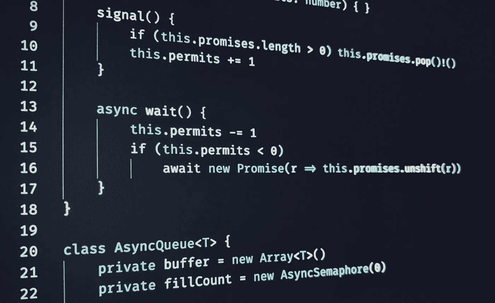

# 异步土地上测试和傻瓜的故事

> 原文：<https://javascript.plainenglish.io/a-tale-of-tests-and-fools-in-the-land-of-asynchronicity-1d3d626352f?source=collection_archive---------8----------------------->



> 第一个原则是你不能欺骗自己——而你是最容易被欺骗的人。— *理查德·费曼*

T 他的故事在 2018 年初展开，当时我正试图理清 JavaScript(特别是 NodeJS) [事件循环](https://nodejs.org/es/docs/guides/event-loop-timers-and-nexttick/)。

## 单线程宇宙

大多数现代(以及古老)语言都为开发人员提供了一种工具，来管理我们当前使用的多核、多处理器机器。通常，人们可以很容易地“fork()”进程和/或使用[线程](https://en.wikipedia.org/wiki/Thread_(computing))。当然，一旦你进入[并发](https://en.wikipedia.org/wiki/Concurrency_(computer_science))仙境，你就开始需要[进程间通信](https://en.wikipedia.org/wiki/Inter-process_communication) (IPC)原语，比如[锁](https://en.wikipedia.org/wiki/Lock_(computer_science))和[信号量](https://en.wikipedia.org/wiki/Semaphore_(programming))；顺便提一下，它是大多数标准库和 OS 的 API(如 POSIX)的一部分。一些语言甚至已经提供了线程池。[和](https://www.ponylang.io)[中的少数](https://elixirschool.com/en/lessons/advanced/concurrency/) [他们](https://en.wikipedia.org/wiki/Erlang_(programming_language))在揭开[演员模型](https://en.wikipedia.org/wiki/Actor_model)并发的奇迹时，推动了抽象的边界。

但是 JavaScript 不是其中之一…

出于历史原因，JavaScript 生活在这个舒适的单线程应用程序世界中(这个世界[可能会让](http://www.informit.com/articles/article.aspx?p=1193856) Donald Knuth 高兴)。一个指令接着一个指令，一个接着一个，一个接着一个……都是按顺序的，都是完全确定的；所有这些都是根据 99%的开发人员对计算机应该如何工作的心理模型得出的。如果不是因为一个小细节，这是一个简单而有效的抽象:

```
+------------------------------------+-----------------+
|                                    |  Latency (ns)   |
+------------------------------------+-----------------+
| L1 cache reference                 |            0.5  |
| Branch mispredict                  |            5.0  |
| L2 cache reference                 |            7.0  |
| Mutex lock/unlock                  |           25.0  |
| Main memory reference              |          100.0  |
| Compress 1K bytes with Zippy       |        3,000.0  |
| Send 1K bytes over 1 Gbps network  |       10,000.0  |
| Read 4K randomly from SSD          |      150,000.0  |
| Read 1 MB sequentially from memory |      250,000.0  |
| Round trip within same datacenter  |      500,000.0  |
| Read 1 MB sequentially from SSD    |    1,000,000.0  |
| Disk seek                          |   10,000,000.0  |
| Read 1 MB sequentially from disk   |   20,000,000.0  |
| Send packet CA > Netherlands > CA  |  150,000,000.0  |
+------------------------------------+-----------------+
```

你看，做事需要*时间*。我们可能正在做 CPU 密集型或 I/O 密集型的工作。但是 JavaScript *的东西*往往不是被 CPU 绑定，而是被 I/O 绑定。这很自然:它是*网络的*语言，所以大部分时间它都是通过这个我们称之为互联网的大网络来操纵资源。

一个单线程应用程序一次只能做一件事:要么它在等待(被阻塞)一个资源变得可用(比如从 CA 的一个服务器下载 3Mb)，要么它在屏幕上计算一些花哨的动画。但是*不是*两者都有。你看到泡菜了吗？

快进到委员会和邮件列表中的一些潜在讨论，一个简单的解决方案出现了:如果 JavaScript 正在做的大多数事情都受到 I/O 的限制，那么将 I/O 从用户那里抽象出来(并可能利用多线程)，同时保持用户的应用程序是单线程的。换句话说，使 I/O 非阻塞。

如果你*真的*注意，这个*本身*绝对不能解决任何问题。人们可以抽象出 I/O，也就是说，人们可以说*“在我继续生活的时候为我取这个吧”*但是应用程序仍然需要一种方法来知道一个资源已经可用:*“这是您所请求的，我的主”*。如果应用程序的单线程很忙，100%专注于做其他事情，它怎么会被 I/O 子系统打扰呢？

嗯，它不能…

为了解决第二个难题，我们必须认识到大多数 JavaScript 脚本(双关语)并不总是在做事。当用户点击某些东西时，他们可能正在做一些事情；或者滚动页面；或者每秒 60 次，如果动画以每秒 60 帧的速度出现。否则，脚本(通常)应该是空闲的。并且正是在这种空闲期间，I/O 子系统可以利用中断流。*瞧着吧*[事件循环](https://nodejs.org/es/docs/guides/event-loop-timers-and-nexttick/)诞生了。

## **事件循环**

一个事件循环只是…一个(无止境？)循环。它的确是按照一定的顺序*填充*，当它到最后的时候，它又重新开始。根据 [Node.js 文档](https://nodejs.org/es/docs/guides/event-loop-timers-and-nexttick/#event-loop-explained)，事件循环是这样的:

```
 ┌───────────────────────────┐
┌─>│           timers          │
│  └─────────────┬─────────────┘
│  ┌─────────────┴─────────────┐
│  │     pending callbacks     │
│  └─────────────┬─────────────┘
│  ┌─────────────┴─────────────┐
│  │       idle, prepare       │
│  └─────────────┬─────────────┘      ┌───────────────┐
│  ┌─────────────┴─────────────┐      │   incoming:   │
│  │           poll            │<─────┤  connections, │
│  └─────────────┬─────────────┘      │   data, etc.  │
│  ┌─────────────┴─────────────┐      └───────────────┘
│  │           check           │
│  └─────────────┬─────────────┘
│  ┌─────────────┴─────────────┐
└──┤      close callbacks      │
   └───────────────────────────┘
```

这些阶段中的每一个都有一个由[回调](https://en.wikipedia.org/wiki/Callback_(computer_programming))组成的 [FIFO 队列](https://en.wikipedia.org/wiki/FIFO_(computing_and_electronics))来执行。尽管每个阶段都有其特殊性，但它的回调都是按顺序执行的，直到(a)它的队列已经用尽，或者(b)达到了回调的最大数量；之后，事件循环将移动到下一阶段，*令人厌烦的*。

## **打电话给我也许**

*“先生您说的这些* **回调** *。一个* **回调** *到底是什么鬼？*“这个问题问得好，我的朋友；我非常高兴你询问了如此奇妙的发明！顾名思义，[回调](https://en.wikipedia.org/wiki/Callback_(computer_programming))是一种给*某物*，通常是给*另一物*一个 function⁴，并期望它回调……一旦它决定这样做。换句话说，这就像是在说:“*请在你认为合适的时候执行这个”⁵。如果您曾经用 JavaScript 编写过代码，您肯定会立即认出这种模式:*

```
setInterval(function() { console.log(“Another one bites the dust”) }, 1000)
```

“function() {…}”部分是我们的回调函数，而“setInterval”的主要作用是将它添加到定时器的 FIFO 中。这里还有一个:

```
document.getElementById(“myBtn”).onclick = function() { console.log(“We Click ^.^” ) }
```

这是一种不同类型的回调(需要一个 [DOM](https://en.wikipedia.org/wiki/Document_Object_Model)) )，但是适用相同的原则。回调被添加到某个 FIFO 中，一旦用户点击按钮，它就会被调用。下面是一些使用 I/O 的示例:

```
require('fs').readFile('./data.csv', function read(err, data) {
    console.log(data)
})console.log("I win!?")
```

作为对读者的一个练习，先想想你期望屏幕上出现什么:文件的内容，或者句子**“我赢了！?"**。

## 你的观点是…

确实，我跑题了。因此，2018 年初，我[试图理解](https://stackoverflow.com/questions/50382553/asynchronous-bounded-queue-in-js-ts-using-async-await)基于非阻塞单线程事件循环的 JavaScript 是如何工作的。我的需求很简单:a)让一对生产者/消费者交换消息，b)通过一个有限的缓冲区，c)如果没有消息可供消费，消费者将*仅*阻塞，d)如果缓冲区已满，生产者将*仅*阻塞。这意味着要实现如下内容:

```
class AsyncQueue<T> {
    private queue = Array<T>()

    constructor(public readonly maxSize: number) { } async enqueue(x: T) {
        if (this.queue.length > this.maxSize) {
            // Block until available
        } this.queue.unshift(x)
    } async dequeue() {
        if (this.queue.length == 0) {
            // Block until available
        } return this.queue.pop()!
    }
}
```

开发者俱乐部的第一条规则是:你不要谈论开发者俱乐部。第二条规则是:**不管你手头有什么问题，别人已经尝试过了…比你更好…处理它！**

## **生产者-消费者问题**

这也不例外，因为人们可以很容易地在维基百科中找到[生产者-消费者问题](https://en.wikipedia.org/wiki/Producer–consumer_problem)。可能有人已经有了一个现成的“npm”图书馆。但是我在努力学习，而不仅仅是继续我的生活。所以，在研究了这个问题之后，我学到了两件事:

1.  写错误的实现是非常容易的(不是吧，夏洛克)。的确，“一个*[*不充分的解决方案*](https://en.wikipedia.org/wiki/Producer–consumer_problem#Inadequate_implementation) *可能会导致死锁，此时两个进程都在等待被唤醒”*；*
2.  *解决这个问题最简单的方法就是使用 Semaphore⁶。*

## ***一个带有信号量的支线任务***

*解释信号量最简单的方法是想象你试图把车停在拥挤的商场里。旗语允许人们在还有车位的时候进入公园(我们称之为许可证)。一旦它到达**零点**，不幸的是:你将不得不**等待**。直到有人离开公园，**给**一个空闲的位置。换句话说，信号量遵循以下约定:*

```
*interface AsyncSemaphore {
    signal(): void
    async wait(): Promise<void>
}*
```

*你会问为什么“wait()”标记为“async ”?因为我不想阻塞我的代码*直到*信号量显示现在有空闲的停车位。记住:我们生活在一个**单线程**世界中，所有的*用户域代码*，包括我们信号量的实现，都被以同样的方式对待，运行在同一个线程中。信号量不可能*甚至检查*是否有空闲空间，因为我们*被阻塞*在队列中等待这样的事情发生。所以，是的，会出现死锁。解决方案是传递一个回调，说:“*嘿，一旦有我可以使用的许可证，就打电话给我”*。如果你不明白回调之间的关系，[承诺](https://en.wikipedia.org/wiki/Futures_and_promises)和[异步/等待](https://en.wikipedia.org/wiki/Async/await)，就是学习时间了。因此，我找到了第一个解决异步信号量挑战的方法:*

```
*class AsyncSemaphore {
    private promises = Array<() => void>() constructor(private permits: number) {} signal() {
        this.permits += 1
        if (this.promises.length > 0) this.promises.pop()()
    } async wait() {
        if (this.permits == 0 || this.promises.length > 0)
            await new Promise(r => this.promises.unshift(r))
        this.permits -= 1
    }
}*
```

## ***生产者-消费者:第二部分***

*生产者-消费者问题的后续解决方案简单地用两个信号量跟踪队列的状态:` emptyCount ',队列中空位置的数量，和` fullCount ',队列中元素的数量。必须保持两个不变量:(1)‘empty count’必须总是小于或等于队列中空位的实际数量，以及(2)‘full count’必须总是小于或等于队列中项目的实际数量。如果想放宽缓冲区的大小(从而允许无限长的队列)，那么单个信号量就足够了。这正是我开始的地方:*

```
*class AsyncQueue<T> {
    private queue = Array<T>()
    private waitingEnqueue: AsyncSemaphore constructor(readonly maxSize: number) {
        this.waitingEnqueue = new AsyncSemaphore(0)
    } async enqueue(x: T) {
        this.queue.unshift(x)
        this.waitingEnqueue.signal()
    } async dequeue() {
        await this.waitingEnqueue.wait()
        return this.queue.pop()!
    }
}*
```

*以我的代码为荣，我做了一些测试，回答了我自己在 Stackoverflow⁷上的问题，一切都很好。我用下面的句子结束了我的帖子:“*我仍然不确定这不会在没有广泛测试的情况下重新引入微妙的错误”。**

## *测试的故事*

*回到我们的主题:我们如何知道实现是正确的？到今天为止，我有 11 票赞成这个问题，6 票赞成这个答案。的确，这看起来并不是一个紧迫的问题。但是我最近给了我的学生同样的挑战，这样我们就可以分享用头撞墙的快乐。他们在 Stackoverflow 上找到了我的解决方案，并原样复制粘贴了代码*和⁸* ，这并不奇怪。*

*我测试过吗？我当然有！在某个时候，我甚至提供了一个“统计测试”,随意生成“enqueues()”和“dequeues()”的随机排列:*

```
*async function testAsyncQueueBehavior(nOps: number):Promise<Boolean> {
    const result = new Array<number>()
    const q = new AsyncQueue<number>() const enqueue = (m: number) => q.enqueue(m)
    const dequeue = () => q.dequeue()
    const promises = Array<Promise<void>>() let enqueues = 0
    let dequeues = 0 // Do a random permutation of enqueing and dequeing
    for (let i = 0; i < nOps; i += 1) {
        if (Math.random() > 0.5) {
            enqueues += 1
            enqueue(enqueues)
        } else {
            dequeues += 1
            promises.push(dequeue().then(v => { result.push(v) }))
        }
    } const pending = Math.min(enqueues, dequeues)
    await Promise.all(promises.slice(0, pending)) // Length should be equal minimum between enqueues and dequeues
    const isLengthOk = pending === result.length // Messages should be ordered
    const isSorted = isArraySorted(result) return isLengthOk && isSorted
}*
```

*据我所知，我的代码反复通过了这些测试。我的学生在他们自己的实现中使用这个，直到他们最终找到我的代码。他们使用了它，到目前为止没有人抱怨。*

## ***论人类的直觉***

*我喜欢认为我们的大脑有一种类似于[生成对抗网络](https://en.wikipedia.org/wiki/Generative_adversarial_network) (GAN)的工作模式。我大脑的一部分(T2 代码猴子 T3)正在产生解决方案；有时比我的手指打字还快。IDE、REPL、编译器的类型系统、测试……所有这些系统都是为了指导*代码猴子*确保他做好自己的*事情*。这是我的“生成性”神经网络。*

*然后是第二部分，它不能控制我的手指。它位于后台，浏览代码，并给我提供一个微弱的信号——实际上更像是一种感觉——如果我做了正确的事情。这是我的“歧视性”网络。*

*丹尼尔·卡内曼在他的畅销书《思考，快与慢》中提到了两种思维模式之间的二分法:“系统 1”是快速的、本能的和情绪化的；“系统 2”更慢，更谨慎，更有逻辑性。我不确定卡尼曼系统和我的比喻是否完全吻合，但是…*

*一直以来，我的*辨别*系统不断告诉我:你的解决方案可能有问题，但我不知道是什么问题。这怎么可能呢？考试通过了，学生们没有抱怨。*

## ***愚人的故事***

*最终，我把完全相同的问题交给了我的朋友兼同事安德烈·雷斯蒂沃。他抓起自己信赖的 ThinkPad，开始不停地编码。在某种程度上，他认为已经找到了一个不使用信号量的解决方案。我声称，在某个地方，不知何故，他会模仿相同的信号量逻辑；只是伪装成别的东西。我提供了我的测试函数，正如我所预料的那样，它失败了。*

*问题是，我们不只是希望它失败。我们想知道*它是如何失败的，所以我们开始在控制台上追踪导致失败的特定排列:一百次该死的“enqueue()”和“dequeue()”调用。我们认为这很愚蠢。好吧，就试着把最大操作次数缩至四次(因为…原因)，一直运行测试直到失败。如果失败，则执行以下操作序列:**

```
*Dequeue() // #1
Enqueue()
Dequeue() // #2
Dequeue() // #3*
```

*手头的具体问题是，他的实现没有像预期的那样阻塞#2，而是触发了#1 和#2 的回调。安德烈开玩笑说:“好吧，问题出在你的测试上！”*

*为我辩护，这样的假设并没有使他的实现工作得更好。我们一丝不苟地找出了失败的原因。但是这让我想到:*我有多确定在测试我自己的代码时这种特殊的排列曾经发生过？在我不知道的情况下，还有哪些错误的排列可能潜伏在周围？**

*我教*软件工程*的正式方法已经有几年了。我们使用的工具之一是 Daniel Jackson 的[合金分析器](http://alloytools.org)，它*提供了一种声明性的规范语言，用于表达软件系统的结构约束和行为*。用 Alloy 实现一个完整的系统是一件痛苦的事情，但是我在使用它的时候总是很享受:它给了我具体的*反例*。*

*此外，丹尼尔被这个“*小范围假设”*所吸引，认为这是对 Alloy 结果信心的基础。本质上，它声称“*大多数不一致模型在小范围内都有反例”*。还记得我们缩小反例的策略吗？似乎我们的直觉也相信这个假设是正确的。*

*但是我**不会**在 Alloy 中实现消费者-生产者问题，原因有两个:(1)这是一个众所周知的问题，已经被证明是正确解决的，(2)我对测试它的*抽象解决方案*不感兴趣，但是我的*具体实现*，以及 JavaScript 的 EventLoop 等等。*

## ***基于属性的测试***

*还记得开发者俱乐部的第二条规则吗？我来给你介绍一下[快检](https://www.npmjs.com/package/fast-check)。这个库允许你检查代码中属性的真实性。你会问，什么是财产？嗯，就像*对于所有(x，y，…)比如前提条件(x，y，…)成立，性质(x，y，…)为真*。*

*让我们提供一个简单的例子。假设您刚刚编写了一个惊人的函数，它检查某个特定的*模式*是否出现在给定的字符串中:*

```
*const contains = (text, pattern) => text.indexOf(pattern) >= 0;*
```

*通常你会写一些测试，比如:*

```
*assert(contains('Look ma, no tests', 'tests'))
assert(contains('Look ma, no tests', 'ma'))
assert(contains('Look ma, no tests', 'Look'))*
```

*你应该什么时候停止？你凭什么相信它对任何(所有)人都有效？)字符串和子字符串的组合？是什么让你确定你不是在测试你所知道的*的结果*起作用(即使有点 subconsciously)⁹？这是泡菜。*

*对于基于属性的测试，您应该写:*

```
*const fc = require('fast-check')
fc.assert(fc.property(fc.string(), text => contains(text, text)))*
```

*快速检查基于*套利*的概念。一个任意的 T 是 T 的生成器，它怎么知道如何生成 T 呢？嗯，有人(可能是你)以这样一种方式编码它，给定一个随机数，它将产生随机‘t’的确定性均匀分布。快速检查已经为我们提供了[内置的任意性](https://github.com/dubzzz/fast-check/blob/master/documentation/1-Guides/Arbitraries.md)来生成自然数、布尔值、字符串和数组等等。然后，由它的内部引擎(使用“property()”调用)来检查我们的属性是否对任何任意输入都有效。*

*如果它所做的只是产生随机的东西，它不会比我的“统计测试”更好。所以它做了一些额外的聪明的事情。首先，fast-check 也相信*小范围假设*:套利行为可能*在统计上偏向典型的问题情境*。在整数的情况下，你知道的演练: **0** 、 **1** 、 **-1** 、**-无穷大**和**+无穷大**是通常的疑点。第二，由“任意”T>生成的值也可以提供“收缩(prev: Ts):流<Ts>”函数，一旦找到反例，该函数可以用于收缩 T18 反例。*

## *一个异步信号的测试*

*让我们为异步信号量实现一个测试。我们从指定如何生成测试开始:*

```
*import { assert, asyncProperty, nat as aNat, array as anArray, boolean as aBoolean } from 'fast-check'assert(
    asyncProperty(
        aNat(10),
        anArray(aBoolean().map(b => b ? 'S' : 'W'), 100),
        async (size, ops) => testSemaphore(size, ops)),
        { numRuns: 1000 })*
```

*我们基本上要说的是，我们想要生成任意的信号量，允许多达 10 个，以及任意的“wait()”和“signal()”序列。该序列可以很容易地从任意的布尔数组(最大为 100)中导出，其中“真”被映射到“信号()”,“假”被映射到“等待()”。然后，我们测试我们的信号量的*良好行为*:*

```
*async function testSemaphore(size: number, ops: Array<'S' | 'W'>) {
    const sem = new AsyncSemaphore(size)
    const res = Array<boolean>()
    const promises = Array<Promise<void>>() let signals = 0, waits = 0 for (const op of ops) {
        if (op === 'S') {
            signals += 1
            sem.signal()
        } else {
            waits += 1
            promises.push(sem.wait().then(() => { res.push(true) }))
        }
    } await Promise.all(promises.slice(0, signals + size))

    return res.length === Math.min(signals + size, waits)
}*
```

*换句话说，给定“signal()”和“wait()”操作的任何序列，只能有和“signal()”一样多的“wait()”被解决，加上初始许可。*

## ***找到了！***

*我一运行它，就得到以下结果:*

```
*catch Error: Property failed after 4 tests 
{ seed: 1474060413, path: "3:0:1:0:1:2:1:1:0:3", endOnFailure: true } 
Counterexample: [0,["W","S","W"]] 
Shrunk 9 time(s) 
Got error: Property failed by returning false*
```

*所以，不仅我的信号量没有按预期工作(！)但是反例简单得令人尴尬:在用“permissions = 0”初始化的信号量上有“wait()”、“signal()”、“wait()”。为什么！？*

## *夏洛克，我们需要你的服务*

*罪魁祸首是事件循环。谢谢，下一位…*

*哦，你想知道更多细节？好吧，让我们从分析这个特殊例子的“结果”数组开始。它的大小是两个，而它应该只有一个。这意味着这些承诺:*

```
*promises.push(sem.wait().then(() => { res.push(true) }))*
```

*…找到了一个既能被处决的方法；这又意味着这条线:*

```
*if (this.promises.length > 0) this.promises.pop()!()*
```

*…可能已经被执行了至少一次。但这没有任何意义:“信号()”方法只有一个用途！*追溯*执行的时间到了:*

```
*Wait received 
Promised created 
Signal received 
Increase Permits
Promise resolved
Wait received
Decrease the permits 
Decrease the permits*
```

*因此，事情是这样的:在收到“等待”()之后，我们期待它会创造一个承诺(因为“许可== 0”)。然后，我们期待它*减少*的许可。但事实并非如此。相反，在承诺创建后，接收到“信号()”后，它会将“许可”增加到 1，然后检查未决的承诺。它找到最后一个并解决它。在这一点上，人们可以*也*预期许可会减少，因为承诺之后的代码的执行会继续。但是不！相反，当接收到最终的“等待()”时，它检查“许可== 0 ”(这出乎意料地为假)，通过减少许可而不产生承诺来解决，然后未决许可减少两次。*唷！**

*这里发生的是，我们的“等待()”实现有问题:*

```
*if (this.permits == 0 || this.promises.length > 0) {
    await new Promise(r => { this.promises.unshift(r) })
}this.permits -= 1*
```

*这个例子中只有一个承诺，而“等待”关键字的结果是将程序的其余部分作为“回调”推送到某个事件循环阶段的先进先出。这包括关键的“这个.许可-= 1”。程序按顺序进行，承诺被“信号()”解决的事实并不意味着之前的回调马上就被解决了。事实上，它没有……代码继续直接执行到第二个“等待()”,在那里“允许”还没有减少。*

*在那里，您被**事件循环怪物**咬伤。*

## ***async 信号量的修正***

*有了我们的基于属性的测试，很容易改变代码，看看会发生什么。通过两行代码的“排列”解决了这个问题，这不无讽刺意味:*

```
*async wait() {
    this.permits -= 1
    if (this.permits < 0 || this.promises.length > 0)
        await new Promise(r => this.promises.unshift(r))
}*
```

*一旦调用“wait()”时，我们做的第一件事就是减少许可。我们还将条件更改为“允许”测试 AsyncQueue*

## *我们从编写如何生成测试开始:*

*并以类似的方式继续:*

```
*assert(
    asyncProperty(
        anArray(aBoolean().map(b => b ? 'E' : 'D'), 1000), 
        async (ns) => testAsyncQueueBehavior(ns)), 
        { numRuns: 100 })*
```

*在这里，我们要寻找两个属性，而不是一个:*

```
*async function testAsyncQueueBehavior(ops: Array<'E' | 'D'>): Promise<boolean> {
    const result = new Array<number>()
    const q = new AsyncQueue<number>()
    const promises = Array<Promise<void>>() let enqueues = 0, dequeues = 0 for (const op of ops) {
        if (op === 'E') { 
            enqueues += 1 
            q.enqueue(enqueues)
        } else {
            dequeues += 1 
            promises.push(q.dequeue().then(v => { result.push(v) }))
        }
    } const pending = Math.min(enqueues, dequeues) 
    await Promise.all(promises.slice(0, pending)) // Length should be equal minimum between enqueues and dequeues
    const isLengthOk = pending === result.length // Messages should be ordered
    const isSorted = isArraySorted(result) return isLengthOk && isSorted
}*
```

*成功“出列”()的数量等于“入队”和“出列”之间的最小值；和*

1.  *所有“出列()”都按顺序求解(从而保留了 FIFO 属性)。*
2.  *快速检查找不到反例。*

***结语***

## *做*正确的事情*和做*正确的事情*之间有微妙的区别。测试允许我们指定，对于非常特定的条件，我们的结果就是我们期望的结果。但是*的规格*，在*正确的事情*的意义上，远远超出了测试所能达到的。属性的自动检查是一种提高*置信度*的方法，我们的测试捕获了*更多的*规范；这是一种*间接*的方式来增加对我们程序*正确性*的信任。但是不要欺骗你自己:绝对没有什么能够告诉你你的规范是否正确。*

*尽管 Donald Knuth 是一个超出我们大多数能力的天才，但他在 2008 年的一次采访中说了以下(不幸的)话:*“让我这么说吧:在过去的 50 年里，我编写了一千多个程序，其中许多都很庞大。在这些程序中，我想不出有哪五个会因为并行或多线程而得到显著增强。当然，举例来说，多处理器对 TeX 毫无帮助…**

*实际上，它需要两种*类型*的时间:做*的时间*它，和*沟通*它的时间。为了这个咆哮的所有目的，总时间是这两件事的总和。*

*除非你考虑[轮询](https://en.wikipedia.org/wiki/Polling_(computer_science))和[忙-等待](https://en.wikipedia.org/wiki/Busy_waiting)作为解决方案。*

*⁴一些顽固的语言，像 Java，很长一段时间都不知道如何传递函数作为参数。因此，这些可怜的家伙用一个众所周知的接口将这些函数包装在一个(可能是匿名的)类中，实例化一个对象，然后传递该对象。对于所有预期的目的——尽管适当的[闭包](https://en.wikipedia.org/wiki/Closure_(computer_programming))解决了范围和环境限制——我们也可以调用这些回调。*

*⁵为什么我坚持使用“决定”和“找到合适的”这样的词？为什么不简单地说“当你完成的时候”？因为这不是真的。*

*⁶嗯了一声，*两个*旗语。*

*⁷:这实际上比你想象的更常见。*

*⁸:这本身并不是一件坏事。这个挑战是[大型演习](https://github.com/hugoferreira/asso-pipes-and-stuff-v19)的一部分，这个想法是让他们思考一件事是*认为*你理解异步，另一件事是*意识到*我们毕竟只是人类。*

*⁹:这是一个导致 TDD 短句之一的难题:在编写实现之前*编写测试。**

*⁹ It’s a pickle that lead to one of the TDD tennets: you write your tests *before* you write your implementation.*